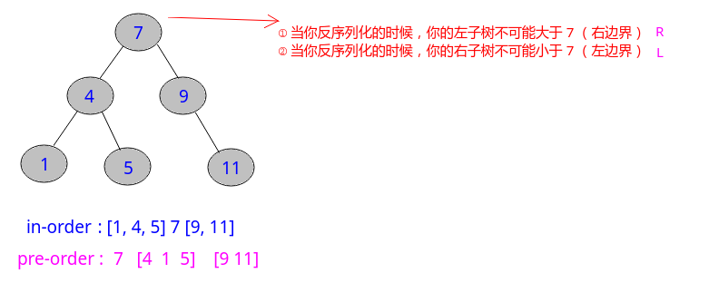

## LeetCode - 297. Serialize and Deserialize Binary Tree(二叉树的序列化和反序列化)

 - [LeetCode - 297. Serialize and Deserialize Binary Tree](#1)
 - [附LeetCode - 449. Serialize and Deserialize BST](#2)
***
### <font id = "1">LeetCode - 297. Serialize and Deserialize Binary Tree
#### [题目链接](https://leetcode.com/problems/serialize-and-deserialize-binary-tree/description/)

> https://leetcode.com/problems/serialize-and-deserialize-binary-tree/description/

#### 题意


当然上面这个是按层序列化，我们也可以按前序序列化，只要能通过序列化的结果还原二叉树即可。

### 解析
 **前序序列化，就是将当前的树按照前序的方式生成一个字符串，如果结点不为空，就是结点的`value`，如果结点为`null`，就用`”null“`来代替。**

逻辑很简单，直接上前序序列化代码

由于说最好不要使用全局变量，所以这里反序列化的时候使用了一个`idx`数组(大小为`1`)。

```java
public class Codec {

    public String serialize(TreeNode root) {
        StringBuilder res = new StringBuilder();
        serHelper(root, res);
        res.deleteCharAt(res.length() - 1); // notice, delete the last
        return res.toString();
    }

    public void serHelper(TreeNode root, StringBuilder sb) {
        if (root == null) { 
            sb.append("null,"); 
            return;
        }
        sb.append(root.val + ",");
        serHelper(root.left, sb);
        serHelper(root.right, sb);
    }

    public TreeNode deserialize(String data) {
        if (data == null || data.length() == 0)
            return null;
        String[] arr = data.split(",");
        int[] idx = new int[1]; 
        return desHelper(arr, idx);
    }

    private TreeNode desHelper(String[] arr, int[] idx) {
        if (idx[0] >= arr.length)
            return null; 
        String val = arr[idx[0]];
        if (val.equals("null"))
            return null;
        TreeNode root = new TreeNode(Integer.valueOf(val));
        idx[0]++;
        root.left = desHelper(arr, idx);
        idx[0]++;
        root.right = desHelper(arr, idx);
        return root;
    }
}
```
或者使用一个存储容器: 

```java
public class Codec {

    public String serialize(TreeNode root) {
        StringBuilder res = new StringBuilder();
        serHelper(root, res);
        res.deleteCharAt(res.length() - 1);
        return res.toString();
    }

    public void serHelper(TreeNode root, StringBuilder sb) {
        if (root == null) {
            sb.append("null,");
            return;
        }
        sb.append(root.val + ",");
        serHelper(root.left, sb);
        serHelper(root.right, sb); 
    }

    public TreeNode deserialize(String data) {
        if (data == null || data.length() == 0)
            return null;
        LinkedList<String> nodes = new LinkedList<>(Arrays.asList(data.split(",")));// 用Queue也行
        return desHelper(nodes);
    }

    private TreeNode desHelper(LinkedList<String> nodes) {
        if (nodes.size() == 0)
            return null;
        String val = nodes.get(0);
        nodes.removeFirst();
        if (val.equals("null")) 
            return null;
        TreeNode root = new TreeNode(Integer.valueOf(val));
        root.left = desHelper(nodes);
        root.right = desHelper(nodes);
        return root;
    }
}
```
也可以使用层序序列化和层序反序列化。

其实和前序差不多，会层序遍历就差不多，一个逻辑。

```java
public class Codec {

    public String serialize(TreeNode root) {
        StringBuilder res = serHelper(root);
        res.deleteCharAt(res.length() - 1);
        return res.toString();
    }

    /** level order */
    public StringBuilder serHelper(TreeNode root) {
        StringBuilder res = new StringBuilder();
        if (root == null) {
            res.append("null,");
            return res;
        }
        Queue<TreeNode> queue = new LinkedList<>();
        queue.add(root);
        TreeNode top = null;
        while (!queue.isEmpty()) {
            top = queue.poll();
            if (top != null) {
                res.append(top.val + ",");
                queue.add(top.left);
                queue.add(top.right);
            } else {
                res.append("null,");
            }
        }
        return res;
    }

    public TreeNode deserialize(String data) {
        String[] arr = data.split(",");
        int idx = 0; 
        TreeNode root = recon(arr[idx++]);
        if (root != null) {
            Queue<TreeNode> queue = new LinkedList<>();
            queue.add(root);
            TreeNode top = null;
            while (!queue.isEmpty()) {
                top = queue.poll();
                top.left = recon(arr[idx++]);
                top.right = recon(arr[idx++]);
                if (null != top.left)
                    queue.add(top.left);
                if (null != top.right)
                    queue.add(top.right);
            }
        }
        return root;
    }

    private TreeNode recon(String str) {
        return str.equals("null") ? null : new TreeNode(Integer.valueOf(str));
    }
}
```
其中`serHelper`方法也可以这样写: 

```java
public StringBuilder serHelper(TreeNode root) {
	 StringBuilder res = new StringBuilder();
	 if (root == null) {
	     res.append("null,");
	     return res;
	 }
	 Queue<TreeNode> queue = new LinkedList<>();
	 queue.add(root);
	 TreeNode top = null;
	 res.append(root.val + ",");  //注意这样写的话 要先添加这个
	 while (!queue.isEmpty()) {
	     top = queue.poll();
	     if (top.left != null) {
	         queue.add(top.left);
	         res.append(top.left.val + ",");
	     } else
	         res.append("null,");
	     if (top.right != null) {
	         queue.add(top.right);
	         res.append(top.right.val + ",");
	     } else
	         res.append("null,");
	 }
	 return res;
}
```
***
### <font id = "2">附LeetCode - 449. Serialize and Deserialize BST

#### [题目链接](https://leetcode.com/problems/serialize-and-deserialize-bst/)

> https://leetcode.com/problems/serialize-and-deserialize-bst/

#### 题目

> 和上一个题目一样，<font color = red>但是给你的是一个二叉搜索树。
#### 解析

唯一的不同就是可以在反序列化的时候可以利用`BST`的性质来优化这个过程。

* 例如下面的`7`去反序列话的时候，递归左子树的时候给一个限定，如果当前数值`>7`，就肯定不行，返回`null`；
* 同理递归右子树的时候，结点的值不能`>7`，否则返回`null`；




```java
public class Codec {

    public String serialize(TreeNode root) {
        if (root == null)
            return "";
        StringBuilder sb = new StringBuilder();
        sb.append(root.val + ",");
        sb.append(serialize(root.left));
        sb.append(serialize(root.right));
        return sb.toString();
    }

    public TreeNode deserialize(String data) {
        if (data.equals(""))
            return null;
        LinkedList<String> nodes = new LinkedList<>(Arrays.asList(data.split(",")));
        return desHelper(nodes, Integer.MIN_VALUE, Integer.MAX_VALUE);
    }

    private TreeNode desHelper(LinkedList<String> nodes, int L, int R) {
        if (nodes.size() == 0) 
            return null; 
        int cur = Integer.parseInt(nodes.get(0));
        if (cur < L || cur > R) // not
            return null;
        TreeNode root = new TreeNode(cur);
        nodes.removeFirst();
        root.left = desHelper(nodes, L, cur);
        root.right = desHelper(nodes, cur, R);
        return root;
    }
}
```

