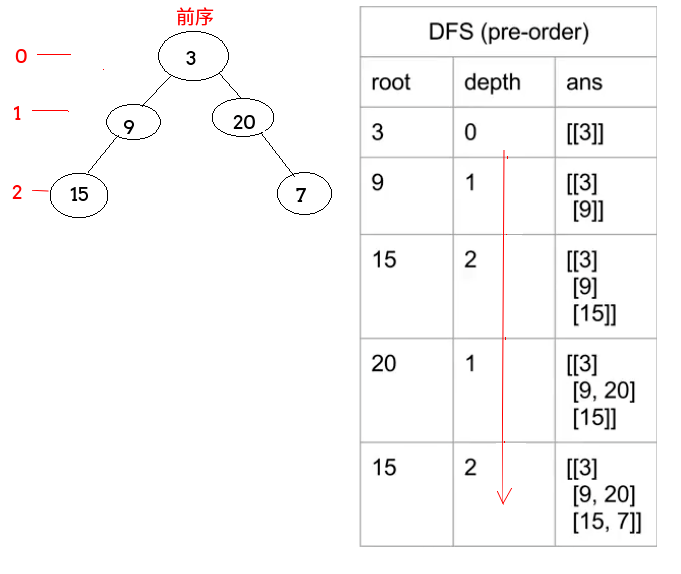

## LeetCode - 637. Average of Levels in Binary Tree(求树的每一层的平均值)
 - BFS(层次)
 - DFS(前序和中序递归)
***
 #### [题目链接](https://leetcode.com/problems/average-of-levels-in-binary-tree/description/)

> https://leetcode.com/problems/average-of-levels-in-binary-tree/description/

#### 题目


### BFS(层次)
很容易想到的解法就是层次遍历，每次处理一层，先得到队列中所有元素的个数，然后全部处理完，然后处理下一层。

图:


代码:

```java
class Solution {
    public List<Double> averageOfLevels(TreeNode root) {
        List<Double> res = new ArrayList<>();
        if (root == null)
            return res;
        Queue<TreeNode> queue = new LinkedList<>();
        queue.add(root);
        TreeNode top = null;
        double sum = 0;
        while (!queue.isEmpty()) {
            int n = queue.size();
            sum = 0;
            for (int i = 0; i < n; i++) {
                top = queue.poll();
                sum += top.val;
                if (top.left != null)
                    queue.add(top.left);
                if (top.right != null)
                    queue.add(top.right);
            }
            res.add(sum / n);
        }
        return res;
    }
}
```

***
### DFS(前序和中序递归)
递归的做法就是 记录一个层数`level`，用两个`List`保存和以及个数，每次遍历到这一层的时候：

 - 或者是这一层第一次来，那就加上第一次`val`，次数变为`1`；
 - 或者不是第一次，不是第一层就累加这一层的和以及个数；
 - **因为前序是先根，再左，再右，所以可以通过层数`level`和`list`的大写来判断上面的情况**；

图:



前序: 

```java
class Solution {

    public List<Double> averageOfLevels(TreeNode root) {
        List<Double> res = new ArrayList<>();
        List<Double> sum = new ArrayList<>();
        List<Integer> count = new ArrayList<>();

        pre(root, 0, sum, count);

        for (int i = 0; i < sum.size(); i++) {
            res.add(sum.get(i) / count.get(i));
        }
        return res;
    }

    private void pre(TreeNode root, int level, List<Double> sum, List<Integer> count) {
        if (root == null) return;
        if (level < sum.size()) { //回去的
            sum.set(level, sum.get(level) + root.val);
            count.set(level, count.get(level) + 1);
        } else {  //新的高度
            sum.add(1.0 * root.val); //添加第一个
            count.add(1);
        }
        pre(root.left, level + 1, sum, count);
        pre(root.right, level + 1, sum, count);
    }
}  
```
中序: 

中序遍历和前序遍历不同的是，先左子树走到底，然后回来根，然后再右子树，所以我们要预先给`list`中添加一个默认值，添加一个`0`即可。后序也是: 

```java
class Solution {
    public List<Double> averageOfLevels(TreeNode root) {
        List<Double> res = new ArrayList<>();
        List<Double> sum = new ArrayList<>();
        List<Integer> count = new ArrayList<>();
        in(root, 0, sum, count);
        for (int i = 0; i < sum.size(); i++) {
            res.add(sum.get(i) / count.get(i));
        }
        return res;
    }

    private void in(TreeNode root, int level, List<Double> sum, List<Integer> count) {
        if (root == null)
            return;
        if (level >= sum.size()) {
            sum.add(0.0);
            count.add(0);
        }
        in(root.left, level + 1, sum, count);
        sum.set(level, sum.get(level) + root.val);
        count.set(level, count.get(level) + 1);
        in(root.right, level + 1, sum, count);
    }
}  
```
后序：

```java
class Solution {
    public List<Double> averageOfLevels(TreeNode root) {
        List<Double> res = new ArrayList<>();
        List<Double> sum = new ArrayList<>();
        List<Integer> count = new ArrayList<>();
        pos(root, 0, sum, count);
        for (int i = 0; i < sum.size(); i++) {
            res.add(sum.get(i) / count.get(i));
        }
        return res;
    }

    private void pos(TreeNode root, int level, List<Double> sum, List<Integer> count) {
        if (root == null) return;
        if (level >= sum.size()) {
            sum.add(0.0);
            count.add(0);
        }
        pos(root.left, level + 1, sum, count);
        pos(root.right, level + 1, sum, count);
        sum.set(level, sum.get(level) + root.val);
        count.set(level, count.get(level) + 1);
    }
}
```
