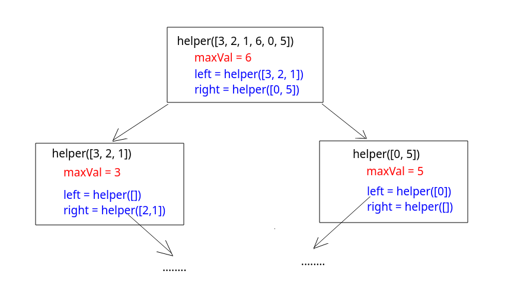
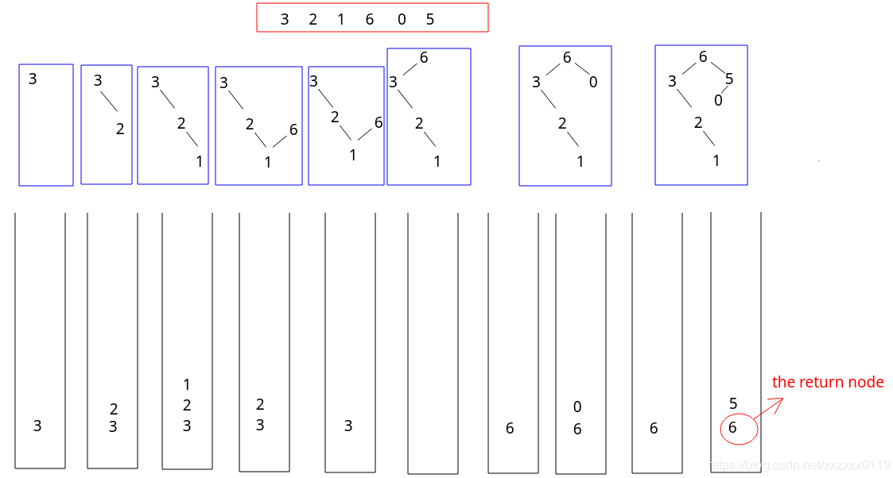

## LeetCode - 654. Maximum Binary Tree(最大二叉树)
* 递归
* 非递归

***
#### [题目链接](https://leetcode.com/problems/maximum-binary-tree/)

#### 题目


### 递归

这个题目很经典，使用类似<font color = red>分治</font>的思想，每次在数组的某个区间操作: 
递归函数写法: 

* 先找出分界点，也就是这段区间`[L， R]`内的最大值`maxx`，以及它的索引`maxi`；
* 然后分治，这个最大值作为根，左右去递归，作为它的左右孩子即可；

```java
class Solution {
    public TreeNode constructMaximumBinaryTree(int[] nums) {
        if(nums == null || nums.length == 0)
            return null;
        return helper(nums, 0, nums.length-1);
    }
    
    private TreeNode helper(int[] nums, int L, int R){
        if(L > R)    //notice section is [L, R]
            return null;
        int maxx = nums[L];
        int maxi = L;
        for(int i = L+1; i <= R; i++){
            if(nums[i] > maxx){
                maxx = nums[i];
                maxi = i;
            }
        }
        TreeNode root = new TreeNode(maxx);
        root.left = helper(nums, L, maxi-1);
        root.right = helper(nums, maxi+1, R);
        return root;
    }
}
```

***
### 非递归
递归的写法没有想出来，类似<font color = blue>单调栈</font>主要思想是维持一个栈，这个栈里面的元素是要<font color = red>从栈底到栈顶保持递减</font>的: 
过程:  
* 扫描数组，将每个元素建立一个节点`cur`；
* 每次都要判断当前元素是否比栈顶元素大，<font color=  blue>如果大，就要一直弹出元素，同时，要将当前元素的左孩子设置成弹出的节点: `cur.left = stack.pop()`；
* 弹完栈之后，此时栈中的元素都比cur大，此时我们让栈顶的节点的右孩子指向`cur`；
* 然后压栈当前元素；
* <font color = red>最后返回的是栈底的元素(最大的元素作为根)；


```java
class Solution {
    public TreeNode constructMaximumBinaryTree(int[] nums) {
        if(nums == null || nums.length == 0)
            return null;
        Stack<TreeNode>stack = new Stack<>();
        for(int i = 0; i < nums.length; i++){
            TreeNode cur = new TreeNode(nums[i]);
            while(!stack.isEmpty() && stack.peek().val < nums[i])                
                cur.left = stack.pop();
            if(!stack.isEmpty())
                stack.peek().right = cur;
            stack.push(cur);
        }
        if(stack.isEmpty())
            return null;
        while(1 != stack.size())
            stack.pop();
        return stack.peek();
    }
}
```
可以改成双端队列`Deque`写法: 

```java
class Solution {
    public TreeNode constructMaximumBinaryTree(int[] nums) {
        if(nums == null || nums.length == 0)
            return null;
        Deque<TreeNode>stack = new LinkedList<>();
        for(int i = 0; i < nums.length; i++){
            TreeNode cur = new TreeNode(nums[i]);
            while(!stack.isEmpty() && stack.peek().val < nums[i])                
                cur.left = stack.pop();
            if(!stack.isEmpty())
                stack.peek().right = cur;
            stack.push(cur);
        }
        return stack.isEmpty() ? null : stack.removeLast();
    }
}
```

***
其他代码: 

`C++`

```cpp
class Solution {
public:
    TreeNode* constructMaximumBinaryTree(vector<int>& nums) {
        return helper(nums, 0, nums.size());// not nums.size()-1
    }
private:
    TreeNode* helper(const vector<int>& nums, int L, int R){
        if(L >= R) //  because below is compute(calculate) section of [L, R), instead [L, R]
            return nullptr;
        auto it = std::max_element(nums.begin() + L, nums.begin() + R);//computer [L,R)'s max value, return position iterator;
        TreeNode* root = new TreeNode(*it); // it is a Iterator
        int idx = it - nums.begin();
        
        root->left = helper(nums, L , idx); //idx postition will not figure in
        root->right = helper(nums, idx+1, R);
        return root;
    }
};
```

注意这个和`Java`的相反，使用的`vector`，这里从后面操作，最后返回的是第一个元素，道理都差不多。
```cpp
class Solution {
public:
    TreeNode* constructMaximumBinaryTree(vector<int>& nums) {
        if(nums.size() == 0)
            return nullptr;
        vector<TreeNode*>stack;
        for(int i = 0; i < nums.size(); i++){
            TreeNode* cur = new TreeNode(nums[i]);
            while(!stack.empty() && stack.back()->val < nums[i]){
                cur->left = stack.back();
                stack.pop_back(); //pop last element
            }
            if(!stack.empty())
                stack.back()->right = cur;
            stack.push_back(cur);
        }
        return stack.empty() ? nullptr : stack.front();
    }
};
```

`Python`:

```python
class Solution:
    def constructMaximumBinaryTree(self, nums):
        if len(nums) == 0:
            return None
        return self.helper(nums, 0, len(nums) - 1)

    def helper(self, nums, L, R):
        if L > R:
            return None
        maxi = nums.index(max(nums[L:R + 1]))  # max(list)'s section is [L, R), so is R+1
        root = TreeNode(nums[maxi])
        root.left = self.helper(nums, L, maxi-1)
        root.right = self.helper(nums, maxi+1, R)
        return root
```

```python
class Solution:
    def constructMaximumBinaryTree(self, nums):
        if len(nums) == 0:
            return None
        stack = []  # a simple list to be a stack
        for i in range(len(nums)):
            cur = TreeNode(nums[i])
            while stack and stack[-1].val < nums[i]:
                cur.left = stack.pop()
            if stack:
                stack[-1].right = cur
            stack.append(cur)
        return None if not stack[0] else stack[0]
```


