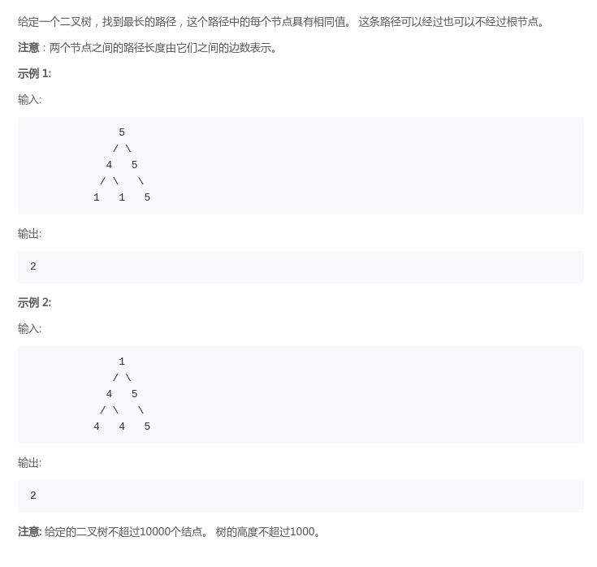
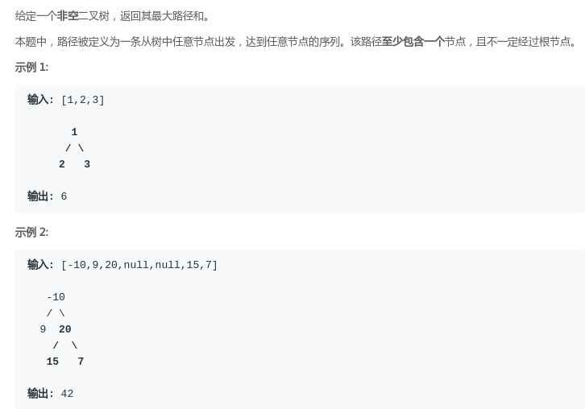

### LeetCode - 687. Longest Univalue Path (树的最长同值路径)

#### [题目链接](https://leetcode.com/problems/longest-univalue-path/)

> https://leetcode.com/problems/longest-univalue-path/

#### 题目



#### 解析

这个题目虽然不难，但是一开始还是没有注意细节: 

* 一开始递归函数就是考虑先递归求出左右孩子的最长同值路径；
* 然后如果左孩子和右孩子和自己相同，就更新当前节点返回的最长同值路径；
* 最终答案就是返回以根节点的最长同值路径；

但是这种思路对于部分情况是错误的，见下图，因为这里的路径是<font color = red>类似只能一笔画，而不能往回走</font>。所以我们需要在递归的时候记录最长路径，而返回的时候只能返回左右孩子的其中一个。


即递归函数需要改变定义: `recur(node)`，返回的是<font color = blue>当前最长连续的同值路径</font>


* 如果当前节点为空或者没有左右孩子，就返回`0`；
* 如果当前节点只有左孩子，如果左孩子的值`node.left.val`等于当前节点的值`node.val`，就先更新最大值，然后返回`L + 1`，如果不等于，就返回`0`；
* 如果当前节点只有右孩子，如果右孩子的值`node.right.val`等于当前节点的值`node.val`，就先更新最大值，然后返回`R + 1`，如果不等于，就返回`0`；
* 否则就是左右孩子都全，如果左右孩子的值都等于`node.val`，<font color = red>就要更新`res = Math.max(res, L + R + 2)`，但是返回的是`Math.max(L, R) + 1`，其他情况和上面类似，具体看代码。


**一开始的<font color = red>错误</font>的代码:**
```java
class Solution {
    public int longestUnivaluePath(TreeNode root) {
        return recur(root);
    }
    
    private int recur(TreeNode node){ 
        if(node == null)
            return 0;
        if(node.left == null && node.right == null)
            return 0;
        if(node.left == null){ 
            int R = recur(node.right);
            if(node.val == node.right.val)
                return 1 + R;
            else 
                return R;
        }
        if(node.right == null){ 
            int L = recur(node.left);
            if(node.val == node.left.val)
                return 1 + L;
            else 
                return L;
        }
        int L = recur(node.left);
        int R = recur(node.right);
        if(node.val == node.left.val && node.val == node.right.val)
            return 2 + L + R;
        else if(node.val == node.left.val && node.val != node.right.val)
            return Math.max(R, L + 1);
        else if(node.val != node.left.val && node.val == node.right.val)
            return Math.max(L, R + 1);
        else 
            return Math.max(L, R);
    }
}
```


**<font color = red>修正</font>之后的代码:** 
```java
class Solution {

    private int res;

    public int longestUnivaluePath(TreeNode root) {
        recur(root);
        return res;
    }
    
    private int recur(TreeNode node){
        if(node == null)
            return 0;
        if(node.left == null && node.right == null)
            return 0;
        int L = recur(node.left);
        int R = recur(node.right);
        if(node.left == null){ // means node.right != null
            if(node.val == node.right.val){
                res = Math.max(res, R + 1);
                return R + 1;
            }
            else 
                return 0;
        }
        if(node.right == null){ //means node.left != null
            if(node.val == node.left.val){
                res = Math.max(res, L + 1);
                return L + 1;
            }
            else 
                return 0;
        }
        if(node.val == node.left.val && node.val == node.right.val){ 
            res = Math.max(res, L + R + 2);
            return Math.max(L, R) + 1; //只能返回其中一个的
        }else if(node.val == node.left.val && node.val != node.right.val){ 
            res = Math.max(res, L + 1);
            return L + 1;
        }else if(node.val != node.left.val && node.val == node.right.val){ 
            res = Math.max(res, R + 1);
            return R + 1;
        }else { 
            return 0;
        }
    }
}
```

简写的代码: 

```java
class Solution {

    private int res;
    
    public int longestUnivaluePath(TreeNode root) {
        recur(root);
        return res;
    }
    
    private int recur(TreeNode node){
        if(node == null)
            return 0;
        int L = recur(node.left);
        int R = recur(node.right);
        int nL = 0, nR = 0;
        if(node.left != null && node.val == node.left.val)
            nL = L + 1;
        if(node.right != null && node.val == node.right.val)
            nR = R + 1;
        res = Math.max(res, nL + nR);
        return Math.max(nL, nR);
    }
}
```

***

<font color = red>附</font>: [**LeetCode-543. Diameter of Binary Tree**](https://leetcode.com/problems/diameter-of-binary-tree/)是这个题目的弱化版本。


```java
class Solution {

    private int res;

    private int recur(TreeNode node){ 
        if(node == null)
            return 0;
        int L = recur(node.left);
        int R = recur(node.right);
        if(node.left != null && node.right != null){ 
            res = Math.max(res, 2 + L + R);
            return Math.max(L, R) + 1;
        }else if(node.left != null && node.right == null){ 
            res = Math.max(res, 1 + L);
            return 1 + L;
        }else if(node.left == null && node.right != null){ 
            res = Math.max(res, 1 + R);
            return 1 + R;
        }else
            return 0;
    }

    public int diameterOfBinaryTree(TreeNode root) {
        if(root == null)
            return 0;
        recur(root);
        return res;
    } 
}
```

***
<font color = red>附</font>: [**LeetCode - 124. Binary Tree Maximum Path Sum**](https://leetcode.com/problems/binary-tree-maximum-path-sum/)也是类似的题目。


```java
class Solution {

    private int res;

    public int maxPathSum(TreeNode root) {
        if(root == null)
            return 0;
        res = Integer.MIN_VALUE;
        recur(root);
        return res;
    }

    public int recur(TreeNode node){ 
        if(node == null)
            return 0;
        int L = recur(node.left);
        int R = recur(node.right);
        res = Math.max(res, L + R + node.val);
        res = Math.max(res, Math.max(L, R) + node.val);
        res = Math.max(res, node.val);
        int maxx = Math.max(L, R);
        if(maxx > 0)
            return maxx + node.val;
        else 
            return node.val;
    }
}
```

