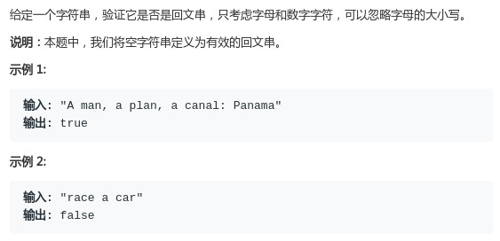
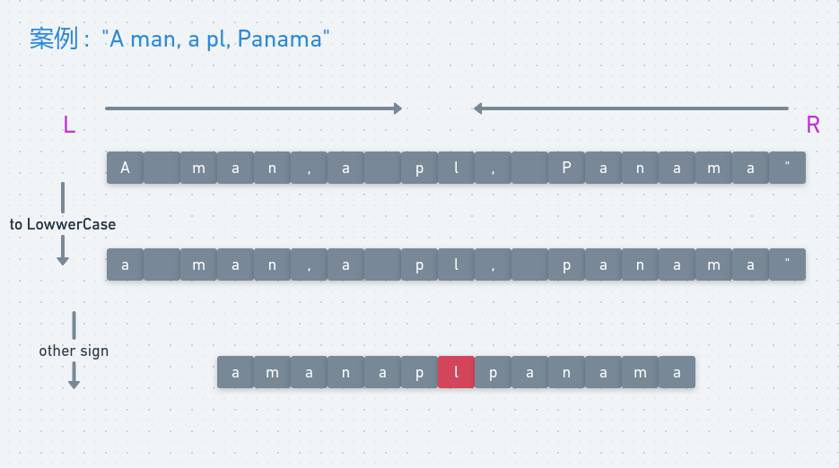

# LeetCode - 125. Valid Palindrome

#### [题目链接](https://leetcode.com/problems/valid-palindrome/)

> https://leetcode.com/problems/valid-palindrome/

#### 题目



## 解析

很简单的模拟题，可以用双指针解法吧。

* 先转成小写；
* 然后两个指针向中间靠拢，遇到没用的字符就跳过；

图:



代码:

```java
class Solution {
    public boolean isPalindrome(String s) {
        char[] chs = s.toLowerCase().toCharArray(); // 都转成小写
        for (int l = 0, r = chs.length - 1; l <= r; ) {
            if (!Character.isLetterOrDigit(chs[l])) // 不是字母或者数字
                l++;
            else if (!Character.isLetterOrDigit(chs[r]))
                r--;
            else if (chs[l] != chs[r])
                return false;
            else {   // chs[l] == chs[r]
                l++;
                r--;
            }
        }
        return true;
    }
}
```

