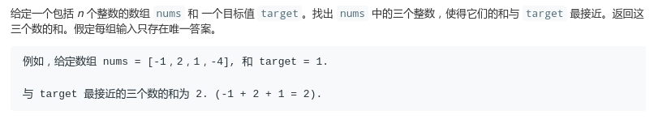
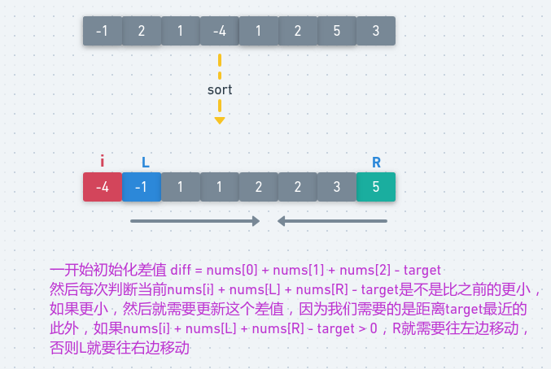

# LeetCode - 16. 3Sum Closest

#### [题目链接](https://leetcode.com/problems/3sum-closest/)

> https://leetcode.com/problems/3sum-closest/

#### 题目



## 解析

和上一道的双指针解法差不多。区别是不要去重，而且找到了和`target`相等的直接`return`。

* 先排序，根据情况移动left 和right；
* 当确定好了第一个数字`nums[i]`后，就在剩下的数组中找两数之和，再加上第一个数字，再减去`target` 来得到`newdiff`，如果`newdiff`比之前的小，那么更新`diff` 。
*  利用双指针特性， 如果 `nums[i] + nums[L] + nums[R]`比`target` 小的话，说明我们需要更大的sum，所以要让`L++`以便得到更大的sum。否则`R--`。

图:

<div algin="center"></div><br>

代码:

```java
import java.util.Arrays;

class Solution {
    public int threeSumClosest(int[] nums, int target) {
        if (nums == null || nums.length == 0) return 0;
        Arrays.sort(nums); // 必须先排序
        int diff = nums[0] + nums[1] + nums[2] - target;
        for (int i = 0; i < nums.length; i++) {
            int L = i + 1, R = nums.length - 1;
            while (L < R) {
                int newDiff = nums[i] + nums[L] + nums[R] - target;
                if (newDiff == 0) return target;
                if (Math.abs(newDiff) < Math.abs(diff)) diff = newDiff;
                if (newDiff < 0) L++;
                else R--;
            }
        }
        return target + diff;
    }
}
```

