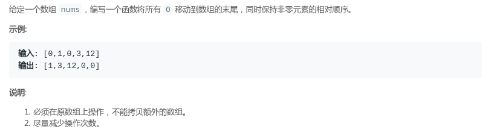

### LeetCode - 283. Move Zeroes(移动零)(简单题)(三种写法)

 - O(n)空间，O(n)时间
 - O(1)空间，O(n)时间
 - O(1)空间，O(n)时间  + 巧妙使用swap()优化

***
#### [题目链接](https://leetcode.com/problems/move-zeroes/description/)

> https://leetcode.com/problems/move-zeroes/description/

#### 题目

#### O(n)空间，O(n)时间
这个方法很简单，直接使用一个额外的数组来保存原数组非`0`的元素，最后再补上`0`即可。

```java
class Solution {
    public void moveZeroes(int[] nums) {
         List<Integer>list = new ArrayList<>();
      
         for(int i = 0; i < nums.length; i++){
             if(nums[i] != 0){
                 list.add(nums[i]);
             }
         }
      
         for(int i = list.size(); i < nums.length; i++) list.add(0);
      
         for(int i = 0; i < list.size(); i++) nums[i] = list.get(i);
    }
}
```
***
### O(1)空间，O(n)时间
这个就稍微具有一点技巧性，可以说是使用了双指针吧，也就是在前面记录一个指针`k`，在我们另一个指针遍历

` i `的时候，只要当前的元素` != 0`，就将这个元素放到相应的k指针指向的位置，如果`i == k` ，我们也可以放到

那里，不会出错。

```java
class Solution {
    public void moveZeroes(int[] nums) {
         int k = 0;
         for(int i = 0; i < nums.length; i++){
             if(nums[i] != 0){
                 nums[k++] = nums[i];
             }
         }
         
         for(; k < nums.length; k++) nums[k] = 0;
     }
}
```

### O(1)空间，O(n)时间  + 巧妙使用swap()优化
第三种方式也是使用两个指针，和前面更加优化的是: 

 - 我们遍历到一个元素的时候，如果`nums[i] != 0`，就可以直接`i `位置的和` k `位置的交换；
 - 这样我们最后甚至都不需要再把`0`填充进去，只需要一次遍历就可以，效率又提高一点。

```java
class Solution {
     // [k,i]为0
     public void moveZeroes(int[] nums) {
         int k = 0; 
         for(int i = 0; i < nums.length; i++){
              if(nums[i] != 0){
                  if(i != k)//另一个小优化
                      swap(nums,i,k);
                  k++;
              }
         }
     }
     
     public void swap(int[] arr,int i,int j){
         int t = arr[i];
         arr[i] = arr[j];
         arr[j] = t;
     }
}
```


