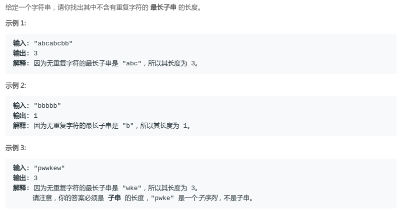
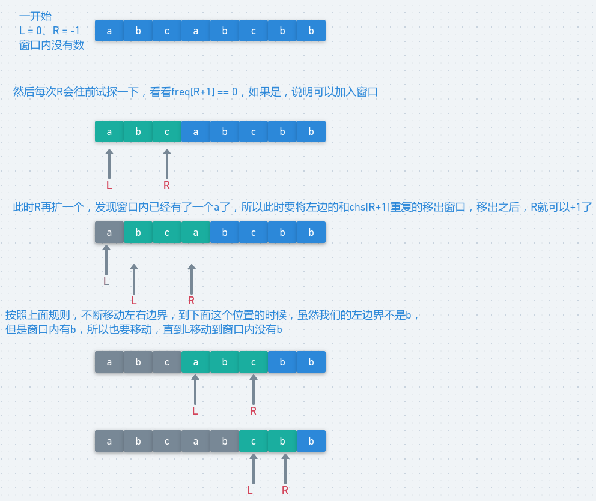
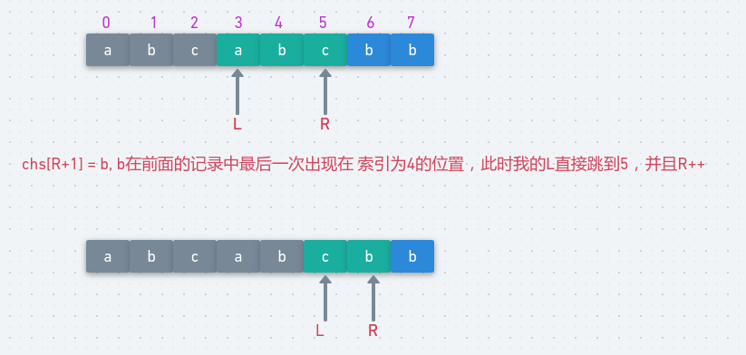

# LeetCode - 3. Longest Substring Without Repeating Characters(滑动窗口)
#### [题目链接](https://leetcode.com/problems/longest-substring-without-repeating-characters/description/)

> https://leetcode.com/problems/longest-substring-without-repeating-characters/description/

#### 题目

## 暴力O(N<sup>3</sup>)
方法:
* 使用一个函数`isAllUnique`来判断某一段字符串是不是有重复的字符；
* 然后枚举左右边界`[L, R]`，一段一段的判断，时间复杂度O(N<sup>3</sup>)；

暴力会超时。

```java
class Solution {

    public int lengthOfLongestSubstring(String s) {
        if (s == null || s.length() == 0)
            return 0;
        int res = 0;
        for (int l = 0; l < s.length(); l++) {
            for (int r = l; r < s.length(); r++) {//注意从l开始，可以是长度为1
                if (isAllUnique(s, l, r))
                    res = Math.max(res, r - l + 1);
            }
        }
        return res;
    }

    //判断[L,R]之间的字符是不是都是不重复的
    public boolean isAllUnique(String s, int L, int R) {
        Set<Character> set = new HashSet<>();
        for (int i = L; i <= R; i++) {
            if (!set.contains(s.charAt(i)))
                set.add(s.charAt(i));
            else
                return false;
        }
        return true;
    }
}    
```
## 滑动窗口
和普通的滑动窗口一样，使用一个`freq`数组来保存字符出现的次数:
* 每次试探`++R`，要判断是否越界，然后判断如果`chs[R+1]`与前面的字符串段中没有重复的话，`R`就可以继续扩展，对应`chs[R+1]`上的频次要`++`；
* 如果有重复的话，左边界`L`就扩展，此时对应的频次要`--`；
* 每一个窗口都更新一下全局最大值；

图: 



代码: 

```java
class Solution {
    public int lengthOfLongestSubstring(String s) {
        if (s == null || s.length() == 0) return 0;
        char[] chs = s.toCharArray();
        int[] freq = new int[256];
        int L = 0, R = -1;
        int res = 0;
        while (R < s.length()) {
            if (R + 1 == s.length()) //一定要break, 一是防止越界，二是不然L不会break； R你都到str.length - 1，L你要再移动也不会更长了
                break;
            //如果freq[chs[R + 1]] != 0，就要先一直移动L,直到freq[chs[R+1]]可以进入窗口，这个过程不会错过最优解
            if (freq[chs[R + 1]] == 0)
                freq[chs[++R]]++;
            else
                freq[chs[L++]]--;
            res = Math.max(res, R - L + 1);
        }
        return res;
    }
}
```
对于`R`边界的判断以及循环的终止，因为`R`如果到达了边界的话，此时`L`你再往右边扩展，此时的长度只会更小，所以上述代码也可以简写成下面的样子: 

```java
class Solution {
    public int lengthOfLongestSubstring(String s) {
        if (s == null || s.length() == 0) return 0;
        char[] chs = s.toCharArray();
        int[] freq = new int[256];
        int L = 0, R = -1;
        int res = 0;
        while (R + 1 < s.length()) { // 直接写成这样就行
            if (freq[chs[R + 1]] == 0)
                freq[chs[++R]]++;
            else
                freq[chs[L++]]--;
            res = Math.max(res, R - L + 1);
        }
        return res;
    }
}
```
更加优化的方式是: 

* 使用一个`index[]`数组记录每一个` chs[i]`最后一次出现位置；
* 下次我的`L`要移动的时候，我直接移动到`index[chs[R+1]]`的位置，前面的`L~index[R]`都直接跳过了。

图: 

<div align="center"></div><br>

代码:


```java
// 优化的滑动窗口
// 其中使用index[c]保存字符c上一次出现的位置, 用于在右边界发现重复字符时, 快速移动左边界
// 使用这种方法, 时间复杂度依然为O(n), 但是只需要动r指针, 实际上对整个s只遍历了一次
class Solution {
    public int lengthOfLongestSubstring(String s) {
        if (s == null || s.length() == 0) return 0;
        char[] chs = s.toCharArray();
        int[] index = new int[256];
        int L = 0, R = -1, res = 0;
        Arrays.fill(index, -1);
        while (R + 1 < s.length()) {
            R++;
            if(index[chs[R]] != -1) 
                L = Math.max(L, index[chs[R]]+1); // 此时L直接移动到上一个R的前一个位置
            //注意更新 R的索引位置
            index[chs[R]] = R;
            res = Math.max(res, R - L + 1);
        }
        return res;
    }
}
```


