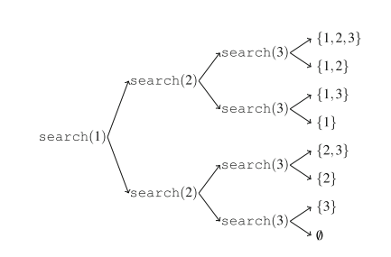

### 1、模运算

性质

```c
(a + b) mod m = (a mod m + b mod m) mod m
(a − b) mod m = (a mod m − b mod m) mod m
(a · b) mod m = (a mod m · b mod m) mod m
```

Usually we want the remainder to always be between `0 ... m−1`. However, in C++ and other languages, `the remainder of a negative number is either zero or negative`. An easy way to make sure there are no negative remainders is to first calculate the remainder as usual and then add m if the result is negative:

```cpp
x = x % m;
if (x < 0) x += m;
```

### 2、Generating Subsets



```java
import java.util.ArrayList;

public class Code_01_SubSet {

    static ArrayList<Integer> subset;
    static ArrayList<ArrayList<Integer>> res;
    static int n;

    static void search(int k) {
        if (k == n+1) { // process subset
            res.add(new ArrayList<>(subset));
        } else {  // include k in the subset
            subset.add(k);
            search(k+1);
            subset.remove(subset.size() - 1);  // don’t include k in the subset
            search(k+1);
        }
    }

    public static void main(String[] args){
        n = 4;
        subset = new ArrayList<>();
        res = new ArrayList<>();
        search(1);
        System.out.println(res);
    }
}
```

### 3、Permutation

```java
import java.util.ArrayList;

public class Code_02_Permutation {

    static ArrayList<Integer> tmp;
    static ArrayList<ArrayList<Integer>> res;
    static int n;
    static boolean[] vis;

    static void search(){
        if(tmp.size() == n){
            res.add(new ArrayList<>(tmp));
        }else {
            for(int i = 1; i <= n; i++){
                if(vis[i]) continue;
                tmp.add(i);
                vis[i] = true;
                search();
                tmp.remove(tmp.size() - 1);
                vis[i] = false;
            }
        }
    }

    public static void main(String[] args){
        n = 3;
        vis = new boolean[n+1];
        tmp = new ArrayList<>();
        res = new ArrayList<>();
        search();
        System.out.println(res);
    }
}

```

### 