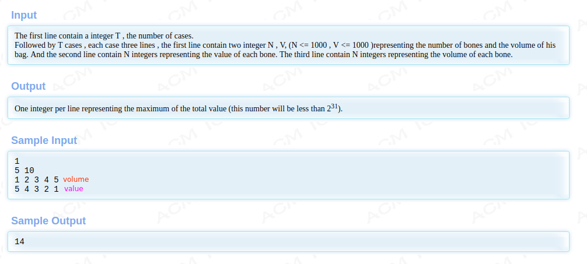
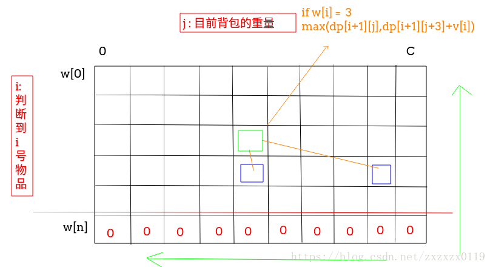
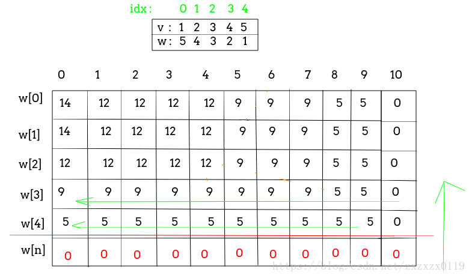
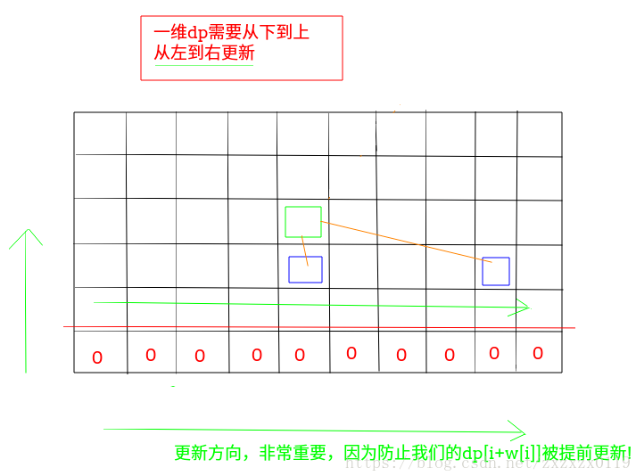

## Hdu - 2602. Bone Collector(01背包问题)
 - 递归写法
 - 二维dp
 - 一维dp

***
#### [题目链接](http://acm.hdu.edu.cn/showproblem.php?pid=2602)

> http://acm.hdu.edu.cn/showproblem.php?pid=2602

#### 题目



### 递归写法

递归的思想就是: 

 - **我要计算的是从第`0`号物体到`n-1`号物体的最大重量；**
 - **记录一个当前判断到i号物体时，已经选择的物体的容量`curW`；**
 - **我的递归边界是如果判断到当前的物体大于我的背包容量了，这个物体就不能选，于是我之前如果假设选了的话我就要减掉这个物体的价值；**
 - 如果`i`越界的话就返回`0`；
 - 否则我就递归的去求<font color = red>**选择了`i`号物品的最大值和不选择`i`号物品的最大值**</font>中，我们要取的最大值；

```java
public class Main {

    static int maxValue(int[] w, int[] v, int C) {
        return rec(w, v, 0, 0, C);
    }

    static int rec(int[] w, int[] v, int i, int curW, int C) {
        if (curW > C)
            return -v[i - 1];  //累加和为0
        if (i == w.length) //到最后一个
            return 0;
        return Math.max(rec(w, v, i + 1, curW + w[i], C) + v[i],
                rec(w, v, i + 1, curW, C));
    }
}
```
**但是上面的写法会超时，所以我们需要使用一个二维数组来记录计算过的重复子问题。(也就是记忆化)**

```java
import java.io.BufferedInputStream;
import java.util.*;

public class Main {

    static int[][] dp;

    static int maxValue(int[] w, int[] v, int C) {
        dp = new int[w.length + 1][C + 1];
        for (int i = 0; i < w.length + 1; i++)
            Arrays.fill(dp[i], -1);
        return rec(w, v, 0, 0, C);
    }

    static int rec(int[] w, int[] v, int i, int curW, int C) {
        if (curW > C)
            return -v[i - 1];
        if (i == w.length)
            return 0;
        if (dp[i][curW] != -1) //记忆化
            return dp[i][curW];
        dp[i][curW] = Math.max(rec(w, v, i + 1, curW + w[i], C) + v[i],
                rec(w, v, i + 1, curW, C));
        return dp[i][curW];
    }

    public static void main(String[] args) {

        Scanner cin = new Scanner(new BufferedInputStream(System.in));
        int T = cin.nextInt();
        while (T-- > 0) {
            int n = cin.nextInt();
            int C = cin.nextInt();
            int[] w = new int[n];
            int[] v = new int[n];
            for (int i = 0; i < n; i++) v[i] = cin.nextInt();
            for (int i = 0; i < n; i++) w[i] = cin.nextInt();
            System.out.println(maxValue(w, v, C));
        }
    }
}
```
### 二维dp



(输入就不处理了，和上面的一样)

```java
public class Main {

    static int maxValue(int[] w, int[] v, int C) {
        int[][] dp = new int[w.length + 1][C + 1];
//        for (int j = 0; j <= C; j++) dp[w.length][j] = 0; //auto initialize to 0
        for (int i = w.length - 1; i >= 0; i--) {
            for (int j = C; j >= 0; j--) {
                dp[i][j] = j + w[i] > C ? dp[i + 1][j] : Math.max(dp[i + 1][j], dp[i + 1][j + w[i]] + v[i]);
            }
        }
        return dp[0][0];
    }
}
```
### 一维dp
也就是滚动优化，`dp`用来记录列。
```java
public class Main {

    static int maxValue(int[] w, int[] v, int C) {
        int[] dp = new int[C + 1];
        for (int i = w.length - 1; i >= 0; i--) {
            for (int j = 0; j <= C; j++) {
                dp[j] = j + w[i] > C ? dp[j] : Math.max(dp[j], dp[j + w[i]] + v[i]);
            }
        }
        return dp[0];
    }
}
```

 - <font color = red>这一行代码`for (int j = 0; j <= C; j++)` 千万不能写成下面的样子(也就是不能和二维`dp`一样从`C --> 0`): </font>
 - <font color = red>因为这样的话我们的需要的`dp[j + w[i]] `此时已经更新了，不是我们需要的了。


```java
  for (int j = C; j >= 0 ; j--) //万万不可
```

