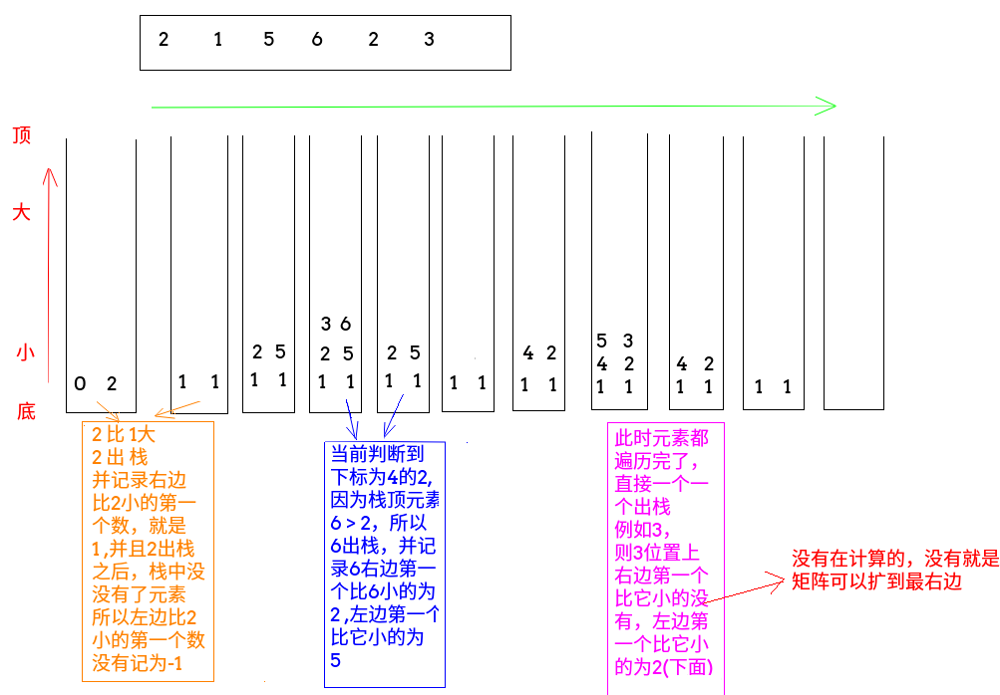

## LintCode - 122. Largest Rectangle in Histogram(直方图最大矩形覆盖)(单调栈)
#### [题目链接](https://www.lintcode.com/problem/largest-rectangle-in-histogram/description)

> https://www.lintcode.com/problem/largest-rectangle-in-histogram/description

#### 题目


**给出 `height = [2,1,5,6,2,3]`，返回`10`。**

### 解析

主要是运用单调栈(单调栈的知识[**这篇博客**](https://blog.csdn.net/zxzxzx0119/article/details/81629626))来解决，注意这个栈是 从栈底到栈顶依次是从小到大的:


 - 如果栈中的数比当前的数大(或者等于)就要处理栈顶的(记录左右两边的比它小的第一个数)；
 - 然后如果遍历完之后，单独处理栈，此时所有元素右边都不存在比它小的；

看下图(上面的例子)栈的变化过程: 



```java
public class Solution {
    /**
     * 准备的是一个 从栈底到栈顶 依次由小到大的栈
     * 找到左右两边第一个比它小的
     * 一个不同就是有可能有相等的，但是不影响
     */
    public int largestRectangleArea(int[] height) {
        if (height == null || height.length == 0) return 0;
        Stack<Integer> stack = new Stack<>();
        int maxArea = 0;
        for (int i = 0; i < height.length; i++) {
            while (!stack.isEmpty() && height[stack.peek()] >= height[i]) {
                int top = stack.pop();
                int L = stack.isEmpty() ? -1 : stack.peek();
                int curArea = (i - L - 1) * height[top];//注意i自己就是右边界  左边界到右边界中间的格子(i-L-1)
                maxArea = Math.max(maxArea, curArea);
            }
            stack.push(i); //注意是下标入栈
        }
        //处理完整个数组之后，再处理栈中的
        while (!stack.isEmpty()) {
            int top = stack.pop();
            int L = stack.isEmpty() ? -1 : stack.peek();
            int curArea = (height.length - 1 - L) * height[top]; //注意所有还在栈中的右边界都是 数组的长度右边没有比它小的
            maxArea = Math.max(maxArea, curArea);
        }
        return maxArea;
    }
}
```
