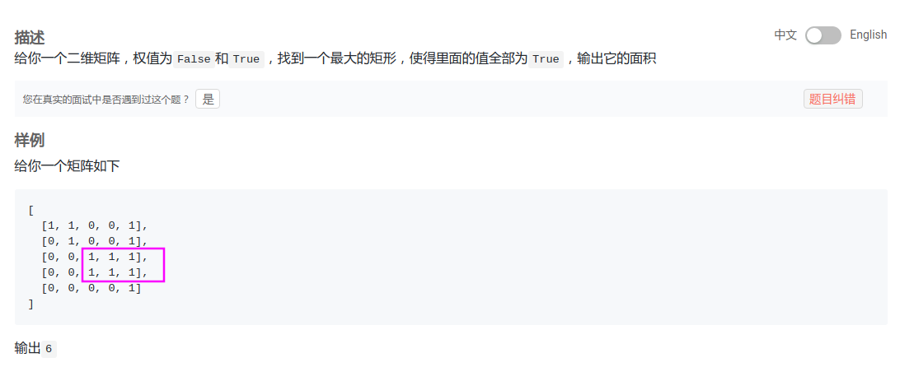

## LintCode - 510. Maximal Rectangle(最大矩形)(单调栈)
#### [题目链接](https://www.lintcode.com/problem/maximal-rectangle/description)

> https://www.lintcode.com/problem/maximal-rectangle/description

#### 题目




### 解析
这个题目就是[**直方图最大矩形覆盖**](https://blog.csdn.net/zxzxzx0119/article/details/81630814)的一个变式: 
我们只需要求出以**每一行作为底最大的矩形是多少**，每一行都有一个`height`数组，把每个数组都调用上个题目的方法就可以求出，以每一行作为底(直方图最下面)时最大矩形面积，然后记录最大值即可。
**关键就是每次更新`height`数组，`height`数组代表的是这一列上面有多少个连续的**`1`


例如: 
```c
map = 1  0  1  1
      1  1  1  1 
      1  1  1  0
```

以第一行做切割后，`height = {1, 0, 1, 1}`，`height[j]`表示目前的底上(第`1`行)，`j`位置往上(包括`j`位置)有多少连续的`1`；

以第`2`行做切割后，`height = {2,  1, 2, 2}`，注意到从第一行到第二行，`height`数组的更新是十分方便的，即`height[j] = map[i][j] == 0 ? 0 : height[j] + 1`；(这里有点dp的意思)

第`3`行做切割后，`height = {3, 2, 3, 0}`；

最后的结果: 对于每一次切割，都利用更新后的`height`数组来求出以每一行为底的情况下，最大的矩形是多大（然后记录最大值即可）。


```java
public class Solution {
    public int maximalRectangle(boolean[][] matrix) {
        if (matrix == null || matrix.length == 0 || matrix[0].length == 0)
            return 0;
        int maxArea = 0;
        int[] height = new int[matrix[0].length];  //依次的求每一行的直方图最大面积
        for (int i = 0; i < matrix.length; i++) {
            for (int j = 0; j < matrix[0].length; j++) {
                height[j] = matrix[i][j] == false ? 0 : height[j] + 1;
            }
            maxArea = Math.max(largestRectangleArea(height), maxArea);
        }
        return maxArea;
    }

    public int largestRectangleArea(int[] height) {
        if (height == null || height.length == 0) return 0;
        Stack<Integer> stack = new Stack<>();
        int maxArea = 0;
        for (int i = 0; i < height.length; i++) {
            while (!stack.isEmpty() && height[stack.peek()] >= height[i]) {
                int top = stack.pop();
                int L = stack.isEmpty() ? -1 : stack.peek();
                int curArea = (i - L - 1) * height[top];//注意i自己就是右边界  左边界到右边界中间的格子(i-L-1)
                maxArea = Math.max(maxArea, curArea);
            }
            stack.push(i); //注意是下标入栈
        }
        //处理完整个数组之后，再处理栈中的
        while (!stack.isEmpty()) {
            int top = stack.pop();
            int L = stack.isEmpty() ? -1 : stack.peek();
            int curArea = (height.length - 1 - L) * height[top]; //注意所有还在栈中的右边界都是 数组的长度右边没有比它小的
            maxArea = Math.max(maxArea, curArea);
        }
        return maxArea;
    }
}
```
