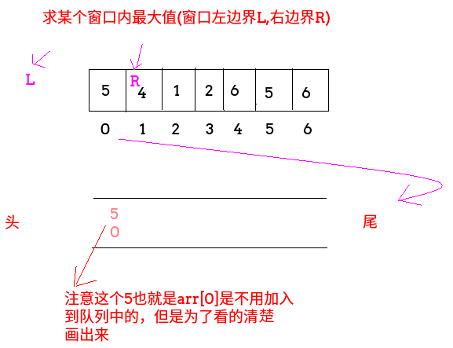
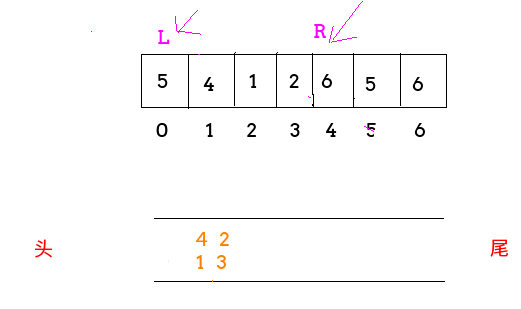
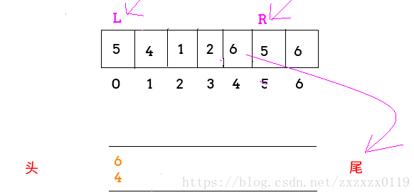
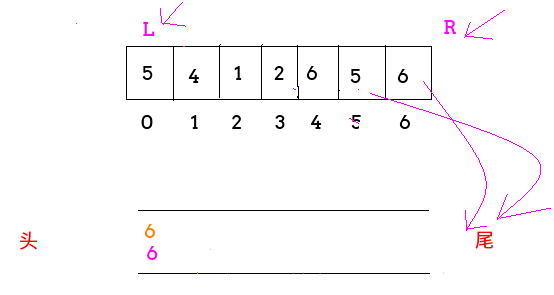

## LintCode - 362. Sliding Window Maximum(滑动窗口的最大值)(单调队列(窗口滑动))

 - 单调队列介绍
 - 使用单调队列解决此题

***
#### [题目链接](https://www.lintcode.com/problem/sliding-window-maximum/description)

> https://www.lintcode.com/problem/sliding-window-maximum/description

#### 单调队列介绍
单调队列一开始用来<font color = red>求出在数组的某个区间范围内求出最大值。</font>具体的做法如下


准备一个双端队列，<font color = red>队列遵守从左到右从大到小(不能相等)的规则</font>，然后当窗口决定加入一个数，**则`R`往右移动一位**，`L`不动，**并且判断队列中的尾部的数是否比刚刚窗口加入的数小**，如果不是就加入，如果是就一直弹出队列尾部的数，直到比这个要加入的数大，就把这个数<font color = red>**的下标**</font>加入双向链表，由于这里一开始队列为空直接加入。 




 再接下来判断`1`位置上的`4`和`2`位置的`1`，他们都比各自的队列尾部小，可以直接进入队列;


再判断`3`位置上的`2`，由于比`1`大(也就是队列的尾部比这个数小)，所以把队列尾部弹出一个，`1`弹出，由于`4`比`2`大，就可以放`２`了:


<font color = red>再看窗口中减数的逻辑</font>，当`L`向右移动的时候，检查队列中的头部**有没有过期，也就是还在不在窗口，如果不在，就弹出，如图，弹出`5`，`L`向右移动**: 



然后如果`R`再向右移动一位，来到`4`位置上的`6`，队列中的数都比`6`小，所以都弹出:



继续往后，直到最后:




 - 上面就是单调队列的窗口加数和减数的操作规则；
 - 要注意队列从左到右一直是降序的；
 - 要注意减数的判断过期规则；
 - <font color = red> 所以在任意的窗口时刻，队列头部就是这个窗口的最大值；

***
### 使用单调队列解决此题
### 题意

给出一个可能包含重复的整数数组，和一个大小为` k` 的滑动窗口, 从左到右在数组中滑动这个窗口，找到数组中每个窗口内的最大值。要求`O(n)`时间，`O(k)`的额外空间。


### 解析
这个和上面的唯一区别就是`L、R`是同时向右，每次都要动一格，所以多了一个判断过期的逻辑，`i-k == qmax.peekFirst()`这个，就是`L`向左移动的逻辑，此时要判断队头是否过期。其他的都是和上面一样。


```java
public class Solution {
    //单调双向队列(窗口内最大值)
    public ArrayList<Integer> maxSlidingWindow(int[] nums, int k) {
        if (nums == null || k < 1 || nums.length < k) return null;
        ArrayList<Integer> res = new ArrayList<>();
        LinkedList<Integer> qmax = new LinkedList<>();//保存的是下标
        for (int i = 0; i < nums.length; i++) {
            while (!qmax.isEmpty() && nums[qmax.peekLast()] <= nums[i]) {//要队尾满足条件
                qmax.pollLast();
            }
            qmax.addLast(i);
            if (i - k == qmax.peekFirst()) {
                qmax.pollFirst();//向左弹出  过期的数据s
            }
            if (i >= k - 1) {
                res.add(nums[qmax.peekFirst()]);
            }
        }
        return res;
    }
}
```


