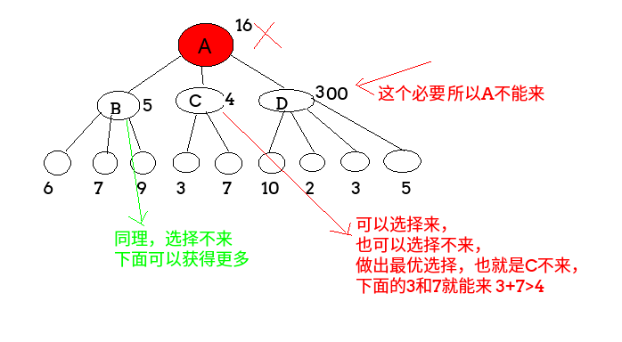
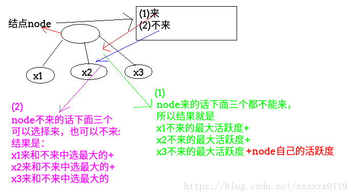

## POJ - 2342. Anniversary party(员工的活跃度问题)(多叉树以及树形dp)
#### [题目链接](http://poj.org/problem?id=2342)

> http://poj.org/problem?id=2342

#### 题意
某公司要举办一次晚会，但是为了使得晚会的气氛更加活跃，每个参加晚会的人都不希望在晚会中见到他的直接上司，现在已知每个人的活跃指数和上司关系（当然不可能存在环），求邀请哪些人（多少人）来能使得晚会的总活跃指数最大。


<font color = purple size = 5>**Sample Input**
```c
7
1
1
1
1
1
1
1
1 3
2 3
6 4
7 4
4 5
3 5
0 0
```
<font color = purple size = 5>**Sample Output**
```c
5
```
比如下面的两个例子：





#### 解析：
在一个结点`node`处:它可以选择来或不来。

 - **如果选择来: 它的子就不能来，此时它来的最大活跃度就是它的子的所有不来的时候的最大活跃度相加；**
 - **如果选择不来: 它的子就可以选择来或者不来，此时`node`的不来的最大活跃度就是它的子来或不来的最大活跃的最大值；**



```java
import java.io.BufferedInputStream;
import java.util.*;

public class Main {

    static class Node {
        public int val;
        public List<Node> nexts;

        public Node(int val) {
            this.val = val;
            nexts = new ArrayList<Node>();
        }
    }

    static class Pair {
        public int yVal; //来的最大活跃度
        public int nVal; //不来的最大活跃度

        public Pair(int yVal, int nVal) {
            this.yVal = yVal;
            this.nVal = nVal;
        }
    }

    static int getMaxHappy(Node head) {
        Pair res = rec(head);
        return Math.max(res.yVal, res.nVal);
    } 

    static Pair rec(Node head) {
        int yVal = head.val;           //选择来，包括自己
        int nVal = 0;                  //选择不来，不包括自己
        for (int i = 0; i < head.nexts.size(); i++) {
            Node next = head.nexts.get(i);
            Pair child = rec(next);
            yVal += child.nVal;         //自己来了，相邻的儿子就不来了
            nVal += Math.max(child.yVal, child.nVal);
        }
        return new Pair(yVal, nVal); //返回自己的来和不来
    }

    public static void main(String[] args) {
        Scanner cin = new Scanner(new BufferedInputStream(System.in));
        int n = cin.nextInt();
        Node[] nodes = new Node[n];
        int val = 0;
        for (int i = 0; i < n; i++) {
            val = cin.nextInt();
            nodes[i] = new Node(val);
        }
        int a, b;
        int[] vis = new int[n];
        while (cin.hasNext()) {
            a = cin.nextInt();
            b = cin.nextInt();
            if (a == 0 && b == 0) break;
            vis[a - 1]++;
            nodes[b - 1].nexts.add(nodes[a - 1]);
        }
        int root = 0;
        for (int i = 0; i < n; i++)
            if (vis[i] == 0) {
                root = i;
                break;
            }
        System.out.println(getMaxHappy(nodes[root]));
    }
}
```
更加优化的写法: 
`dp[i][0]`表示的是`i`作为父节点，它不来的时候的最大活跃度；
`dp[i][1]`表示的是`i`作为父节点，它来的时候的最大活跃度；

```java
import java.io.BufferedInputStream;
import java.util.*;

public class Main {

    static int[][] dp;
    static boolean[] vis;
    static int[] parent;

    static void dfs(int root, int n) {
        vis[root] = true;  //标记当前结点已经做过父 也就是它的dp两个值都算出来了
        for (int i = 0; i < n; i++) {
            if (!vis[i] && parent[i] == root) { //找到儿子
                dfs(i, n);
                dp[root][1] += dp[i][0]; //来的活跃度  加上儿子不来的活跃度
                dp[root][0] += Math.max(dp[i][0], dp[i][1]); //不来的活跃度是儿子来或不来的最大值
            }
        }
    }

    public static void main(String[] args) {
        Scanner cin = new Scanner(new BufferedInputStream(System.in));
        int n = cin.nextInt();
        dp = new int[n][2];
        for (int i = 0; i < n; i++)
            dp[i][1] = cin.nextInt(); //来的时候的活跃度
        int a = 0, b;
        parent = new int[n];
        for (int i = 0; i < n; i++) parent[i] = i;
        while (cin.hasNext()) {
            a = cin.nextInt();
            b = cin.nextInt();
            if (a == 0 && b == 0) break;
            parent[a - 1] = b - 1;
        }
        while (a != parent[a])
            a = parent[a];  //找到根节点
        vis = new boolean[n];
        dfs(a, n);
        System.out.println(Math.max(dp[a][0], dp[a][1]));
    }
}
```

