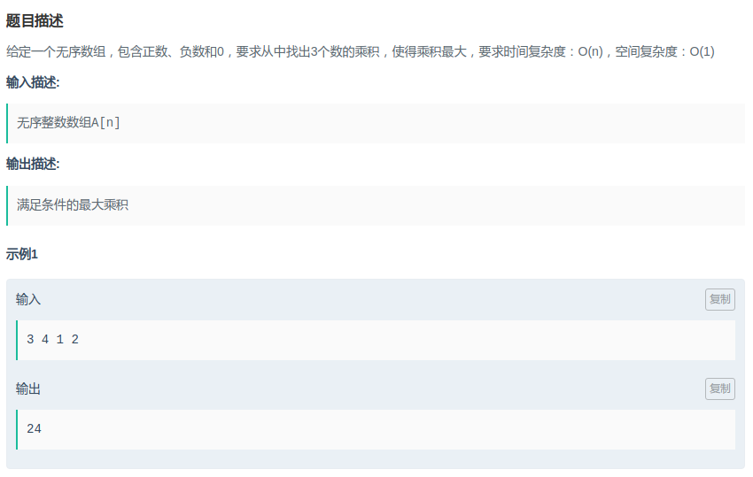

## 拼多多 - 最大乘积

#### [题目链接](https://www.nowcoder.com/practice/5f29c72b1ae14d92b9c3fa03a037ac5f?tpId=90&tqId=30776&tPage=1&rp=1&ru=/ta/2018test&qru=/ta/2018test/question-ranking)

> https://www.nowcoder.com/practice/5f29c72b1ae14d92b9c3fa03a037ac5f?tpId=90&tqId=30776&tPage=1&rp=1&ru=/ta/2018test&qru=/ta/2018test/question-ranking

#### 题目



#### 解析

记录最大的三个数`max1、max2、max3`和最小的两个数(`min1、min2`)即可。

```java
import java.util.*;
import java.io.*;

public class Main{
    public static void main(String[] args){

        Scanner in =  new Scanner(new BufferedInputStream(System.in));
        PrintStream out = System.out;
        int n = in.nextInt();
        int[] a = new int[n];
        for(int i = 0; i < n; i++) a[i] = in.nextInt();

        long max1 = Long.MIN_VALUE, max2 = Long.MIN_VALUE, max3 = Long.MIN_VALUE;
        long min1 = Long.MAX_VALUE, min2 = Long.MAX_VALUE;

        for(int i = 0; i < n; i++){
            if(a[i] > max1){
                max3 = max2;
                max2 = max1;
                max1 = a[i];
            }else if(a[i] > max2){
                max3 = max2;
                max2 = a[i];
            }else if(a[i] > max3){
                max3 = a[i];
            }
            if(a[i] < min1){
                min2 = min1;
                min1 = a[i];
            }else if(a[i] < min2)
                min2 = a[i];
        }
        long res = Math.max(max1 * max2 * max3, min1 * min2 * max1);
        out.println(res);
    }
}
```

