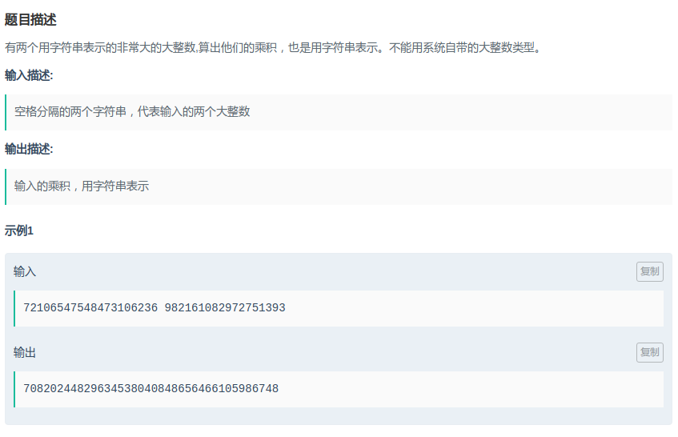

## 拼多多 - 大整数相乘

#### [题目链接](https://www.nowcoder.com/practice/0f0badf5f2204a6bb968b0955a82779e?tpId=90&tqId=30777&tPage=1&rp=1&ru=/ta/2018test&qru=/ta/2018test/question-ranking)

> https://www.nowcoder.com/practice/0f0badf5f2204a6bb968b0955a82779e?tpId=90&tqId=30777&tPage=1&rp=1&ru=/ta/2018test&qru=/ta/2018test/question-ranking

#### 题目



#### 解析

经典的大数乘法。

```java
import java.util.*;
import java.io.*;

public class Main{

    static String bigMul(char[] s1, char[] s2){
        int n1 = s1.length, n2 = s2.length;
        int[] a = new int[n1];
        int[] b = new int[n2];
        int[] c = new int[n1 + n2];
        for(int i = 0; i < n1; i++) a[i] = s1[n1 - i - 1] - '0';
        for(int i = 0; i < n2; i++) b[i] = s2[n2 - i - 1] - '0';
        for(int i = 0; i < n1; i++){
            for(int j = 0; j < n2; j++){
                c[i+j] += a[i] * b[j];
            }
        }
        for(int i = 0; i < n1 + n2 - 1; i++){
            if(c[i] >= 10){
                c[i+1] += c[i]/10;
                c[i] %= 10;
            }
        }
        int i;
        for(i = n1 + n2 - 1; i >= 0; i--) if(c[i] != 0) break;
        StringBuilder sb = new StringBuilder();
        for(; i >= 0; i--) sb.append( (char)(c[i] + '0'));
        return sb.toString();
    }

    public static void main(String[] args){
        Scanner in =  new Scanner(new BufferedInputStream(System.in));
        PrintStream out = System.out;
        char[] s1 = in.next().toCharArray();
        char[] s2 = in.next().toCharArray();
        out.println(bigMul(s1, s2));
    }
}
```

顺便加上一个加法的模板:

`POJ2506`代码:

思路是`F(n) = F(n - 1) + 2 * F(n - 2)`；但是要用大数处理。

```java
import java.io.*;
import java.util.*;

public class Main{

    static String bigAdd(String str1, String str2){
        char[] s1 = str1.toCharArray();
        char[] s2 = str2.toCharArray();
        int n1 = s1.length, n2 = s2.length;
        int maxL = Math.max(n1, n2);
        int[] a = new int[maxL + 1];//注意a,b的数组大小都必须是maxL+1
        int[] b = new int[maxL + 1];
        for(int i = 0; i < n1; i++) a[i] = s1[n1 - i - 1] - '0';
        for(int i = 0; i < n2; i++) b[i] = s2[n2 - i - 1] - '0';
        for(int i = 0; i < maxL; i++){
            if(a[i] + b[i] >= 10){
                int tmp = a[i] + b[i];//注意一定要先抽取出来
                a[i] = tmp%10;
                a[i+1] += tmp/10;
            }else
                a[i] += b[i];
        }
        StringBuilder sb = new StringBuilder();
        if(a[maxL] != 0) sb.append((char)(a[maxL] + '0'));
        for(int i = maxL-1; i >= 0; i--) sb.append((char)(a[i] + '0'));
        return sb.toString();
    }

    static String bigMul(String str1, String str2){
        char[] s1 = str1.toCharArray();
        char[] s2 = str2.toCharArray();
        int n1 = s1.length, n2 = s2.length;
        int[] a = new int[n1];
        int[] b = new int[n2];
        int[] c = new int[n1 + n2];
        for(int i = 0; i < n1; i++) a[i] = s1[n1 - i - 1] - '0';
        for(int i = 0; i < n2; i++) b[i] = s2[n2 - i - 1] - '0';
        for(int i = 0; i < n1; i++){
            for(int j = 0; j < n2; j++){
                c[i+j] += a[i] * b[j];
            }
        }
        for(int i = 0; i < n1 + n2 - 1; i++){
            if(c[i] >= 10){
                c[i+1] += c[i]/10;
                c[i] %= 10;
            }
        }
        int i;
        for(i = n1 + n2 - 1; i >= 0; i--) if(c[i] != 0) break;
        StringBuilder sb = new StringBuilder();
        for(; i >= 0; i--) sb.append( (char)(c[i] + '0'));
        return sb.toString();
    }

    public static void main(String[] args){
        Scanner in = new Scanner(new BufferedInputStream(System.in));
        PrintStream out = System.out;
        String[] s = new String[255];
        s[0] = "1"; s[1] = "1";
        for(int i = 2; i < 255; i++){
            String mul = bigMul("2", s[i-2]);
            s[i] = bigAdd(mul, s[i-1]);
        }
        while(in.hasNext()){
            int n = in.nextInt();
            out.println(s[n]);
        }
    }
}
```

