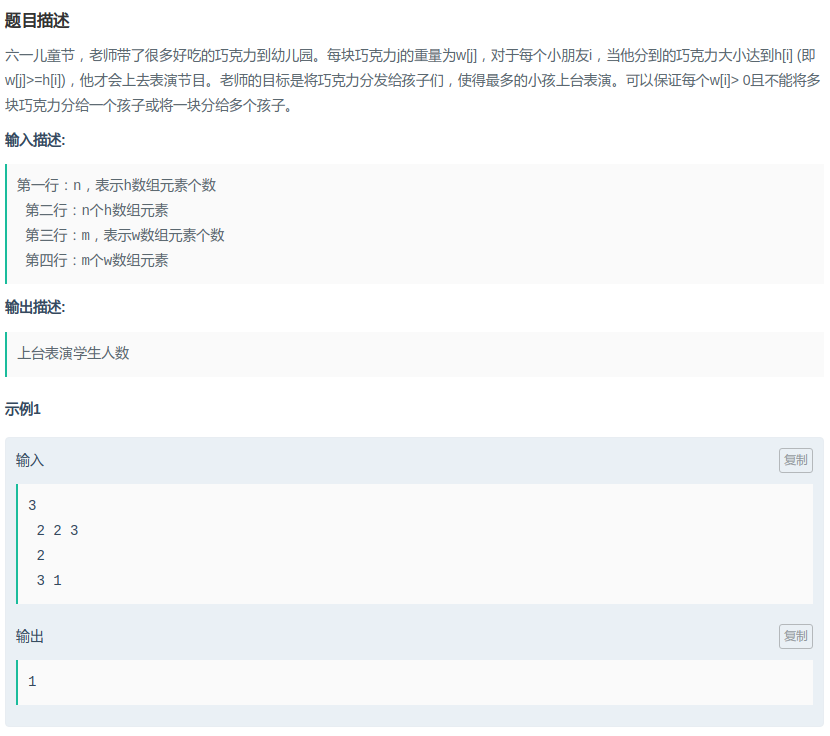

## 拼多多 - 六一儿童节

#### [题目链接](https://www.nowcoder.com/practice/d2dfc62bf1ba42679a0e358c57da9828?tpId=90&tqId=30778&tPage=1&rp=1&ru=/ta/2018test&qru=/ta/2018test/question-ranking)

> https://www.nowcoder.com/practice/d2dfc62bf1ba42679a0e358c57da9828?tpId=90&tqId=30778&tPage=1&rp=1&ru=/ta/2018test&qru=/ta/2018test/question-ranking

#### 题目



#### 解析

先对两个数组排序，然后贪心即可。

```java
import java.io.*;
import java.util.*;

public class Main{
    
    public static void main(String[] args){
        Scanner in = new Scanner(new BufferedInputStream(System.in));
        PrintStream out = System.out;
        int n = in.nextInt();
        int[] h = new int[n];
        for(int i = 0; i < n; i++) h[i] = in.nextInt();
        int m = in.nextInt();
        int[] w = new int[m];
        for(int i = 0; i < m; i++) w[i] = in.nextInt();
        Arrays.sort(h);
        Arrays.sort(w);
        int res = 0;
        for(int i = 0, j = 0; i < n && j < m; ){
            if(w[j] >= h[i]){
                res++;
                i++;
                j++;
            }else {
                j++;
            }
        }
        out.println(res);
    }
}
```

