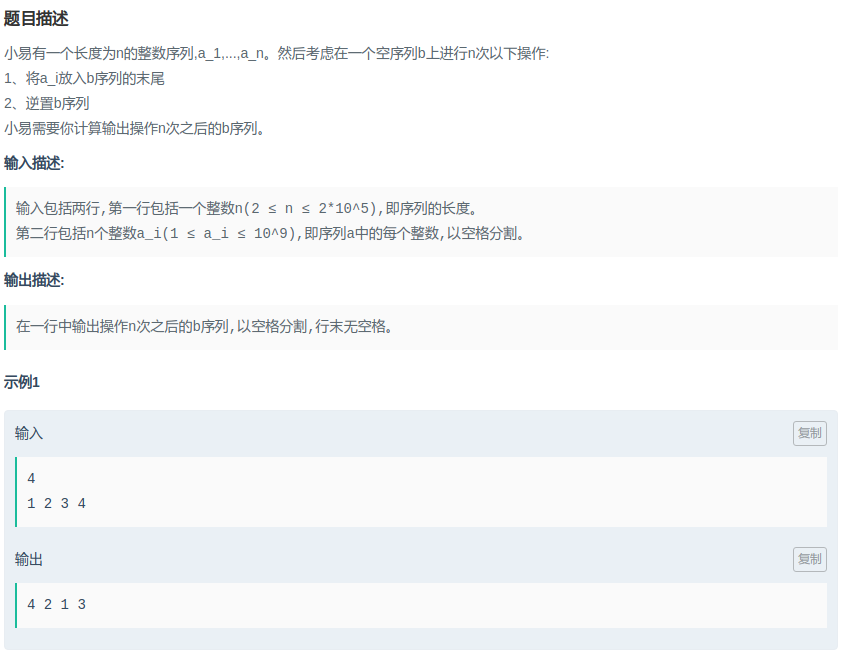

## XZ-04-网易-操作序列

#### [题目链接](https://www.nowcoder.com/practice/b53bda356a494154b6411d80380295f5?tpId=90&tqId=30783&tPage=1&rp=1&ru=/ta/2018test&qru=/ta/2018test/question-ranking)

> https://www.nowcoder.com/practice/b53bda356a494154b6411d80380295f5?tpId=90&tqId=30783&tPage=1&rp=1&ru=/ta/2018test&qru=/ta/2018test/question-ranking

#### 题目



### 解析

一开始用两个双向链表模拟，感觉时间复杂度是在O(N)，但是还是超时了。

正解是找规律。就是**从后往前隔一个打印一个，然后从前往后隔一个打印一个**。

一开始超时的代码(用两个双向链表画一下):

```java
import java.io.*;
import java.util.*;

public class Main {
    static void solve(InputStream is, PrintWriter out) {
        Scanner in = new Scanner(new BufferedInputStream(is));
        /**-------------write code-----------------**/
        int n = in.nextInt();
        LinkedList<Integer> b1 = new LinkedList<>();
        LinkedList<Integer> b2 = new LinkedList<>();
        boolean ok = true;
        for (int i = 1; i <= n; i++) {
            int x = in.nextInt();
            if (!ok) {
                b1.addLast(x);
                b2.addFirst(x);
            } else {
                b1.addFirst(x);
                b2.addLast(x);
            }
            ok = !ok;
        }
        if (n % 2 == 1) for (int i = 0; i < n; i++) out.print(b1.get(i) + " ");
        else for (int i = 0; i < n; i++) out.print(b2.get(i) + " ");
        out.println();
    }

    public static void main(String[] args) {
        OutputStream os = System.out;
        InputStream is = System.in;
        PrintWriter out = new PrintWriter(os);
        solve(is, out);
        out.close(); //must close
    }
}
```

找规律通过代码:

```java
import java.io.*;
import java.util.*;

public class Main {

    static void solve(InputStream is, PrintWriter out) {
        Scanner in = new Scanner(new BufferedInputStream(is));
        /**-------------write code-----------------**/
        int n = in.nextInt();
        int[] a = new int[n];
        for(int i = 0; i < n; i++) a[i] = in.nextInt();
        for(int i = n-1; i >= 0; i-=2) out.print(a[i] +" ");
        for(int i = (n%2 == 1) ? 1 : 0; i < n; i+=2) out.print(a[i] + " ");
        out.println();
    }

    public static void main(String[] args) {
        OutputStream os = System.out;
        InputStream is = System.in;
        PrintWriter out = new PrintWriter(os);
        solve(is, out);
        out.close(); //must close
    }
}
```

