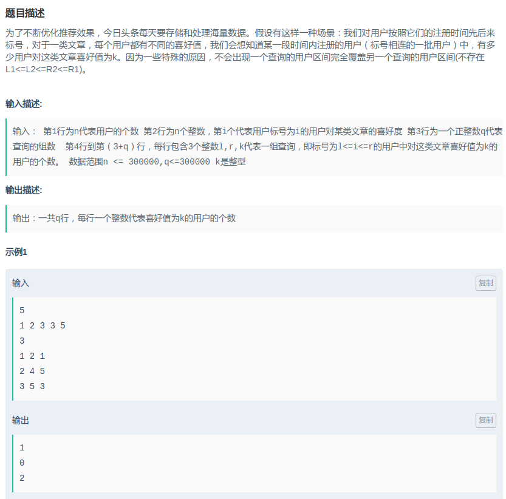
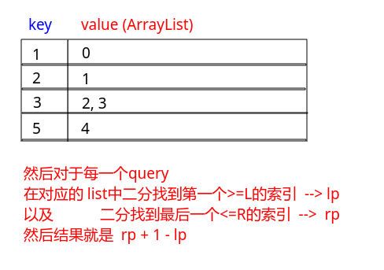

# 头条 - 用户喜好

#### [题目链接](https://www.nowcoder.com/practice/d25162386a3140cbbe6dc071e1eb6ed6?tpId=90&tqId=30818&tPage=3&rp=3&ru=/ta/2018test&qru=/ta/2018test/question-ranking)

> https://www.nowcoder.com/practice/d25162386a3140cbbe6dc071e1eb6ed6?tpId=90&tqId=30818&tPage=3&rp=3&ru=/ta/2018test&qru=/ta/2018test/question-ranking

#### 题目



### 解析

先用`HashMap<Integer, ArrayList<Integer>>`存储 ，然后每次查询在对应的`mp.get(k)`的list中二分查找，因为输入的时候每个list内部都会是有序的。

<div align = "center"></div><br>

代码:

```java
import java.util.*;
import java.io.*;

public class Main{

    static int firstLargeEqual(ArrayList<Integer> list, int key){
        int L = 0, R = list.size() - 1;
        while(L <= R){
            int m = L + (R - L) / 2;
            if(list.get(m) >= key){
                R = m - 1;
            }else {
                L = m + 1;
            }
        }
        return L;
    }
    
    static int lastSmallEqual(ArrayList<Integer> list, int key){
        int L = 0, R = list.size() - 1;
        while(L <= R){
            int m = L + (R - L) / 2;
            if(list.get(m) <= key){
                L = m + 1;
            }else {
                R = m - 1;
            }
        }
        return R;
    }

    static void solve(InputStream stream, PrintWriter out) {
        FR in = new FR(stream);

        int n = in.nextInt();
        int[] a = new int[n];
        HashMap<Integer, ArrayList<Integer>> mp = new HashMap<>();
        for(int i = 0; i < n; i++){
            a[i] = in.nextInt();
            ArrayList<Integer> tmp = mp.getOrDefault(a[i], new ArrayList<>());
            tmp.add(i);
            mp.put(a[i], tmp);
        }
        int q = in.nextInt();
        for(int i = 0; i < q; i++){
            int l = in.nextInt() - 1;
            int r = in.nextInt() - 1;
            int k = in.nextInt();
            if(mp.get(k) == null) {
                out.println(0);
                continue;
            }
            ArrayList<Integer> pos = mp.get(k);
            int lp = firstLargeEqual(pos, l);
            int rp = lastSmallEqual(pos, r);
            out.println(rp + 1 - lp);
        }
        out.close();
    }

    public static void main(String[] args) {
        OutputStream os = System.out;
        InputStream is = System.in;
        PrintWriter out = new PrintWriter(os);
        solve(is, out);
        out.close(); // 不关闭就没有输出
    }


    static class FR {
        BufferedReader br;
        StringTokenizer tk;

        FR(InputStream stream) {
            br = new BufferedReader(new InputStreamReader(stream), 32768);
            tk = null;
        }

        String next() {
            while (tk == null || !tk.hasMoreElements()) {
                try {
                    tk = new StringTokenizer(br.readLine());
                } catch (IOException e) {
                    e.printStackTrace();
                }
            }
            return tk.nextToken();
        }

        int nextInt() {
            return Integer.parseInt(next());
        }
    }
}

```

