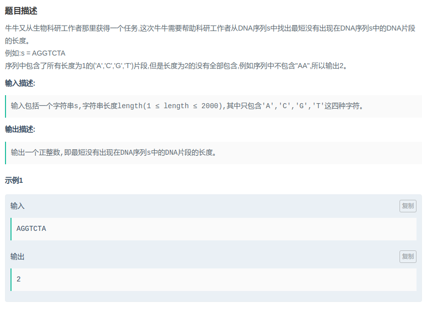

## 爱奇艺-DNA序列

#### [题目链接](https://www.nowcoder.com/practice/ab900f183e054c6d8769f2df977223b5?tpId=90&tqId=30789&tPage=1&rp=1&ru=/ta/2018test&qru=/ta/2018test/question-ranking)

> https://www.nowcoder.com/practice/ab900f183e054c6d8769f2df977223b5?tpId=90&tqId=30789&tPage=1&rp=1&ru=/ta/2018test&qru=/ta/2018test/question-ranking

#### 题目



### 解析

一开始理解错误题目意思，以为是`AA，CC，TT，GG`。。。

不存在的最短DNA序列是什么？

例如，长度为2的序列包括：`(AA, AG, AC, AT, CA, CC, CG, CT ……..)`，要全部判断一遍才可以。并不是判断`(AA, CC, GG TT)`就可以了。

所以我们可以加入到一个set中，然后判断集合容量即可。 

```java
import java.util.*;
import java.io.*;

public class Main {

    static void solve(InputStream stream, PrintWriter out) {
        Scanner in = new Scanner(new BufferedInputStream(stream));
        String s = in.next();
        int n = s.length();
        for(int len = 1; len <= n; len++){
            HashSet<String> set = new HashSet<>();
            for(int i = 0; i < n-len; i++) set.add(s.substring(i, i + len));
            if(set.size() < Math.pow(4, len)){
                out.println(len);
                return;
            }
        }
    }

    public static void main(String[] args) {
        OutputStream os = System.out;
        InputStream is = System.in;
        PrintWriter out = new PrintWriter(os);
        solve(is, out);
        out.close();
    }
}
```

