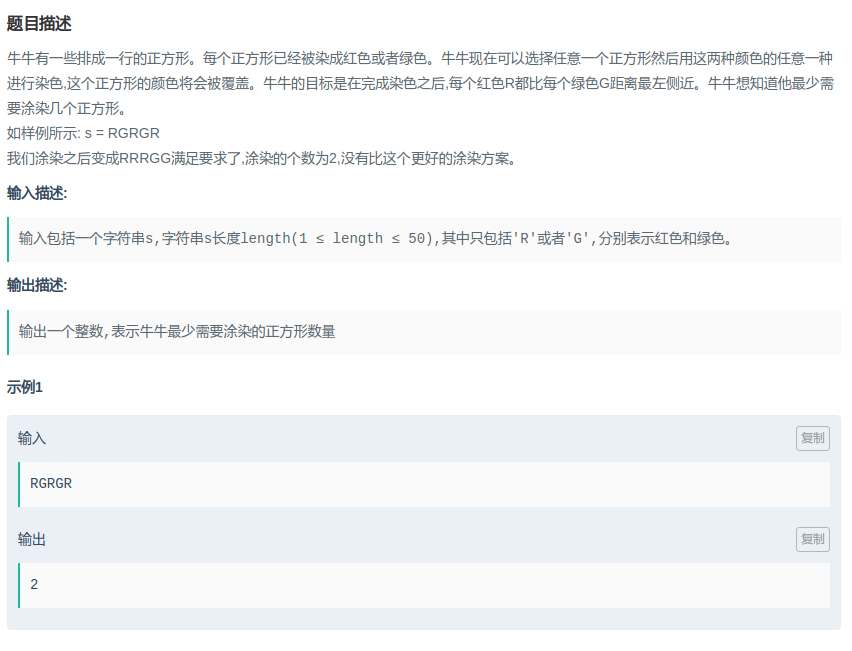

## XZ-爱奇艺 - 红和绿

#### [题目链接](https://www.nowcoder.com/practice/56ab932abac44c8aabf0af75f598a0b4?tpId=90&tqId=30799&tPage=2&rp=2&ru=/ta/2018test&qru=/ta/2018test/question-ranking)

> https://www.nowcoder.com/practice/56ab932abac44c8aabf0af75f598a0b4?tpId=90&tqId=30799&tPage=2&rp=2&ru=/ta/2018test&qru=/ta/2018test/question-ranking

#### 题目



#### 解析

暴力，暴力枚举每个位置左边的`G`的数目和右边的`R`的数目:

```java
import java.io.*;
import java.util.*;

public class Main {

    static void solve(InputStream is, PrintWriter out) {
        Scanner in = new Scanner(new BufferedInputStream(is)); // hasNext method use
//        FR in = new FR(is);
        /**------------------------*/
        char[] s = in.next().toCharArray();
        int n = s.length;
        int min = n;
        for (int i = 0; i < n; i++) {
            int cnt = 0; 
            for (int j = 0; j < i; j++) if (s[j] == 'G') cnt++;
            for (int j = i + 1; j < n; j++) if (s[j] == 'R') cnt++;
            min = Math.min(min, cnt);
        }
        out.print(min);
    }

    public static void main(String[] args) {
        OutputStream os = System.out;
        InputStream is = System.in;
        PrintWriter out = new PrintWriter(os);
        solve(is, out);
        out.close(); // must close
    }
}

```

记录一个前缀的`G`出现多少次，然后就可以省去计算左边的`G`和右边的`R`的数目的时间。

时间复杂度`O(N)`。

```java
import java.io.*;
import java.util.*;

public class Main {

    static void solve(InputStream is, PrintWriter out) {
        Scanner in = new Scanner(new BufferedInputStream(is)); // hasNext method use
        /**------------------------*/
        char[] s = in.next().toCharArray();
        int n = s.length;
        int count = 0;
        int[] c = new int[n + 1];
        for (int i = 0; i < n; i++) {
            c[i] = count;
            if(s[i] == 'G') count++;
        }
        int min = n;
        for(int i = 0; i < n; i++){
            int leftG = c[i];//左边的G
            int rightG = count - c[i] - (s[i] == 'G' ? 1 : 0 );//注意减去s[i] == G的情况
            int rightR = n - i - 1 - rightG;//右边的R
            min = Math.min(min, leftG + rightR);
        }
        out.print(min);
    }

    public static void main(String[] args) {
        OutputStream os = System.out;
        InputStream is = System.in;
        PrintWriter out = new PrintWriter(os);
        solve(is, out);
        out.close(); // must close
    }
}

```

更简单的做法:

在当前位置为R时有可能两种情况:

* 一种是把这个位置变成G；
* 另一种是把前面的G全部变成R；

代码:

```java
import java.io.*;
import java.util.*;

public class Main {

    static void solve(InputStream is, PrintWriter out) {
        Scanner in = new Scanner(new BufferedInputStream(is)); // hasNext method use
        /**------------------------*/
        char[] s = in.next().toCharArray();
        int n = s.length;
        int min = 0;
        int gCount = 0;
        for(int i = 0; i < n; i++){
            if(s[i] == 'G') gCount++;
            else min = Math.min(min+1, gCount);
        }
        out.println(min);
    }

    public static void main(String[] args) {
        OutputStream os = System.out;
        InputStream is = System.in;
        PrintWriter out = new PrintWriter(os);
        solve(is, out);
        out.close(); // must close
    }
}

```

