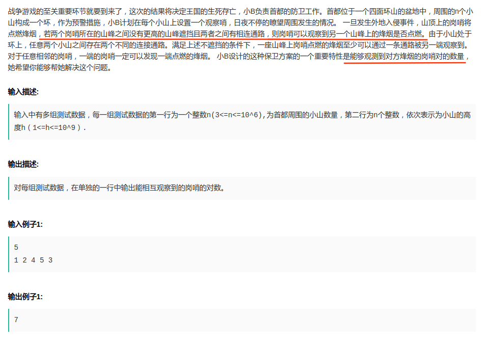

## 京东2017校招编程题 - 保卫方案(山峰对数量)
#### [题目链接](https://www.nowcoder.com/test/question/e1967ae812ea42e7a3ce57ee1f83b686?pid=5715499&tid=17568666)

> https://www.nowcoder.com/test/question/e1967ae812ea42e7a3ce57ee1f83b686?pid=5715499&tid=17568666

#### 题目



简单的说就是: 
 一个环形山脉，哪两座山的烽火可以相互看见，条件如下:

 * (1) 相邻的山；
 * (2) 两座山中的某条路 中间不存在比这两座山的最小值大的山(可以相等)；

<font color = red>给出环形山数组值，求能互相看到的山的对数。</font>
### 解析

本题使用的是单调栈求解，为了求某个山峰左右两边最近的比它大的，此时结算这个山峰，求解过程如下: 

 - 先准备一个栈，栈中存放山峰值和出现次数的结构体，从栈底到顶按照山峰值从大到小；
 - 先找到数组中第一个最大的值开始遍历，遍历一圈山脉数组；
 - 如果当前值比栈顶大就要出栈当前栈顶并结算栈顶，具体可以分为三种情况见下图右下角说明；
 - 如果相等就要统计次数，`times++`，如果`<` 且没有出现过就加入；
 - 最后遍历完之后单独处理栈；


```java
import java.io.BufferedInputStream;
import java.util.*;
/**
 * 一个环形山脉，哪两座山的烽火可以相互看见,条件如下:
 *          (1)相邻的山
 *          (2)两座山中的某条路 中间不存在比这两座山的最小值大的山(可以相等)
 *  给出环形山数组值，求能互相看到的山的对数
 */
public class Main {

    //放入单调栈中的结构
    static class Pair{
        public int value;
        public int times;

        public Pair(int value) {
            this.value = value;
            this.times = 1;  //栈中每次第一次添加是1,以后++
        }
    }

    //返回在环形山脉中数组中的下一个位置
    static int nextIndex(int index,int n){
        return index < n-1 ? index + 1 : 0;
    }

    //C(2,k)
    static long getInternalSum(int k){
        return k == 1L ? 0 : (long)k * (long)(k-1) / 2L;
    }

    //求出山峰对
    static long communications(int[] arr){
        if(arr == null || arr.length < 2)return 0;
        int maxIndex = 0; //先找到最大值的下标
        for(int i = 0; i < arr.length; i++) maxIndex = arr[maxIndex] < arr[i] ? i : maxIndex;
        long res = 0; //结果
        Stack<Pair>stack = new Stack<>();
        stack.push(new Pair(arr[maxIndex]));    //将找到的最大值 压入栈，开始过程
        for(int i = nextIndex(maxIndex,arr.length); i != maxIndex; i = nextIndex(i,arr.length)){ //i 就是maxIndex的下一个

            while(!stack.isEmpty() && stack.peek().value < arr[i]){
                int times = stack.pop().times;
                res += getInternalSum(times) + times * 2; //这时候栈不可能为空 因为最大值在打底
            }
            //判断是推进去还是加次数(times)
            if(!stack.isEmpty() && arr[i] == stack.peek().value){
                stack.peek().times++;
            }else {
                stack.push(new Pair(arr[i]));
            }

        }
        //单独处理栈中的元素
        while(!stack.isEmpty()){
            int times = stack.pop().times;
            res += getInternalSum(times); //不管怎样先加上  内部的C(2,times)
            if(!stack.isEmpty()){
                res += times;
                if(stack.size() > 1){  //> 2层的
                    res += times;
                }else { // <=2层的
                    res += stack.peek().times > 1 ? times : 0;
                }
            }
        }
        return res;
    }

    public static void main(String[] args) {
        Scanner cin = new Scanner(new BufferedInputStream(System.in));
        while(cin.hasNext()) {
            int n = cin.nextInt();
            int[] arr = new int[n];
            for (int i = 0; i < n; i++) {
                arr[i] = cin.nextInt();
            }
            System.out.println(communications(arr));
        }
        cin.close();
    }

}
```

