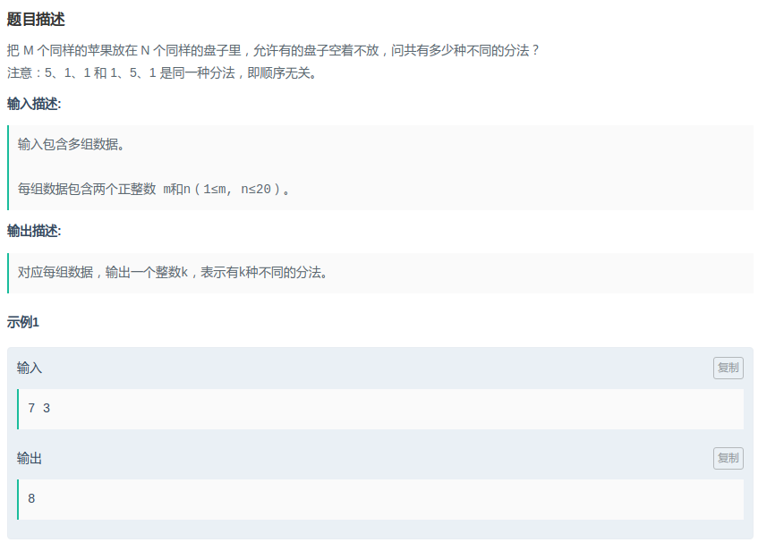

## NowCoder - 放苹果

#### [题目链接](https://www.nowcoder.com/practice/a2a1d0266629404fba582d416d84b6a0?tpId=61&&tqId=29533&rp=1&ru=/activity/oj&qru=/ta/pku-kaoyan/question-ranking)

> https://www.nowcoder.com/practice/a2a1d0266629404fba582d416d84b6a0?tpId=61&&tqId=29533&rp=1&ru=/activity/oj&qru=/ta/pku-kaoyan/question-ranking

#### 题目



### 解析

递归思路:

* 1)、递归出口：当只有一个盘子或者 含有 0 个 或 1 个苹果的时候只有一种方法；
* 2)、当盘子数 n 大于苹果数 m 时，则必有 n - m 个空盘子，所以只需求 m 个盘子放 m 个苹果时的方法数即可；
* 3)、当盘子数 n 小于等于 苹果数 m 时，总方法数 = 当含有一个空盘子时的方法数+不含空盘子时的方法数；

> 原因：当在求只含有一个空盘子时的方法数时，已经包含了含有 `2 ~ n-1` 个空盘子 的情况。
>
> 不含空盘子的计算：先将每个盘子装一个苹果，则问题变成了求 n 个盘子放 m - n个苹果的方法数了。

 代码:

```java
import java.io.*;
import java.util.*;

public class Main {

    static PrintStream out = System.out;

    static int[][] dp;

    static int dfs(int n, int m){
        if(n == 1 || m == 0 || m == 1) return 1;
        if(dp[n][m] != -1) return dp[n][m];
        if(n > m) return dp[n][m] = dfs(m, m);
        return dp[n][m] = dfs(n, m-n) + dfs(n-1, m);
    }

    static int getDp(int n, int m){
        for(int i = 0; i <= n; i++) for(int j = 0; j <= m; j++) dp[i][j] = 1;
        for(int i = 2; i <= n; i++){
            for(int j = 2; j <= m; j++){
                if(i > j) dp[i][j] = dp[j][j];
                else dp[i][j] = dp[i][j - i] + dp[i-1][j];
            }
        }
        return dp[n][m];
    }

    static void solve(InputStream stream) {
        Scanner in = new Scanner(new BufferedInputStream(stream));
        while(in.hasNext()){
            int m = in.nextInt();
            int n = in.nextInt();
            dp = new int[n+1][m+1];
//            for(int i = 0; i <= n; i++) Arrays.fill(dp[i], -1);
//            out.println(dfs(n, m));
            out.println(getDp(n, m));
        }
    }

    public static void main(String[] args) {
        solve(System.in);
    }
}
```

