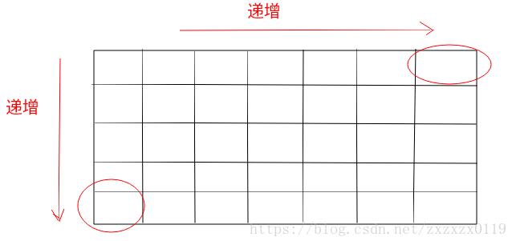

## 剑指Offer - 01 - 二维数组中的查找

#### [题目链接](https://www.nowcoder.com/practice/abc3fe2ce8e146608e868a70efebf62e?tpId=13&tqId=11154&tPage=1&rp=1&ru=/ta/coding-interviews&qru=/ta/coding-interviews/question-ranking)

> https://www.nowcoder.com/practice/abc3fe2ce8e146608e868a70efebf62e?tpId=13&tqId=11154&tPage=1&rp=1&ru=/ta/coding-interviews&qru=/ta/coding-interviews/question-ranking

#### 题目

> 在一个二维数组中（每个一维数组的长度相同），**每一行都按照从左到右递增的顺序排序，每一列都按照从上到下递增的顺序排序**。请完成一个函数，输入这样的一个二维数组和一个整数，**判断数组中是否含有该整数**。

### 解析

 - 这个题目比较好的解题思路是从<font color =red>**右上角或者左下角**</font>开始找；这个是题目给定的每一行<font color =red>**从左到右递增**</font>和每一列<font color =red>**从上到下递增**</font>的原因；

 - 例如，从<font color =red>右上角</font>开始找，设置两个变量`row`，`col`分别代表行坐标和列坐标， 如果要找的数就是`target`，则直接返回；

 - **如果`arr[row][col]  < target`，那` row = row + 1`，因为它左边的都会`arr[row][col]`小，这是因为列增加的性质**；

 - **如果`arr[row][col]  > target`，那 `col = col - 1`，因为它下面的都会`arr[row][col]`大，这是因为行增加的性质**；



从右上角开始查找代码:

```java
public class Solution {
    public boolean Find(int target, int[][] array) {
        int r = 0, c = array[0].length - 1;
        while (r < array.length && c >= 0)
            if (array[r][c] == target)
                return true;
            else if (array[r][c] > target)
                c--;
            else
                r++;
        return false;
    }
}

```

从左下角开始查找代码:

```java
public class Solution {
    public boolean Find(int target, int[][] array) {
        int r = array.length - 1, c = 0;
        while (r >= 0 && c < array[0].length)
            if (array[r][c] == target)
                return true;
            else if (array[r][c] > target)
                r--;
            else
                c++;
        return false;
    }
}
```
