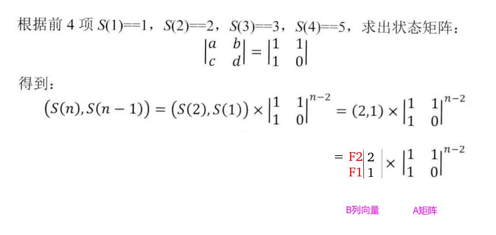

## 剑指Offer - 08 - 跳台阶

#### [题目链接](https://www.nowcoder.com/practice/8c82a5b80378478f9484d87d1c5f12a4?tpId=13&tqId=11161&tPage=1&rp=1&ru=%2Fta%2Fcoding-interviews&qru=%2Fta%2Fcoding-interviews%2Fquestion-ranking)

> https://www.nowcoder.com/practice/8c82a5b80378478f9484d87d1c5f12a4?tpId=13&tqId=11161&tPage=1&rp=1&ru=%2Fta%2Fcoding-interviews&qru=%2Fta%2Fcoding-interviews%2Fquestion-ranking

#### 题目

> 一只青蛙一次可以跳上1级台阶，也可以跳上2级。求该青蛙跳上一个n级的台阶总共有多少种跳法（先后次序不同算不同的结果）。

#### 解析

和上一题斐波那契数列问题唯一的不同就是`n == 2`的时候是`2`而不是`1`，思路如下：

* 唯一的不同在于`n = 2`时不是返回`1`而是返回`2`，因为`2`级台阶可以有**两种**跳法；
* 为什么是f<sub>n</sub> = f<sub>n-1</sub> + f<sub>n-2</sub>呢，**如果台阶有N级，最后跳上第N级的情况，要么是从N-2级台阶直接跨2级台阶，要么是从N-1级台阶跨1级台阶，所以台阶有N级的方法数为跨到N-2级台阶的方法数加上跨到N-1级台阶的方法数**；


##### 1)、递归

```java
public class Solution {
    public int JumpFloor(int target) {
        if (target < 1)
            return 0;
        if (target == 1 || target == 2) //这里和上面的不同
            return target;
        return JumpFloor(target - 1) + JumpFloor(target - 2);
    }
}
```

##### 2)、记忆化

```java
public class Solution {

    public int[] dp;

    public int JumpFloor(int target) {
        dp = new int[target + 1];
        return rec(target);
    }

    public int rec(int n) {
        if (n < 1)
            return 0;
        if (n == 1 || n == 2) // n== 2 返回 2
            return n;
        if (dp[n] != 0)
            return dp[n];
        dp[n] = rec(n - 1) + rec(n - 2);
        return dp[n];
    }
}
```

##### 3)、递推(DP)

```java
public class Solution {

    public int JumpFloor(int target) {
        if (target < 1)
            return 0;
        if (target == 1 || target == 2)
            return target;

        int[] dp = new int[target + 1];
        dp[1] = 1;
        dp[2] = 2;
        for (int i = 3; i <= target; i++)
            dp[i] = dp[i - 1] + dp[i - 2];
        return dp[target];
    }
}
```

##### 4)、滚动优化

上面的`dp[i]`只依赖于`dp[i-1]`和`dp[i-2]`，所以用`f1、f2`两个变量即可。

```java
public class Solution {

    public int JumpFloor(int target) {
        if (target < 1)
            return 0;
        if (target == 1 || target == 2)
            return target;
        int f1 = 1;
        int f2 = 2;
        int res = 0;
        for (int i = 3; i <= target; i++) {
            res = f1 + f2;
            f1 = f2;
            f2 = res;
        }
        return res;
    }
}
```

##### 5)、利用矩阵快速幂

>  矩阵操作可以看[这篇博客](https://blog.csdn.net/zxzxzx0119/article/details/82822588)和[这篇博客](https://blog.csdn.net/zxzxzx0119/article/details/82816131)。

同理，推出矩阵即可。注意返回时`return res.m[0][0] * 2 + res.m[0][1]; `即可。



```java
public class Solution {

    static class Matrix {
        public int row;
        public int col;
        public int[][] m;

        public Matrix(int row, int col) {
            this.row = row;
            this.col = col;
            m = new int[row][col];
        }
    }

    static Matrix mul(Matrix a, Matrix b) {
        Matrix c = new Matrix(a.row, b.col); //注意这里

        for (int i = 0; i < a.row; i++) {
            for (int j = 0; j < b.col; j++) {
                for (int k = 0; k < a.col; k++)
                    c.m[i][j] = c.m[i][j] + a.m[i][k] * b.m[k][j];
            }
        }
        return c;
    }

    static Matrix pow(Matrix a, int k) {
        Matrix res = new Matrix(a.row, a.col); // 方阵
        for (int i = 0; i < a.row; i++)
            res.m[i][i] = 1;
        while (k > 0) {
            if ((k & 1) != 0)
                res = mul(res, a);
            a = mul(a, a);
            k >>= 1;
        }
        return res;
    }

    public int JumpFloor(int target) {
        if (target < 1)
            return 0;
        if (target == 1 || target == 2)
            return target;
        Matrix a = new Matrix(2, 2);
        a.m[0][0] = a.m[0][1] = a.m[1][0] = 1;
        a.m[1][1] = 0;
        Matrix res = pow(a, target - 2);

        //注意这里F2 = 2 ,所以乘以2
        return res.m[0][0] * 2 + res.m[0][1]; 
    }
}
```