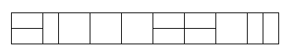

## 剑指Offer - 10 - 矩形覆盖

#### [题目链接](https://www.nowcoder.com/practice/72a5a919508a4251859fb2cfb987a0e6?tpId=13&tqId=11163&tPage=1&rp=1&ru=%2Fta%2Fcoding-interviews&qru=%2Fta%2Fcoding-interviews%2Fquestion-ranking)

> https://www.nowcoder.com/practice/72a5a919508a4251859fb2cfb987a0e6?tpId=13&tqId=11163&tPage=1&rp=1&ru=%2Fta%2Fcoding-interviews&qru=%2Fta%2Fcoding-interviews%2Fquestion-ranking

#### 题目

和[POJ - 2506. Tiling](http://poj.org/problem?id=2506)类似。

> 我们可以用`2*1`的小矩形横着或者竖着去覆盖更大的矩形。请问用`n`个`2*1`的小矩形无重叠地覆盖一个`2*n`的大矩形，总共有多少种方法？
>
> 

#### 解析t

覆盖`2 * n`(`2`代表行，`n`代表列)的时候，先看看假设前面已经覆盖`2 * (n-2)`之后，到`2 * n`之间还有多少种覆盖法：

* 后面两个只有两种覆盖方法，一种是全部竖着放(实际上是从`2 * (n-1)`来的)，**这里注意不要认为还有一种情况是放置两个竖的，实际上放好`n-1`的情况中已经包含了那种情况；**
* 另一种就是全部横着放，也就是`n-2`到`n`之间横着放两块 `1 * 2`的矩形，如图`(2)`；
* 所以fn= fn-1 + fn-2 ，和跳台阶问题(第二题)完全一样。

由于代码和**跳台阶问题(剑指Offer08跳台阶)**一模一样，就不放重复的代码了。

