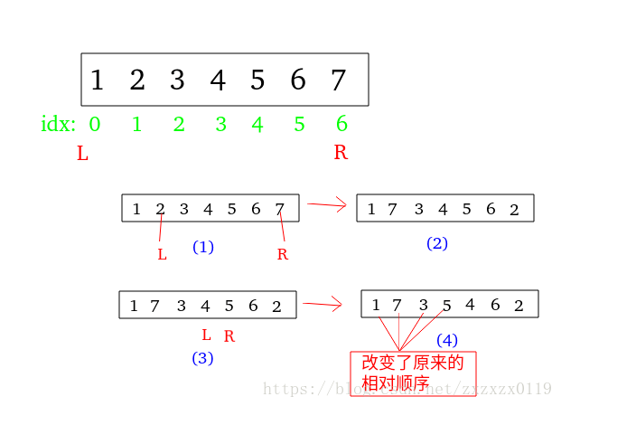
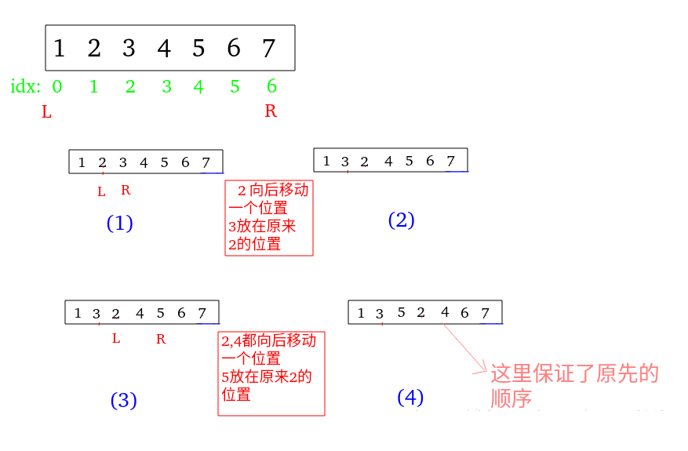

## 剑指Offer - 13 - 调增数组顺序使奇数位于偶数前面

#### [题目链接](https://www.nowcoder.com/practice/beb5aa231adc45b2a5dcc5b62c93f593?tpId=13&tqId=11166&tPage=1&rp=1&ru=%2Fta%2Fcoding-interviews&qru=%2Fta%2Fcoding-interviews%2Fquestion-ranking)

> https://www.nowcoder.com/practice/beb5aa231adc45b2a5dcc5b62c93f593?tpId=13&tqId=11166&tPage=1&rp=1&ru=%2Fta%2Fcoding-interviews&qru=%2Fta%2Fcoding-interviews%2Fquestion-ranking

#### 题目

> 输入一个整数数组，实现一个函数来调整该数组中数字的顺序，使得所有的奇数位于数组的前半部分，所有的偶数位于数组的后半部分，**并保证奇数和奇数，偶数和偶数之间的相对位置不变**。

#### 解析

**首先这题出题的意思在于不使用额外空间实现**。

这题**必须要保证奇数和奇数、偶数和偶数的相对位置不变**，所以不能使用双指针的方法，其中[LintCode373PartitionArraybyOddandEven](https://www.lintcode.com/problem/partition-array-by-odd-and-even/description)不需要保证相对位置，可以使用下面的解法:

* 第一个指针`L`从前面开始找，令一个`R`从后面开始找；
* 第一个找到一个偶数，第二个找到一个奇数，就进行互换；
* 终止条件就是`L == R`；



这里是**LintCode - 373. Partition Array by Odd and Even**的代码: 

```java
public class Solution {

    // 不能保证原有的相对次序, 会改变原来的相对次序
    public void partitionArray(int[] nums) {
        int L = 0, R = nums.length - 1;
        while (L < R) {
            while (L < R && odd(nums[L])) L++;
            while (L < R && !odd(nums[R])) R--;
            if (L < R) {
                int t = nums[L];
                nums[L++] = nums[R];
                nums[R--] = t;
            }
        }
    }

    private boolean odd(int n) {
        return (n & 1) == 1 ? true : false;
    }
}
```

这个题目需要保证不能改变相对位置，就只能使用类似快排或者插排的思想:

先看**类似冒泡排序解法**

冒泡排序是交换前面的一个数比后面的一个数大的情况，而这个题目是**交换前面是偶数而后面是奇数**的情况。

```java
public class Solution {

    public void reOrderArray(int[] array) {
        for (int end = array.length - 1; end > 0; end--) {//n-1次冒泡
            for (int i = 0; i < end; i++) {
                if (!odd(array[i]) && odd(array[i + 1])) {//把偶数往后面冒
                    int t = array[i];
                    array[i] = array[i + 1];
                    array[i + 1] = t;
                }
            }
        }
    }

    private boolean odd(int n) {
        return (n & 1) == 1 ? true : false;
    }
}
```

然后就是类似插入排序:

步骤:

* `L`从左向右遍历，找到第一个偶数；
* 每次`R`从`L+1`开始向后找，直到找到第一个奇数；
* 将`[L,...,R-1]`的元素整体后移一位，最后将找到的奇数放入`L`位置，然后`L++`；
* 如果没有找到那样的`arr[R]`是奇数，那说明右边没有奇数了，可以`break`了；



代码:

```java
public class Solution {

    public void reOrderArray(int[] array) {
        int L = 0, R;
        while (L < array.length) {
            while (L < array.length && odd(array[L]))// 先找到第一个偶数
                L++;
            R = L + 1;
            while (R < array.length && !odd(array[R]))// 再在L 的后面开始找到第一个奇数
                R++;
            // 注意此时arr[L]是偶数　　arr[R]是奇数　-->将 [L,..R-1]中的数　向后移动一个位置
            if (R < array.length) {
                int t = array[R];
                for (int i = R - 1; i >= L; i--)
                    array[i + 1] = array[i];
                array[L] = t;
                L++;
            } else
                break;//查找失败 说明此时后面的都是偶数，可以退出了
        }
    }

    private boolean odd(int n) {
        return (n & 1) == 1 ? true : false;
    }
}
```

