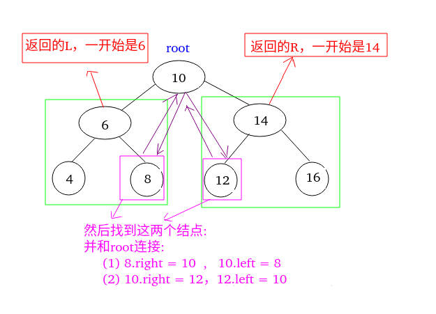
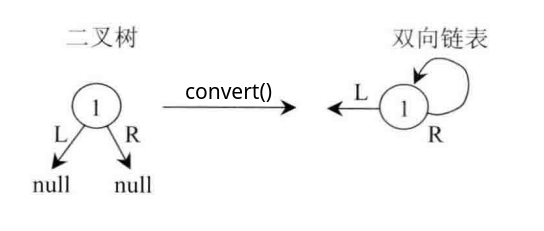
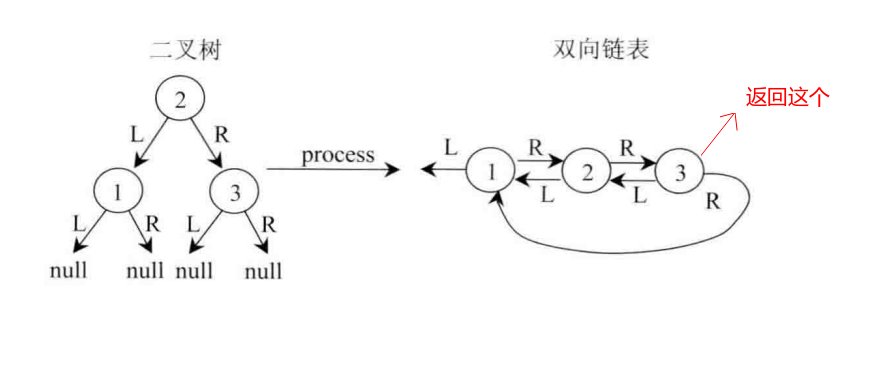
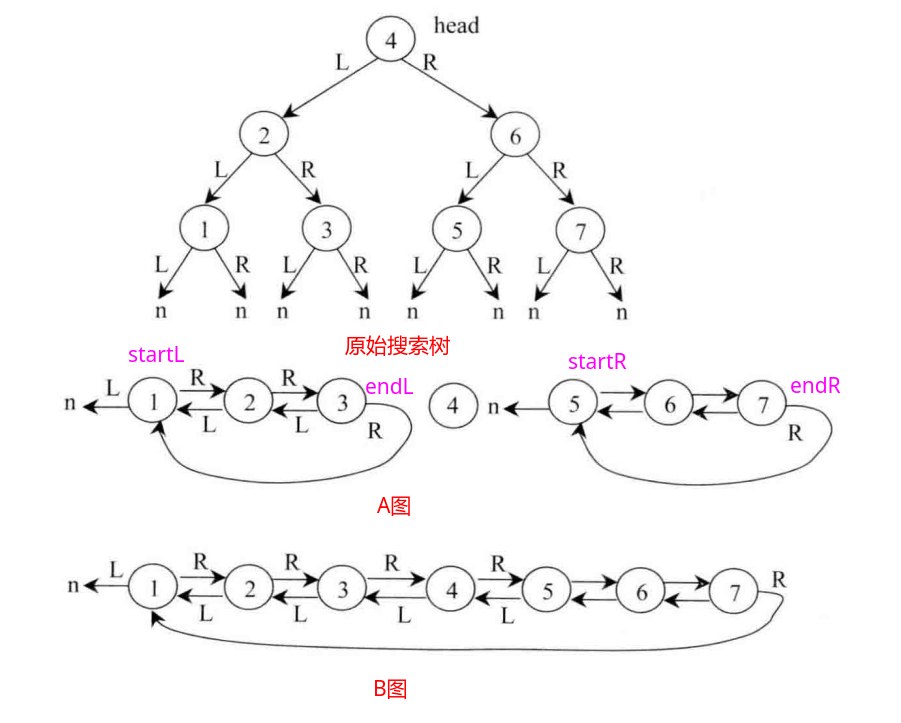

## 剑指Offer - 26 - 二叉搜索树与双向链表

#### [题目链接](https://www.nowcoder.com/practice/947f6eb80d944a84850b0538bf0ec3a5?tpId=13&tqId=11179&tPage=2&rp=1&ru=%2Fta%2Fcoding-interviews&qru=%2Fta%2Fcoding-interviews%2Fquestion-ranking)

> https://www.nowcoder.com/practice/947f6eb80d944a84850b0538bf0ec3a5?tpId=13&tqId=11179&tPage=2&rp=1&ru=%2Fta%2Fcoding-interviews&qru=%2Fta%2Fcoding-interviews%2Fquestion-ranking

#### 题目

> 输入一棵二叉搜索树，**将该二叉搜索树转换成一个排序的双向链表**。**要求不能创建任何新的结点**，只能调整树中结点指针的指向。

### 解析

这题也很经典，这里给出3种写法。

#### 1、写法一－中序改造+pre

思路:

* 改进中序非递归遍历(使用`pre`保存上一个访问的结点)，这个只要会非递归的中序遍历，其实是最简单的方法。
* 每次记录上一个访问的结点`pre`，然后每次当前结点为空(**访问到了最左边**)的时候，就设置`pre`和`cur`的关系即可；
* 这里使用了一个`isFirst`变量标注了一开始的节点，用`res`记录一开始的结点；

代码:

```java
import java.util.Stack;
public class Solution {
    public TreeNode Convert(TreeNode pRootOfTree) {// 返回排序的双向链表的头结点
        if (pRootOfTree == null)
            return null;
        Stack<TreeNode> s = new Stack<>();
        TreeNode pre = null, cur = pRootOfTree, res = null;
        boolean isFirst = true;
        while (!s.isEmpty() || cur != null) {
            if (cur != null) {
                s.push(cur);
                cur = cur.left;
            } else { // 走到最左边了
                cur = s.pop();
                if (isFirst) {
                    isFirst = false;
                    res = cur;
                    pre = cur;
                } else {
                    pre.right = cur;
                    cur.left = pre;
                    pre = cur;
                }
                cur = cur.right; //当前结点向右
            }
        }
        return res;
    }
}
```

上面的写法也可以改成非递归的写法，如下：

```java
public class Solution {

    private TreeNode pre;

    public TreeNode Convert(TreeNode pRootOfTree) {
        if (pRootOfTree == null)
            return null;
        pre = null;
        convert(pRootOfTree); //返回的pre是双向链表的最后一个结点
        while (pre != null && pre.left != null)
            pre = pre.left;
        return pre;
    }

    private void convert(TreeNode root) {
        if (root == null)
            return;
        convert(root.left);
        root.left = pre;
        if (pre != null)
            pre.right = root;
        pre = root;
        convert(root.right);
    }
}
```

#### 2、写法二－后序递归

递归思路

* 递归的时候，每次递归完之后(后续递归)，返回的是 : 左右孩子都变成了双向链表，并且返回的是变成双向链表的根节点；
* 然后要做的操作就是: (1)  找到左边返回的树中的**最右边的结点** ；(2) 找到右边返回的树中的**最左边的结点**；(3) 将这两个结点和当前的根节点的关系连接起来；
* 然后返回的是连接之后的根节点；
* 所以在主函数中，最后还需要从根节点`root`，找到整棵树的最左边的节点，即需要额外的遍历；

例子:



代码:

```java
public class Solution {

    public TreeNode Convert(TreeNode pRootOfTree) {// 返回排序的双向链表的头结点
        if (pRootOfTree == null)
            return null;
        TreeNode root = convert(pRootOfTree); //返回的还是根结点
        while (root != null && root.left != null)
            root = root.left;
        return root;  //返回最左下角那个
    }

    private TreeNode convert(TreeNode root) {
        if (root == null)
            return null;
        TreeNode L = convert(root.left);
        TreeNode R = convert(root.right);
        //将左子树的最后一个结点(最大结点)和根节点链接起来
        if (L != null) {
            while (L.right != null) {
                L = L.right;
            }
            L.right = root;
            root.left = L;
        }
        //将右子树的最小的结点和根结点链接起来
        if (R != null) {
            while (R.left != null) {
                R = R.left;
            }
            R.left = root;
            root.right = R;
        }
        return root;//返回的是链接之后的根节点
    }
}
```

#### 3、写法三－最优递归

这个是递归的改进版本:

* 上面的方法在递归完成之后，需要向左不断的循环，找到最左边的结点，然后返回；
* 其实可以省掉这个，在递归的时候，设置好返回的链表的左右两端的结点，注意分情况判断；

具体过程如下：

(１)、实现递归函数` convert()`。`convert()` 的功能是将一棵搜索二又树转换为一个结构有点特殊的有序双向链表。 结构特殊是指这个双向链表尾节点的 `right` 指针指向该双向链表的头节点。函数 `convert()` 最终返回这个链表的**尾节点**。

例如:  (a). 搜索二叉树只有一个节点时，在经过 convert 处理后，形成如图的形式，最后返回节点1。



  (b). 一般的情况，在经过`convert()`处理之后，形成右边的样子，并返回`3`；



(２)、`convert()`函数的实现。

看一个例子:



节点 `4` 为头节点，先用 `convert()` 函数处理左子树，就将左子树转换成了有序双向链表，同时返回尾节点，记为`endL` ； 再用 `convert()` 函数处理右子树，就将右子树转换成了有序双向链表，同时返回尾节点，记为`endR`，如图`A`所示。

接下来:

* 把节点 `3` (左子树 `convert()` 处理后的返回节点) 的` right `指针连向节点 `4`；
* 节点`4`的` left `指针连向节点`3`；
* 节点 `4` 的`right`指针连向节点 `5` (右子树 `convert()` 处理后的返回节点为节点` 7`，通过节点 `7 `的 `right` 指针可以找到节点`5`)；
* 节点 `5 `的` left` 指针连向节点` 4`；

这样就完成了整个棵树向有序双向链表的转换。

* 最后根据 `convert()` 函数的要求，把节点 `7` (右子树`convert()` 处理后的返回节点) 的 `right` 指针连向节点 `1` (左子树 `convert()` 处理后的返回节点为节点 `3`，通过节点 `3` 的 `right` 指针可以找到节点 `1`)，
* 然后返回节点 `7`即可，如图`B` 所示。

(３)、通过 `convert()` 过程得到的双向链表是尾节点的`right` 指针连向头节点的结构。所以，最终需要将尾节点的` right `指针设置为` null `，来让双向链表变成正常的样子。

代码:

```java
public class Solution {

    public TreeNode Convert(TreeNode pRootOfTree) {
        if (pRootOfTree == null)
            return null;
        TreeNode last = convert(pRootOfTree);
        TreeNode res = last.right;//返回最右边的.right(最左边的)
        last.right = null;//最终设置
        return res;
    }

    //功能: 将二叉搜索树转换成一个有序的双向链表, 并返回连接之后的最后一个结点
    private TreeNode convert(TreeNode root) {
        if (root == null)
            return null;
        TreeNode endL = convert(root.left);  //左边的结尾的结点
        TreeNode endR = convert(root.right); //右边的结尾的结点
        TreeNode startL = endL != null ? endL.right : null; //左边开始的结点
        TreeNode startR = endR != null ? endR.right : null; //右边开始的结点
        //分情况连接这些结点
        if (endL != null && endR != null) {
            //连接根节点的
            root.left = endL;
            endL.right = root;
            root.right = startR;
            startR.left = root;
            //最后一个指回去
            endR.right = startL;
            return endR;
        } else if (endL != null) {//右边为空
            root.left = endL;
            endL.right = root;
            root.right = startL;
            return root;
        } else if (endR != null) {//左边为空
            root.right = startR;
            startR.left = root;
            endR.right = root;
            return endR;
        } else {  //左右都是空
            root.right = root;
            return root;
        }
    }
}
```

