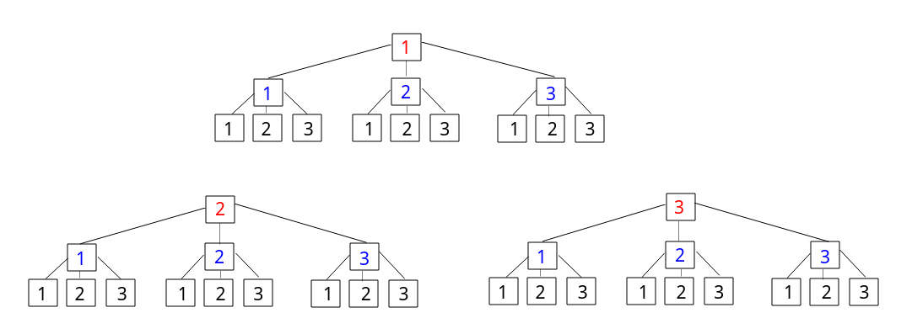

## 剑指Offer - 27 - 字符串的排列

#### [题目链接](https://www.nowcoder.com/practice/fe6b651b66ae47d7acce78ffdd9a96c7?tpId=13&tqId=11180&tPage=2&rp=1&ru=%2Fta%2Fcoding-interviews&qru=%2Fta%2Fcoding-interviews%2Fquestion-ranking)

> https://www.nowcoder.com/practice/fe6b651b66ae47d7acce78ffdd9a96c7?tpId=13&tqId=11180&tPage=2&rp=1&ru=%2Fta%2Fcoding-interviews&qru=%2Fta%2Fcoding-interviews%2Fquestion-ranking

#### 题目

> 输入一个字符串,按字典序打印出该字符串中字符的所有排列。例如输入字符串`abc`,则打印出由字符`a,b,c`所能排列出来的所有字符串`abc,acb,bac,bca,cab和cba`。
>
> 输入描述：输入一个字符串,长度不超过`9`(可能有字符重复),字符只包括大小写字母。

### 解析

这题也很经典，和[**LeetCode47**](https://github.com/ZXZxin/ZXNotes/blob/master/%E5%88%B7%E9%A2%98/LeetCode/Search/LeetCode%20-%2047.%20Permutations%20II(%E4%B8%8D%E9%87%8D%E5%A4%8D%E5%85%A8%E6%8E%92%E5%88%97)(%E5%9B%9B%E7%A7%8D%E6%96%B9%E5%BC%8F%E5%AE%9E%E7%8E%B0).md)几乎一样，具体可以看[**这篇博客**](https://github.com/ZXZxin/ZXNotes/blob/master/%E5%88%B7%E9%A2%98/LeetCode/Search/LeetCode%20-%2047.%20Permutations%20II(%E4%B8%8D%E9%87%8D%E5%A4%8D%E5%85%A8%E6%8E%92%E5%88%97)(%E5%9B%9B%E7%A7%8D%E6%96%B9%E5%BC%8F%E5%AE%9E%E7%8E%B0).md)。给出四种写法。

**这题要注意去重和有序两个方面。**

#### 1)、写法一－经典写法

这种方法真是没啥好说的，经典方法，[这篇博客](https://blog.csdn.net/summerxiachen/article/details/60579623)讲的很好。

```java
import java.util.ArrayList;
import java.util.Collections;

public class Solution {

    private ArrayList<String> res;

    public ArrayList<String> Permutation(String str) {
        res = new ArrayList<>();
        if (str == null || str.length() == 0)
            return res;
        rec(str.toCharArray(), 0);
        Collections.sort(res); //保证字典序
        return res;
    }

    private void rec(char[] str, int cur) {
        if (cur == str.length - 1) {
            if (!res.contains(String.valueOf(str)))
                res.add(String.valueOf(str));
        } else for (int i = cur; i < str.length; i++) {
            swap(str, cur, i);
            rec(str, cur + 1);
            swap(str, cur, i);
        }
    }

    private void swap(char[] arr, int i, int j) {
        char t = arr[i];
        arr[i] = arr[j];
        arr[j] = t;
    }
}
```

#### 2)、写法二－先排序+递归函数字符串数组拷贝

比较玄乎:

- 使用的是先要排序，而且在调用`rec`函数的时候，我们要进行行数组的拷贝(`Arrays.copyof()`)，不能使用原来的数组(`C++`中传递的就是数组的拷贝)；
- 而且使用数组的复制品还不能交换回来，这样就可以得到整个序列的字典序(在先排序的情况下得到字典序)，去重的时候使用`if(cur != i && newNums[i] == newNums[cur])continue;`去重。

代码:

```java
import java.util.ArrayList;
import java.util.Arrays;

public class Solution {

    private ArrayList<String> res;

    public ArrayList<String> Permutation(String str) {
        res = new ArrayList<>();
        if (str == null || str.length() == 0)
            return res;
        char[] charArr = str.toCharArray();
        Arrays.sort(charArr);  //注意这里需要排序，虽然牛客网的可以通过，但是有问题
        rec(charArr, 0);
        return res;
    }

    private void rec(char[] str, int cur) {
        char[] newStr = Arrays.copyOf(str, str.length);// 这里是数组的拷贝，然后后面就不要swap了...
        if (cur == newStr.length - 1) {
            res.add(String.valueOf(newStr));
        } else for (int i = cur; i < newStr.length; i++) {
            if (cur != i && newStr[cur] == newStr[i])
                continue;
            swap(newStr, cur, i);
            rec(newStr, cur + 1);
            //swap(newStr,cur,i);  //这里不能交换，不然得不到字典序
        }
    }

    private void swap(char[] arr, int i, int j) {
        char t = arr[i];
        arr[i] = arr[j];
        arr[j] = t;
    }
}
```

#### 3)、HashSet去重

原理和经典的议案该，只不过利用`HashSet`去重。

```java
import java.util.*;

public class Solution {
    
    private ArrayList<String> res;

    public ArrayList<String> Permutation(String str) {
        res = new ArrayList<>();
        if (str == null || str.length() == 0)
            return res;
        rec(str.toCharArray(), 0);
        Collections.sort(res); //这个也是在之后排序
        return res;
    }

    //使用Set去重
    private void rec(char[] str, int cur) {
        if (cur == str.length - 1) {
            res.add(String.valueOf(str));
            return;
        }
        HashSet<Character> set = new HashSet<>();
        for (int i = cur; i < str.length; i++) {
            if (!set.contains(str[i])) {
                set.add(str[i]);
                swap(str, cur, i);
                rec(str, cur + 1);
                swap(str, cur, i);
            }
        }
    }

    private void swap(char[] arr, int i, int j) {
        char t = arr[i];
        arr[i] = arr[j];
        arr[j] = t;
    }
}
```

#### 4)、dfs+回溯

类似下面这种，枚举所有的可能。时间复杂度O(`n* n`<sup>`n-1`</sup>)。 



* 利用`used`标记已经使用过的字符的位置即可；
* 然后判断重复就要在`dfs`之前进行排序，保证相邻元素在一块。
* 然后记得回溯，维护`used`和`sb`；

代码:

```java
import java.util.ArrayList;
import java.util.Arrays;

public class Solution {

    private ArrayList<String> res;

    public ArrayList<String> Permutation(String str) {
        res = new ArrayList<>();
        if (str == null || str.length() == 0)
            return res;
        char[] charArr = str.toCharArray();
        Arrays.sort(charArr); //保证相邻的元素在一块
        dfs(new StringBuilder(), charArr, new boolean[str.length()]);
        return res;
    }

    private void dfs(StringBuilder sb, char[] str, boolean[] used) {
        if (sb.length() == str.length) {
            res.add(sb.toString());
            return;
        }
        for (int i = 0; i < str.length; i++) {
            if (used[i] || (i > 0 && !used[i - 1] && str[i] == str[i - 1]))//去重
                continue;
            used[i] = true;
            sb.append(str[i]);
            dfs(sb, str, used);
            used[i] = false;
            sb.deleteCharAt(sb.length()-1);
        }
    }

    private void swap(char[] str, int i, int j) {
        char t = str[i];
        str[i] = str[j];
        str[j] = t;
    }
}
```

