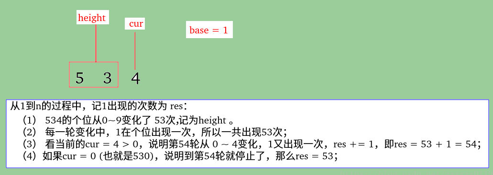
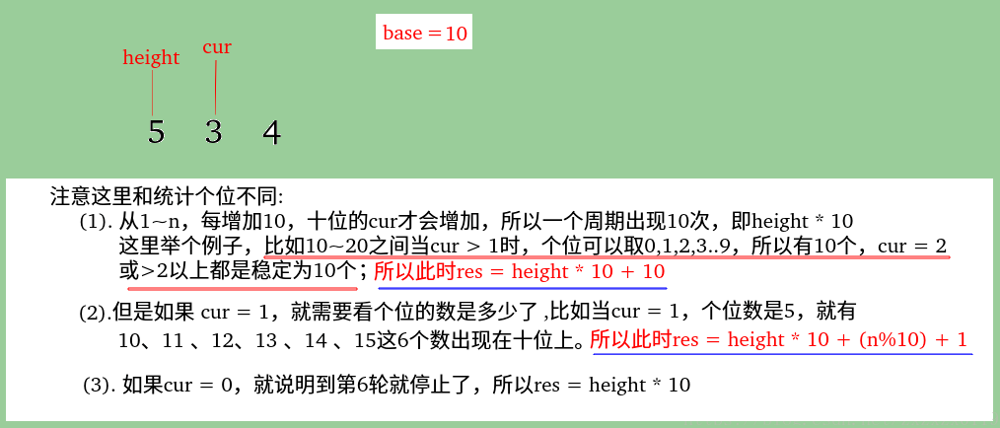
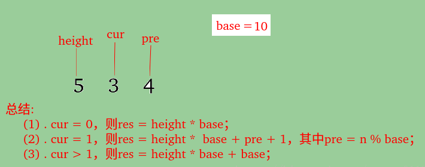

## 剑指Offer - 31 - 整数中1出现的次数（从1到n整数中1出现的次数）

#### [题目链接](https://www.nowcoder.com/practice/bd7f978302044eee894445e244c7eee6?tpId=13&tqId=11184&tPage=2&rp=1&ru=%2Fta%2Fcoding-interviews&qru=%2Fta%2Fcoding-interviews%2Fquestion-ranking)

>https://www.nowcoder.com/practice/bd7f978302044eee894445e244c7eee6?tpId=13&tqId=11184&tPage=2&rp=1&ru=%2Fta%2Fcoding-interviews&qru=%2Fta%2Fcoding-interviews%2Fquestion-ranking

#### 题目

> 求出1~13的整数中1出现的次数,并算出100~1300的整数中1出现的次数？为此他特别数了一下1~13中包含1的数字有1、10、11、12、13因此共出现6次,但是对于后面问题他就没辙了。ACMer希望你们帮帮他,并把问题更加普遍化,可以很快的求出任意非负整数区间中1出现的次数（从1 到 n 中1出现的次数）。

### 解析

这题的解法非常多。很好的一道思维+拓展题。说一种个人认为比较好理解的方法，其他自己好好琢磨吧。

参考了这个博客: https://blog.csdn.net/yi_afly/article/details/52012593







**再举一个栗子: 统1～5246中1的个数** :

* 想到每一位和1的关系，拿5246，先是个位6，个位的变化范围是0~9，而这样的变化，会有524次，所以这里有524个1，又因为最后一次有个6，所以还要加一次，所以个位的1的个数是524+1 = 525；
* 再看十位，十位上的数字是4，所以同理，这个位数的上的1的个数应该是52 * 10，**注意这里不是52 * 1，因为，10位上的数后面10-20之间有10个1，且最后`4>1`，所以还要加上10，所以十位上的1的个数是`52 * 10+10 = 530`。这里要注意如果十位上的数字是1的话，就要看个位上的数是多少了，也就是10 ~ 20之间取多少个，这时候我们只要计算**`n%10+1`就行了。
* 然后同理推高位，可以得到1~5246中1的个数是`(524 * 1+1)+(52 * 10+10)+(5 * 100+100) +( 0 * 1000+1000) = 2655`个。

代码:

```java
public class Solution {
    public int NumberOf1Between1AndN_Solution(int n) {
        if (n <= 0) return 0;
        int res = 0;
        // base表示当前判断的位数、cur表示当前位、height表示高位
        int base = 1, cur, height = n;
        while (height > 0) {
            cur = height % 10;
            height /= 10;
            res += height * base; //先加上一开始的
            if (cur == 1)
                res += (n % base) + 1; //==1 就要看前面的了
            else if (cur > 1)
                res += base; //后面剩的，>1 还要+base
            base *= 10;
        }
        return res;
    }
}
```


```java
public class Solution {

    private Integer[][][] dp = new Integer[32][32][2];

    private char[] chs;

    public int NumberOf1Between1AndN_Solution(int n) {
        if (n <= 0) return 0;
        if (n < 10) return 1;
        chs = String.valueOf(n).toCharArray();
        return help(0, 0, 0);
    }

    // 231
    // 11 ~ 19
    // 21
    // 31
    // 100 ~
    // 110 ~ 119
    // 121, 131, 141, 151
    // other
    private int help(int pos, int temp, int less) {
        if (pos == chs.length)
            return temp;
        if (dp[pos][temp][less] != null)
            return dp[pos][temp][less];
        int res = 0;
        if (less == 1) {
            // if preview digit is already less than n
            // current digit can be 0-9
            res = help(pos + 1, temp + 1, less)
                    + 9 * help(pos + 1, temp, less);
        } else { // less = 0
            // if previous digit is equal to n
            if (chs[pos] == '0') {
                res = help(pos + 1, temp, less); // current digit must be 0
            } else if (chs[pos] == '1') {
                res = help(pos + 1, temp, 1)  // current digit is 0
                        + help(pos + 1, temp + 1, 0); // current digit is 1
            } else {
                res = help(pos + 1, temp + 1, 1)  // 1
                        + help(pos + 1, temp, 0)   // equals
                        + (chs[pos] - '1') * help(pos + 1, temp, 1);  // other numbers
            }
        }
        dp[pos][temp][less] = res;
        return res;
    }
}
```

另一种DP

```java
import java.util.LinkedList;
public class Solution {
    public int NumberOf1Between1AndN_Solution(int n) {
        if(n <= 0)
            return 0;
        int[][] f = new int[30][2];
        int[][] g = new int[30][2];
        LinkedList<Integer>digits = new LinkedList<>();
        for(; n > 0; n /= 10)
            digits.addFirst(n % 10);
        f[0][1] = 0;
        g[0][1] = 1;
        for(int i = 0; i < digits.size(); i++) {
            for (int j = 0; j < 10; j++) {
                g[i+1][0] += g[i][0];
                f[i+1][0] += f[i][0] + (g[i][0] * (j == 1 ? 1 : 0 ));
                if(j < digits.get(i)){
                    g[i+1][0] += g[i][1];
                    f[i+1][0] += f[i][1] + (g[i][1] * (j == 1 ? 1 : 0 ));
                }else if(j == digits.get(i)){
                    g[i+1][1] += g[i][1];
                    f[i+1][1] += f[i][1] + (g[i][1] * (j == 1 ? 1 : 0 ));
                }
            }
        }
        return f[digits.size()][0] + f[digits.size()][1];
    }
}
```


```java
public class Solution {
    
    public int NumberOf1Between1AndN_Solution(int n) {
        if (n <= 0)
            return 0;
        int len = getLenOfNum(n);
        if (len == 1)
            return 1;
        int tmp1 = (int) Math.pow(10, len - 1);
        int first = n / tmp1;
        int firstOneNum = first == 1 ? n % tmp1 + 1 : tmp1;
        int otherOneNum = first * (len - 1) * (tmp1 / 10);
        return firstOneNum + otherOneNum + NumberOf1Between1AndN_Solution(n % tmp1);
    }

    public int getLenOfNum(int num) {
        int len = 0;
        while (num != 0) {
            len++;
            num /= 10;
        }
        return len;
    }
}
```

```java
public class Solution {
    
    public int NumberOf1Between1AndN_Solution(int n) {
        return countDigit(n, 1);
    }

    public int countDigit(int n, int digit) { // 0 < digit <= 9
        if (n < digit)
            return 0;
        else if (n < 10)
            return 1;
        int scale = 1;
        for (int t = n / 10; t > 0; t /= 10)
            scale *= 10;
        int highestDigit = n / scale;
        int res = 0;
        res += highestDigit * countDigit(scale - 1, digit);// ex) countDigit(2345, 2) -> 2 * countDigit(999, 2)
        res += countDigit(n % scale, digit);               // ex) countDigit(2345, 2) -> countDigit(345, 2) 
        if (highestDigit > digit)                          // ex) countDigit(2345, 1) --> 1000
            res += scale;
        else if (highestDigit == digit)                    //ex) countDigit(2345, 2) --> 345 + 1
            res += n % scale + 1;
        return res;
    }
}
```

