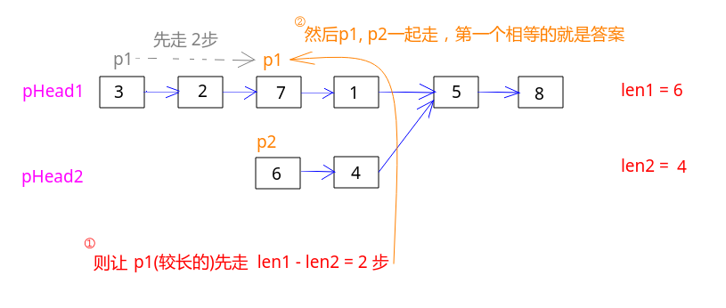

## 剑指Offer - 36 - 两个链表的第一个公共结点

#### [题目链接](https://www.nowcoder.com/practice/6ab1d9a29e88450685099d45c9e31e46?tpId=13&tqId=11189&tPage=2&rp=1&ru=%2Fta%2Fcoding-interviews&qru=%2Fta%2Fcoding-interviews%2Fquestion-ranking)

> https://www.nowcoder.com/practice/6ab1d9a29e88450685099d45c9e31e46?tpId=13&tqId=11189&tPage=2&rp=1&ru=%2Fta%2Fcoding-interviews&qru=%2Fta%2Fcoding-interviews%2Fquestion-ranking

#### 题目

> 输入两个链表，找出它们的第一个公共结点。

### 解析

最简单的想法，使用一个`Set`存储`pHead1`中的所有节点，然后遍历`pHead2`每一个节点，查看`set`中是否存在该节点即可。时间复杂度为`O(N)`。空间复杂度`O(N)`

```java
import java.util.*;
public class Solution {
    public ListNode FindFirstCommonNode(ListNode pHead1, ListNode pHead2) {
        HashSet<ListNode>set = new HashSet<>();
        for(ListNode cur = pHead1; cur != null; cur = cur.next)
            set.add(cur);
        for(ListNode cur = pHead2; cur != null; cur = cur.next)
            if(set.contains(cur))
                return cur;
        return null;
    }
}
```

O(N)时间，O(1)空间优化解法。思路如下:

* 先求出两个链表的长度`n1、n2`；
* 记长度较长的链表为`p1`，较短的为`p2`；
* 先让`p1`走`abs(n1 - n2)`步；
* 然后让`p1、p2`一起走，当`p1 == p2`的时候，就是第一个公共节点；

看个例子:



代码:

```java
public class Solution {
    public ListNode FindFirstCommonNode(ListNode pHead1, ListNode pHead2) {
        if (pHead1 == null || pHead2 == null) return null;
        int n1 = len(pHead1), n2 = len(pHead2);
        ListNode p1 = n1 > n2 ? pHead1 : pHead2;
        ListNode p2 = n1 > n2 ? pHead2 : pHead1;
        for(int i = 0; i < Math.abs(n1 - n2); i++) p1 = p1.next;
        for(; p1 != null && p1 != p2 ; p1 = p1.next, p2 = p2.next);
        return p1;
    }
    private int len(ListNode node) {
        int len = 0;
        for (ListNode p = node; p != null; p = p.next) len++;
        return len;
    }
}
```

讨论区还有一种比较玄学的代码，时间复杂度应该是要比O(N)要高，但是代码简单。原理需要数学证明，和那种[**不用空间找到链表第一个入环节点**](https://github.com/ZXZxin/ZXNotes/blob/master/%E5%88%B7%E9%A2%98/LeetCode/Data%20Structure/List/LeetCode%20-%20141.%20Linked%20List%20Cycle%20%20%26%20160.%20Intersection%20Of%20Two%20Linked%20Lists(%E9%93%BE%E8%A1%A8%E6%88%90%E7%8E%AF%E9%97%AE%E9%A2%98).md#leetcode---142-linked-list-cycle-ii-%E6%89%BE%E5%88%B0%E7%AC%AC%E4%B8%80%E4%B8%AA%E5%85%A5%E7%8E%AF%E8%8A%82%E7%82%B9)类似。

* 设置两个初始指针`p1 = pHead1、p2 = pHead2`；
* 只要两个指针对应的节点不相同，就一直往下`p = p.next`，如果其中某一个为空，就又回到各自的起点，相当于再来一次(环)；

看个例子:


代码如下:

```java
public class Solution {
    public ListNode FindFirstCommonNode(ListNode pHead1, ListNode pHead2) {
        ListNode p1 = pHead1, p2 = pHead2;
        while(p1 != p2){
            p1 = p1 == null ? pHead1 : p1.next; // 为空就回到起点，否则往下
            p2 = p2 == null ? pHead2 : p2.next;
        }
        return p1;
    }
}
```

