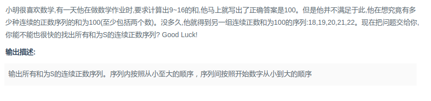

## 剑指Offer - 41 - 和为S的连续正数序列

#### [题目链接]()

> https://www.nowcoder.com/practice/c451a3fd84b64cb19485dad758a55ebe?tpId=13&tqId=11194&tPage=3&rp=1&ru=%2Fta%2Fcoding-interviews&qru=%2Fta%2Fcoding-interviews%2Fquestion-ranking

#### 题目



### 解析


```java
import java.util.ArrayList;

public class Solution {

    private ArrayList<ArrayList<Integer>> res;

    public ArrayList<ArrayList<Integer>> FindContinuousSequence(int sum) {
        res = new ArrayList<>();
        int small = 1, big = 2;
        int mid = (sum + 1) / 2;
        int curSum = small + big;
        while (small < mid) {
            if (curSum == sum)
                packing(small, big);
            while (curSum > sum && small < mid) {
                curSum -= small;
                small++;
                if (curSum == sum) packing(small, big);
            }
            big++;
            curSum += big;
        }
        return res;
    }

    private void packing(int small, int big) {
        ArrayList<Integer> tmp = new ArrayList<>();
        for (int i = small; i <= big; i++)
            tmp.add(i);
        res.add(tmp);
    }
}
```

