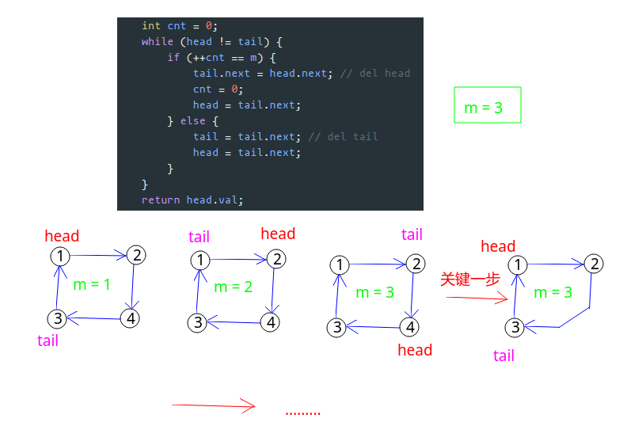
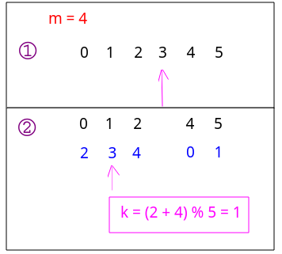
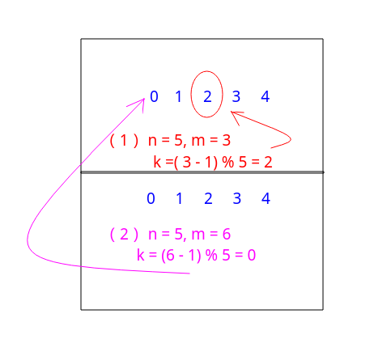
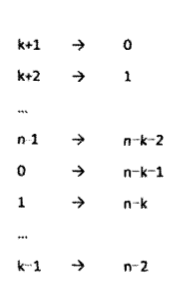

## 孩子们的游戏(圆圈中最后剩下的数)(约瑟夫环)

#### [题目链接](https://www.nowcoder.com/practice/f78a359491e64a50bce2d89cff857eb6?tpId=13&tqId=11199&tPage=3&rp=1&ru=%2Fta%2Fcoding-interviews&qru=%2Fta%2Fcoding-interviews%2Fquestion-ranking)

> https://www.nowcoder.com/practice/f78a359491e64a50bce2d89cff857eb6?tpId=13&tqId=11199&tPage=3&rp=1&ru=%2Fta%2Fcoding-interviews&qru=%2Fta%2Fcoding-interviews%2Fquestion-ranking

#### 题目

### 解析

提供几种做法。

#### 1、解法一

常规解法，使用链表模拟。

* 在环形链表中遍历每一个节点，不断转圈，不断让每个节点报数；
* 当报数达到`m`互，就删除当前报数的点；
* 删除节点后，继续连接整个环形链表；
* 继续报数，继续删除，知道链表节点数为`1`；

看个例子。



代码:

```java
public class Solution {

    class Node {
        int val;
        Node next;

        Node(int v) {
            val = v;
        }
    }

    public int LastRemaining_Solution(int n, int m) {
        if (m == 0 || n == 0)
            return -1;
        // 构造环形链表
        Node head = new Node(0);
        Node pre = head;
        for (int i = 1; i < n; i++) {
            Node cur = new Node(i); 
            pre.next = cur;
            pre = cur;
        }
        pre.next = head; // 环形
        Node tail = pre;
        int cnt = 0;
        while (head != tail) {
            if (++cnt == m) {
                tail.next = head.next; // del head
                cnt = 0;
                head = tail.next;
            } else {
                tail = tail.next; // del tail
                head = tail.next;
            }
        }
        return head.val;
    }
}

```

#### 2、解法二

利用取摸。看个例子就懂了。

`n = 5, m = 4`。




代码:

```java
import java.util.ArrayList;
public class Solution {
    public int LastRemaining_Solution(int n, int m) {
        if(n == 0 || m == 0)
            return -1;
        ArrayList<Integer> list = new ArrayList<>();
        for(int i = 0; i < n; i++) list.add(i);
        int pos = -1;
        while(list.size() > 1){
            pos = (pos + m) % list.size();
            list.remove(pos);
            pos--;
        }
        return list.get(0);
    }
}

```

#### 3、解法三

这个解法我也没看的很懂。。。。

函数`F(n, m)`关于`n`个数字的序列中最后剩下的数字 与 函数`F(n-1, m)`关于`n-1`个数字的序列中最后一个数字存在一定的关系。

要得到`n`个数字的序列中最后剩下的数字，只需要得到`n-1`个数字的序列中最后一个数字即可。

先给出递归公式:

`F(n, m) = [F(n-1, m) + m] % n`。

当 `n == 1`时 `F(n, m) = 0`。

下面给出一些简单的推理。

* 定义`F(n, m)`表示每次在`n`个数字`(0, 1, ... n-1)`中，每次删除第`m`个数字最后剩下的数字。在这个`n`个数字中，**第一个被删除的数字  = `(m - 1)%n`；**(记为`k`)

  看个例子:

  

* 那么删除 `k` 之后剩下的 `n-1` 个数字为 `(0， 1，.…, k-1，k+1,，.…, n-1)`，并且下一次删除从`k+1`开始计数，从而形参`(k+1, k+2, ... n-1, 0, 1, ... k-1)`。

* 上述序列最后剩下的数字也是关于`n`和 `m`的函数，由于这个序列的规律和前面最初的序列不一样，记为`F'(n-1, m)`；

* 最初序列最后剩下的数字`F(n, m)`一定是删除一个数字之后的序列最后剩下的数字，即`F(n, m) = F'(n-1, m)`；

* 把上面的序列和新的索引做一个映射如下:



* 我们把映射定义为 `p`，则 `p(x)=(x-k-1)%n`。它表示如果映射前的数字是`x`，那么映射后的数字是`(x-k-1)%n`。该映射的着映射是 **p<sup>-1</sup>(x)=(x + k + 1)%n**。
* 由于映射之后的序列和最初的序列具有同样的形式，即都是从 0 开始的连续序列，因此仍然可以用函数`F`来表示，记为 `F(n-1 m)`。根据我们的映射规则, 映射之前的序列中最后剩下的数字**F'(n-1, m) = p<sup>-1</sup>[F(n-1, m)] = [F(n-1, m) + k + 1] % n**；
* 把`k = (m-1)%n`带入得到`F(n, m) = F'(n-1, m) = [F(n-1, m) + m] %n`。

代码:

递归:

```java
public class Solution {

    public int LastRemaining_Solution(int n, int m) {
        if (m == 0 || n == 0)
            return -1;
        return news(n, m);
    }

    public int news(int n, int m) {
        if (n == 1) // 当链表中只有一个元素的时候就返回编号1
            return 0;
        int upper = news(n - 1, m); // 从 n-1中移除后最后剩下的
        return (upper + m) % n;  // 回到 n 层 对应的编号是啥
    }
}

```

非递归:

```java
public class Solution {

    public int LastRemaining_Solution(int n, int m) {
        if (m == 0 || n == 0)
            return -1;
        int last = 0;
        for(int i = 2; i <= n; i++) last = (last + m) % i;
        return last;
    }
}

```

