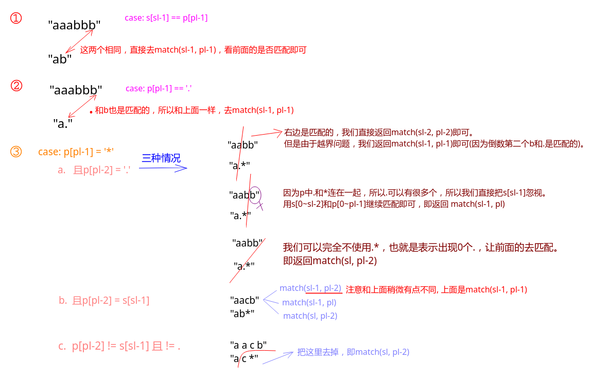

## 剑指Offer - 52 - 正则表达式匹配

#### [题目链接](https://www.nowcoder.com/practice/45327ae22b7b413ea21df13ee7d6429c?tpId=13&tqId=11205&tPage=3&rp=1&ru=%2Fta%2Fcoding-interviews&qru=%2Fta%2Fcoding-interviews%2Fquestion-ranking)

> https://www.nowcoder.com/practice/45327ae22b7b413ea21df13ee7d6429c?tpId=13&tqId=11205&tPage=3&rp=1&ru=%2Fta%2Fcoding-interviews&qru=%2Fta%2Fcoding-interviews%2Fquestion-ranking

#### 题目

>  请实现一个函数用来匹配包括`'.'`和`'*'`的正则表达式。模式中的字符`'.'`表示任意一个字符，而`'*'`表示它**前面的字符**可以出现任意次（**包含0次**）。 
>
> 在本题中，匹配是指字符串的所有字符匹配整个模式。例如，字符串`"aaa"`与模式`"a.a"`和`"ab*ac*a"`匹配，但是与`"aa.a"`和`"ab*a"`均不匹配。

### 解析

这种题目一般都会用动态规划。

递归的思路如下图，大致分三种情况

我们的`sl`和`pl`分别表示当前判断的两个串的长度。而对应的索引是`s[sl - 1]`和`p[pl-1]`。

* `s[sl - 1] = p[pl-1]`；
* `p[pl - 1] = '.'`；
* `p[pl - 1] = '*'`；这种情况具体又可以分几种情况，具体看下图。



最后还要注意边界，当`s == "" && p == ""`的时候返回`true`，当`p=="" & s!= ""`的时候返回`false`。

当`s == "" && p != ""`的时候就要注意，如果`p[i-1] == '*'`则`dp[0][i] = dp[0][i-2]`，因为可以用`*`可以消去前一个字符。

虽然第三种情况，可以合起来考虑，代码会更简洁一些，但是这里个人认为还是写的清楚一点较好。

递归版本:

```java
public class Solution {

    private int[][] dp;

    public boolean match(char[] str, char[] pattern) {
        dp = new int[str.length + 1][pattern.length + 1];
        return isMatch(str, pattern, str.length, pattern.length);
    }

    private boolean isMatch(char[] s, char[] p, int ls, int lp) {
        if (ls == 0 && lp == 0)
            return true;
        if (dp[ls][lp] != 0)
            return dp[ls][lp] == 1;
        if (lp == 0)
            return false; 
        boolean res = false;
        if (ls == 0) {
            res = lp >= 2 && p[lp - 1] == '*' && isMatch(s, p, ls, lp - 2);
        } else {
            if (p[lp - 1] == '.' || p[lp - 1] == s[ls - 1]) {
                res = isMatch(s, p, ls - 1, lp - 1);
            } else if (p[lp - 1] == '*') {
                if (p[lp - 2] == '.')
                    res = isMatch(s, p, ls - 1, lp - 1)
                            || isMatch(s, p, ls - 1, lp)
                            || isMatch(s, p, ls, lp - 2);
                else if (s[ls - 1] == p[lp - 2]) {
                    res = isMatch(s, p, ls - 1, lp - 2) //这里和上面不同，不是ls-1, lp-1, 
                            || isMatch(s, p, ls - 1, lp)
                            || isMatch(s, p, ls, lp - 2);
                } else
                    res = isMatch(s, p, ls, lp - 2);
            }
        }
        dp[ls][lp] = res ? 1 : -1;
        return res;
    }
}
```

递推版本:

```java
public class Solution {
    public boolean match(char[] str, char[] pattern) {
        return isMatch(str, pattern);
    }

    private boolean isMatch(char[] s, char[] p) {
        int sn = s.length;
        int pn = p.length;
        boolean[][] dp = new boolean[sn + 1][pn + 1];
        dp[0][0] = true;
        for (int i = 1; i <= pn; i++)
            if (p[i - 1] == '*') // 第一个不会是 *
                dp[0][i] = dp[0][i - 2];

        for (int i = 1; i <= sn; i++) {
            for (int j = 1; j <= pn; j++)
                if (s[i - 1] == p[j - 1] || p[j - 1] == '.')
                    dp[i][j] = dp[i - 1][j - 1];
                else if (p[j - 1] == '*') {
                    if (p[j - 2] == '.') {
                        dp[i][j] = dp[i - 1][j - 1] || dp[i - 1][j] || dp[i][j - 2];
                    } else if (s[i - 1] == p[j - 2]) {
                        dp[i][j] = dp[i - 1][j] || dp[i - 1][j - 2] || dp[i][j - 2];
                    } else
                        dp[i][j] = dp[i][j - 2];
                }
        }
        return dp[sn][pn];
    }
}
```

