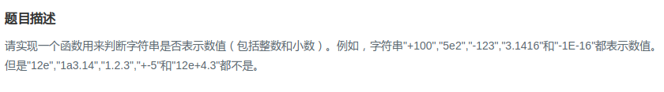

## 剑指Offer - 53 - 表示数值的字符串

#### [题目链接](https://www.nowcoder.com/practice/6f8c901d091949a5837e24bb82a731f2?tpId=13&tqId=11206&tPage=3&rp=1&ru=%2Fta%2Fcoding-interviews&qru=%2Fta%2Fcoding-interviews%2Fquestion-ranking)

> https://www.nowcoder.com/practice/6f8c901d091949a5837e24bb82a731f2?tpId=13&tqId=11206&tPage=3&rp=1&ru=%2Fta%2Fcoding-interviews&qru=%2Fta%2Fcoding-interviews%2Fquestion-ranking

#### 题目




### 解析

模拟题，比较好的方式是用三个`bool`变量`sign、dot、E`记录前面是否已经出现过`+/-、.、E/e`，然后就去考虑一些情况:

* 首先最后一个字符不能是`E、e、.、+、e`；
* 当`str[i] == E/e`时，先判断之前有没有出现过`E/e`，且`E`前面只能是数字；
* 当`str[i] == +/-`时，如果是前面以及出现了`+/-`，则这个`+/-`只能在`E/e`之后。如果第一次出现`+/-`，则必须出现在开头或者在`E/e`之后；
* 当`str[i] == '.'`时，判断`.`只能出现一次，且`.`不能出现在`E`之后；

代码:

```java
import java.math.BigDecimal;

class Solution {

    public boolean isNumeric(char[] str) {
        if (str == null || str.length == 0)
            return false;
        int n = str.length;
        // 最后一个不能为这些
        if (str[n - 1] == 'E' || str[n - 1] == 'e' || str[n - 1] == '.' || str[n - 1] == '+' || str[n - 1] == '-')
            return false;
        boolean sign = false, dot = false, E = false; // 是否出现 +/- 、.　、E/e
        for (int i = 0; i < str.length; i++) {
            if (str[i] == 'e' || str[i] == 'E') {
                if (E) return false; // 只能出现一个E
                if (i == str.length - 1) return false; // E后面一定要有东西
                if (i > 0 && (str[i - 1] == '+' || str[i - 1] == '-' || str[i - 1] == '.')) return false; //E 前面是数字
                E = true;
            } else if (str[i] == '-' || str[i] == '+') {
                // 第二次出现+- 必须在e之后
                if (sign && str[i - 1] != 'e' && str[i - 1] != 'E') return false; // 第二个符号必须在E的后面
                // 第一次出现+-符号，且不是在字符串开头，则也必须紧接在e之后
                if (!sign && i > 0 && str[i - 1] != 'e' && str[i - 1] != 'E') return false;
                sign = true;
            } else if (str[i] == '.') { // dot
                if (E || dot) return false; // E后面不能有小数点, 小数点不能出现两次 例如: 12e+4.3
                dot = true;
            } else if (str[i] < '0' || str[i] > '9') {
                return false;
            }
        }
        return true;
    }

    public static void main(String[] args) {
        System.out.println(new Solution().isNumeric(new char[]{'-', '.', 'E', '5'})); // false
        System.out.println(new Solution().isNumeric(new char[]{'-', '+'}));           // false
        System.out.println(new Solution().isNumeric(new char[]{'-', '.', 'E', '+'})); // false

        // 测试 科学计数法
        BigDecimal bd = new BigDecimal("-3.40256010353E11");
        System.out.println(bd.toPlainString());
    }
}
```

