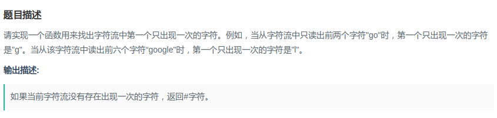
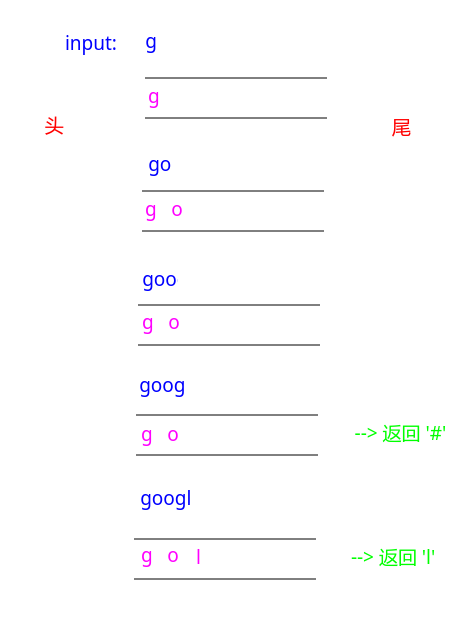

## 剑指Offer - 54 - 字符流中第一个不重复的字符

#### [题目链接](https://www.nowcoder.com/practice/00de97733b8e4f97a3fb5c680ee10720?tpId=13&tqId=11207&tPage=3&rp=1&ru=%2Fta%2Fcoding-interviews&qru=%2Fta%2Fcoding-interviews%2Fquestion-ranking)

> https://www.nowcoder.com/practice/00de97733b8e4f97a3fb5c680ee10720?tpId=13&tqId=11207&tPage=3&rp=1&ru=%2Fta%2Fcoding-interviews&qru=%2Fta%2Fcoding-interviews%2Fquestion-ranking

#### 题目



### 解析

解法一，O(N)。

最容易想到的是: 先用一个容器或者字符串记录`Insert`的字符，并且使用一个哈希表`count`数组统计出现次数。

然后查询的时候，就遍历容器，第一个`c[str[i]] == 1`的就是答案。

但是这种方法需要遍历容器一遍，也就是时间复杂度是`Insert`的长度`O(N)`。

```java
public class Solution {

    private StringBuilder sb = new StringBuilder();

    private int[] c = new int[256];

    public void Insert(char ch) {
        sb.append(ch);
        c[ch]++;
    }
    
    public char FirstAppearingOnce() {
        for(int i = 0; i < sb.length(); i++) if(c[sb.charAt(i)] == 1) return sb.charAt(i);
        return '#';
    }
}
```

O(256)。

第二种优化的方法是使用一个队列，来记录`c[ch] == 1`的，然后每次查询的时候，从对头取，直到取到`c[q.peek()] == 1`的，就是我们要的，**因为队列的先进先出，所以对头的一定是我们之前最早加入的**。

这种方法将时间复杂度从`O(N)`降低到`O(256)`。

例如，加入`googl`的过程。



代码:

```java
import java.util.*;

public class Solution {

    private int[] c;
    private Queue<Character> q;

    public Solution() {
        c = new int[256];
        q = new LinkedList<>();
    }

    public void Insert(char ch) {
        if (++c[ch] == 1) q.add(ch); // 将出现一次的入队
    }

    public char FirstAppearingOnce() {
        while (!q.isEmpty() && c[q.peek()] != 1) q.poll();
        if (q.isEmpty()) return '#'; // 不能将这个放在上面，可能会空指针异常
        return q.peek();
    }
}
```

还一种使用特殊标记`c`数组的方法。这种方法的时间复杂度也是`O(256)`。

方法也差不多，用一个`pos`变量记录加入的顺序，用`c[ch] = -1`表示超过了`2`次。

后面查找函数，就遍历`ch(0~ 256)`，然后找到一个最小的索引（最先加入的）即可。

```java
public class Solution {

    private int[] c = new int[256];
    private int pos = 1; // 从1开始

    public void Insert(char ch) {
        if(c[ch] == 0)
            c[ch] = pos++;
        else
            c[ch] = -1; // 超过一次的直接标记为-1
    }

    public char FirstAppearingOnce() {
        int minIndex = Integer.MAX_VALUE;
        char res = '#';
        for(int i = 0; i < 256; i++) if(c[i] != 0 && c[i] != -1 && c[i] < minIndex){
            minIndex = c[i];
            res = (char)i;
        }
        return res;
    }
}
```

