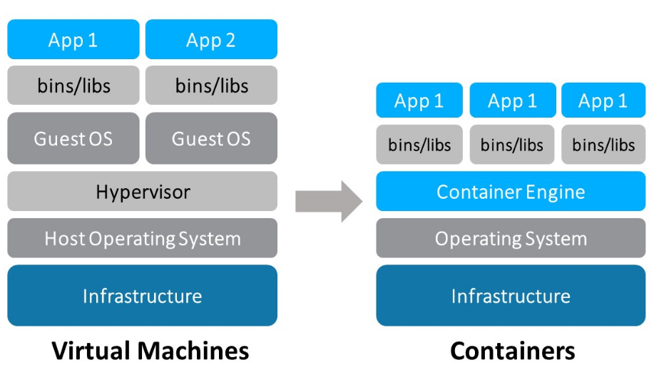
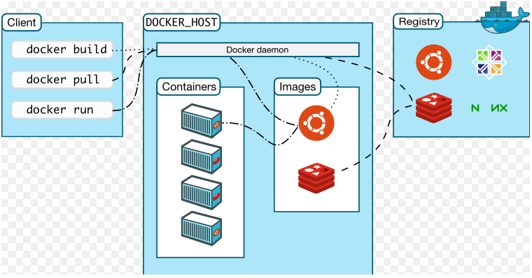

# Docker

### 1、基本概念以及和虚拟机的对比

 Docker 可以让开发者打包他们的应用以及依赖包到一个**轻量级、可移植的容器**中，然后发布到任何流行的 Linux 机器上，也可以实现虚拟化。

注意和虚拟机的对比:

比较Docker 和传统虚拟化方式的不同之处： 

传统虚拟机技术是虚拟出一套硬件后，在**其上运行一个完整操作系统**，在该系统上再运行所需应用进程(占用资源多，启动慢)；

而容器内的应用进程**直接运行于宿主的内核，容器内没有自己的内核，而且也没有进行硬件虚拟**。因此容器要比传统虚拟机更为轻便。 **每个容器之间互相隔离**，每个容器有自己的文件系统 ，容器之间进程不会相互影响，能区分计算资源。

### 2、Docker优势

* 1、更高效的利用系统资源；
* 2、更快速的启动时间；
* 3、一致的运行环境；
* 4、持续交付和部署；
* 5、更轻松的迁移；
* 6、更轻松的维护和扩展；

### 3、镜像、容器、仓库

镜像:

* **Docker 镜像（Image）就是一个只读的模板**。
* **镜像可以用来创建 Docker 容器，一个镜像可以创建很多容器**。

容器:

* Docker 利用容器（Container）独立运行的一个或一组应用。
* 容器是用镜像创建的运行实例。  它可以被启动、开始、停止、删除。
* 每个容器都是相互隔离的、保证安全的平台。  
* 可以把容器看做是一个简易版的 Linux 环境（包括root用户权限、进程空间、用户空间和网络空间等）和运行在其中的应用程序。  
* 容器的定义和镜像几乎一模一样，也是一堆层的统一视角，**唯一区别在于容器的最上面那一层是可读可写的**。

仓库:

* 仓库（Repository）是**集中存放镜像文件的场所**。 
* 仓库(Repository)和仓库注册服务器（Registry）是有区别的。
* 仓库注册服务器上往往存放着多个仓库，每个仓库中又包含了多个镜像，每个镜像有不同的标签（tag）。
*  仓库分为公开仓库（Public）和私有仓库（Private）两种形式。 最大的公开仓库是 Docker Hub(https://hub.docker.com/)， 存放了数量庞大的镜像供用户下载。

总结，需要正确的理解仓库/镜像/容器这几个概念: 

 Docker 本身是一个容器运行载体或称之为管理引擎。**我们把应用程序和配置依赖打包好形成一个可交付的运行环境，这个打包好的运行环境就似乎 image镜像文件**。只有通过这个镜像文件才能生成 Docker 容器。image 文件可以看作是容器的模板。Docker 根据 image 文件生成容器的实例。同一个 image 文件，可以生成多个同时运行的容器实例。  image 文件生成的容器实例，本身也是一个文件，称为镜像文件。 一个容器运行一种服务，当我们需要的时候，就可以通过docker客户端创建一个对应的运行实例，也就是我们的容器。

