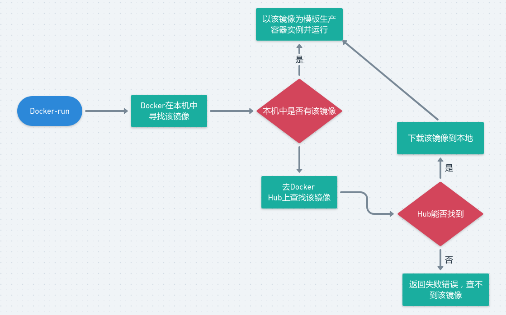
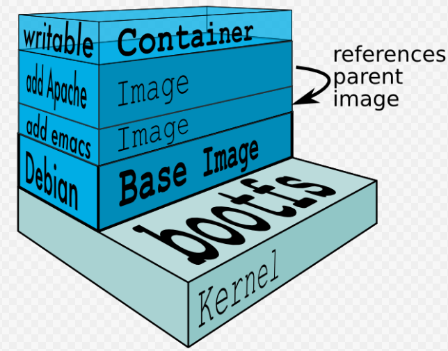
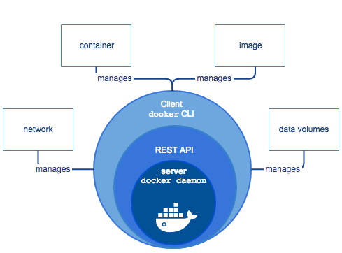
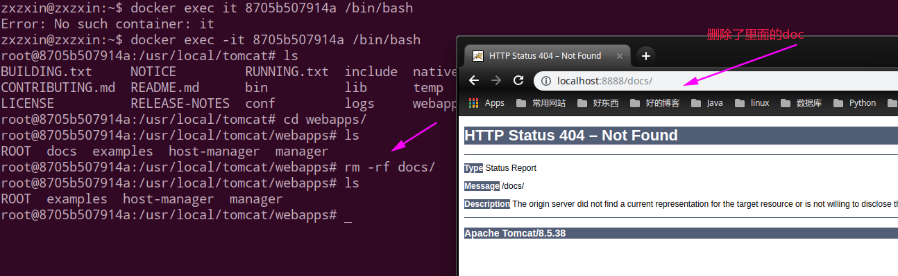
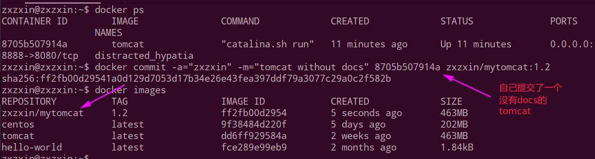
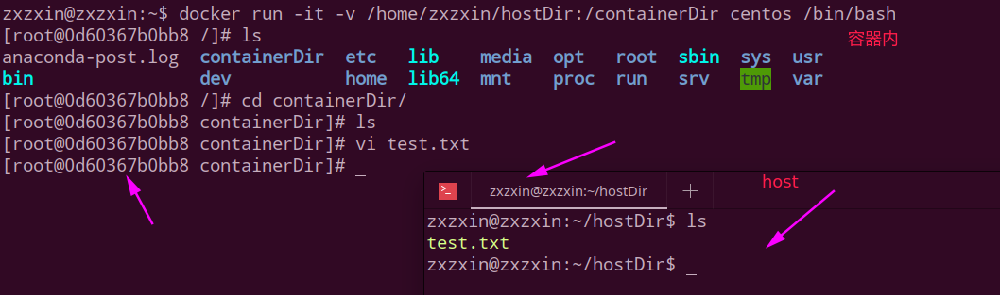
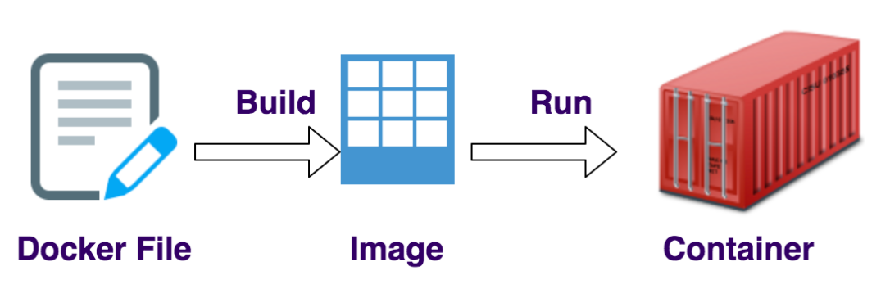

# Docker

## 一、基本概念以及和虚拟机的对比


 Docker 可以让开发者打包他们的应用以及依赖包到一个**轻量级、可移植的容器**中，然后发布到任何流行的 Linux 机器上，也可以实现虚拟化。

注意和虚拟机的对比:


> 来源: [Playing Catch-up with Docker and Containers](https://rancher.com/playing-catch-docker-containers/)

比较Docker 和传统虚拟化方式的不同之处： 

传统虚拟机技术是虚拟出一套硬件后，在**其上运行一个完整操作系统**，在该系统上再运行所需应用进程(占用资源多，启动慢)；

而容器内的应用进程**直接运行于宿主的内核，容器内没有自己的内核，而且也没有进行硬件虚拟**。因此容器要比传统虚拟机更为轻便。 **每个容器之间互相隔离**，每个容器有自己的文件系统 ，容器之间进程不会相互影响，能区分计算资源。

## 二、Docker优势

* 1、更高效的利用系统资源；
* 2、更快速的启动时间；
* 3、一致的运行环境；
* 4、持续交付和部署；
* 5、更轻松的迁移；
* 6、更轻松的维护和扩展；

## 三、镜像、容器、仓库

镜像:

* **Docker 镜像（Image）就是一个只读的模板**。
* **镜像可以用来创建 Docker 容器，一个镜像可以创建很多容器**。

容器:

* Docker 利用容器（Container）独立运行的一个或一组应用。
* 容器是用镜像创建的运行实例。  它可以被启动、开始、停止、删除。
* 每个容器都是相互隔离的、保证安全的平台。  
* 可以把容器看做是一个简易版的 Linux 环境（包括root用户权限、进程空间、用户空间和网络空间等）和运行在其中的应用程序。  
* 容器的定义和镜像几乎一模一样，也是一堆层的统一视角，**唯一区别在于容器的最上面那一层是可读可写的**。

仓库:

* 仓库（Repository）是**集中存放镜像文件的场所**。 
* 仓库(Repository)和仓库注册服务器（Registry）是有区别的。
* 仓库注册服务器上往往存放着多个仓库，每个仓库中又包含了多个镜像，每个镜像有不同的标签（tag）。
*  仓库分为公开仓库（Public）和私有仓库（Private）两种形式。 最大的公开仓库是 Docker Hub(https://hub.docker.com/)， 存放了数量庞大的镜像供用户下载。

总结，需要正确的理解仓库/镜像/容器这几个概念: 

 Docker 本身是一个容器运行载体或称之为管理引擎。**我们把应用程序和配置依赖打包好形成一个可交付的运行环境，这个打包好的运行环境就似乎 image镜像文件**。只有通过这个镜像文件才能生成 Docker 容器。image 文件可以看作是容器的模板。Docker 根据 image 文件生成容器的实例。同一个 image 文件，可以生成多个同时运行的容器实例。  image 文件生成的容器实例，本身也是一个文件，称为镜像文件。 一个容器运行一种服务，当我们需要的时候，就可以通过docker客户端创建一个对应的运行实例，也就是我们的容器。


> 个人系统为`deepin`，安装教程参考：https://blog.csdn.net/qq_36148847/article/details/79273591

## 四、启动运行以及基本原理

运行Docker run hello-world流程:



Docker工作原理:

Docker是一个`Client-Server`结构的系统，**Docker守护进程运行在主机上**， 然后通过Socket连接从客户端访问，**守护进程从客户端接受命令并管理运行在主机上的容**器。 容器，是一个运行时环境，就是我们前面说到的集装箱。

## 五、Docker常用命令

### 1、帮助命令

* docker version
* docker info 
* docker --help(常用)

### 2、镜像命令

#### 1)、docker images

查看本机的镜像。

```shell
zxzxin@zxzxin:~$ docker images
REPOSITORY          TAG                 IMAGE ID            CREATED             SIZE
hello-world         latest              fce289e99eb9        2 months ago        1.84kB
```

可以看到我之前运行了一个`hello-world`镜像。

各个选项说明: 

* REPOSITORY：表示镜像的仓库源 
* TAG：镜像的标签 
* IMAGE ID：镜像ID 
* CREATED：镜像创建时间 
* SIZE：镜像大小 

同一仓库源可以有多个 TAG，代表这个仓库源的不同个版本，我们使用 REPOSITORY:TAG 来定义不同的镜像。 如果你不指定一个镜像的版本标签，例如你只使用 ubuntu，docker 将默认使用 ubuntu:**latest** 镜像。

参数:

* `-a` :列出本地所有的镜像（含中间映像层）；
* `-q` :只显示镜像ID；
* `--digests` :显示镜像的摘要信息；
* `--no-trunc` :显示完整的镜像信息；

```shell
zxzxin@zxzxin:~$ docker images -qa
9f38484d220f
fce289e99eb9
zxzxin@zxzxin:~$ docker images --digests
REPOSITORY          TAG                 DIGEST                                                                    IMAGE ID            CREATED             SIZE
centos              latest              sha256:8d487d68857f5bc9595793279b33d082b03713341ddec91054382641d14db861   9f38484d220f        4 days ago          202MB
hello-world         latest              sha256:2557e3c07ed1e38f26e389462d03ed943586f744621577a99efb77324b0fe535   fce289e99eb9        2 months ago        1.84kB
zxzxin@zxzxin:~$ docker images --no-trunc
REPOSITORY          TAG                 IMAGE ID                                                                  CREATED             SIZE
centos              latest              sha256:9f38484d220fa527b1fb19747638497179500a1bed8bf0498eb788229229e6e1   4 days ago          202MB
hello-world         latest              sha256:fce289e99eb9bca977dae136fbe2a82b6b7d4c372474c9235adc1741675f587e   2 months ago        1.84kB
zxzxin@zxzxin:~$ 

```

#### 2)、docker search

搜索某个镜像。

格式: `docker search [OPTIONS] 镜像名字`。

OPTIONS说明：

* `--no-trunc` : 显示完整的镜像描述；
* `-s` : 列出收藏数(`star`)不小于指定值的镜像。
* `--automated`: 只列出 automated build类型的镜像；

#### 3)、docker pull

格式：`docker pull 镜像名字[:TAG]`。默认是拉取最新的`latest`。

#### 4)、docker rmi

* 删除单个: `docker rmi -f 镜像ID`。
* 删除多个: `docker rmi -f 镜像名1:TAG 镜像名2:TAG`。
* 删除全部: `docker rmi -f $(docker images -qa)`。

### 3、容器命令

#### 1)、docker run

新建并启动容器。

`docker run [OPTIONS] IMAGE [COMMAND][ARG...]`

OPTIONS说明（常用）：有些是一个减号，有些是两个减号。

*  `--name="容器新名字"`: 为容器指定一个名称； 
* `-d`: 后台运行容器，并返回容器ID，也即启动守护式容器；
* ` -i`：**以交互模式运行容器，通常与 `-t` 同时使用**；
*  `-t`：为容器重新分配一个伪输入终端，通常与 `-i` 同时使用；
* ` -P`: 随机端口映射；
* ` -p`: 指定端口映射，有以下格式 `ip:hostPort:containerPort`、 `ip::containerPort...`；

使用镜像`centos:latest`以交互模式启动一个容器，在容器内执行`/bin/bash`命令。 `docker run -it centos /bin/bash`。

#### 2)、docker ps

列出当前所有正在运行的容器。

格式：`docker ps [OPTIONS]`。

OPTIONS说明（常用）：

* `-a` :列出当前所有正在运行的容器+历史上运行过的；(不加`a`的话就只是当前运行的)
* `-l` :显示最近创建的容器；
* `-n`：显示最近n个创建的容器；
* `-q` : 静默模式，只显示容器编号；
* ` --no-trunc` :不截断输出；

#### 3)、退出容器

两种方式:

* `exit`： 容器停止退出；
* `ctrl+P+Q ` : 容器不停止退出；

```shell
zxzxin@zxzxin:~$ docker run -it centos
[root@0026c6962638 /]# ls    这里进入了docker 的centos容器内部
anaconda-post.log  dev  home  lib64  mnt  proc  run   srv  tmp  var
bin                etc  lib   media  opt  root  sbin  sys  usr
[root@0026c6962638 /]# exit
exit
zxzxin@zxzxin:~$ 

```

#### 4)、docker start、restart、stop、kill

启动容器: 格式： `docker start 容器ID或者容器名`。

重启容器: 格式: `docker restart 容器ID或者容器名`。

停止容器: 格式: `docker stop 容器ID或者容器名`。

强制停止容器: 格式: `docker kill 容器ID或者容器名`。

#### 5)、docker rm

基本格式: `docker rm 容器ID`。

删除多个容器:

* `docker rm -f $(docker ps -a -q)`；
* `docker ps -a -q | xargs docker rm`；

#### 6)、其他

* 启动守护式容器: 基本格式: `docker run -d 容器名`。
* 查看容器日志: `docker logs -f -t --tail 容器ID`。
* 查看容器内运行的进程: `docker top 容器ID`。
* 查看容器内部细节: `docker inspect 容器ID`。
* 进入正在运行的容器并以命令行交互: 
  * `docker exec -it 容器ID bashShell`。 (例如`docker exec -it 335134 /bin/bash`)
  * 重新进入:  `docker attach 容器ID`。
  * 上面两个区别: attach 直接进入容器启动命令的终端，不会启动新的进程。exec 是在容器中打开新的终端，并且可以启动新的进程。
* 从容器内拷贝文件到主机上: `docker cp 容器ID:容器内路径 目的主机路径`。

## 六、Docker镜像

UnionFS（联合文件系统）：Union文件系统（UnionFS）是一种分层、轻量级并且高性能的文件系统，它支持对文件系统的修改作为一次提交来一层层的叠加，同时可以将不同目录挂载到同一个虚拟文件系统下(unite several directories into a single virtual filesystem)。

Union 文件系统是 Docker 镜像的基础。**镜像可以通过分层来进行继承，基于基础镜像（没有父镜像），可以制作各种具体的应用镜像**。

特性：一次同时加载多个文件系统，但从外面看起来，只能看到一个文件系统，联合加载会把各层文件系统叠加起来，这样最终的文件系统会包含所有底层的文件和目录。

<div align="center"></div><br>
<div align="center"></div><br>
### 1、docker commit

特点: (`commit`的只是一个副本容器。原来的不能修改)

**Docker镜像都是只读的**，当容器启动时，一个新的可写层被加载到镜像的顶部。

这一层通常被称作“容器层”，“容器层”之下的都叫“镜像层”。

`docker commit`提交容器副本使之成为一个新的镜像。

提交格式: `docker commit -m=“提交的描述信息” -a=“作者” 容器ID 要创建的目标镜像名:[标签名]`

### 2、实战:拉取一个tomcat然后修改变成副本，然后commit

我们先运行原先拉去的`tomcat`，然后我们以进入正在运行的`tomcat`，然后我们将里面`webapps/docs`删除，于是网页的`document`就打不开了：

`docker run -it -p 8888:8080 tomcat`

* `-p`  ，主机端口:docker容器端口；
* `-P `，随机分配端口；
* `i`，交互；
* `t`，终端；

故意删除上一步镜像生产tomcat容器的文档



然后我们提交:



也即当前的tomcat运行实例是一个没有文档内容的容器， 以它为模板commit一个没有doc的tomcat新镜像`zxzxin/tomcat:1.2`

启动我们的新镜像并和原来的对比:

* 启动`zxzxin/tomcat:1.2`，它没有docs；
* 新启动原来的tomcat，它有docs；

## 七、容器数据卷

### 1、概念和作用

有点类似我们Redis里面的rdb和aof文件。

作用：

* 容器的持久化；
* 容器间（容器和宿主）继承+共享数据；

### 2、数据卷

#### 1)、命令添加

命令格式:

```shell
docker run -it -v /宿主机目录:/容器内目录 centos /bin/bash
```

查看数据卷是否挂载成功:

`docker inspect 容器ID`。

特点:

* 容器和宿主机之间数据共享；
* 容器停止退出后，主机修改后数据是否同步；
* 命令(带权限): `docker run -it -v /宿主机绝对路径目录:/容器内目录:ro 镜像名` (ro就是`read only`)



#### 2)、Docker File添加

这部分具体在下面说。

根目录下新建mydocker文件夹并进入。

可在Dockerfile中使用VOLUME指令来给镜像添加一个或多个数据卷。

```shell
volume test
FROM centos
VOLUME ["/dataVolumeContainer1","/dataVolumeContainer2"]
CMD echo "finished,--------success1"
CMD /bin/bash
```

build后生成镜像。

> Docker挂载主机目录Docker访问出现cannot open directory .: Permission denied 解决办法：在挂载目录后多加一个`--privileged=true`参数即可。

### 3、数据卷容器

命名的容器挂载数据卷，其它容器通过挂载这个(父容器)实现数据共享，挂载数据卷的容器，称之为数据卷容器。

以上一步新建的镜像`zxzxin/centos`为模板并运行容器`dc01`、`dc02`、`dc03`。

假设他们都有了容器卷: `/dataVolumeContainer1、/dataVolumeContainer2`。

其中`dc02、dc03`会继承`dc01`。我们在其中任意一个容器内加数据，另外两个容器内部都可以看到。

* 先启动一个父容器dc01；并在dataVolumeContainer2新增内容。
* dc02/dc03继承自dc01；`--volumes-from`，具体是`docker run -it --name dc02 --volumes-from dc01 zxzxin/centos`。
* 回到dc01可以看到02/03各自添加的都能共享了。
* 删除dc01，dc02修改后dc03可否访问。
* 删除dc02后dc03可否访问。
* 新建dc04继承dc03后再删除dc03。

**结论：容器之间配置信息的传递，数据卷的生命周期一直持续到没有容器使用它为止**。

## 八、Docker File

