# Checkout进阶与stash

## 一、gitcheckout和git reset --的区别

`git checkout -- test.txt`的作用: **丢弃掉相对于暂存区中最后一次添加的文件内容所做的变更**。

演示:

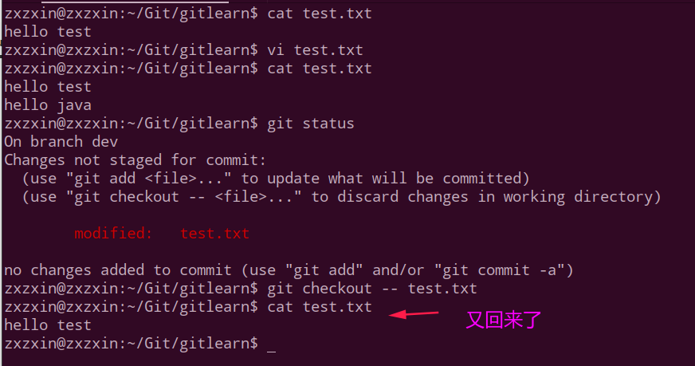

第二个，注意和`git reset HEAD test.txt`的区别:

**将之前添加到暂存区(stage)的内容从暂存区移除到工作区**

演示: 

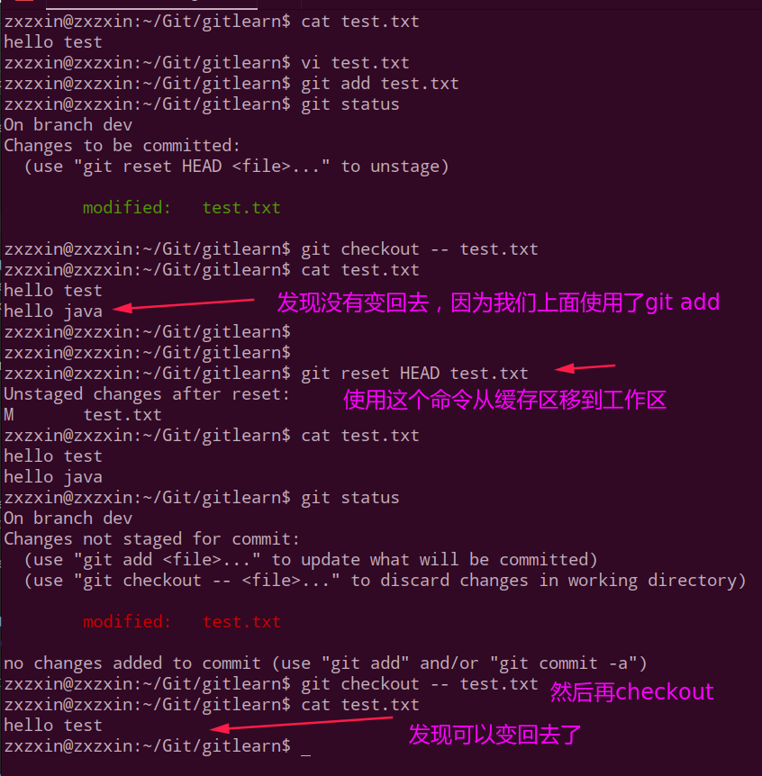

## 二、git checkout游离状态

之前我们知道`git branch`可以切换到历史提交。而`git reset HEAD commid-id`可以切换到某个历史状态，然而`git checkout`也可以切换到某个历史状态，但是`git checkout `切换到的是一个游离的状态，我们必须要提交或者`stash`，不然会报错。

下面开始演示，先做准备工作: 创建`test.txt`并修改提交几次。

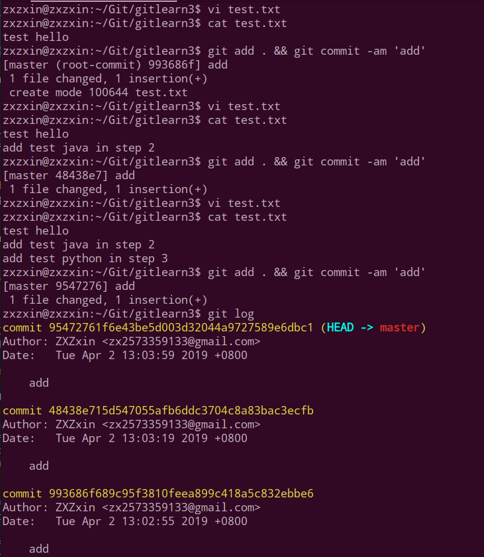

然后开始我们的演示。

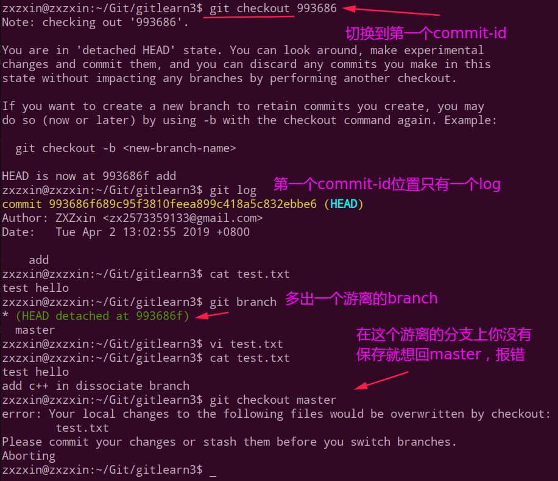

可以看到git报错了，所以我们必须通过`add和commit`保存起来，最好再创建一个分支，如下:

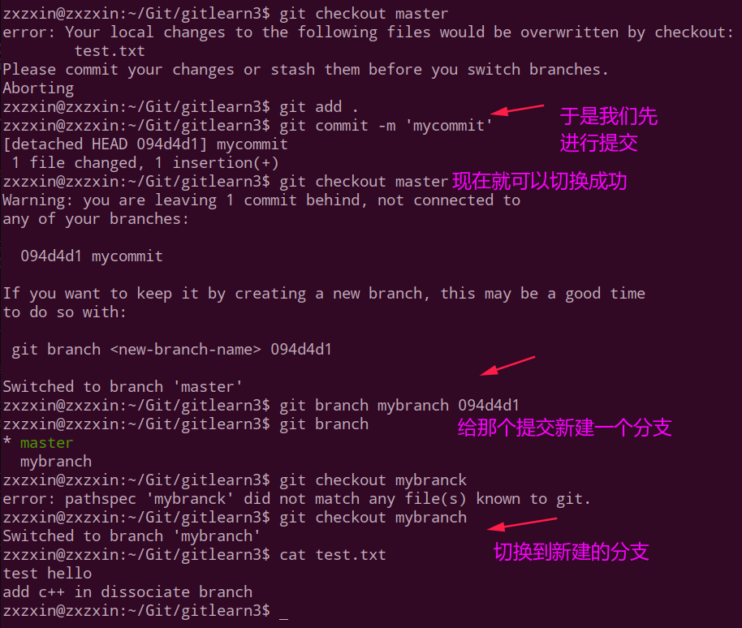

总结图:

 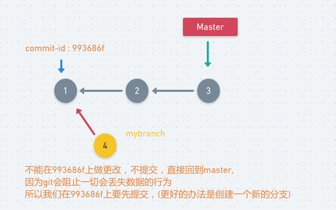
 

## 三、stash使用

常见使用命令：

* 保存现场
  * `git stash`
  * `git stash list`
* 恢复现场
  * `git stash apply`(stash内容并不删除，需要通过`git stash drop stash@{id}` 手动删除)作用，保存在`master`之前创建的分支上做的修改(想要回到`master`)。
  * `git stash pop`（恢复的同时也将stash内容删除）
  * `git stash apply stash@{id}`，回到某一个`stash`。

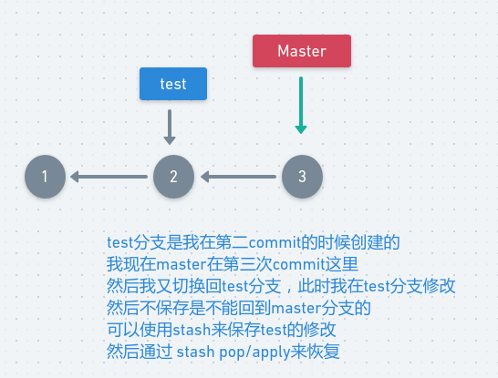
 

演示: 

先搭建基础环境:

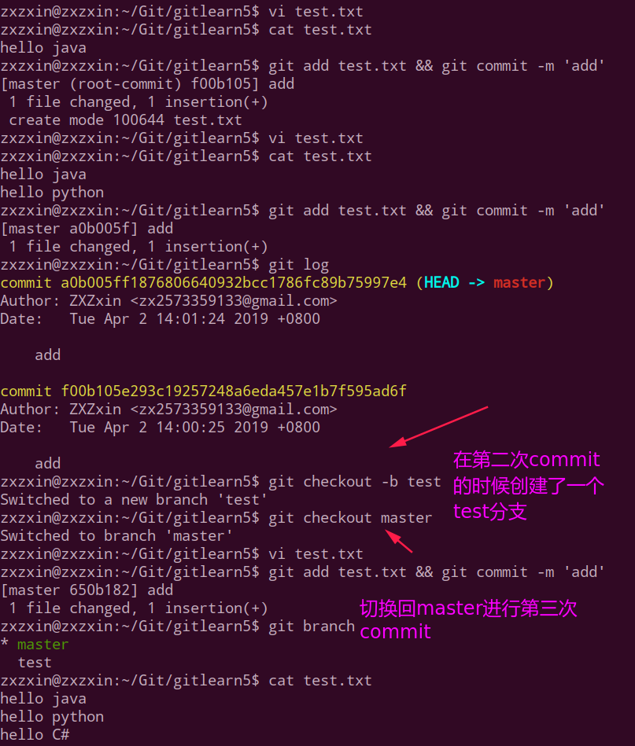

然后我们回到`test`分支上进行修改，不做提交，想回到`master`上:

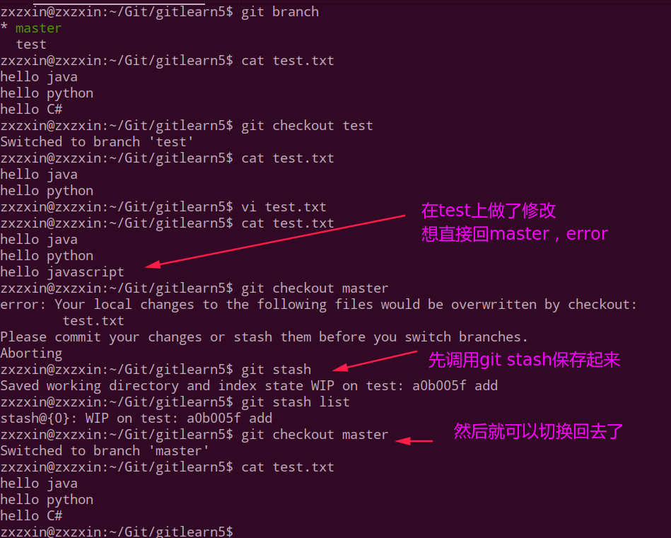

下面看使用`stash pop`恢复:

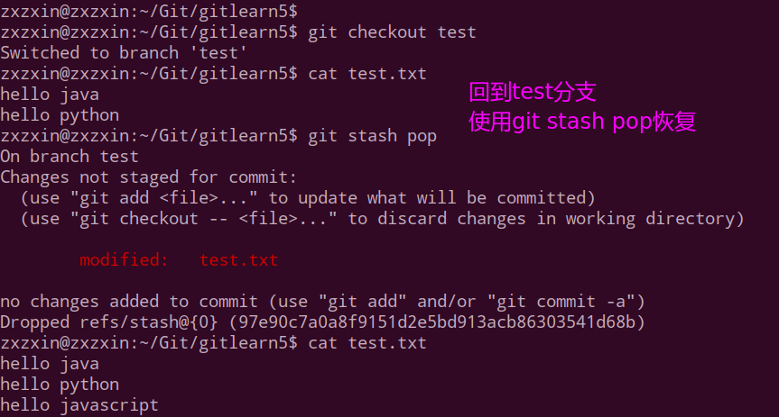

下面使用`stash apply`和`stash drop`命令:

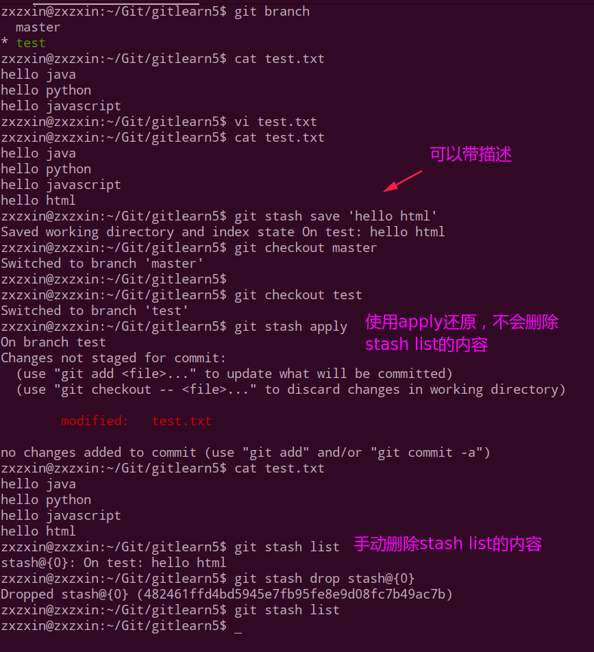