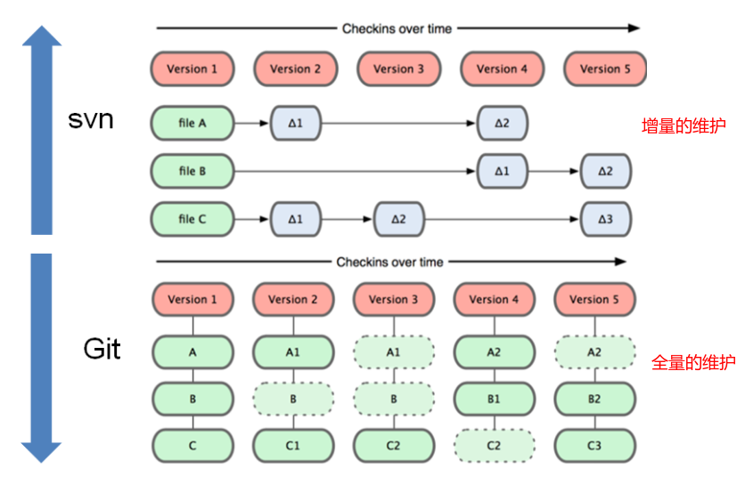
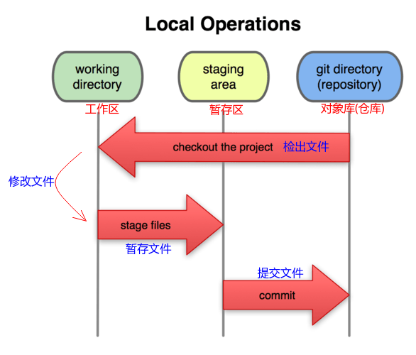
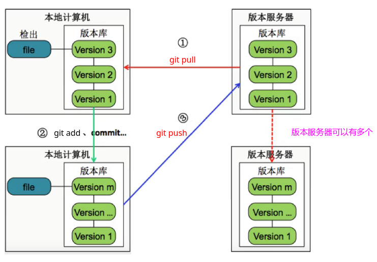
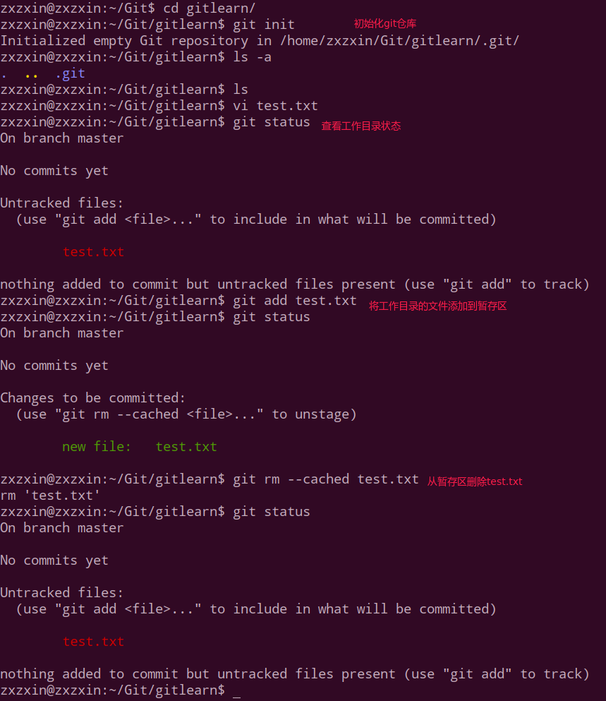
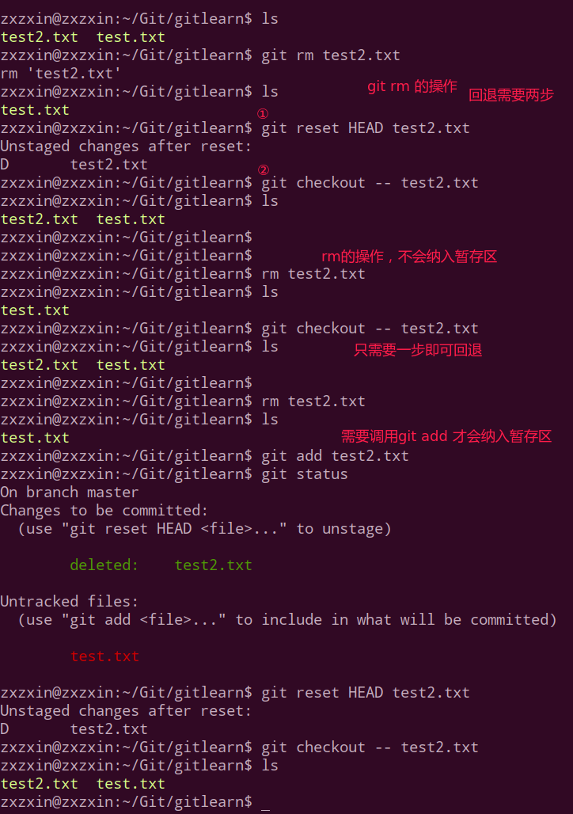
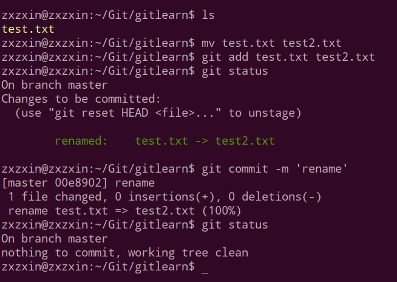
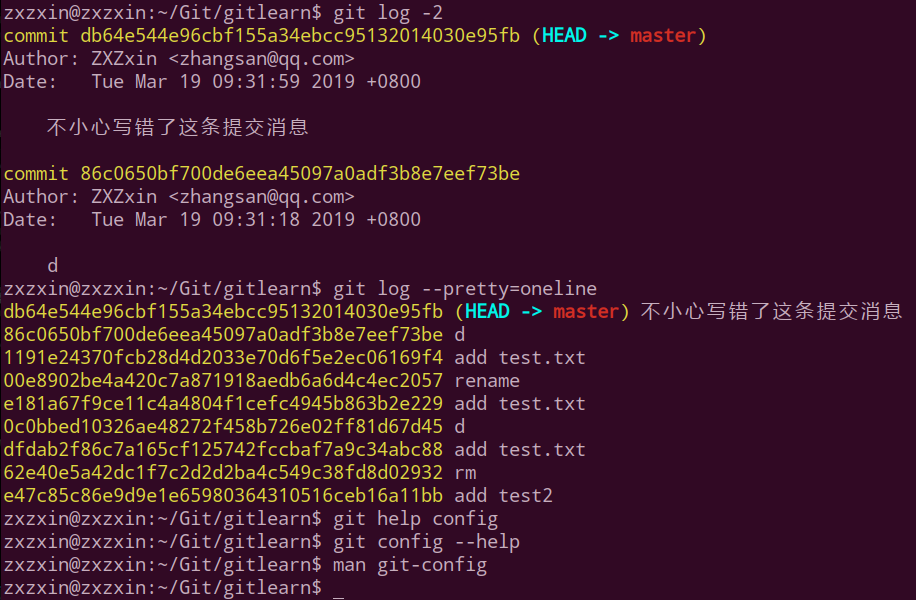
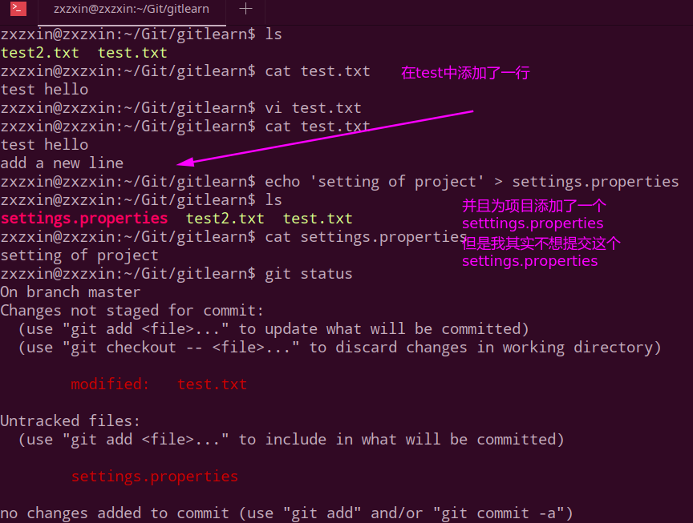
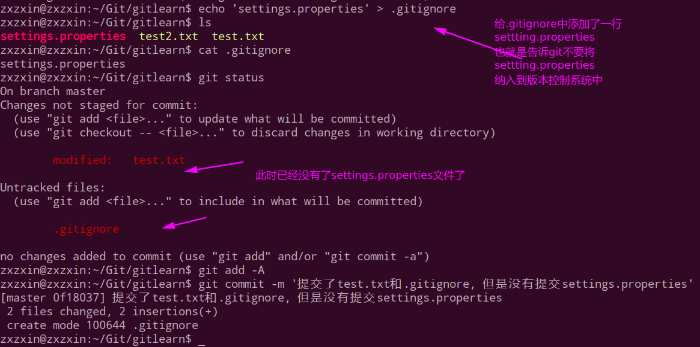

# Git

* [一、Git基础概念](#一git基础概念)
* [二、Git常用命令](#二git常用命令)

## 一、Git基础概念

Git功能简单概述

- 可以随时回滚到之前的代码版本(`git reset --hard `)；
- 协同开发时不会覆盖别人的代码(分支)；
- 留下修改记录(`git log`)；
- 发版时可以方便的管理不同的版本；

### 1、Git工作模式

操作

* 90%以上的操作在个人计算机上

* 添加文件、修改文件、提交变更、查看版本历史等

* 版本库同步

* 将本地修改推送到版本服务器

版本控制系统:


### 2、Git文件存储

注意文件存储和SVN不同:



Git 不按照SVN那样对待或保存数据。 **反之，Git 更像是把数据看作是对小型文件系统的一组快照。 每次你提交更新，或在 Git 中保存项目状态时，它主要对当时的全部文件制作一个快照并保存这个快照的索引。 为了高效，如果文件没有修改，Git 不再重新存储该文件，而是只保留一个链接指向之前存储的文件**。 Git 对待数据更像是一个 快照流。

总结特点:

* 直接记录快照`snapshoot`。而并非比较差异；
* 近乎所有操作都在本地执行；
* **时刻保持数据完整性**；
* 多数操作仅添加数据；
* **文件的三种状态**（只会处于这三种状态）
  * 已修改(`modified`)
  * 已暂存(`staged`)
  * 已提交(`committed`)

### 3、Git文件状态

* Git文件: 已被版本库管理的文件；
* 已修改: 在工作目录(`working directory`)修改Git文件；
* 已暂存: 对已修改的文件执行Git暂存操作，将文件存入**暂存区**(`staging area`)； (注意SVN中没有暂存区这个概念)
* 已提交: 将已暂存的文件执行Git提交操作，将文件存入版本库(`git directory`)；



Git 仓库目录是 Git 用来保存项目的元数据和对象数据库的地方。 这是 Git 中最重要的部分，从其它计算机克隆仓库时，拷贝的就是这里的数据。

工作目录是对项目的某个版本独立提取出来的内容。 这些从 Git 仓库的压缩数据库中提取出来的文件，放在磁盘上供你使用或修改。

暂存区域是一个文件，保存了下次将提交的文件列表信息，一般在 Git 仓库目录中。 有时候也被称作‘索引’，不过一般说法还是叫暂存区域。

基本的 Git 工作流程如下：

1. 在工作目录中修改文件。
2. 暂存文件，将文件的快照放入暂存区域`git add`。
3. 提交更新，找到暂存区域的文件，将快照永久性存储到 Git 仓库目录`git commit`。

> git add 放到暂存区；
>
> git commit 从暂存区放到版本仓库中；

### 4、本地版本库与服务器版本库

Git是分布式的。



## 二、Git常用命令
### 1、config和email



关于配置`user.name`和`user.email`:

可以有三个地方配置:

比如输入`git config`命令， 会出现下面三个信息，即系统级别`system`，全局`global`，和局部`local`。其中优先级不断升高。

```shell
zxzxin@zxzxin:~/Git/gitlearn$ git config
usage: git config [<options>]

Config file location
    --global              use global config file
    --system              use system config file
    --local               use repository config file
    -f, --file <file>     use given config file
    --blob <blob-id>      read config from given blob object

```

这里展示一下配置我们局部的`gitlearn`仓库:


> git 提交的id(`commit id`)是一个摘要值，这个摘要值实际上是一个`sha1`计算出来的。

### 2、git rm 和rm的区别

**git rm** : 

* 1、删除了一个文件
* 2、将被删除的文件纳入到了暂存区(stage)；(可以直接调用`git commit`来提交)

若想恢复被删除的文件，需要进行两个动作:

* 1、`git reset HEAD test2.txt`，将待删除的文件从暂存区恢复到工作区；
* 2、`git checkout -- test2.txt`， 将工作区的修改丢弃掉；

**rm **:

* 只是将文件删除；注意: 这时，被删除的文件并未纳入到暂存区当中。
* 这时是提交(`git commit`)不了的。要想纳入暂存区，必须要再调用一次`git add`。

实战对比:



### 3、git mv 和 mv的对比

git mv(和`git rm `类似)：

* 先完成重命名；
* 然后提交到暂存区；

`git mv`演示:


而  mv:

* 只是完成重命名；
* 需要自己调用`git add`提交到暂存区；



​	

> 使用技巧: 可以通过`git commit --amend -m '修正内容'`更改上次错误的提交消息。(就是`-m ''`)后面的提交信息写错了。

### 4、git log查看日志

`git log -n `可以查看最近的`n`条日志。

`git log --pretty=oneline`以一行一行的方式显示出来。 

查看git命令帮助:



### 5、`.gitignore`文件

在开发中，如果我们不想将所有的文件都放到git当中，而是要忽略少数一些文件(比如`jar`包、配置文件等)，我们可以在我们的目录创建一个`.gitignore`文件，git就不会将这些文件放入暂存区，也不会提交(不会加入版本控制系统)。



此时我们可以创建一个`.gitignore`文件:



简而言之，**放在`.gitignore`中的文件会直接被`git`无视**。

> 其中，放在`.gitignore`中的文件也支持正则表达式。
>
> 例如:
>
> * `*.a`，会忽略所有`.a`结尾的文件；
> * `!lib.a`，不要忽略`lib.a`(排除这个忽略)；
> * `/test.txt`，仅仅忽略项目根目录下的`TODO`文件，不包括子目录下的`test.txt`文件；
> * `dir1/`，忽略`dir1/`目录下的所有文件；
> * `dir1/*.txt`，会忽略`dir1/a.txt`但不会包括`dir1/dir2/a.txt`。
> * 例如`dir1/*.txt`会忽略`dir1`下的所有`.txt`文件，`dir1/*/*.txt`会忽略`dir1`下所有层下的`.txt`，而`dir1/**/*.txt`会忽略`dir1/`下的任意层的`.txt`文件。

在`.gitignore`中用`#`表示注释。


