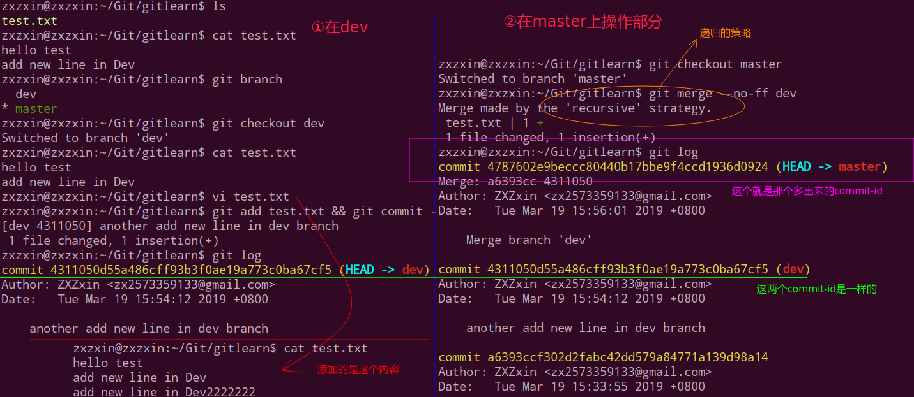

# Git分支和版本回退

## 一、分支

### 1、分支简单介绍

简单使用:


> 可以将`git branch new_branch`和`git checkout new_branch`两个命令合并成一个命令:
> `git checkout -b new_branch`。这个命令的意思就是创建一个分支并且切换到这个分支上。
>
> 本地分支改名: `git branch -m 原分支名 新分支名`

### 2、合并分支merge

这个过程中，下一个版本会记录一个`parent id`，这个`parent id`就是前一个版本的`commit id`。


注意当我们在`dev`中更改文件之后，一定要先`add`和`commit`，不然那样就会和`master`内容同步了，我们需要的是在`dev`中更改之后，在没有进行`merge`之前，`master`不会和`dev`相同: 看下面的演示：


### 3、快进fast forward

HEAD的含义: (在`git reset HEAD test.txt`中使用过)

* HEAD指向的是当前分支；
* master是指向提交(本质上只的是当前的提交)；

即如下表示:


如果我们执行`git checkout -b dev`，我们就会创建一个`dev`分支并指向新的分支。

这是在`master`分支的基础上，但是这个过程并不是像`SVN`一样会拷贝一份，而是只是创建一个指针`dev`，会和`master`指向了同一个提交。但此时HEAD指向的是`dev`（当前分支）。


查看HEAD文件的内容:


然后我在上图的基础上，如果我在`dev`分支下进行了一次提交，图就会变成下面这样:


**此时`master`指向第3次提交，而`dev`已经指向了第四次提交**。

接下来，如果我将`dev`上面的修改合并到`master`上面 (在`master`中操作)，上面的图就会变成下面这样:


这种情况不会有冲突存在。

实战演示:


总结一下这种情况，就是直接从`master`分支跳转到了最后的`dev`修改的那个位置，相当于指针的跳转。

### 4、master和dev同时修改同一文件同一位置产生冲突

演示冲突：在`master`中修改了`test.txt`的第三行，在`dev`中也修改了`test.txt`中的第三行，于是合并的时候就会产生冲突:


上面的过程就是如下图的过程:


> 注意箭头往回指是因为后一个提交里面包含一个`parent-id`指向前一个提交的`commit-id`，前面已经说过。

注意观察`master`分支中`test.txt`文件的内容以及我们将解决这次冲突(即我们打算保存`master`的修改而丢弃`dev`的修改)：


### 5、深入fast-forward模式

也就是说在`fast-forward`模式下:

* 如果可能（合并时没有冲突），那么Git就会采用`fast-forward`模式；
* 在这种模式下，删除分支时会丢掉分支信息；
* 合并时加上 `-- no-ff`参数会禁用`fast-forward`模式，这样就会多出一个`commit - id`，也就是说在`fast-forward`模式下面`merge`不会多出一个`commit-id`；

```shell
git merge -- no-ff dev
```

* 查看日志更好的方式

```shell
git log --graph
```

关于`fast-forward`模式和非`fast-forward`模式下的少一次`commit-id`和多一次`commid-id`的图解:


我们先看使用`fast-forward`模式下的: (即合并的时候`commit-id`和另一个分支相同):


再看不使用`fast-forward`模式:



## 二、Git版本回退

Git的另外一个强大之处在于可以回退到之前的任意一个版本：


主要看下面的命令:

* `git reset --hard HEAD^`， 往后回退1个版本；
* `git reset --hard HEAD~3`，往后回退3个版本；
* `git reset --hard commit-id`，直接回退到某个`commit-id`；(如果当前在靠前面，就可以通过`git log`查看)；
* 如果在后面，不能查看到前面的`git log 得到 commit-id`怎么办呢？可以用`git reflog`查看自己的操作日志；

实战演示:


查看修改和提交日志:


下面演示怎么回退:

