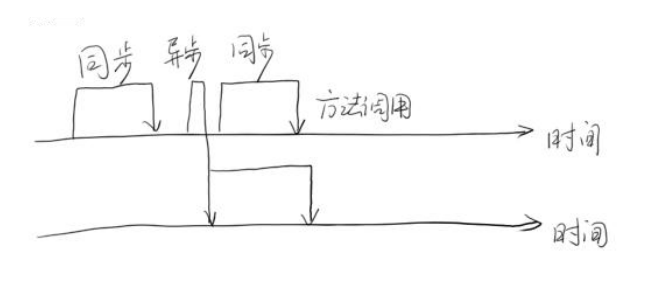
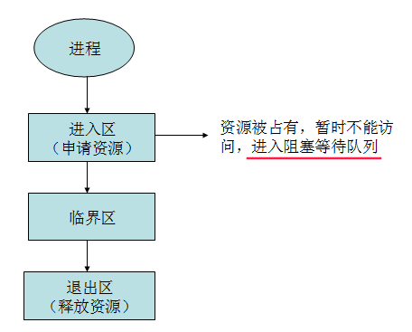
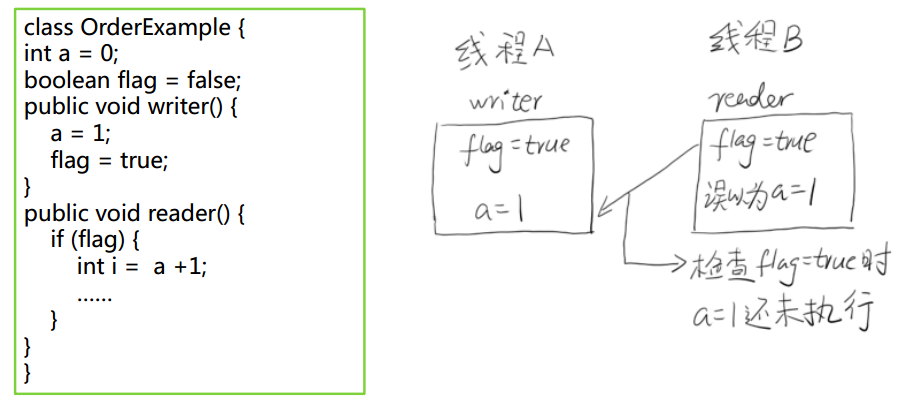

## 一、基础

### 1、同步（synchronous）和异步（asynchronous）




### 2、临界区

临界区用来表示一种公共资源或者说是共享数据，可以被多个线程使用。

但是每一次，只能有一个线程使用它，一旦临界区资源被占用，其他线程要想使用这个资源，就必须等待。

<div align="center"></div><br>


### 3、阻塞（Blocking）和非阻塞（Non-Blocking）

* 阻塞和非阻塞通常用来形容多线程间的相互影响。比如一个线程占用了临界区资源，那么其它所有需要

这个资源的线程就必须在这个临界区中进行等待，等待会导致线程挂起。这种情况就是阻塞。

* 此时，如果占用资源的线程一直不愿意释放资源，那么其它所有阻塞在这个临界区上的线程都不能工作。

* 非阻塞允许多个线程同时进入临界区

### 4、并发级别

阻塞

* 当一个线程进入临界区后，其他线程必须等待

无障碍（Obstruction-Free）

* 无障碍是一种最弱的非阻塞调度
* 自由出入临界区
* 无竞争时，有限步内完成操作
* 有竞争时，回滚数据

无锁（Lock-Free）

* 是无障碍的
* 保证有一个线程可以胜出

```java
while (!atomicVar.compareAndSet(localVar, localVar+1)) // CAS
{
     localVar = atomicVar.get();
}
```

无等待（Wait-Free）（要求最高）

* 无锁的

* 要求所有的线程都必须在有限步内完成
* 无饥饿的

## 二、内存模型和线程安全

### 1、原子性

原子性是指一个操作是不可中断的。即使是在多个线程一起执行的时候，一个操作一旦开始，就不会被其它线程干扰。

例如`i++`不是原子的。

### 2、有序性

在并发时，程序的执行可能出现乱序。

一条指令的执行是可以分为很多步骤的

* 取指 IF

* 译码和取寄存器操作数 ID

* 执行或者有效地址计算 EX

* 存储器访问 MEM

* 写回 WB



### 3、可见性

可见性是指当一个线程修改了某一个共享变量的值，其他线程是否能够立即知道这个修改。

* 编译器优化
* 硬件优化（如写吸收，批操作）

### 4、Happen-Before规则

程序顺序原则：一个线程内保证语义的串行性

* volatile规则：volatile变量的写，先发生于读，这保证了volatile变量的可见性

* 锁规则：解锁（unlock）必然发生在随后的加锁（lock）前

* 传递性：A先于B，B先于C，那么A必然先于C

* 线程的start()方法先于它的每一个动作

* 线程的所有操作先于线程的终结（Thread.join()）

* 线程的中断（interrupt()）先于被中断线程的代码

* 对象的构造函数执行结束先于finalize()方法

### 5、线程安全

 指某个函数、函数库在多线程环境中被调用时，能够正确地处理各个线程的局部变量，使程序功
能正确完成。

## 三、无锁(CAS)

### 1、CAS原理

CAS算法的过程是这样：

它包含3个参数CAS(V,E,N)。 

V 表示要更新的变量，E表示预期值，N表示新值。

仅当V值等于E值时，才会将V的值设为N，如果V 值和E值不同，则说明已经有其他线程做了更新，则当前线程什么都不做。最后，CAS返回当前V的真实值。CAS操作是抱着**乐观**的态度进行的，它总是认为自己可以成功完成操作。

当多个线程同时使用CAS操作一个变量时，只有一个会胜出，并成功更新，其余均会失败。失败的线程不会被挂起，仅是被告知失败，并且允许再次尝试，当然也允许失败的线程放弃操作。

基于这样的原理，CAS操作即时没有锁，也可以发现其他线 程对当前线程的干扰，并进行恰当的处理。

### 2、AtomicReference

举例: 运行下面这个程序，每次一定有一个线程会修改成功，但是是哪个线程是未知的。

```java
import java.util.concurrent.atomic.AtomicReference;

public class AtomicReferenceTest {

    // 初始值
    final static AtomicReference<String> atomicStr = new AtomicReference<>("aaa");

    // 运行下面这个程序，每次一定有一个线程会修改成功，但是是哪个线程是未知的
    public static void main(String[] args){

        for(int i = 0; i < 10; i++){
            final int num = i;
            new Thread(){
                @Override
                public void run() {
                    try {
                        Thread.sleep(Math.abs((int)(Math.random() * 100)));
                    } catch (InterruptedException e) {
                        e.printStackTrace();
                    }

                    if(atomicStr.compareAndSet("aaa", "bbb")){
                        System.out.println("Thread : " + Thread.currentThread().getId() + "  Changed the value to bbb..");
                    }else {
                        System.out.println("Thread : " + Thread.currentThread().getId() + "  Failed");
                    }
                }
            }.start();
        }
    }
}

```

### 3、AtomicStampReference

解决CAS的不足:

线程1准备用CAS将变量的值由A替换为B，在此之前，线程2将变量的值由A替换为C，又由C替换为A，然后线程1执行CAS时发现变量的值仍然为A，所以CAS成功。但实际上这时的现场已经和最初不同了，尽管CAS成功，但可能存在潜藏的问题，例如下面的例子：

```java
// 本例要求做到只能充值一次，所以需要加上　timestamp，因为可以做到　ABA问题
public class AtomicStampedReferenceTest {

    static AtomicStampedReference<Integer> money = new AtomicStampedReference<>(19, 0);

    public static void main(String[] args) {
        //模拟多个线程同时更新后台数据库，为用户充值
        for (int i = 0; i < 3; i++) {
            final int timestamp = money.getStamp();
            new Thread() {
                public void run() {
                    while (true) {
                        while (true) {
                            Integer m = money.getReference();
                            if (m < 20) {
                                if (money.compareAndSet(m, m + 20, timestamp, timestamp + 1)) {
                                    System.out.println("余额小于20元，充值成功，余额:" + money.getReference() + "元");
                                    break;
                                }
                            } else {
                                //System.out.println("余额大于20元，无需充值");
                                break;
                            }
                        }
                    }
                }
            }.start();
        }

        //用户消费线程，模拟消费行为
        new Thread() {
            public void run() {
                for (int i = 0; i < 100; i++) {
                    while (true) {
                        int timestamp = money.getStamp();
                        Integer m = money.getReference();
                        if (m > 10) {
                            System.out.println("大于10元");
                            if (money.compareAndSet(m, m - 10, timestamp, timestamp + 1)) {
                                System.out.println("成功消费10元，余额:" + money.getReference());
                                break;
                            }
                        } else {
                            System.out.println("没有足够的金额");
                            break;
                        }
                    }
                    try {
                        Thread.sleep(100);
                    } catch (InterruptedException e) {
                    }
                }
            }
        }.start();
    }
}

```

