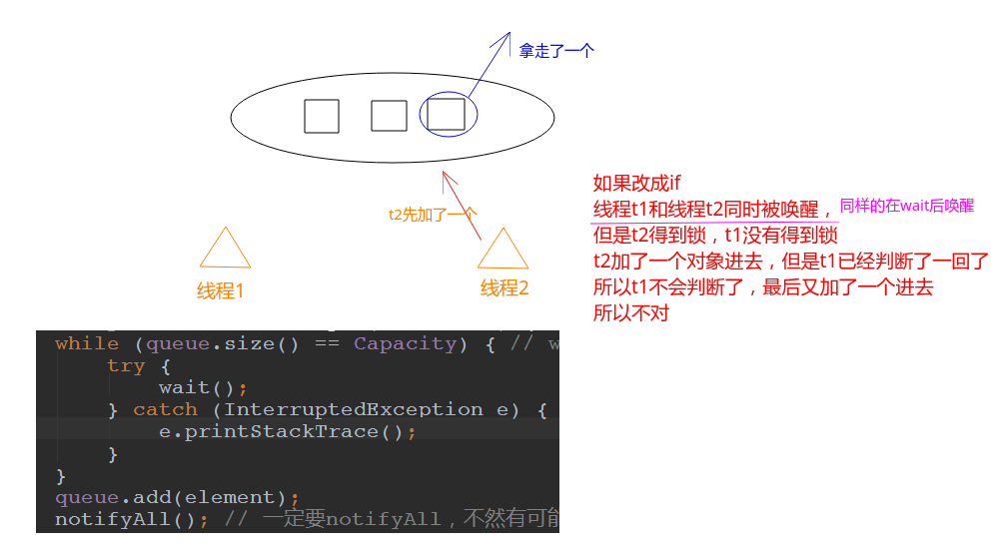
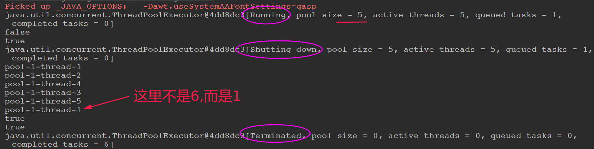
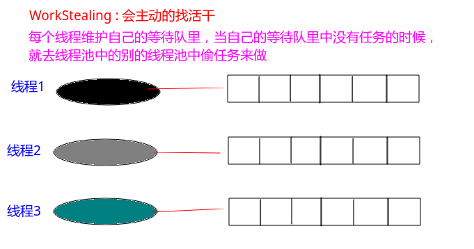
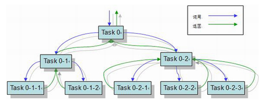
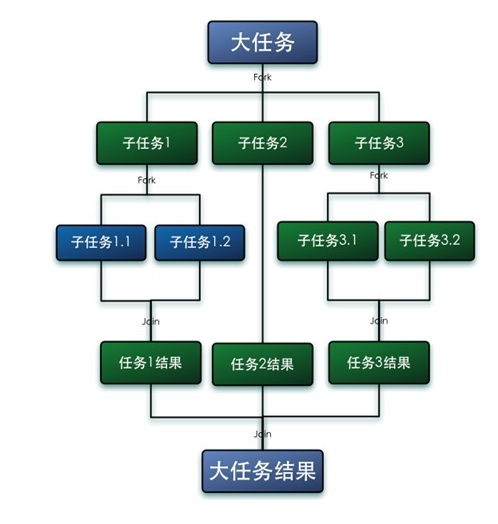
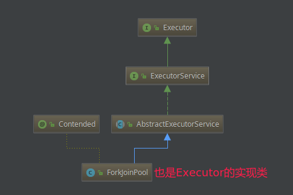
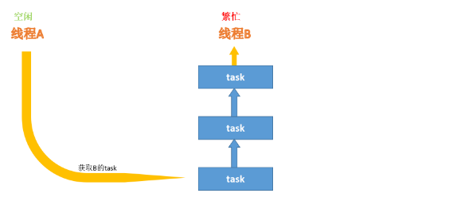
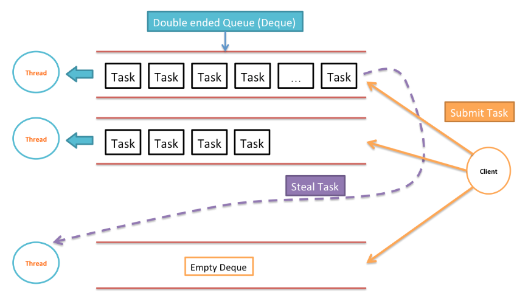

# Java多线程基础(二)

* [一、锁相关基础](#一锁相关基础)
* [二、并发容器](#二并发容器)
* [三、Executor线程池框架](#三executor线程池框架)

## 一、锁相关基础

### 1、对某个对象加锁

```java
/**
 * synchronized 对某个对象加锁,注意不是对某个代码块加锁
 */
public class T {

    private int count = 10;

    private Object o = new Object();

    public void m(){
        synchronized(o){ //o 指向了堆内存的一把锁
            count--;
            System.out.println(Thread.currentThread().getName() + "count = " + count);
        }
    }
}
```

### 2、对this对象加锁

```java
/**
 * synchronized 对this加锁，只要这个对象new了出来，就对自己加锁
 */
public class T {

    private int count = 10;

    public void m(){
        synchronized(this){// 任何线程想要执行下面的代码，必须要拿到this对象的锁
            count--;
            System.out.println(Thread.currentThread().getName() + "count = " + count);
        }
    }
}
```

上面程序的简写:

```java
/**
 * synchronized 对this加锁，只要这个对象new了出来，就对自己加锁
 */
public class T {

    private int count = 10;

    // 和c_002的程序等价, 等同于在方法执行的时候加上synchronized(this){
    // 锁定的是当前的对象
    public synchronized void m() {
        count--;
        System.out.println(Thread.currentThread().getName() + "count = " + count);
    }
}
```

### 3、对this对象的static方法加锁

```java
/**
 * synchronized 对this加锁，只要这个对象new了出来，就对自己加锁
 */
public class T {

    private static int count = 10;

    //这里等同于synchronized(thread.c_004.T.class)
    //反射，都是Class类的一个对象
    public synchronized static void m() {
        count--;
        System.out.println(Thread.currentThread().getName() + " count = " + count);
    }

    public static void mm() {
        synchronized(T.class) { //考虑一下这里写synchronized(this)是否可以？ --> 不可以，静态的属性和方法是和类一起的
            count --;
        }
    }
}
```

### 4、加锁之后的安全演示

```java
public class T implements Runnable {

    private int count = 10;

    // 如果不加 synchronized就会出现问题，因为我只有一个t(Thread)对象，有5个线程在同时访问count
    // 加了这个synchronized之后就可以了，锁住了当前的对象, synchronized代码块是原子操作
    public /*synchronized*/ void run() {
        count--;
        System.out.println(Thread.currentThread().getName() + " count = " + count);
    }

    public static void main(String[] args) {
        T t = new T();
        for(int i=0; i<5; i++) {
            new Thread(t, "THREAD" + i).start();
        }
    }
}
```

如果不加`synchronized`，程序可能不是按照`10、9、8、7、6`的顺序输出的。

### 5、同步方法和非同步方法可以被两个线程同时调用

```java
/**
 *  同步和非同步方法是否可以同时调用？ : 可以
 *  因为虽然对象被锁住了，但是m2不需要看那把锁
 */
public class T  {

    public synchronized void m1() {
        System.out.println(Thread.currentThread().getName() + " m1 start...");
        try {
            Thread.sleep(10000);
        } catch (InterruptedException e) {
            e.printStackTrace();
        }
        System.out.println(Thread.currentThread().getName() + " m1 end");
    }

    public void m2() {
        try {
            Thread.sleep(5000);
        } catch (InterruptedException e) {
            e.printStackTrace();
        }
        System.out.println(Thread.currentThread().getName() + " m2 ");
    }

    public static void main(String[] args){
        T t = new T();

        /*new Thread(()->t.m1(), "t1").start();
        new Thread(()->t.m2(), "t2").start();*/

        new Thread(t::m1, "t1").start(); //方法推导
        new Thread(t::m2, "t2").start();

        /*
        new Thread(new Runnable() {
            @Override
            public void run() {
                t.m1(); // 在run方法中调用了 m1()
            }
        });
        */
    }
}

```

输出:

```java
t1 m1 start...
t2 m2 
t1 m1 end
```

可以看到`t2`线程在`t1`线程调用`m1()`方法的同时，自己也调用了`m1()`方法。

即`t`对象虽然被锁住了。但是多个线程可以调用非同步的方法(调用`m2()`的时候不需要看那个锁)。

但是如果将`m2()`方法也加上`synchronized`，那执行结果就是下面这样了:(因为`synchronized`锁住的是对象)

```java
t1 m1 start...
t1 m1 end
t2 m2 
```

### 6、读和写都要加锁，不然容易产生脏读

```java
/**
 * 对业务写方法加锁
 * 对业务读方法不加锁
 * 容易产生脏读问题（dirtyRead） : 一开始读的数据和后面的不同
 */
public class Account {
    String name;
    double balance;

    public synchronized void set(String name, double balance) {
        this.name = name;

        // 加上下面的代码，只是为了演示问题的所在
        try {
            Thread.sleep(2000);
        } catch (InterruptedException e) {
            e.printStackTrace();
        }

        this.balance = balance;
    }

    // 如果不在下面的方法中加上synchronized，就会产生脏读的问题
    public /*synchronized*/ double getBalance() {
        return this.balance;
    }


    public static void main(String[] args) {
        Account account = new Account();
        new Thread(()->account.set("zhangsan", 100.0)).start();
        
        try {
            TimeUnit.SECONDS.sleep(1);
        } catch (InterruptedException e) {
            e.printStackTrace();
        }
        
        System.out.println(account.getBalance()); // 第一次获取，结果发现不正确
        
        try {
            TimeUnit.SECONDS.sleep(2);
        } catch (InterruptedException e) {
            e.printStackTrace();
        }
        
        System.out.println(account.getBalance());
    }
}
```

上面注释了`getBalance()`方法，程序输出如下，可以发现和预期的不同:

```java
0.0
100.0
```

### 7、synchronized获得的锁是可重入的

一个同步方法可以调用另外一个同步方法。

一个线程已经拥有某个对象的锁，再次申请的时候仍然会得到该对象的锁。

也就是说synchronized获得的锁是可重入的。

```java
/**
 * 一个同步方法可以调用另外一个同步方法:
 * 一个线程已经拥有某个对象的锁，再次申请的时候仍然会得到该对象的锁.
 * 也就是说synchronized获得的锁是可重入的
 */
public class T {

    synchronized void m1() {
        System.out.println("m1 start");
        try {
            TimeUnit.SECONDS.sleep(1);
        } catch (InterruptedException e) {
            e.printStackTrace();
        }
        m2();
    }

    synchronized void m2() {
        try {
            TimeUnit.SECONDS.sleep(2);
        } catch (InterruptedException e) {
            e.printStackTrace();
        }
        System.out.println("m2");
    }
}

```

### 8、子类也可以调用父类的同步方法

```java
/**
 *  这里是继承中有可能发生的情形，子类调用父类的同步方法，也是可以的(不会造成死锁)
 */
public class T {
    synchronized void m() {
        System.out.println("m start");
        try {
            TimeUnit.SECONDS.sleep(1);
        } catch (InterruptedException e) {
            e.printStackTrace();
        }
        System.out.println("m end");
    }

    public static void main(String[] args) {
        new TT().m();
    }
}


class TT extends T {
    @Override
    synchronized void m() {
        System.out.println("child m start");
        super.m(); // 在子类中调用父类的同步方法
        System.out.println("child m end");
    }
}
```

### 9、抛出异常后，锁就被释放

```java
/**
 * 线程抛出异常之后: 锁就会被释放
 *
 * 程序在执行过程中，如果出现异常，默认情况锁会被释放
 * 所以，在并发处理的过程中，有异常要多加小心，不然可能会发生不一致的情况。
 * 比如，在一个web app处理过程中，多个servlet线程共同访问同一个资源，这时如果异常处理不合适，
 * 在第一个线程中抛出异常，其他线程就会进入同步代码区，有可能会访问到异常产生时的数据。
 * 因此要非常小心的处理同步业务逻辑中的异常
 */
public class T {

    int count = 0;

    synchronized void m() {
        System.out.println(Thread.currentThread().getName() + " start");
        while(true) {
            count ++;
            System.out.println(Thread.currentThread().getName() + " count = " + count);

            try {
                TimeUnit.SECONDS.sleep(1);
            } catch (InterruptedException e) {
                e.printStackTrace();
            }
            
            if(count == 5) {
                int i = 1/0;  //此处抛出异常，锁将被释放，要想不被释放，可以在这里进行catch，然后让循环继续
                System.out.println(i);
            }
        }
    }


    // 如果没有t没有释放锁， t2应该是永远得不到执行，但是t1出现了异常，释放了锁，所以得到了执行
    public static void main(String[] args) throws InterruptedException {
        T t = new T();

        Runnable r = new Runnable() {
            @Override
            public void run() {
                t.m();
            }
            
        };
        new Thread(r, "t1").start();

        TimeUnit.SECONDS.sleep(3);

        new Thread(r, "t2").start();
    }
}

```

看程序输出，本来`t2`线程是永远得不到执行的，但是`t1`发生了异常，所以`t2`得到了执行。


### 10、volatile: 保证线程之间的可见性

下面的程序中，我们有一个全局变量`running`一开始是`true`，然后`t1`开始运行，然而我们在后面将`running`设置成了`true`，但是最后`t1`线程并没有结束，还是一直在运行，这是为什么呢?

```java
/**
 *
 * volatile: 保证线程之间的可见性
 *
 * volatile 关键字，使一个变量在多个线程间可见
 * A B线程都用到一个变量，java默认是A线程中保留一份copy，这样如果B线程修改了该变量，则A线程未必知道
 * 使用volatile关键字，会让所有线程都会读到变量的修改值 (不是说每次都要去读一遍，而是这个值有改动就重新读一下)
 *
 * 在下面的代码中，running是存在于堆内存的t对象中
 * 当线程t1开始运行的时候，会把running值从内存中读到t1线程的工作区，在运行过程中直接使用这个copy，并不会每次都去
 * 读取堆内存，这样，当主线程修改running的值之后，t1线程感知不到，所以不会停止运行
 *
 * 使用volatile，将会强制所有线程都去堆内存中读取running的值 (不会读缓存的内容)
 * 可以阅读这篇文章进行更深入的理解
 * http://www.cnblogs.com/nexiyi/p/java_memory_model_and_thread.html
 * volatile并不能保证多个线程共同修改running变量时所带来的不一致问题，也就是说volatile不能替代synchronized(既有可见性，又有原子性)
 * volatile比synchronized: 轻量级
 */

public class T {

    //对比一下有无volatile的情况下，整个程序运行结果的区别
    /*volatile*/ boolean running = true;   // volatile，可以保证每次都是从内存读，读完之后就写到内存(缓存),内存可见性，禁止指令重排
    void m() {
        System.out.println("m start");

        while(running) {

            // 虽然加了下面的代码（或者别的代码，可以结束程序(和volatile)一样的结果，但是还是要加volatile，因为下面的是随机性的）
    //			try {
    //				TimeUnit.MILLISECONDS.sleep(10);
    //			} catch (InterruptedException e) {
    //				e.printStackTrace();
    //			}
        }

        System.out.println("m end!");
    }

    public static void main(String[] args) {
        T t = new T();
        
        new Thread(t::m, "t1").start();
    //		new Thread(()->t.m(), "t1").start();
        
        try {
            TimeUnit.SECONDS.sleep(1);
        } catch (InterruptedException e) {
            e.printStackTrace();
        }
        
        t.running = false;
    }
}
```

这是因为在`main`线程和`t1`线程虽然共享了`running`变量，但是当`main`线程修改了`running`变量之后，`t1`并没有收到这个最新的已经更改的信息。

因为这两个线程，在一开始得到`running = true`的时候，会存在自己线程的缓冲区。

下一次就直接在缓存中拿，所以当`main`线程更改之后，`t1`并不知道。

要解决上面的问题，要使用`volatile`关键字，当别的线程更改变量之后，会通知别的用到的线程。

### 11、volatile: 不保证线程之间的原子性

`volatile`虽然保证了线程之间的可见性，但是确不能保证线程之间的原子性。

比如下面的程序:

```java
/**
 * volatile并不能保证多个线程共同修改running变量时所带来的不一致问题，也就是说volatile不能替代synchronized
 * 运行下面的程序，并分析结果 : 虽然某个线程修改了值之后，另外的线程会马上知道，但是不能保证原子性(同时的改)
 */
public class T {

    volatile int count = 0;

    void m() {
        for(int i=0; i<10000; i++) count++;
    }

    // 下面的程序预期输出是 100000，但是实际上达不到 100000
    public static void main(String[] args) {
        T t = new T();
        
        List<Thread> threads = new ArrayList<>();
        
        for(int i=0; i<10; i++) {
            threads.add(new Thread(t::m, "thread-"+i));
        }
        
        threads.forEach((o)->o.start());
        
        threads.forEach((o)->{
            try {
                o.join();
            } catch (InterruptedException e) {
                e.printStackTrace();
            }
        });
        
        System.out.println(t.count);
    }
}
```

我们期望的输出是`100000`，但是实际上达不到`100000`，因为`volitile`虽然能保证可见性，但是不能保证原子性。

所以还是需要在`m()`方法上加上`synchronized`：

```java
import java.util.ArrayList;
import java.util.List;

/**
 * 对比上一个程序，可以用synchronized解决，synchronized可以保证可见性和原子性，volatile只能保证可见性
 */
public class T {
    /*volatile*/ int count = 0;

    synchronized void m() {
        for (int i = 0; i < 10000; i++)
            count++;
    }

    // 这次程序运行结果就一定是 100000
    public static void main(String[] args) {
        T t = new T();

        List<Thread> threads = new ArrayList<>();

        for (int i = 0; i < 10; i++) {
            threads.add(new Thread(t::m, "thread-" + i));
        }

        threads.forEach((o) -> o.start());
        threads.forEach((o) -> {
            try {
                o.join();
            } catch (InterruptedException e) {
                e.printStackTrace();
            }
        });

        System.out.println(t.count);
    }
}
```

### 12、AtomicXXX类高效的解决原子性问题

上面给`m()`方法加上了`synchronized`虽然解决了原子性问题，但是性能不好。

JDK提供了一些现成的类，里面的方法都是原子性操作的。这样我们就不需要加`synchronized`，这样性能更好。

```java
/**
 * 解决同样上一个程序问题的更高效的方法，使用AtomXXX类
 * AtomXXX类本身方法都是原子性的，但不能保证多个方法连续调用是原子性的
 */
public class T {
    /*volatile*/ //int count = 0;

    
    AtomicInteger count = new AtomicInteger(0);

    /*synchronized*/ void m() {
        for (int i = 0; i < 10000; i++)
            //if count.get() < 1000  // 两个Atom类的方法之间还是不具备原子性
            count.incrementAndGet(); //等同于count++, 但是这个是原子性的
    }

    public static void main(String[] args) {
        T t = new T();

        List<Thread> threads = new ArrayList<Thread>();

        for (int i = 0; i < 10; i++) {
            threads.add(new Thread(t::m, "thread-" + i));
        }

        threads.forEach((o) -> o.start());
        threads.forEach((o) -> {
            try {
                o.join();
            } catch (InterruptedException e) {
                e.printStackTrace();
            }
        });

        System.out.println(t.count);
    }
}
```

### 13、在synchronized内的代码越少越好

比较下面的代码，显然`m2()`的实现比`m1()`更好，`synchronized`是重量级对象，所以尽量包含更少的代码:

```java
/**
 * synchronized优化
 * 同步代码块中的语句越少越好
 * 比较m1和m2
 */
public class T {

    int count = 0;

    synchronized void m1() {
        //do sth need not sync
        try {
            TimeUnit.SECONDS.sleep(2);
        } catch (InterruptedException e) {
            e.printStackTrace();
        }

        //业务逻辑中只有下面这句需要sync，这时不应该给整个方法上锁
        count++;

        //do sth need not sync
        try {
            TimeUnit.SECONDS.sleep(2);
        } catch (InterruptedException e) {
            e.printStackTrace();
        }
    }

    void m2() {
        //do sth need not sync
        try {
            TimeUnit.SECONDS.sleep(2);
        } catch (InterruptedException e) {
            e.printStackTrace();
        }

        //业务逻辑中只有下面这句需要sync，这时不应该给整个方法上锁
        //采用细粒度的锁，可以使线程争用时间变短，从而提高效率
        synchronized(this) {
            count ++;
        }

        //do sth need not sync
        try {
            TimeUnit.SECONDS.sleep(2);
        } catch (InterruptedException e) {
            e.printStackTrace();
        }
    }
}
```

### 14、某个引用指向的对象改变，则原先对象的锁就释放了

某个对象的锁指的是在堆内对象的所，而不是在栈中引用的锁，所以当栈内的引用指向了堆的别的对象，那么原来的对象的锁就不存在了。

看实例演示:

```java
/**
 * 锁是所在堆内存中，而不是栈内存中，当某个引用指向了别的地方，原先那个被指向的对象的锁就释放了
 * 即:
 * 锁定某对象o，如果o的属性发生改变，不影响锁的使用
 * 但是如果o变成另外一个对象，则锁定的对象发生改变
 * 应该避免将锁定对象的引用变成另外的对象
 */
public class T {
    Object o = new Object();

    void m() {
        synchronized(o) {
            while(true) {
                try {
                    TimeUnit.SECONDS.sleep(1);
                } catch (InterruptedException e) {
                    e.printStackTrace();
                }
                System.out.println(Thread.currentThread().getName());
            }
        }
    }

    public static void main(String[] args) {
        T t = new T();
        //启动第一个线程
        new Thread(t::m, "t1").start();
        
        try {
            TimeUnit.SECONDS.sleep(3);
        } catch (InterruptedException e) {
            e.printStackTrace();
        }

        //创建第二个线程
        Thread t2 = new Thread(t::m, "t2");
        //锁对象发生改变(指向了别的地方)，然后t1的锁就释放了, 所以t2线程得以执行，如果注释掉下面这句话，线程2将永远得不到执行机会
        t.o = new Object();
        t2.start();
    }
}
```

### 15、不要以常量作为锁定对象

```java
/**
 * 不要以字符串常量作为锁定对象
 * 在下面的例子中，m1和m2其实锁定的是同一个对象
 * 这种情况还会发生比较诡异的现象，比如你用到了一个类库，在该类库中代码锁定了字符串“Hello”，
 * 但是你读不到源码，所以你在自己的代码中也锁定了"Hello",这时候就有可能发生非常诡异的死锁阻塞，
 * 因为你的程序和你用到的类库不经意间使用了同一把锁
 *
 * jetty 曾经就有一个这样的bug
 */
public class T {

	// 这两个对象是同一个对象, 所以下面的两个方法锁定了同一个对象，就有可能产生死锁
    String s1 = "Hello";
    String s2 = "Hello";

    void m1() {
        synchronized(s1) {
        }
    }

    void m2() {
        synchronized(s2) {
            
        }
    }
}
```

### 16、实现一个容器监控另一个容器

实现一个容器，提供两个方法，`add`，`size `                                     

写两个线程，线程`1`添加`10`个元素到容器中，线程`2`实现监控元素的个数，当个数到`5`个时，线程`2`给出提示并结束。 

先看初步版本:

分析下面这个程序，能完成这个功能吗？
答: 不能，因为虽然 `t2`线程 和` t1`线程的共享变量 list不是内存可见的(没有加` volatile`关键字)


```java
/**
 * 分析下面这个程序，能完成这个功能吗？
 * 答: 不能，因为虽然 t2线程 和 t1线程的共享变量 list不是内存可见的(没有加 volatile关键字)
 */
public class MyContainer1 {

    List<Integer>list = new ArrayList<>();

    public void add(Integer o) {
        list.add(o);
    }

    public int size() {
        return list.size();
    }

    public static void main(String[] args) {
        MyContainer1 c = new MyContainer1();

        new Thread(() -> {
            for(int i=0; i<10; i++) {
                c.add(i);
                System.out.println("add " + i);
                
                try {
                    TimeUnit.SECONDS.sleep(1);
                } catch (InterruptedException e) {
                    e.printStackTrace();
                }
            }
        }, "t1").start();

        new Thread(() -> {
            while(true) {
                if(c.size() == 5) {
                    break;
                }
            }
            System.out.println("t2 结束");
        }, "t2").start();
    }
}
```

解决上面问题的方法就是在`list`前面加上一个` volatile`关键字即可。

但是，还有一个问题，`t2`线程的死循环很浪费cpu，如果不用死循环，该怎么做呢？

这里使用wait和notif机制，wait会释放锁，而notify不会释放锁:

* 需要注意的是: 运用这种方法，必须要保证t2先执行，也就是首先让t2监听才可以；

阅读下面的程序，并分析输出结果
可以读到输出结果并不是size=5时t2退出，而是t1结束时t2才接收到通知而退出
想想这是为什么？

答: 因为notify不会放弃锁，所以最后程序结果不对，因为这个没有放弃锁，所以t2得不到执行。

```java
public class MyContainer3 {

    // 添加volatile，使t2能够得到通知
    volatile List<Integer> list = new ArrayList<>();

    public void add(Integer o) {
        list.add(o);
    }

    public int size() {
        return list.size();
    }

    public static void main(String[] args) {
        MyContainer3 c = new MyContainer3();

        final Object lock = new Object();// 随便创建一个锁

        new Thread(() -> {
            synchronized (lock) {
                System.out.println("t2启动");
                if (c.size() != 5) {
                    try {
                        lock.wait(); // 放入条件等待队列，放弃当前锁, 被阻塞
                    } catch (InterruptedException e) {
                        e.printStackTrace();
                    }
                }
                System.out.println("t2 结束");
            }

        }, "t2").start();

        try {
            TimeUnit.SECONDS.sleep(1);
        } catch (InterruptedException e1) {
            e1.printStackTrace();
        }

        new Thread(() -> {
            System.out.println("t1启动");
            synchronized (lock) {
                for (int i = 0; i < 10; i++) {
                    c.add(i);
                    System.out.println("add " + i);

                    if (c.size() == 5) {
                        lock.notify(); // 不会放弃当前锁，所以最后程序结果不对，因为这个没有放弃锁，所以t2得不到执行
                    }

                    try {
                        TimeUnit.SECONDS.sleep(1);
                    } catch (InterruptedException e) {
                        e.printStackTrace();
                    }
                }
            }
        }, "t1").start();
    }
}
```

解决办法:

* `notify`之后，`t1`必须释放锁，`t2`退出后，也必须`notify`，通知`t1`继续执行；
* 整个通信过程比较繁琐；

```java
public class MyContainer4 {

    //添加volatile，使t2能够得到通知
    volatile List<Integer> list = new ArrayList<>();

    public void add(Integer o) {
        list.add(o);
    }

    public int size() {
        return list.size();
    }

    public static void main(String[] args) {
        MyContainer4 c = new MyContainer4();

        final Object lock = new Object();

        new Thread(() -> {
            synchronized (lock) {
                System.out.println("t2启动");
                if (c.size() != 5) {
                    try {
                        lock.wait();
                    } catch (InterruptedException e) {
                        e.printStackTrace();
                    }
                }
                System.out.println("t2 结束");
                //t1释放锁之后，我t2得到了执行，最后我还要通知t1继续执行
                lock.notify();
            }

        }, "t2").start();

        try {
            TimeUnit.SECONDS.sleep(1);
        } catch (InterruptedException e1) {
            e1.printStackTrace();
        }

        new Thread(() -> {
            System.out.println("t1启动");
            synchronized (lock) {
                for (int i = 0; i < 10; i++) {
                    c.add(i);
                    System.out.println("add " + i);

                    if (c.size() == 5) {
                        lock.notify();
                        //再加一个wait(), ---> 释放锁，让t2得以执行
                        try {
                            lock.wait();
                        } catch (InterruptedException e) {
                            e.printStackTrace();
                        }
                    }
                    try {
                        TimeUnit.SECONDS.sleep(1);
                    } catch (InterruptedException e) {
                        e.printStackTrace();
                    }
                }
            }
        }, "t1").start();
    }
}
```

更高效的方式:

* 使用Latch（门闩）替代wait notify来进行通知；
* 好处是通信方式简单，同时也可以指定等待时间；
* 使用`await()`和`countdown()`方法替代wait和notify；
* CountDownLatch**不涉及锁定**(这是和上面不同的，这比上面高效)， 当count的值为零时当前线程继续运行(`new CountDownCatch(count)`)；
* **当不涉及同步，只是涉及线程通信的时候，用`synchronized + wait/notify`就显得太重了**；
* 这时应该考虑countdownlatch/cyclicbarrier/semaphore

代码:

```java
public class MyContainer5 {

    //添加volatile，使t2能够得到通知
    volatile List<Integer> list = new ArrayList<>();

    public void add(Integer o) {
        list.add(o);
    }

    public int size() {
        return list.size();
    }

    public static void main(String[] args) {
        MyContainer5 c = new MyContainer5();

        CountDownLatch latch = new CountDownLatch(1);

        new Thread(() -> {
            System.out.println("t2启动");
            if (c.size() != 5) {
                try {
                    latch.await();
                    //也可以指定等待时间
                    //latch.await(5000, TimeUnit.MILLISECONDS);
                } catch (InterruptedException e) {
                    e.printStackTrace();
                }
            }
            System.out.println("t2 结束");
        }, "t2").start();

        try {
            TimeUnit.SECONDS.sleep(1);
        } catch (InterruptedException e1) {
            e1.printStackTrace();
        }

        new Thread(() -> {
            System.out.println("t1启动");
            for (int i = 0; i < 10; i++) {
                c.add(i);
                System.out.println("add " + i);

                if (c.size() == 5) {
                    // 打开门闩，让t2得以执行
                    latch.countDown(); // 调用一次countDown，构造函数中构造的那个值就-1，到了0，门栓就开了(通知t2运行)
                }
                try {
                    TimeUnit.SECONDS.sleep(1);
                } catch (InterruptedException e) {
                    e.printStackTrace();
                }
            }

        }, "t1").start();
    }
}
```

### 17、ReentrantLock的相关知识

#### 1)、用ReentrantLock替代synchronized

下面先给一个用synchronized实现同步的程序。然后演示用`ReentrantLock`来替代它。

```java
/**
 * ReentrantLock用于替代synchronized
 * 本例中由于m1锁定this,只有m1执行完毕的时候,m2才能执行: 这里是复习synchronized最原始的语义
 */
public class TestReentrantLock1 {

    synchronized void m1(){
        for(int i = 0; i < 10; i++){
            try {
                TimeUnit.SECONDS.sleep(1);
            } catch (InterruptedException e) {
                e.printStackTrace();
            }
            System.out.println(i);
        }
    }

    synchronized void m2(){
        System.out.println("m2...");
    }

    public static void main(String[] args) throws InterruptedException {
        TestReentrantLock1 r1 = new TestReentrantLock1();
        new Thread(() -> r1.m1(), "t1").start();

        TimeUnit.SECONDS.sleep(1);

        new Thread(() -> r1.m2(), "t2").start(); // m2必须要等待t1的m1执行完
    }
}
```

用`ReentrantLock`替代`synchronized`的功能:

```java
/**
 * 使用ReentrantLock可以完成同样的功能
 * 需要注意的是，必须要必须要必须  要手动释放锁（重要的事情说三遍）
 * 使用syn锁定的话如果遇到异常，jvm会自动释放锁，但是lock必须手动释放锁，因此经常在finally中进行锁的释放
 */

public class TestReentrantLock2 {

    Lock lock = new ReentrantLock(); // 注意这是JDK里面的

    void m1() {
        try {
            lock.lock(); // 相当于synchronized(this);
            for (int i = 0; i < 10; i++) {
                TimeUnit.SECONDS.sleep(1);
                System.out.println(i);
            }
        } catch (InterruptedException e) {
            e.printStackTrace();
        } finally {
            lock.unlock(); // 这个释放锁一定要在finally中, 如果发生异常就会释放，否则如果没有手动释放,m2永远得不到执行
        }
    }

    // 没有加synchronized
    void m2() {
        lock.lock();
        System.out.println("m2...");
        lock.unlock();
    }

    public static void main(String[] args) throws InterruptedException {
        TestReentrantLock2 r1 = new TestReentrantLock2();
        new Thread(() -> r1.m1(), "t1").start();

        TimeUnit.SECONDS.sleep(1);

        new Thread(() -> r1.m2(), "t2").start(); // m2必须要等待t1的m1执行完
    }
}
```

#### 2)、ReentrantLock的tryLock功能

```java
/**
 * 使用reentrantlock可以进行“尝试锁定”tryLock。
 * 这样无法锁定，或者在指定时间内无法锁定，线程可以决定是否继续等待
 */

public class TestReentrantLock3 {

    Lock lock = new ReentrantLock(); // 注意这是JDK里面的

    void m1() {
        try {
            lock.lock(); // 相当于synchronized(this);
            for (int i = 0; i < 10; i++) {
                TimeUnit.SECONDS.sleep(1);
                System.out.println(i);
            }
        } catch (InterruptedException e) {
            e.printStackTrace();
        } finally {
            lock.unlock(); // 这个释放锁一定要在finally中, 如果发生异常就会释放，否则如果没有手动释放,m2永远得不到执行
        }
    }


    /**
     * 使用tryLock进行尝试锁定，不管锁定与否，方法都将继续执行: 可以先去做边的事，不像synchronized一样死等着
     * 可以根据tryLock的返回值来判定是否锁定
     * 也可以指定tryLock的时间，由于tryLock(time)抛出异常，所以要注意unclock的处理，必须放到finally中
     */
    void m2() {
        boolean success = false;
        while(!success) {
            success = lock.tryLock(); //尝试获取锁，如果获取到了返回true
//            success = lock.tryLock(5, TimeUnit.SECONDS); //等待5秒，如果5秒还没有，我该干啥就干啥
            if(success) {
                System.out.println("                                                                                                                                    m2... ");
                lock.unlock();
                break;
            }
        }
    }

    public static void main(String[] args) throws InterruptedException {
        TestReentrantLock3 r1 = new TestReentrantLock3();
        new Thread(() -> r1.m1(), "t1").start();

        TimeUnit.SECONDS.sleep(1);

        new Thread(() -> r1.m2(), "t2").start(); // m2必须要等待t1的m1执行完
    }
}
```

#### 3)、ReentrantLock的lockInterruptibly()方法可以对interrupt做出响应

注意这里t2线程没有获取到锁的话就不要`unlock`，不然会报异常，但是我这里没有很好分情况的解决，只是注释了`unlock()`。

```java
/**
 * 使用ReentrantLock还可以调用lockInterruptibly方法，可以对线程interrupt方法做出响应，
 * 在一个线程等待锁的过程中，可以被打断
 */

public class TestReentrantLock4 {

    public static void main(String[] args){
        Lock lock = new ReentrantLock();

        Thread t1 = new Thread(()->{
            try {
                lock.lock();
                System.out.println("t1 start");
                TimeUnit.SECONDS.sleep(Integer.MAX_VALUE); // 一直占有这把锁
                System.out.println("t1 end");
            } catch (InterruptedException e) {
                System.out.println("interrupted!");
            } finally {
                lock.unlock();
            }
        });
        t1.start();

        Thread t2 = new Thread(()->{

            try {
                //lock.lock();
                lock.lockInterruptibly(); //  可以对interrupt()方法做出响应
                System.out.println("t2 start");
                TimeUnit.SECONDS.sleep(5);
                System.out.println("t2 end");
            } catch (InterruptedException e) {
                System.out.println("interrupted!");
            } finally {
//                lock.unlock();  //这里会抛异常，因为我没有获取到锁，肯定不能unlock
            }
        });
        t2.start();

        try {
            TimeUnit.SECONDS.sleep(1);
        } catch (InterruptedException e) {
            e.printStackTrace();
        }
        t2.interrupt(); //打断线程2的等待, 就是告诉t2，你别等了，t1要这么久，再怎么等也没用
    }
}
```

#### 4)、ReentrantLock可以实现公平锁

公平锁，就是当对象释放锁的时候，其他需要拿到锁的线程中，等的最久的那个会先拿到锁。

```java
/**
 * ReentrantLock还可以指定为公平锁
 * 就是等的越久的就越先拿到锁
 */
public class TestReentrantLock5 extends Thread{

    private static ReentrantLock lock = new ReentrantLock(true); //参数为true表示为公平锁，请对比输出结果

    public void run() {
        for(int i = 0 ;i < 100; i++) {
            lock.lock();
            try{
                System.out.println(Thread.currentThread().getName()+"获得锁");
            }finally{
                lock.unlock();
            }
        }
    }
    public static void main(String[] args) {
        TestReentrantLock5 rl = new TestReentrantLock5();
        Thread th1 = new Thread(rl);
        Thread th2 = new Thread(rl);
        th1.start();
        th2.start();
    }
}
```

### 18、实现生产者消费者同步容器

使用`wait()`和`notify()`实现:

几点注意:

* `wait()`一般和`while`放在一起使用，具体原因如下图。

* 每次都是`notifyAll()`而不是`notify()`，因为`notify()`是通知任意一个线程，有可能通知不到**生产者/消费者**，所以需要`notifyAll()`。



代码:s

```java
import java.util.ArrayDeque;
import java.util.Queue;

public class MyBlockingQueue1<E> {
    private Queue<E> queue = null;
    private int Capacity;

    public MyBlockingQueue1(int capacity) {
        this.Capacity = capacity;
        queue = new ArrayDeque<>(capacity);
    }

    public synchronized void put(E element) {
        while (queue.size() == Capacity) { // wait和while一般在一起使用(effective java中提到)
            try {
                wait();
            } catch (InterruptedException e) {
                e.printStackTrace();
            }
        }
        queue.add(element);
        notifyAll(); // 一定要notifyAll，不然有可能会通知不到 消费者 
    }

    public synchronized E take() {
        while (queue.isEmpty()) {
            try {
                wait();
            } catch (InterruptedException e) {
                e.printStackTrace();
            }
        }
        E e = queue.poll();
        notifyAll();
        return e;
    }

    public static void main(String[] args) {
        MyBlockingQueue1<Integer> blockingQueue = new MyBlockingQueue1<>(15);

        // 生产者不停的生产
        new Thread(new Runnable() {
            @Override
            public void run() {
                int num = 0;
                try {
                    while (true) {
                        blockingQueue.put(num);
                        System.out.println("produce put: " + num);
                        num++;
                        Thread.sleep((int) (Math.random() * 100));
                    }
                } catch (InterruptedException e) {
                    e.printStackTrace();
                }
            }
        }, "P").start();

        // 消费者，不停的拿
        new Thread(new Runnable() {
            @Override
            public void run() {
                try {
                    while (true) {
                        Integer num = blockingQueue.take();
                        System.out.println("customer take: " + num);
                        Thread.sleep((int) (Math.random() * 100));
                    }
                } catch (InterruptedException e) {
                    e.printStackTrace();
                }
            }
        }, "C").start();
    }
}
```

使用`ReentrantLock`和`Condition`实现:

```java
public class MyBlockingQueue2<E> {
    private Queue<E> queue = null;
    private int Capacity;

    private Lock lock = new ReentrantLock();
    private Condition prodCondi = lock.newCondition();
    private Condition consCondi = lock.newCondition();

    public MyBlockingQueue2(int capacity) {
        this.Capacity = capacity;
        queue = new ArrayDeque<>(capacity);
    }

    public synchronized void put(E element) {
        try {
            lock.lock();
            while (queue.size() == Capacity) {
                prodCondi.await(); // 等同于 wait()
            }
            queue.add(element);
            consCondi.signalAll(); // 具体的通知，不像notifyAll通知所有的
        }catch (InterruptedException e) {
            e.printStackTrace();
        }finally {
            lock.unlock();
        }
    }

    public synchronized E take() {
        E element = null;
        try {
            lock.lock();
            while (queue.isEmpty()) {
                consCondi.await();
            }
            element = queue.poll();
            prodCondi.signalAll(); // 具体的通知，不像notifyAll通知所有的
        }catch (InterruptedException e) {
            e.printStackTrace();
        }finally {
            lock.unlock();
        }
        return element;
    }

    public static void main(String[] args) {
        MyBlockingQueue2<Integer> blockingQueue = new MyBlockingQueue2<>(15);

        // 生产者不停的生产
        new Thread(new Runnable() {
            @Override
            public void run() {
                int num = 0;
                try {
                    while (true) {
                        blockingQueue.put(num);
                        System.out.println("produce put: " + num);
                        num++;
                        Thread.sleep((int) (Math.random() * 100));
                    }
                } catch (InterruptedException e) {
                    e.printStackTrace();
                }
            }
        }, "P").start();

        // 消费者，不停的拿
        new Thread(new Runnable() {
            @Override
            public void run() {
                try {
                    while (true) {
                        Integer num = blockingQueue.take();
                        System.out.println("customer take: " + num);
                        Thread.sleep((int) (Math.random() * 100));
                    }
                } catch (InterruptedException e) {
                    e.printStackTrace();
                }
            }
        }, "C").start();
    }
}
```

### 19、ThreadLocal线程局部变量(空间换时间)

使用volatile可以实现 不同线程之间变量的可见性，但是我如果就是不要两个线程互相看到呢?

```java
public class ThreadLocal1 {

	// 使用volatile可以实现 不同线程之间变量的可见性，但是我如果就是不要两个线程互相看到呢?
    volatile static Person p = new Person();

    public static void main(String[] args) {
                
        new Thread(()->{
            try {
                TimeUnit.SECONDS.sleep(2);
            } catch (InterruptedException e) {
                e.printStackTrace();
            }
            
            System.out.println(p.name);
        }).start();
        
        new Thread(()->{
            try {
                TimeUnit.SECONDS.sleep(1);
            } catch (InterruptedException e) {
                e.printStackTrace();
            }
            p.name = "lisi";
        }).start();

    }
	static class Person {
		String name = "zhangsan";
	}
}
```

用`ThreadLocal`可以实现两个线程的局部变量互不影响:

```java
public class ThreadLocal2 {

    //volatile static Person p = new Person();
    static ThreadLocal<Person> tl = new ThreadLocal<>(); // 这个就是在每一个线程里面都有一份独立的变量不会影响

    public static void main(String[] args) {
                
        new Thread(()->{
            try {
                TimeUnit.SECONDS.sleep(2);
            } catch (InterruptedException e) {
                e.printStackTrace();
            }
            
            System.out.println(tl.get());
        }).start();
        
        new Thread(()->{
            try {
                TimeUnit.SECONDS.sleep(1);
            } catch (InterruptedException e) {
                e.printStackTrace();
            }
            tl.set(new Person());
        }).start(); 
    }

    static class Person {
        String name = "zhangsan";
    }
}
```

## 二、并发容器

### 1、引入并发容器

引出并发容器。

案例: 模拟售票。

```java
/**
 * 有N张火车票，每张票都有一个编号
 * 同时有10个窗口对外售票
 * 请写一个模拟程序
 *
 * 分析下面的程序可能会产生哪些问题？
 * 重复销售？超量销售？
 * 有时候会造成 ArrayIndexOutOfBoundsException
 */
public class TicketSeller1 {

    static List<String> tickets = new ArrayList<>();

    static {
        for(int i = 1; i <= 10000; i++)
            tickets.add("票编号: " + i);
    }

    public static void main(String[] args){
        for(int i = 0; i < 10; i++){
            new Thread(() -> {
                while(tickets.size() > 0){
                    System.out.println("销售了 -- " + tickets.remove(0));
                }
            }).start();
        }
    }
}
```

所以对应的就有一个`Vector`容器，可以防止并发问题。

但是`Vector`还是存在问题，因为虽然单个方法是原子性的，但是两个方法之间不是原子性的。

```java
/**
 * 使用Vector或者Collections.synchronizedXXX
 * 分析一下，这样能解决问题吗？
 * 　答: 还是可能造成问题，因为 tickets.size()方法和下面的tickets.remove()方法并不是同步的(原子性的)
 */
public class TicketSeller2 {

    static Vector<String> tickets = new Vector<>();

    static {
        for(int i = 1; i <= 10000; i++)
            tickets.add("票编号: " + i);
    }

    public static void main(String[] args){
        for(int i = 0; i < 10; i++){
            new Thread(() -> {
                while(tickets.size() > 0){

                    // 像如果加了下面这段话，程序就还是会出问题
//                    try {
//                        TimeUnit.MILLISECONDS.sleep(10);
//                    } catch (InterruptedException e) {
//                        e.printStackTrace();
//                    }

                    System.out.println("销售了 -- " + tickets.remove(0));
                }
            }).start();
        }
    }
}
```

使用`synchronized`锁定`ticket.size()`和`tickets.remove`:

```java
/**
 * 就算操作A和B都是同步的，但A和B组成的复合操作也未必是同步的，仍然需要自己进行同步
 * 就像这个程序，判断size和进行remove必须是一整个的原子操作
 * 可以用synchronized锁定，但是这样太慢了
 * Java为我们提供了容器
 */
public class TicketSeller3 {

    static Vector<String> tickets = new Vector<>();

    static {
        for(int i = 1; i <= 10000; i++)
            tickets.add("票编号: " + i);
    }

    public static void main(String[] args){
        for(int i = 0; i < 10; i++){

            new Thread(() ->{
                while(true){
                    synchronized (tickets){
                        if(tickets.size() <= 0)break;

                        // 即使这里要操作一段时间也不会有问题
                        try {
                            TimeUnit.MILLISECONDS.sleep(10);
                        } catch (InterruptedException e) {
                            e.printStackTrace();
                        }
                        System.out.println("销售了 -- " + tickets.remove(0));
                    }
                }
            }).start();
        }
    }
}
```

更好的方法是使用JDK提供的并发容器:

```java
/**
 * 使用ConcurrentQueue提高并发性
 */
public class TicketSeller4 {

    static Queue<String> tickets = new ConcurrentLinkedQueue<>();

    static {
        for(int i = 1; i <= 10000; i++)
            tickets.add("票编号: " + i);
    }

    public static void main(String[] args){
        for(int i = 0; i < 10; i++){

            new Thread(() ->{
                while(true){
                    String poll = tickets.poll(); // 因为是先取出来了

                    // 假如这里被打断了，大不了我再拿一遍，拿一个空值出来
                    if(poll == null) // 因为
                        break;
                    else
                        System.out.println("销售了 -- " + poll);
                }
            }).start();
        }
    }
}
```

### 2、JDK并发容器

先看`HashTable`和`ConcurrentHashMap` (支持并发)的性能对比:

```java
import java.util.*;
import java.util.concurrent.ConcurrentHashMap;
import java.util.concurrent.ConcurrentSkipListMap;
import java.util.concurrent.CountDownLatch;

/**
 * http://blog.csdn.net/sunxianghuang/article/details/52221913
 * 阅读concurrentskiplistmap
 */
public class CC_01_ConcurrentMap {

    public static void main(String[] args) {
        Map<String, String> map = new ConcurrentHashMap<>();  //高并发 (里面是分段的，将大锁分成了小锁)
//        Map<String, String> map = new ConcurrentSkipListMap<>(); //高并发并且排序

//        Map<String, String> map = new Hashtable<>();
        //Map<String, String> map = new HashMap<>(); //要通过Collections.synchronizedXXX才能得到同步容器
        //TreeMap

        Random rnd = new Random();
        Thread[] ths = new Thread[100];
        CountDownLatch latch = new CountDownLatch(ths.length);
        long start = System.currentTimeMillis();

        for (int i = 0; i < ths.length; i++) {
            ths[i] = new Thread(() -> {
                for (int j = 0; j < 10000; j++) map.put("a" + rnd.nextInt(100000), "a" + rnd.nextInt(100000));
                latch.countDown();
            });
        }
        Arrays.asList(ths).forEach(t -> t.start());
        try {
            latch.await(); //等待100个线程结束
        } catch (InterruptedException e) {
            e.printStackTrace();
        }

        long end = System.currentTimeMillis();
        System.out.println(end - start);
    }
}
```


关于`CopyOnWriteList`:

```java
/**
 * 写时复制容器 copy on write
 * 多线程环境下，写时效率低，读时效率高
 * 适合写少读多的环境
 */
public class CC_02_CopyOnWriteList {

    public static void main(String[] args) {
        List<String> lists =
                //new ArrayList<>(); //这个会出并发问题！
                //new Vector(); //读的时候要加锁
                new CopyOnWriteArrayList<>(); //好处就是读的时候不要加锁

        Random r = new Random();
        Thread[] ths = new Thread[100];
        for (int i = 0; i < ths.length; i++) {
            Runnable task = new Runnable() {
                @Override
                public void run() {
                    for (int i = 0; i < 1000; i++) lists.add("a" + r.nextInt(10000));
                }
            };
            ths[i] = new Thread(task);
        }

        // 启动这些线程，并且使用main.join来等待结束
        runAndComputeTime(ths);

        System.out.println(lists.size());
    }

    static void runAndComputeTime(Thread[] ths) {
        long s1 = System.currentTimeMillis();

        Arrays.asList(ths).forEach(t -> t.start());
        Arrays.asList(ths).forEach(t -> {
            try {
                t.join();
            } catch (InterruptedException e) {
                e.printStackTrace();
            }
        });

        long s2 = System.currentTimeMillis();
        System.out.println(s2 - s1);
    }
}
```

使用`LinkeBlockingQueue`实现生产者消费者模式:

```java
/**
 * 生产者消费者模式，可以直接使用LinkedBlockingQueue来实现
 */
public class CC_03_LinkedBlockingQueue {

    static BlockingQueue<String> queue = new LinkedBlockingQueue<>(); // 如果队列是空就会等待

    static Random r = new Random();

    public static void main(String[] args) {
        new Thread(() -> {
            for (int i = 0; i < 100; i++) {
                try {
                    queue.put("" + i); //如果满了，就会等待
                    System.out.println(Thread.currentThread().getName() + " put - " + i);
                    TimeUnit.MILLISECONDS.sleep(r.nextInt(1000));
                } catch (InterruptedException e) {
                    e.printStackTrace();
                }
            }
        }, "P").start();


        for (int i = 0; i < 5; i++) {
            new Thread(() -> {
                for (; ;) {
                    try {
                        System.out.println(Thread.currentThread().getName() + " take - " + queue.take()); //如果空了，就会等待
                    } catch (InterruptedException e) {
                        e.printStackTrace();
                    }
                }
            }, "C" + i).start();
        }
    }
}
```

`ArrayBlockingQueue`的使用:

```java
public class CC_04_ArrayBlockingQueue {

    static BlockingQueue<String> queue = new ArrayBlockingQueue<>(10);

    public static void main(String[] args) throws InterruptedException {
        for (int i = 0; i < 10; i++) {
            queue.put("a" + i);
        }

        queue.put("aaa"); //满了就会等待，程序阻塞
        //queue.add("aaa");
        //queue.offer("aaa");
        //queue.offer("aaa", 1, TimeUnit.SECONDS); //等待了这么长的时间就会阻塞

        System.out.println(queue);
    }
}
```

使用`DelayQueue`默认线程运行时间短的先执行:

```java
public class CC_05_DelayQueue {

    static BlockingQueue<MyTask> tasks = new DelayQueue<>();

    static Random rnd = new Random();

    static class MyTask implements Delayed {
        long runningTime;
        String name;

        MyTask(long rt, String name) {
            this.runningTime = rt;
            this.name = name;
        }

        // 按照运行时间短的，先运行
        @Override
        public int compareTo(Delayed o) {
            return (int) (getDelay(TimeUnit.MILLISECONDS) - o.getDelay(TimeUnit.MILLISECONDS) );
        }

        @Override
        public long getDelay(TimeUnit unit) {

            return unit.convert(runningTime - System.currentTimeMillis(), TimeUnit.MILLISECONDS);
        }

        @Override
        public String toString() {
            return name;
        }
    }

    public static void main(String[] args) throws InterruptedException {
        long curTime = System.currentTimeMillis();
        MyTask t1 = new MyTask(curTime + 1000, "t1");
        MyTask t2 = new MyTask(curTime + 2000, "t2");
        MyTask t3 = new MyTask(curTime + 1500, "t3");
        MyTask t4 = new MyTask(curTime + 2500, "t4");
        MyTask t5 = new MyTask(curTime + 500, "t5"); // 时间最短的，先运行

        tasks.put(t1);
        tasks.put(t2);
        tasks.put(t3);
        tasks.put(t4);
        tasks.put(t5);

        System.out.println(tasks);

        for(int i=0; i<5; i++) {
            System.out.println(tasks.take());
        }
    }
}
```

输出:

```java
[t5, t1, t3, t4, t2]
t5
t1
t3
t2
t4
```

`LinkedTransferQueue`:

```java
/**
 * 这个就是，如果先有消费者，我就不放在队列了，直接给消费者了，但是如果没有消费者的话就会阻塞
 */
public class CC_06_TransferQueue {

    public static void main(String[] args){
        LinkedTransferQueue<String> queue = new LinkedTransferQueue<>();

        // 先启动消费者
		/*new Thread(() -> {
			try {
				System.out.println(strs.take());
			} catch (InterruptedException e) {
				e.printStackTrace();
			}
		}).start();*/

        //strs.transfer("aaa");  //这个就是，如果先有消费者，我就不放在队列了，直接给消费者了，但是如果没有消费者的话就会阻塞
        queue.put("aaa");

        new Thread(() -> {
            try {
                System.out.println(queue.take());
            } catch (InterruptedException e) {
                e.printStackTrace();
            }
        }).start();
    }
}

```

`SynchronousQueue`: 和上面那个差不多

```java
/**
 * 这个是一个容量为0的queue，意思就是有东西(生产者一生产就要消费掉)，你马上就要消费掉
 */
public class CC_07_SynchronusQueue {

    public static void main(String[] args) throws InterruptedException {
        BlockingQueue<String> queue = new SynchronousQueue<>();

        new Thread(() -> {
            try {
                System.out.println(queue.take());
            } catch (InterruptedException e) {
                e.printStackTrace();
            }
        }).start();

        queue.put("aaa"); // 阻塞等待消费者消费, 阻塞，一直等待消费者消费
        //strs.add("aaa"); //这个会报错，因为 队列的容量为0
        System.out.println(queue.size());
    }
}

```

## 三、Executor线程池框架

> 参考文章:
>
> https://www.cnblogs.com/zhujiabin/p/5404771.html
>
> http://wiki.jikexueyuan.com/project/java-concurrency/executor.html
>
> https://www.cnblogs.com/dolphin0520/p/3949310.html

Executor 框架是 Java 5 中引入的，其内部使用了线程池机制，它在 java.util.cocurrent 包下，通过该框架来控制线程的启动、执行和关闭，**可以简化并发编程的操作**。因此，在 Java 5之后，通过 Executor 来启动线程比使用 Thread 的 start 方法更好，除了更易管理，效率更好（用线程池实现，节约开销）外，还有关键的一点：**有助于避免 this 逃逸问题——如果我们在构造器中启动一个线程，因为另一个任务可能会在构造器结束之前开始执行，此时可能会访问到初始化了一半的对象用 Executor 在构造器中**。

Executor 框架包括：线程池，`Executor，Executors，ExecutorService，CompletionService，Future，Callable` 等。

### 1、Executor和ExecutorService

Executor 接口中之定义了一个方法 execute（Runnable command），该方法接收一个 Runable 实例，它用来执行一个任务，任务即一个实现了 Runnable 接口的类。ExecutorService 接口继承自 Executor 接口，它提供了更丰富的实现多线程的方法，比如，ExecutorService 提供了关闭自己的方法，以及可为跟踪一个或多个异步任务执行状况而生成 Future 的方法。 可以调用 ExecutorService 的 `shutdown()`方法来平滑地关闭ExecutorService，调用该方法后，**将导致 ExecutorService 停止接受任何新的任务且等待已经提交的任务执行完成**(已经提交的任务会分两类：一类是已经在执行的，另一类是还没有开始执行的)，当所有已经提交的任务执行完毕后将会关闭 ExecutorService。因此我们一般用该接口来实现和管理多线程。

ExecutorService 的生命周期包括三种状态：运行、关闭、终止。创建后便进入运行状态，当调用了 shutdown（）方法时，便进入关闭状态，此时意味着 ExecutorService 不再接受新的任务，但它还在执行已经提交了的任务，当素有已经提交了的任务执行完后，便到达终止状态。如果不调用 shutdown（）方法，ExecutorService 会一直处在运行状态，不断接收新的任务，执行新的任务，服务器端一般不需要关闭它，保持一直运行即可。

```java
public class T01_MyExecutor implements Executor {

    @Override
    public void execute(Runnable command) {
        command.run();
//        new Thread(command).start();
    }

    public static void main(String[] args){
        new T01_MyExecutor().execute(() -> System.out.println("hello executor"));
    }
}

```

关于ExecutorService (继承自Executor接口):

```java
public class T02_ExecutorService /**implements ExecutorService*/ {

}
```

接口中的相关方法:


### 2、Callable

关于Callable接口:

看源码说的很清楚，支持:

* 返回值；(Runnable不支持)
* 抛出受检查异常；

```java
@FunctionalInterface
public interface Callable<V> {
    /**
     * Computes a result, or throws an exception if unable to do so.
     *
     * @return computed result
     * @throws Exception if unable to compute a result
     */
    V call() throws Exception;
}

```

怎么使用Callable呢？一般情况下是配合ExecutorService来使用的，在ExecutorService接口中声明了若干个submit方法的重载版本：

```java
<T> Future<T> submit(Callable<T> task);
<T> Future<T> submit(Runnable task, T result);
Future<?> submit(Runnable task);
```

看个案例:

```java
/**
 * 特点:
 *  1. 有返回值、支持泛型
 *  2. 可以抛出检查异常 (Runnable只支持抛出运行异常)
 *
 *  如果没有返回值没有抛出检查异常，建议使用Runnable
 *
 * FutureTask 和 RunnableFuture
 *  public class FutureTask<V> implements RunnableFuture<V> {
 *  }
 *  public interface RunnableFuture<V> extends Runnable, Future<V> {
 *      void run();
 *  }
 */
public class T03_Callable {

    static class RandomCallable implements Callable<Integer>{

        @Override
        public Integer call() throws Exception {
            Thread.sleep(3000);
            return new Random().nextInt(10);
        }
    }

    public static void main(String[] args) throws ExecutionException, InterruptedException {
        // 创建一个Callable对象
        Callable<Integer> callable = new RandomCallable();

        FutureTask<Integer>task = new FutureTask<>(callable);

        Thread t = new Thread(task);

        // 启动线程
        t.start();

        // 得到返回值
        System.out.println(task.isDone());  //true
        Integer result = task.get(); // 阻塞式的，里面sleep了，所以要等待
        System.out.println(task.isDone()); // true
        System.out.println(result);
    }
}
```

输出:

```java
false
true
9
```

### 3、Executors

`Executors` 能够异步的执行任务，并且通常管理一个线程池。这样我们就不用手动的去创建线程了，线程池中的所有线程都将被重用。从而可以在一个 `executorservice` 的整个应用程序生命周期中运行尽可能多的并发任务。

 使用Executors来实现线程池管理:

```java
public class T04_ThreadPool {

    public static void main(String[] args) throws InterruptedException {
        // 创建一个线程池，里面有5个线程
        ExecutorService service = Executors.newFixedThreadPool(5); //使用Executors的方法创建Executor服务

        // 放入6个任务 , 势必有一个任务要等待， --> 且有一个线程要执行两个任务
        for (int i = 0; i < 6; i++) {
            service.execute(() -> { // service.execute(Runnable command)
                try {
                    TimeUnit.MILLISECONDS.sleep(500);
                } catch (InterruptedException e) {
                    e.printStackTrace();
                }
                System.out.println(Thread.currentThread().getName());
            });
        }

        System.out.println(service);
        service.shutdown(); // 等待已经放入的任务执行结束,就会关闭
        System.out.println(service.isTerminated()); // 是否结束了，没有，还在等待已经放入的线程结束
        System.out.println(service.isShutdown());   // 是否正在关闭：是的
        System.out.println(service);

        // 5秒之后，就真的结束了
        TimeUnit.SECONDS.sleep(5);
        System.out.println(service.isTerminated());
        System.out.println(service.isShutdown());
        System.out.println(service);
    }
}

```

输出:



### 4、Future

Future就是对于具体的Runnable或者Callable任务的执行结果进行取消、查询是否完成、获取结果。

Future提供了三种功能：

* 1）判断任务是否完成；
* 2）能够中断任务；
* 3）能够获取任务执行结果。

**因为Future只是一个接口，所以是无法直接用来创建对象使用的，因此就有了FutureTask**。

查看Future源码:

```java
public interface Future<V> {

    boolean cancel(boolean mayInterruptIfRunning);

    boolean isCancelled();

    /**
     * Returns {@code true} if this task completed.
     */
    boolean isDone();

    /**
     * Waits if necessary for the computation to complete, and then
     * retrieves its result.
     */
    V get() throws InterruptedException, ExecutionException;

    /**
     * Waits if necessary for at most the given time for the computation
     * to complete, and then retrieves its result, if available.
     */
    V get(long timeout, TimeUnit unit)
        throws InterruptedException, ExecutionException, TimeoutException;
}

```

> 方法作用:
>
> - cancel方法用来取消任务，如果取消任务成功则返回true，如果取消任务失败则返回false。参数mayInterruptIfRunning表示**是否允许取消正在执行却没有执行完毕的任务，如果设置true，则表示可以取消正在执行过程中的任务**。如果任务已经完成，则无论mayInterruptIfRunning为true还是false，此方法肯定返回false，即如果取消已经完成的任务会返回false；如果任务正在执行，若mayInterruptIfRunning设置为true，则返回true，若mayInterruptIfRunning设置为false，则返回false；如果任务还没有执行，则无论mayInterruptIfRunning为true还是false，肯定返回true。
> - isCancelled方法表示任务是否被取消成功，如果在任务正常完成前被取消成功，则返回 true。
> - isDone方法表示任务是否已经完成，若任务完成，则返回true；
> - get()方法用来获取执行结果，**这个方法会产生阻塞，会一直等到任务执行完毕才返回**；
> - get(long timeout, TimeUnit unit)用来获取执行结果，如果在指定时间内，还没获取到结果，就直接返回null。

### 5、FutureTask

**FutureTask是Future接口的一个唯一实现类**。

我们先来看一下FutureTask的实现：

```java
public class FutureTask<V> implements RunnableFuture<V> {
}
```

FutureTask类实现了RunnableFuture接口，我们看一下RunnableFuture接口的实现：

```java
public interface RunnableFuture<V> extends Runnable, Future<V> {
    /**
     * Sets this Future to the result of its computation
     * unless it has been cancelled.
     */
    void run();
}
```

**可以看出RunnableFuture继承了Runnable接口和Future接口，而FutureTask实现了RunnableFuture接口。所以它既可以作为Runnable被线程执行，又可以作为Future得到Callable的返回值**。

FutureTask提供了2个构造器：

```java
public FutureTask(Callable<V> callable) {
}
public FutureTask(Runnable runnable, V result) {
}
```

例子: 下面部分是使用`Future`接收`ExecuteService`的submit(Callable)接口的返回值的。

```java
public class T05_Future {

    public static void main(String[] args) throws InterruptedException, ExecutionException {

        // 这个就是 和上面那个随机数 RandomCallable一样
        FutureTask<Integer> task = new FutureTask<>(()->{
            TimeUnit.MILLISECONDS.sleep(2000);
            return new Random().nextInt(10);
        }); //new Callable () { Integer call();}

        new Thread(task).start();

        System.out.println(task.get()); //阻塞

        // Future  可以用来接收 submit(Callable) 返回的结果
        //*******************************

        ExecutorService service = Executors.newFixedThreadPool(5);
        Future<Integer> f = service.submit(()->{
            TimeUnit.MILLISECONDS.sleep(2000);
            return new Random().nextInt(100);
        });
        System.out.println(f.get());
        System.out.println(f.isDone());

        service.shutdown(); // 关闭service 不然一直不会关闭
    }
}

```

写一个小应用:

使用并行计算`0~20000`的素数:

```java
public class T06_ParallelComputing {

    public static void main(String[] args) throws InterruptedException, ExecutionException {
        long start = System.currentTimeMillis();
        List<Integer> primes = getPrime(1, 200000);
        long end = System.currentTimeMillis();
        System.out.println("time elapsed: " + (end - start));
//        System.out.println(primes);

        System.out.println("------------------------------------");


        // 上面是普通的计算方法  下面是使用并行计算,会快一些

        final int cpuCoreNum = 4; // 四个线程，一般 >= CPU核数
        ExecutorService service = Executors.newFixedThreadPool(cpuCoreNum);

        MyTask t1 = new MyTask(1, 80000); //1-5 5-10 10-15 15-20
        MyTask t2 = new MyTask(80001, 130000);
        MyTask t3 = new MyTask(130001, 170000);
        MyTask t4 = new MyTask(170001, 200000);
        Future<List<Integer>> f1 = service.submit(t1);
        Future<List<Integer>> f2 = service.submit(t2);
        Future<List<Integer>> f3 = service.submit(t3);
        Future<List<Integer>> f4 = service.submit(t4);
        start = System.currentTimeMillis();
        ArrayList<Integer>primes2 = new ArrayList<>();
        primes2.addAll(f1.get());
        primes2.addAll(f2.get());
        primes2.addAll(f3.get());
        primes2.addAll(f4.get());
        end = System.currentTimeMillis();
        System.out.println("time elapsed: " + (end - start));
//        System.out.println(primes2);
        service.shutdown();
    }

    static class MyTask implements Callable<List<Integer>> {
        int startPos, endPos;

        MyTask(int s, int e) {
            this.startPos = s;
            this.endPos = e;
        }

        @Override
        public List<Integer> call() throws Exception {
            List<Integer> r = getPrime(startPos, endPos);
            return r;
        }
    }

    static boolean isPrime(int num) {
        for (int i = 2; i <= Math.sqrt(num); i++)
            if (num % i == 0) return false;
        return true;
    }

    static List<Integer> getPrime(int start, int end) {
        List<Integer> results = new ArrayList<>();
        for (int i = start; i <= end; i++)
            if (isPrime(i)) results.add(i);
        return results;
    }
}
```

### 6、CachedPool

CachePool原理:

 * (1)当有线程来的时候且现在线程池的线程都在工作的时候，才创建新的线程，否则使用空闲的线程；
 * (2)默认的情况下，如果某个线程空闲超过60秒，就会自动结束；

代码:

```java
/**
 * CachePool原理:
 *  (1)当有线程来的时候且现在线程池的线程都在工作的时候，才创建新的线程，否则使用空闲的线程
 *  (2)默认的情况下，如果某个线程空闲超过60秒，就会自动结束
 */
public class T07_CachedPool {

    public static void main(String[] args) throws InterruptedException {

        ExecutorService service = Executors.newCachedThreadPool();
        System.out.println(service);

        for(int i = 0; i < 2; i++){
            service.execute(()->{
                try {
                    Thread.sleep(500);
                } catch (InterruptedException e) {
                    e.printStackTrace();
                }
                System.out.println(Thread.currentThread().getName()); // 默认pool-number-thread-number
            });
        }

        System.out.println(service);

        TimeUnit.SECONDS.sleep(4);

        System.out.println(service);
    }
}
```

### 7、SingleThreadPool

即在线程池中只有一个线程。

作用:**可以保证任务是顺序执行的**。

```java
/**
 * 在线程池中只有一个线程:
 * 有什么用？
 * 可以保证任务是顺序执行的。
 */
public class T08_SingleThreadPool {

    public static void main(String[] args) {
//        ExecutorService service = Executors.newFixedThreadPool(3); // 多个线程同时执行
        ExecutorService service = Executors.newSingleThreadExecutor(); //一个线程顺序执行
        for (int i = 0; i < 5; i++) {
            final int j = i;
            service.execute(() -> System.out.println(j + " " + Thread.currentThread().getName()));
        }
    }
}

```

### 7、ScheduledPool

ScheduledExecutorService比Timer更安全，功能更强大。

可以延迟和循环周期的执行:

```java
public class T09_ScheduledPool {

    public static void main(String[] args) {
        // 线程池中有5个线程
        ScheduledExecutorService scheduledPool = Executors.newScheduledThreadPool(5);
        // 延迟执行
//        scheduledPool.schedule(() -> System.out.println("delay 3 seconds"), 3, TimeUnit.SECONDS);
        // 循环周期执行
        scheduledPool.scheduleAtFixedRate(() ->
                    System.out.println(Thread.currentThread().getName() +
                            "  --->  delay 1 seconds, and excute every 3 seconds")
                ,
                1, 3, TimeUnit.SECONDS);
    }
}

```

输出:

```java
pool-1-thread-1  --->  delay 1 seconds, and excute every 3 seconds
pool-1-thread-1  --->  delay 1 seconds, and excute every 3 seconds
pool-1-thread-2  --->  delay 1 seconds, and excute every 3 seconds
pool-1-thread-1  --->  delay 1 seconds, and excute every 3 seconds
pool-1-thread-3  --->  delay 1 seconds, and excute every 3 seconds
pool-1-thread-3  --->  delay 1 seconds, and excute every 3 seconds
```

### 8、WorkStealingPool

基本原理:




注意 `WorkStealingPool`的线程是`Daemon`线程。只要虚拟机不结束，就会一直运行。

为什么呢?

**因为这样你有任务来了，它永远都会主动去拿**。

启动的时候，默认是CPU多少核，就启动多少个线程。

测试:

```java
public class T10_WorkStealingPool {

    static class R implements Runnable {
        int time;
        R(int t) {
            this.time = t;
        }
        @Override
        public void run() {
            try {
                TimeUnit.MILLISECONDS.sleep(time);
            } catch (InterruptedException e) {
                e.printStackTrace();
            }
            System.out.println(time + " " + Thread.currentThread().getName());
        }
    }

    public static void main(String[] args) throws Exception {
        ExecutorService service = Executors.newWorkStealingPool();
        System.out.println(Runtime.getRuntime().availableProcessors());

        service.execute(new R(1000));
        service.execute(new R(2000));
        service.execute(new R(2000));
        service.execute(new R(2000)); //daemon
        //关键在这里，最后一个线程一定是 第一个线程执行的，因为第一个线程是最先执行结束的，所以会去抢最后一个任务
        service.execute(new R(2000));

        //由于产生的是精灵线程（守护线程、后台线程），主线程不阻塞的话，看不到输出
        System.in.read();
    }
}
```

### 9、ForkJoinPool

> 参考文章:
>
> http://blog.dyngr.com/blog/2016/09/15/java-forkjoinpool-internals/
>
> https://www.cnblogs.com/shijiaqi1066/p/4631466.html

forkJoinPoll大体主要分为两个操作:

* `fork`操作的作用是把一个大的问题划分成若干个较小的问题。在这个划分过程一般是递归进行的。直到可以直接进行计算。需要恰当地选取子问题的大小。太大的子问题不利于通过并行方式来提高性能，而太小的子问题则会带来较大的额外开销。每个子问题计算完成后，可以得到关于整个问题的部分解。
* `join`操作的作用是把这些分解手机组织起来，得到完整解。

 **简单的说，ForkJoin其核心思想就是分治。Fork分解任务，Join收集数据**。



注意:

* 在fork/join框架中，若某个子问题由于等待另一个子问题的完成而无法继续执行。那么处理该子问题的线程会主动寻找其他尚未运行完成的子问题来执行。这种方式减少了线程的等待时间，提高了性能。
* 子问题中应该避免使用synchronized关键词或其他方式方式的同步。也不应该是一阻塞IO或过多的访问共享变量。在理想情况下，每个子问题的实现中都应该只进行CPU相关的计算，并且只适用每个问题的内部对象。唯一的同步应该只发生在子问题和创建它的父问题之间。



下面介绍一个案例:

>  案例: 计算1至1000的正整数之和。

先看使用 `ExecutorService` 实现的并行累加。

```java
// 普通的用循环就不说了，这里先介绍用 ExecutorService来实现 : 比较麻烦
public class T11_ForkJoinPool1 {

    static class SumTask implements Callable<Integer> {

        private int[] numbers;
        private int from;
        private int to;

        public SumTask(int[] numbers, int from, int to) {
            this.numbers = numbers;
            this.from = from;
            this.to = to;
        }

        @Override
        public Integer call() throws Exception {
            int total = 0;
            for (int i = from; i <= to; i++)
                total += numbers[i];
            return total;
        }
    }

    static class ExecutorServiceCalculator {
        private int parallelNum;
        private ExecutorService pool;

        public ExecutorServiceCalculator() {
            parallelNum = Runtime.getRuntime().availableProcessors(); // CPU的核心数
            pool = Executors.newFixedThreadPool(parallelNum);  // 固定个数线程池
        }

        public long sum(int[] nums) throws ExecutionException, InterruptedException {

            List<Future<Integer>> resFur = new ArrayList<>();

            // 将这些任务分给 parallelNum 个线程, 让这些线程去各个处理, 每个线程分配的任务的数目: nums.length / parallelNum
            // 最后一个任务的数量可能不不止 nums.length / parallelNum

            int part = nums.length / parallelNum;
            // 比如 nums.length == 10, parallelNum = 3,

            for (int i = 0; i < parallelNum; i++) {
                int from = i * part; // 0 * 3 = 3
                int to = (i == parallelNum - 1) ? nums.length - 1 : (i + 1) * part - 1;
                resFur.add(pool.submit(new SumTask(nums, from, to)));
            }

            long all = 0;
            for (Future<Integer> f : resFur)
                all += f.get();
            return all;
        }
    }

    public static void main(String[] args) throws Exception {
        int n = 1000;

        // 普通方法
        int sum = 0;
        for (int i = 1; i <= n; i++) sum += i;
        System.out.println(sum);

        //-------------------------

        int[] nums = new int[n];
        for (int i = 0; i < n; i++) nums[i] = i + 1;
        ExecutorServiceCalculator calService = new ExecutorServiceCalculator();
        System.out.println(calService.sum(nums));

        // calService.pool.shutdown(); // 关闭一下内部的ExecutorService
    }
}
```

然后用ForkJoin优化这个过程:

```java
// 使用forkJoin的写法
public class T12_ForkJoinPool2 {

    final static int PART = 50;

    // 这里使用的是 RecursiveTask，这个是有返回值的，还有一个 RecursiveAction 没有返回值
    static class SumTask extends RecursiveTask<Long> {

        private int[] numbers;
        private int from;
        private int to;

        public SumTask(int[] numbers, int from, int to) {
            this.numbers = numbers;
            this.from = from;
            this.to = to;
        }

        @Override
        protected Long compute() {
            // 当需要计算的数字小于PART时，直接计算结果
            if (to - from < PART) {
                long total = 0;
                for (int i = from; i <= to; i++)
                    total += numbers[i];
                return total;
                // 否则，把任务一分为二，递归计算
            } else {
                int middle = from + (to - from)/2;
                SumTask taskLeft = new SumTask(numbers, from, middle);
                SumTask taskRight = new SumTask(numbers, middle + 1, to);
                taskLeft.fork(); // 分开去求
                taskRight.fork();
                // 返回合并的
                return taskLeft.join() + taskRight.join();
            }
        }
    }

    static class ForkJoinCalculator {

        private ForkJoinPool pool;

        public ForkJoinCalculator() {
            // 也可以使用公用的 ForkJoinPool：
            // pool = ForkJoinPool.commonPool()
            pool = new ForkJoinPool();
        }

        public long sum(int[] nums) {
            // 第一种写法
//            SumTask sumTask = new SumTask(nums, 0, nums.length - 1);
//            pool.execute(sumTask);
//            return sumTask.join();
            // 第二种写法
            return pool.invoke(new SumTask(nums, 0, nums.length - 1));
        }
    }

    public static void main(String[] args) throws Exception {
        int n = 1000;
        int[] nums = new int[n];
        for (int i = 0; i < n; i++) nums[i] = i + 1;
        ForkJoinCalculator forkService = new ForkJoinCalculator();
        System.out.println(forkService.sum(nums));

        // calService.pool.shutdown(); // 关闭一下内部的ExecutorService
    }
}
```

`ForkJoin`类的下的工作任务由`ForkJoinTask`来表示，但是一般不是直接使用这个类，而是使用它的两个子类:


`fork/join`框架任务的执行由ForkJoinTask类的对象之外，**还可以使用一般的Callable和Runnable接口来表示任务**。

ForkJoin要利用线程池ForkJoinPool。每个线程池都有一个WorkQueue实例。

**在ForkJoinPool类的对象中执行的任务大支可以分为两类，一类通过execute、invoke或submit提交的任务**；

另一类是ForkJoinTask类的对象在执行过程中产生的子任务，并通过fork方法来运行。一般的做法是表示整个问题的ForkJoinTask类的对象用第一类型是提交，而在执行过程中产生的子任务并不需要进行处理，ForkJoinPool类对象会负责子任务的执行。



ForkJoinPool是ExecutorService的实现类，因此是一种特殊的线程池。使用方法与Executor框架类似。ForkJoinPool提供如下两个常用的构造器：

```java
ForkJoinPool(int parallelism)   // 创建一个包含parallelism个并行线程的ForkJoinPool。
ForkJoinPool()  //以Runtime.availableProcessors()方法的返回值作为parallelism参数来创建ForkJoinPool。
```

ForkJoinPool有如下三个方法启动线程：

使用ForkJoinPool的`submit(ForkJoinTask task)` 或 invoke(ForkJoinTask task) 方法来执行指定任务。其中ForkJoinTask代表一个可以并行、合并的任务。 

查看区别: 

| **客户端非fork/join调用** | **内部调用fork/join** |                                             |
| ------------------------- | --------------------- | ------------------------------------------- |
| **异步执行**              | execute(ForkJoinTask) | ForkJoinTask.fork                           |
| **等待获取结果**          | invoke(ForkJoinTask)  | ForkJoinTask.invoke                         |
| **执行,获取Future**       | submit(ForkJoinTask)  | ForkJoinTask.fork(ForkJoinTask are Futures) |

 ForkJoinTask是分支合并的执行任何，分支合并的业务逻辑使用者可以再继承了这个抽先类之后，在抽象方法exec()中实现。其中exec()的返回结果和ForkJoinPool的执行调用方( `execute(...),invoke(...),submit(...)` )，共同决定着线程是否阻塞。

ForkJoinTask 是一个抽象类，它还有两个抽象子类：RecurisiveTask和RecurisiveAction。

RecurisiveTask代表有返回值的任务。`RecursiveTask<T>`是泛型类。T是返回值的类型。

`RecurisiveAction`代表没有返回值的任务。

 **ForkJoinPoll**原理:

和其他的ExecutorService一样，ForkJoinPool在提供自身特殊优势的同时也可以作为一个普通的Executor框架来使用，通过submit等方法来提交Runnable任务。

ForkJoinPool最大的特殊之处就在于其实现了工作密取（[work-stealing](http://supertech.csail.mit.edu/papers/steal.pdf)）。

 工作窃取:

所谓工作窃取，即当前线程的Task已经全被执行完毕，则自动取到其他线程的Task池中取出Task继续执行。



ForkJoinPool中维护着多个线程（一般为CPU核数）在不断地执行Task，每个线程除了执行自己职务内的Task之外，还会根据自己工作线程的闲置情况去获取其他繁忙的工作线程的Task，如此一来就能能够减少线程阻塞或是闲置的时间，提高CPU利用率。



ForkJoinPool中的工作线程是由**ForkJoinWorkerThread**类实现的，其通过维护一个双端队列（`ForkJoinPool.WorkQueue`）来存放Task的，这里的Task一般是ForkJoinTask的子类。每一个工作线程简单的通过以下两条原则进行活动：

- 若队列非空，则代表自己线程的Task还没执行完毕，取出Task并执行。
- 若队列为空，则随机选取一个其他的工作线程的Task并执行。

那么为了减少在对Task双端队列进行操作时的Race Condition，这里的双端队列通过维护一个top变量和一个base变量来解决这个问题。top变量类似于栈帧，当ForkJoinTask fork出新的Task或者Client从外部提交一个新的Task的ForkJoinPool时，工作线程将Task以LIFO的方式push到双端队列的队头，top维护队头的位置，可以简单理解为双端队列push的部分为一个栈。而base维护队列的队尾，当别的线程需要从本工作线程密取任务时，是从双端队列的队尾出取出任务。工作队列基于以下几个保证对队列进行操作：

- push和pop操作只会被owner线程调用。
- 只有非owner线程会调用take操作。
- pop和take操作只有在队列将要变成空（当前只有一个元素）时才会需要处理同步问题。

也就是说这个实现的双端队列将整体的同步问题转换为了一个two-party的同步问题，对于take而言我们只要提供一个简单的entry lock来保证所以其他线程的take的一致性，而对于自己owner线程的pop和push几乎不需要同步。

由于ForkJoinPool的这些特性，因此它除了适合用来实现分而治之的计算框架以外，还非常适合用来作为基于event的异步消息处理执行框架，而Akka正是将ForkJoinPool作为默认的底层ExcutorService。事实证明，ForkJoinPool在Akka这种基于消息传递的异步执行环境下能够展现出非常高的性能优势，前提是尽量减少在处理过程中的线程阻塞（如IO等待等等）。

### 10、ParallelStream

最后演示一下Java8中`ParallelStream`进行并行计算的速度:

```java
/**
 * 使用两种方式判断10000 ~ 20000之间的数是不是素数
 */
public class T12_ParallelStream {

    public static void main(String[] args) {
        List<Integer> nums = new ArrayList<>();
        Random r = new Random();
        for (int i = 0; i < 10000; i++) nums.add(1000000 + r.nextInt(1000000));
        //System.out.println(nums);

        // 使用普通的方法
        long start = System.currentTimeMillis();
        nums.forEach(v -> isPrime(v));
        long end = System.currentTimeMillis();
        System.out.println("Time elapsed: " + (end - start));

        //使用parallel stream api
        start = System.currentTimeMillis();
        nums.parallelStream().forEach(T12_ParallelStream::isPrime);
        end = System.currentTimeMillis();
        System.out.println("Time elapsed: " + (end - start));
    }

    static boolean isPrime(int num) {
        for (int i = 2; i <= num / 2; i++)
            if (num % i == 0) return false;
        return true;
    }
}
```

输出:

```java
Time elapsed: 2092
Time elapsed: 730
```

