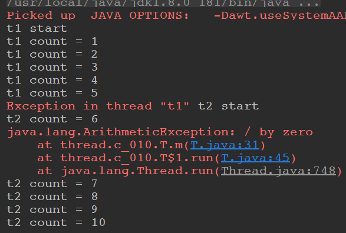

# Java多线程基础(二)

### 1、对某个对象加锁

```java
/**
 * synchronized 对某个对象加锁,注意不是对某个代码块加锁
 */
public class T {

    private int count = 10;

    private Object o = new Object();

    public void m(){
        synchronized(o){ //o 指向了堆内存的一把锁
            count--;
            System.out.println(Thread.currentThread().getName() + "count = " + count);
        }
    }
}
```

### 2、对this对象加锁

```java
/**
 * synchronized 对this加锁，只要这个对象new了出来，就对自己加锁
 */
public class T {

    private int count = 10;

    public void m(){
        synchronized(this){// 任何线程想要执行下面的代码，必须要拿到this对象的锁
            count--;
            System.out.println(Thread.currentThread().getName() + "count = " + count);
        }
    }
}
```

上面程序的简写:

```java
/**
 * synchronized 对this加锁，只要这个对象new了出来，就对自己加锁
 */
public class T {

    private int count = 10;

    // 和c_002的程序等价, 等同于在方法执行的时候加上synchronized(this){
    // 锁定的是当前的对象
    public synchronized void m() {
        count--;
        System.out.println(Thread.currentThread().getName() + "count = " + count);
    }
}
```

### 3、对this对象的static方法加锁

```java
/**
 * synchronized 对this加锁，只要这个对象new了出来，就对自己加锁
 */
public class T {

    private static int count = 10;

    //这里等同于synchronized(thread.c_004.T.class)
    //反射，都是Class类的一个对象
    public synchronized static void m() {
        count--;
        System.out.println(Thread.currentThread().getName() + " count = " + count);
    }

    public static void mm() {
        synchronized(T.class) { //考虑一下这里写synchronized(this)是否可以？ --> 不可以，静态的属性和方法是和类一起的
            count --;
        }
    }
}
```

### 4、加锁之后的安全演示

```java
public class T implements Runnable {

    private int count = 10;

    // 如果不加 synchronized就会出现问题，因为我只有一个t(Thread)对象，有5个线程在同时访问count
    // 加了这个synchronized之后就可以了，锁住了当前的对象, synchronized代码块是原子操作
    public /*synchronized*/ void run() {
        count--;
        System.out.println(Thread.currentThread().getName() + " count = " + count);
    }

    public static void main(String[] args) {
        T t = new T();
        for(int i=0; i<5; i++) {
            new Thread(t, "THREAD" + i).start();
        }
    }
}
```

如果不加`synchronized`，程序可能不是按照`10、9、8、7、6`的顺序输出的。

### 5、同步方法和非同步方法可以被两个线程同时调用

```java
/**
 *  同步和非同步方法是否可以同时调用？ : 可以
 *  因为虽然对象被锁住了，但是m2不需要看那把锁
 */
public class T  {

    public synchronized void m1() {
        System.out.println(Thread.currentThread().getName() + " m1 start...");
        try {
            Thread.sleep(10000);
        } catch (InterruptedException e) {
            e.printStackTrace();
        }
        System.out.println(Thread.currentThread().getName() + " m1 end");
    }

    public void m2() {
        try {
            Thread.sleep(5000);
        } catch (InterruptedException e) {
            e.printStackTrace();
        }
        System.out.println(Thread.currentThread().getName() + " m2 ");
    }

    public static void main(String[] args){
        T t = new T();

        /*new Thread(()->t.m1(), "t1").start();
        new Thread(()->t.m2(), "t2").start();*/

        new Thread(t::m1, "t1").start(); //方法推导
        new Thread(t::m2, "t2").start();

        /*
        new Thread(new Runnable() {
            @Override
            public void run() {
                t.m1(); // 在run方法中调用了 m1()
            }
        });
        */
    }
}

```

输出:

```java
t1 m1 start...
t2 m2 
t1 m1 end
```

可以看到`t2`线程在`t1`线程调用`m1()`方法的同时，自己也调用了`m1()`方法。

即`t`对象虽然被锁住了。但是多个线程可以调用非同步的方法(调用`m2()`的时候不需要看那个锁)。

但是如果将`m2()`方法也加上`synchronized`，那执行结果就是下面这样了:(因为`synchronized`锁住的是对象)

```java
t1 m1 start...
t1 m1 end
t2 m2 
```

### 6、读和写都要加锁，不然容易产生脏读

```java
/**
 * 对业务写方法加锁
 * 对业务读方法不加锁
 * 容易产生脏读问题（dirtyRead） : 一开始读的数据和后面的不同
 */
public class Account {
    String name;
    double balance;

    public synchronized void set(String name, double balance) {
        this.name = name;

        // 加上下面的代码，只是为了演示问题的所在
        try {
            Thread.sleep(2000);
        } catch (InterruptedException e) {
            e.printStackTrace();
        }

        this.balance = balance;
    }

    // 如果不在下面的方法中加上synchronized，就会产生脏读的问题
    public /*synchronized*/ double getBalance() {
        return this.balance;
    }


    public static void main(String[] args) {
        Account account = new Account();
        new Thread(()->account.set("zhangsan", 100.0)).start();
        
        try {
            TimeUnit.SECONDS.sleep(1);
        } catch (InterruptedException e) {
            e.printStackTrace();
        }
        
        System.out.println(account.getBalance()); // 第一次获取，结果发现不正确
        
        try {
            TimeUnit.SECONDS.sleep(2);
        } catch (InterruptedException e) {
            e.printStackTrace();
        }
        
        System.out.println(account.getBalance());
    }
}
```

上面注释了`getBalance()`方法，程序输出如下，可以发现和预期的不同:

```java
0.0
100.0
```

### 7、synchronized获得的锁是可重入的

一个同步方法可以调用另外一个同步方法。

一个线程已经拥有某个对象的锁，再次申请的时候仍然会得到该对象的锁。

也就是说synchronized获得的锁是可重入的。

```java
/**
 * 一个同步方法可以调用另外一个同步方法:
 * 一个线程已经拥有某个对象的锁，再次申请的时候仍然会得到该对象的锁.
 * 也就是说synchronized获得的锁是可重入的
 */
public class T {

    synchronized void m1() {
        System.out.println("m1 start");
        try {
            TimeUnit.SECONDS.sleep(1);
        } catch (InterruptedException e) {
            e.printStackTrace();
        }
        m2();
    }

    synchronized void m2() {
        try {
            TimeUnit.SECONDS.sleep(2);
        } catch (InterruptedException e) {
            e.printStackTrace();
        }
        System.out.println("m2");
    }
}

```

### 8、子类也可以调用父类的同步方法

```java
/**
 *  这里是继承中有可能发生的情形，子类调用父类的同步方法，也是可以的(不会造成死锁)
 */
public class T {
    synchronized void m() {
        System.out.println("m start");
        try {
            TimeUnit.SECONDS.sleep(1);
        } catch (InterruptedException e) {
            e.printStackTrace();
        }
        System.out.println("m end");
    }

    public static void main(String[] args) {
        new TT().m();
    }
}


class TT extends T {
    @Override
    synchronized void m() {
        System.out.println("child m start");
        super.m(); // 在子类中调用父类的同步方法
        System.out.println("child m end");
    }
}
```

### 9、抛出异常后，锁就被释放

```java
/**
 * 线程抛出异常之后: 锁就会被释放
 *
 * 程序在执行过程中，如果出现异常，默认情况锁会被释放
 * 所以，在并发处理的过程中，有异常要多加小心，不然可能会发生不一致的情况。
 * 比如，在一个web app处理过程中，多个servlet线程共同访问同一个资源，这时如果异常处理不合适，
 * 在第一个线程中抛出异常，其他线程就会进入同步代码区，有可能会访问到异常产生时的数据。
 * 因此要非常小心的处理同步业务逻辑中的异常
 */
public class T {

    int count = 0;

    synchronized void m() {
        System.out.println(Thread.currentThread().getName() + " start");
        while(true) {
            count ++;
            System.out.println(Thread.currentThread().getName() + " count = " + count);

            try {
                TimeUnit.SECONDS.sleep(1);
            } catch (InterruptedException e) {
                e.printStackTrace();
            }
            
            if(count == 5) {
                int i = 1/0;  //此处抛出异常，锁将被释放，要想不被释放，可以在这里进行catch，然后让循环继续
                System.out.println(i);
            }
        }
    }


    // 如果没有t没有释放锁， t2应该是永远得不到执行，但是t1出现了异常，释放了锁，所以得到了执行
    public static void main(String[] args) throws InterruptedException {
        T t = new T();

        Runnable r = new Runnable() {
            @Override
            public void run() {
                t.m();
            }
            
        };
        new Thread(r, "t1").start();

        TimeUnit.SECONDS.sleep(3);

        new Thread(r, "t2").start();
    }
}

```

看程序输出，本来`t2`线程是永远得不到执行的，但是`t1`发生了异常，所以`t2`得到了执行。



### 10、volatile: 保证线程之间的可见性

下面的程序中，我们有一个全局变量`running`一开始是`true`，然后`t1`开始运行，然而我们在后面将`running`设置成了`true`，但是最后`t1`线程并没有结束，还是一直在运行，这是为什么呢?

```java
/**
 *
 * volatile: 保证线程之间的可见性
 *
 * volatile 关键字，使一个变量在多个线程间可见
 * A B线程都用到一个变量，java默认是A线程中保留一份copy，这样如果B线程修改了该变量，则A线程未必知道
 * 使用volatile关键字，会让所有线程都会读到变量的修改值 (不是说每次都要去读一遍，而是这个值有改动就重新读一下)
 *
 * 在下面的代码中，running是存在于堆内存的t对象中
 * 当线程t1开始运行的时候，会把running值从内存中读到t1线程的工作区，在运行过程中直接使用这个copy，并不会每次都去
 * 读取堆内存，这样，当主线程修改running的值之后，t1线程感知不到，所以不会停止运行
 *
 * 使用volatile，将会强制所有线程都去堆内存中读取running的值 (不会读缓存的内容)
 * 可以阅读这篇文章进行更深入的理解
 * http://www.cnblogs.com/nexiyi/p/java_memory_model_and_thread.html
 * volatile并不能保证多个线程共同修改running变量时所带来的不一致问题，也就是说volatile不能替代synchronized(既有可见性，又有原子性)
 * volatile比synchronized: 轻量级
 */

public class T {

    //对比一下有无volatile的情况下，整个程序运行结果的区别
    /*volatile*/ boolean running = true;   // volatile，可以保证每次都是从内存读，读完之后就写到内存(缓存),内存可见性，禁止指令重排
    void m() {
        System.out.println("m start");

        while(running) {

            // 虽然加了下面的代码（或者别的代码，可以结束程序(和volatile)一样的结果，但是还是要加volatile，因为下面的是随机性的）
    //			try {
    //				TimeUnit.MILLISECONDS.sleep(10);
    //			} catch (InterruptedException e) {
    //				e.printStackTrace();
    //			}
        }

        System.out.println("m end!");
    }

    public static void main(String[] args) {
        T t = new T();
        
        new Thread(t::m, "t1").start();
    //		new Thread(()->t.m(), "t1").start();
        
        try {
            TimeUnit.SECONDS.sleep(1);
        } catch (InterruptedException e) {
            e.printStackTrace();
        }
        
        t.running = false;
    }
}
```

这是因为在`main`线程和`t1`线程虽然共享了`running`变量，但是当`main`线程修改了`running`变量之后，`t1`并没有收到这个最新的已经更改的信息。

因为这两个线程，在一开始得到`running = true`的时候，会存在自己线程的缓冲区。

下一次就直接在缓存中拿，所以当`main`线程更改之后，`t1`并不知道。

要解决上面的问题，要使用`volatile`关键字，当别的线程更改变量之后，会通知别的用到的线程。

### 11、volatile: 不保证线程之间的原子性

`volatile`虽然保证了线程之间的可见性，但是确不能保证线程之间的原子性。

比如下面的程序:

```java
/**
 * volatile并不能保证多个线程共同修改running变量时所带来的不一致问题，也就是说volatile不能替代synchronized
 * 运行下面的程序，并分析结果 : 虽然某个线程修改了值之后，另外的线程会马上知道，但是不能保证原子性(同时的改)
 */
public class T {

    volatile int count = 0;

    void m() {
        for(int i=0; i<10000; i++) count++;
    }

    // 下面的程序预期输出是 100000，但是实际上达不到 100000
    public static void main(String[] args) {
        T t = new T();
        
        List<Thread> threads = new ArrayList<>();
        
        for(int i=0; i<10; i++) {
            threads.add(new Thread(t::m, "thread-"+i));
        }
        
        threads.forEach((o)->o.start());
        
        threads.forEach((o)->{
            try {
                o.join();
            } catch (InterruptedException e) {
                e.printStackTrace();
            }
        });
        
        System.out.println(t.count);
    }
}
```

我们期望的输出是`100000`，但是实际上达不到`100000`，因为`volitile`虽然能保证可见性，但是不能保证原子性。

所以还是需要在`m()`方法上加上`synchronized`：

```java
import java.util.ArrayList;
import java.util.List;

/**
 * 对比上一个程序，可以用synchronized解决，synchronized可以保证可见性和原子性，volatile只能保证可见性
 */
public class T {
    /*volatile*/ int count = 0;

    synchronized void m() {
        for (int i = 0; i < 10000; i++)
            count++;
    }

    // 这次程序运行结果就一定是 100000
    public static void main(String[] args) {
        T t = new T();

        List<Thread> threads = new ArrayList<>();

        for (int i = 0; i < 10; i++) {
            threads.add(new Thread(t::m, "thread-" + i));
        }

        threads.forEach((o) -> o.start());
        threads.forEach((o) -> {
            try {
                o.join();
            } catch (InterruptedException e) {
                e.printStackTrace();
            }
        });

        System.out.println(t.count);
    }
}
```

### 12、AtomicXXX类高效的解决原子性问题

上面给`m()`方法加上了`synchronized`虽然解决了原子性问题，但是性能不好。

JDK提供了一些现成的类，里面的方法都是原子性操作的。这样我们就不需要加`synchronized`，这样性能更好。

```java
/**
 * 解决同样上一个程序问题的更高效的方法，使用AtomXXX类
 * AtomXXX类本身方法都是原子性的，但不能保证多个方法连续调用是原子性的
 */
public class T {
    /*volatile*/ //int count = 0;

    
    AtomicInteger count = new AtomicInteger(0);

    /*synchronized*/ void m() {
        for (int i = 0; i < 10000; i++)
            //if count.get() < 1000  // 两个Atom类的方法之间还是不具备原子性
            count.incrementAndGet(); //等同于count++, 但是这个是原子性的
    }

    public static void main(String[] args) {
        T t = new T();

        List<Thread> threads = new ArrayList<Thread>();

        for (int i = 0; i < 10; i++) {
            threads.add(new Thread(t::m, "thread-" + i));
        }

        threads.forEach((o) -> o.start());
        threads.forEach((o) -> {
            try {
                o.join();
            } catch (InterruptedException e) {
                e.printStackTrace();
            }
        });

        System.out.println(t.count);
    }
}
```

### 13、在synchronized内的代码越少越好

比较下面的代码，显然`m2()`的实现比`m1()`更好，`synchronized`是重量级对象，所以尽量包含更少的代码:

```java
/**
 * synchronized优化
 * 同步代码块中的语句越少越好
 * 比较m1和m2
 */
public class T {

    int count = 0;

    synchronized void m1() {
        //do sth need not sync
        try {
            TimeUnit.SECONDS.sleep(2);
        } catch (InterruptedException e) {
            e.printStackTrace();
        }

        //业务逻辑中只有下面这句需要sync，这时不应该给整个方法上锁
        count++;

        //do sth need not sync
        try {
            TimeUnit.SECONDS.sleep(2);
        } catch (InterruptedException e) {
            e.printStackTrace();
        }
    }

    void m2() {
        //do sth need not sync
        try {
            TimeUnit.SECONDS.sleep(2);
        } catch (InterruptedException e) {
            e.printStackTrace();
        }

        //业务逻辑中只有下面这句需要sync，这时不应该给整个方法上锁
        //采用细粒度的锁，可以使线程争用时间变短，从而提高效率
        synchronized(this) {
            count ++;
        }

        //do sth need not sync
        try {
            TimeUnit.SECONDS.sleep(2);
        } catch (InterruptedException e) {
            e.printStackTrace();
        }
    }
}
```

### 14、某个引用指向的对象改变，则原先对象的锁就释放了

某个对象的锁指的是在堆内对象的所，而不是在栈中引用的锁，所以当栈内的引用指向了堆的别的对象，那么原来的对象的锁就不存在了。

看实例演示:

```java
/**
 * 锁是所在堆内存中，而不是栈内存中，当某个引用指向了别的地方，原先那个被指向的对象的锁就释放了
 * 即:
 * 锁定某对象o，如果o的属性发生改变，不影响锁的使用
 * 但是如果o变成另外一个对象，则锁定的对象发生改变
 * 应该避免将锁定对象的引用变成另外的对象
 */
public class T {
    Object o = new Object();

    void m() {
        synchronized(o) {
            while(true) {
                try {
                    TimeUnit.SECONDS.sleep(1);
                } catch (InterruptedException e) {
                    e.printStackTrace();
                }
                System.out.println(Thread.currentThread().getName());
            }
        }
    }

    public static void main(String[] args) {
        T t = new T();
        //启动第一个线程
        new Thread(t::m, "t1").start();
        
        try {
            TimeUnit.SECONDS.sleep(3);
        } catch (InterruptedException e) {
            e.printStackTrace();
        }

        //创建第二个线程
        Thread t2 = new Thread(t::m, "t2");
        //锁对象发生改变(指向了别的地方)，然后t1的锁就释放了, 所以t2线程得以执行，如果注释掉下面这句话，线程2将永远得不到执行机会
        t.o = new Object();
        t2.start();
    }
}
```

### 15、不要以常量作为锁定对象

```java
/**
 * 不要以字符串常量作为锁定对象
 * 在下面的例子中，m1和m2其实锁定的是同一个对象
 * 这种情况还会发生比较诡异的现象，比如你用到了一个类库，在该类库中代码锁定了字符串“Hello”，
 * 但是你读不到源码，所以你在自己的代码中也锁定了"Hello",这时候就有可能发生非常诡异的死锁阻塞，
 * 因为你的程序和你用到的类库不经意间使用了同一把锁
 *
 * jetty 曾经就有一个这样的bug
 */
public class T {

	// 这两个对象是同一个对象, 所以下面的两个方法锁定了同一个对象，就有可能产生死锁
    String s1 = "Hello";
    String s2 = "Hello";

    void m1() {
        synchronized(s1) {
        }
    }

    void m2() {
        synchronized(s2) {
            
        }
    }
}
```

### 16、实现一个容器监控另一个容器

实现一个容器，提供两个方法，`add`，`size `                                     

写两个线程，线程`1`添加`10`个元素到容器中，线程`2`实现监控元素的个数，当个数到`5`个时，线程`2`给出提示并结束。 

先看初步版本:

分析下面这个程序，能完成这个功能吗？
答: 不能，因为虽然 `t2`线程 和` t1`线程的共享变量 list不是内存可见的(没有加` volatile`关键字)


```java
/**
 * 分析下面这个程序，能完成这个功能吗？
 * 答: 不能，因为虽然 t2线程 和 t1线程的共享变量 list不是内存可见的(没有加 volatile关键字)
 */
public class MyContainer1 {

    List<Integer>list = new ArrayList<>();

    public void add(Integer o) {
        list.add(o);
    }

    public int size() {
        return list.size();
    }

    public static void main(String[] args) {
        MyContainer1 c = new MyContainer1();

        new Thread(() -> {
            for(int i=0; i<10; i++) {
                c.add(i);
                System.out.println("add " + i);
                
                try {
                    TimeUnit.SECONDS.sleep(1);
                } catch (InterruptedException e) {
                    e.printStackTrace();
                }
            }
        }, "t1").start();

        new Thread(() -> {
            while(true) {
                if(c.size() == 5) {
                    break;
                }
            }
            System.out.println("t2 结束");
        }, "t2").start();
    }
}
```

解决上面问题的方法就是在`list`前面加上一个` volatile`关键字即可。

但是，还有一个问题，`t2`线程的死循环很浪费cpu，如果不用死循环，该怎么做呢？

这里使用wait和notif机制，wait会释放锁，而notify不会释放锁:

* 需要注意的是: 运用这种方法，必须要保证t2先执行，也就是首先让t2监听才可以；

阅读下面的程序，并分析输出结果
可以读到输出结果并不是size=5时t2退出，而是t1结束时t2才接收到通知而退出
想想这是为什么？

答: 因为notify不会放弃锁，所以最后程序结果不对，因为这个没有放弃锁，所以t2得不到执行。

```java
public class MyContainer3 {

    // 添加volatile，使t2能够得到通知
    volatile List<Integer> list = new ArrayList<>();

    public void add(Integer o) {
        list.add(o);
    }

    public int size() {
        return list.size();
    }

    public static void main(String[] args) {
        MyContainer3 c = new MyContainer3();

        final Object lock = new Object();// 随便创建一个锁

        new Thread(() -> {
            synchronized (lock) {
                System.out.println("t2启动");
                if (c.size() != 5) {
                    try {
                        lock.wait(); // 放入条件等待队列，放弃当前锁, 被阻塞
                    } catch (InterruptedException e) {
                        e.printStackTrace();
                    }
                }
                System.out.println("t2 结束");
            }

        }, "t2").start();

        try {
            TimeUnit.SECONDS.sleep(1);
        } catch (InterruptedException e1) {
            e1.printStackTrace();
        }

        new Thread(() -> {
            System.out.println("t1启动");
            synchronized (lock) {
                for (int i = 0; i < 10; i++) {
                    c.add(i);
                    System.out.println("add " + i);

                    if (c.size() == 5) {
                        lock.notify(); // 不会放弃当前锁，所以最后程序结果不对，因为这个没有放弃锁，所以t2得不到执行
                    }

                    try {
                        TimeUnit.SECONDS.sleep(1);
                    } catch (InterruptedException e) {
                        e.printStackTrace();
                    }
                }
            }
        }, "t1").start();
    }
}
```

解决办法:

* `notify`之后，`t1`必须释放锁，`t2`退出后，也必须`notify`，通知`t1`继续执行；
* 整个通信过程比较繁琐；

```java
public class MyContainer4 {

    //添加volatile，使t2能够得到通知
    volatile List<Integer> list = new ArrayList<>();

    public void add(Integer o) {
        list.add(o);
    }

    public int size() {
        return list.size();
    }

    public static void main(String[] args) {
        MyContainer4 c = new MyContainer4();

        final Object lock = new Object();

        new Thread(() -> {
            synchronized (lock) {
                System.out.println("t2启动");
                if (c.size() != 5) {
                    try {
                        lock.wait();
                    } catch (InterruptedException e) {
                        e.printStackTrace();
                    }
                }
                System.out.println("t2 结束");
                //t1释放锁之后，我t2得到了执行，最后我还要通知t1继续执行
                lock.notify();
            }

        }, "t2").start();

        try {
            TimeUnit.SECONDS.sleep(1);
        } catch (InterruptedException e1) {
            e1.printStackTrace();
        }

        new Thread(() -> {
            System.out.println("t1启动");
            synchronized (lock) {
                for (int i = 0; i < 10; i++) {
                    c.add(i);
                    System.out.println("add " + i);

                    if (c.size() == 5) {
                        lock.notify();
                        //再加一个wait(), ---> 释放锁，让t2得以执行
                        try {
                            lock.wait();
                        } catch (InterruptedException e) {
                            e.printStackTrace();
                        }
                    }
                    try {
                        TimeUnit.SECONDS.sleep(1);
                    } catch (InterruptedException e) {
                        e.printStackTrace();
                    }
                }
            }
        }, "t1").start();
    }
}
```

更高效的方式:

* 使用Latch（门闩）替代wait notify来进行通知；
* 好处是通信方式简单，同时也可以指定等待时间；
* 使用`await()`和`countdown()`方法替代wait和notify；
* CountDownLatch**不涉及锁定**(这是和上面不同的，这比上面高效)， 当count的值为零时当前线程继续运行(`new CountDownCatch(count)`)；
* **当不涉及同步，只是涉及线程通信的时候，用`synchronized + wait/notify`就显得太重了**；
* 这时应该考虑countdownlatch/cyclicbarrier/semaphore

代码:

```java
public class MyContainer5 {

    //添加volatile，使t2能够得到通知
    volatile List<Integer> list = new ArrayList<>();

    public void add(Integer o) {
        list.add(o);
    }

    public int size() {
        return list.size();
    }

    public static void main(String[] args) {
        MyContainer5 c = new MyContainer5();

        CountDownLatch latch = new CountDownLatch(1);

        new Thread(() -> {
            System.out.println("t2启动");
            if (c.size() != 5) {
                try {
                    latch.await();
                    //也可以指定等待时间
                    //latch.await(5000, TimeUnit.MILLISECONDS);
                } catch (InterruptedException e) {
                    e.printStackTrace();
                }
            }
            System.out.println("t2 结束");
        }, "t2").start();

        try {
            TimeUnit.SECONDS.sleep(1);
        } catch (InterruptedException e1) {
            e1.printStackTrace();
        }

        new Thread(() -> {
            System.out.println("t1启动");
            for (int i = 0; i < 10; i++) {
                c.add(i);
                System.out.println("add " + i);

                if (c.size() == 5) {
                    // 打开门闩，让t2得以执行
                    latch.countDown(); // 调用一次countDown，构造函数中构造的那个值就-1，到了0，门栓就开了(通知t2运行)
                }
                try {
                    TimeUnit.SECONDS.sleep(1);
                } catch (InterruptedException e) {
                    e.printStackTrace();
                }
            }

        }, "t1").start();
    }
}
```

### 17、ReentrantLock的相关知识

#### 1)、用ReentrantLock替代synchronized

下面先给一个用synchronized实现同步的程序。然后演示用`ReentrantLock`来替代它。

```java
/**
 * ReentrantLock用于替代synchronized
 * 本例中由于m1锁定this,只有m1执行完毕的时候,m2才能执行: 这里是复习synchronized最原始的语义
 */
public class TestReentrantLock1 {

    synchronized void m1(){
        for(int i = 0; i < 10; i++){
            try {
                TimeUnit.SECONDS.sleep(1);
            } catch (InterruptedException e) {
                e.printStackTrace();
            }
            System.out.println(i);
        }
    }

    synchronized void m2(){
        System.out.println("m2...");
    }

    public static void main(String[] args) throws InterruptedException {
        TestReentrantLock1 r1 = new TestReentrantLock1();
        new Thread(() -> r1.m1(), "t1").start();

        TimeUnit.SECONDS.sleep(1);

        new Thread(() -> r1.m2(), "t2").start(); // m2必须要等待t1的m1执行完
    }
}
```

用`ReentrantLock`替代`synchronized`的功能:

```java
/**
 * 使用ReentrantLock可以完成同样的功能
 * 需要注意的是，必须要必须要必须  要手动释放锁（重要的事情说三遍）
 * 使用syn锁定的话如果遇到异常，jvm会自动释放锁，但是lock必须手动释放锁，因此经常在finally中进行锁的释放
 */

public class TestReentrantLock2 {

    Lock lock = new ReentrantLock(); // 注意这是JDK里面的

    void m1() {
        try {
            lock.lock(); // 相当于synchronized(this);
            for (int i = 0; i < 10; i++) {
                TimeUnit.SECONDS.sleep(1);
                System.out.println(i);
            }
        } catch (InterruptedException e) {
            e.printStackTrace();
        } finally {
            lock.unlock(); // 这个释放锁一定要在finally中, 如果发生异常就会释放，否则如果没有手动释放,m2永远得不到执行
        }
    }

    // 没有加synchronized
    void m2() {
        lock.lock();
        System.out.println("m2...");
        lock.unlock();
    }

    public static void main(String[] args) throws InterruptedException {
        TestReentrantLock2 r1 = new TestReentrantLock2();
        new Thread(() -> r1.m1(), "t1").start();

        TimeUnit.SECONDS.sleep(1);

        new Thread(() -> r1.m2(), "t2").start(); // m2必须要等待t1的m1执行完
    }
}
```

#### 2)、ReentrantLock的tryLock功能

```java
/**
 * 使用reentrantlock可以进行“尝试锁定”tryLock。
 * 这样无法锁定，或者在指定时间内无法锁定，线程可以决定是否继续等待
 */

public class TestReentrantLock3 {

    Lock lock = new ReentrantLock(); // 注意这是JDK里面的

    void m1() {
        try {
            lock.lock(); // 相当于synchronized(this);
            for (int i = 0; i < 10; i++) {
                TimeUnit.SECONDS.sleep(1);
                System.out.println(i);
            }
        } catch (InterruptedException e) {
            e.printStackTrace();
        } finally {
            lock.unlock(); // 这个释放锁一定要在finally中, 如果发生异常就会释放，否则如果没有手动释放,m2永远得不到执行
        }
    }


    /**
     * 使用tryLock进行尝试锁定，不管锁定与否，方法都将继续执行: 可以先去做边的事，不像synchronized一样死等着
     * 可以根据tryLock的返回值来判定是否锁定
     * 也可以指定tryLock的时间，由于tryLock(time)抛出异常，所以要注意unclock的处理，必须放到finally中
     */
    void m2() {
        boolean success = false;
        while(!success) {
            success = lock.tryLock(); //尝试获取锁，如果获取到了返回true
//            success = lock.tryLock(5, TimeUnit.SECONDS); //等待5秒，如果5秒还没有，我该干啥就干啥
            if(success) {
                System.out.println("                                                                                                                                    m2... ");
                lock.unlock();
                break;
            }
        }
    }

    public static void main(String[] args) throws InterruptedException {
        TestReentrantLock3 r1 = new TestReentrantLock3();
        new Thread(() -> r1.m1(), "t1").start();

        TimeUnit.SECONDS.sleep(1);

        new Thread(() -> r1.m2(), "t2").start(); // m2必须要等待t1的m1执行完
    }
}
```

#### 3)、ReentrantLock的lockInterruptibly()方法可以对interrupt做出响应

```java
/**
 * 使用ReentrantLock还可以调用lockInterruptibly方法，可以对线程interrupt方法做出响应，
 * 在一个线程等待锁的过程中，可以被打断
 */

public class TestReentrantLock4 {

    public static void main(String[] args){
        Lock lock = new ReentrantLock();

        Thread t1 = new Thread(()->{
            try {
                lock.lock();
                System.out.println("t1 start");
                TimeUnit.SECONDS.sleep(Integer.MAX_VALUE); // 一直占有这把锁
                System.out.println("t1 end");
            } catch (InterruptedException e) {
                System.out.println("interrupted!");
            } finally {
                lock.unlock();
            }
        });
        t1.start();

        Thread t2 = new Thread(()->{

            try {
                //lock.lock();
                lock.lockInterruptibly(); //  可以对interrupt()方法做出响应
                System.out.println("t2 start");
                TimeUnit.SECONDS.sleep(5);
                System.out.println("t2 end");
            } catch (InterruptedException e) {
                System.out.println("interrupted!");
            } finally {
//                lock.unlock();  //这里会抛异常，因为我没有获取到锁，肯定不能unlock
            }
        });
        t2.start();

        try {
            TimeUnit.SECONDS.sleep(1);
        } catch (InterruptedException e) {
            e.printStackTrace();
        }
        t2.interrupt(); //打断线程2的等待, 就是告诉t2，你别等了，t1要这么久，再怎么等也没用
    }
}
```

#### 4)、ReentrantLock可以实现公平锁

公平锁，就是当对象释放锁的时候，其他需要拿到锁的线程中，等的最久的那个会先拿到锁。

```java
/**
 * ReentrantLock还可以指定为公平锁
 * 就是等的越久的就越先拿到锁
 */
public class TestReentrantLock5 extends Thread{

    private static ReentrantLock lock = new ReentrantLock(true); //参数为true表示为公平锁，请对比输出结果

    public void run() {
        for(int i = 0 ;i < 100; i++) {
            lock.lock();
            try{
                System.out.println(Thread.currentThread().getName()+"获得锁");
            }finally{
                lock.unlock();
            }
        }
    }
    public static void main(String[] args) {
        TestReentrantLock5 rl = new TestReentrantLock5();
        Thread th1 = new Thread(rl);
        Thread th2 = new Thread(rl);
        th1.start();
        th2.start();
    }
}
```

