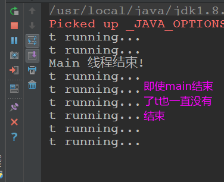

# Java多线程基础

 - [一、线程介绍](#一线程介绍)
    - [1、简单案例引入](#1简单案例引入)
    - [2、start和run方法区别](#2start和run方法区别)
    - [3、线程生命周期](#3线程生命周期)
    - [4、银行排队业务案例](#4银行排队业务案例)
 - [二、深入理解Thread构造函数](#二深入理解thread构造函数)
       - [1、线程的默认命名](#1线程的默认命名)
       - [2、线程的父子关系](#2线程的父子关系)
       - [3、Thread和ThreadGroup](#3thread和threadgroup)
       - [4、Thread和JVM虚拟机栈](#4thread和jvm虚拟机栈)
       - [5、守护线程](#5守护线程)
 - [三、Thread API的详细内容](#三threadapi的详细内容)
     - [1、线程sleep](#1线程sleep)
     - [2、线程yield](2线程yield)
     - [3、设置线程的优先级](#3设置线程的优先级)
     - [4、获取线程ID](#4获取线程id)
     - [5、获取当前线程](5获取当前线程)
     - [6、设置线程上下文类加载器](#6设置线程上下文类加载器)
     - [7、线程interrupt](#7线程interrupt)
     - [8、线程join](#8线程join)
     - [9、关闭线程](9关闭线程)
 - 四、线程安全与数据同步
 - 五、线程间通信
 - 六、ThreadGroup详细讲解

***

## 一、线程介绍

### 1、简单案例引入
> 模拟同时从数据库中读取数据和写入文件；

 - 模拟同时从数据库中读取数据和写入文件，这两个操作作为两个线程同时进行，不需要相互的等待；
 - 这里使用的是匿名类创建的线程，重写了Thread类中的run方法，当然也可以通过继承Thread类或者实现Runnable接口来创建线程；

```java
/**
 * 基本的创建线程
 * 模拟两个线程同时执行 读数据库和写文件
 */
public class Code_01_TryConcurrency {

    public static void main(String[] args) {

        //一边从数据库读取，一边写入文件

        new Thread("Read-Thread") {
            @Override
            public void run () {
                readFromData();
            }
        }.start();//start()方法是立刻返回的，不会阻塞

        new Thread("Write-Thread") {
            @Override
            public void run() {
                writeToFile() ;
            }
        }.start(); //只有调用start()方法才是线程,不然只是一个普通的类
    }


    static void readFromData() {
        try {
            println("Begin read data from db......");
            Thread.sleep(1000 * 5L);
            println("After read data !");
        } catch (InterruptedException e) {
            e.printStackTrace();
        }
        println("Read data successfully!");
    }

    static void writeToFile() {
        try {
            println("Begin write data to File.......");
            Thread.sleep(1000 * 5L);
            println("After write date !");
        } catch (InterruptedException e) {
            e.printStackTrace();
        }
        println("Write data successfully!");
    }

    static void println(String msg) {
        System.out.println(msg);
    }

}

```
效果:

 

### 2、start和run方法区别

 - 注意只有当Thread的实例调用`start()`方法时，才能真正的成为一个线程，否则`Thread`和其他普通的Java对象没有什么区别；
 - 调用`run()`方法不是一个线程；
 - `start()`方法是一个立即返回的方法，不会让程序陷入阻塞；

下面的代码，如果是`t.start()`输出的线程名为`"Read-Thread"`，而如果调用的是`t.run()`则会输出`main`线程名。
```java
Thread t = new Thread("Read-Thread"){
    @Override
    public void run() {
        println(Thread.currentThread().getName()); //如果调用start就是"Read-Thread"，如果调用的是run方法就是main
        readFromDataBase();
    }
};

//  t.start();  //只有调用start()方法才是真正的线程
t.run();
```

Thread中使用了[模板方法设计模式](https://blog.csdn.net/zxzxzx0119/article/details/81709199)，也就是我们继承Thread类，重写的是`run()`方法(钩子方法)，但是调用的却是`start()`方法(最终方法)的原因。


关于模板方法，简单说: **就是父类写了一些固定的逻辑，但是给自己留了一个方法可以实现，有些逻辑不能改，有些可以改**，看一个简单的例子:

```java
public class Code_02_TemplateMethod {

    // 不能给子类实现
    public final void print(String msg){
        System.out.println("################");
        wrapPrint(msg);
        System.out.println("################");
    }

    // 给子类实现(也可以写成抽象方法，子类必须实现)
    protected void wrapPrint(String msg){

    }

    public static void main(String[] args){

        Code_02_TemplateMethod t1 = new Code_02_TemplateMethod(){
            @Override
            protected void wrapPrint(String msg) {
                System.out.println("**" + msg + "**");
            }
        };
        t1.print("Hello Thread");

        Code_02_TemplateMethod t2 = new Code_02_TemplateMethod(){
            @Override
            protected void wrapPrint(String msg) {
                System.out.println("++" + msg + "++");
            }
        };
        t2.print("Hello Thread");
    }
}

```
输出:
```c
################
**Hello Thread**
################
################
++Hello Thread++
################
```

* `print` 方法类似于 Thread 的 `start`方法，而 wrapPrint 则类似于 `run` 方法；
* 这样做的好处是，程序结构由父类控制，并且是 `final` 修饰的，不允许被重写，子类只需要实现想要的罗辑任务即可；

也就是说`start`方法中会调用`start0`方法(并没有调用`run`方法)，而重新的`run`方法何时被调用呢?

在开始执行这个线程时，JVM 将会调用该线程的 `run` 方法，换言之，**`run` 方法是被 JNI 方法 `start0()` 调用的**，仔细阅读 `start()` 的源码将会总结出如下几个知识要点。

* Thread 被构造后的NEW 状态，事实上 threadStatus 这个内部属性为 0。
* 不能两次启动 Thread，否则就会出现 IlegalThreadStateException 异常。
* 线程启动后将会被加入到一个 ThreadGroup 中；
* 一个线程生命周期结束，也就是到了 TERMINATED 状态，再次调用 start 方法是不允许的，也就是说 TERMINATED 状态是没有办法回到RUNNABLE/RUNNING 状态的。

其他总结:

 - Java应用程序的main函数是一个线程，在JVM启动的时候调用，名字叫`main`；
 - **当你调用一个线程`start()`方法的时候，此时至少有两个线程，一个是调用你的线程(例如`main`)，还有一个是执行`run()`方法的线程；**
- 如果在构造Thread的时候没有传递Runable或者没有复写`Thread`的`run()`方法，就不会调用任何东西。只有传递`Runable`接口的实例(策略模式的算法族)；或者复写了`Thread`的`run()`方法(在`start()`中有一个`start0()`方法（会调用子类重写的`run()`方法）)，才会执行相应的逻辑代码；
- JVM启动时，实际上有多个线程，但是至少有一个**非守护线程**；s

关于守护线程和非守护线程:

> Java分为两种线程：用户线程和守护线程
>
> 所谓守护线程是指在程序运行的时候在后台提供一种通用服务的线程，比如**垃圾回收线程**就是一个很称职的守护者，并且这种线程并不属于程序中不可或缺的部分。因此，当所有的非守护线程结束时，程序也就终止了，同时会杀死进程中的所有守护线程。反过来说，只要任何非守护线程还在运行，程序就不会终止。
>
> 守护线程和用户线程的没啥本质的区别：唯一的不同之处就在于**虚拟机的离开：如果用户线程已经全部退出运行了，只剩下守护线程存在了**，虚拟机也就退出了。 因为没有了被守护者，守护线程也就没有工作可做了，也就没有继续运行程序的必要了。
>
> 将线程转换为守护线程可以通过调用Thread对象的`setDaemon(true)`方法来实现。在使用守护线程时需要注意一下几点：
>
> * `thread.setDaemon(true)`必须在`thread.start()`之前设置，否则会抛出一个`IllegalThreadStateException`异常。你不能把正在运行的常规线程设置为守护线程。
> * 在Daemon线程中产生的新线程也是Daemon的。
> * 守护线程应该永远不去访问固有资源，如文件、数据库，因为它会在任何时候甚至在一个操作的中间发生中断。

### 3、线程生命周期


每种状态的解释: 

#### 1)、New状态

* 当我们用关键字 new 创建一个 Thread 对象时，**此时它并不处于执行状态**；
* 因为没有调用 `start` 方法启动该线程，那么线程的状态为`NEW` 状态。
* 准确地说，它只是 Thread 对象的状态，因为在没有 start 之前，该线程根本不存在，与你用关键字 new 创建一个普通的 Java对象没什么区别。
* NEW 状态通过 `start` 方法进入 `RUNNABLE` 状态。

#### 2)、Runnable状态

* 线程对象进入 RUNNABLE 状态必须调用 start 方法，那么此时才是真正地在 JVM 进程中创建了一个线程，线程一经启动就可以立即得到执行吗?

* 答案是否定的，线程的运行与否和进程一样都要听令于 CPU 的调度，那么我们把这个中间状态称为可执行状态(RUNNABLE)，**也就是说它具备执行的资格，但是并没有真正地执行起来而是在等待 CPU的调度**；
* 由于存在`Running` 状态，所以不会直接进入`BLOCKED` 状态和`TERMINATED `状态，即使是在线程的执行逻辑中调用 wait、sleep 或者其他 block 的 IO 操作等，也必须先获得 CPU 的调度执行权才可以，严格来讲，RUNNABLE 的线程只能**意外终止或者进入RUNNING 状态**；(即`Runnable`不能直接到`BLOCKED`和`TERMINATED`状态)

#### 3)、Running状态

一且 CPU 通过轮询或者其他方式从任务可执行队列中选中了线程，那么此时它才能真正地执行自己的逻辑代码(也就是RUNNING)，需要说明的一点是**一个正在 RUNNING 状态的线程事实上也是RUNNABLE 的，但是反过来则不成立**。在该状态中，线程的状态可以发生如下的状态转换。

* 直接进入TERMINATED 状态，比如调用 JDK 已经不推荐使用的 stop 方法或者判断某个逻辑标识；
* 进入 BLOCKED 状态，比如调用了 `sleep` ，或者 `wait` 方法而加入了 `waitSet` 中；
* 进行某个阻塞的 IO 操作，比如因网络数据的读写而进入了 BLOCKED 状态；
* 获取某个锁资源，从而加入到该锁的阻塞队列中而进入了 BLOCKED 状态；
* 由于 CPU 的调度器轮询使该线程放弃执行，进入RUNNABLE 状态；
* 线程主动调用 `yield` 方法，放弃 CPU 执行权，进入RUNNABLE 状态；

#### 4)、BLOCKED状态

在BLOCKED状态可以转换的状态:

*  直接进入TERMINATED 状态，比如调用 JDK 已经不推荐使用的 stop 方法或者意外死亡 (`JVM Crash` ) ；
*   线程阻塞的操作结束，比如读取了想要的数据字节进入到RUNNABLE 状态；
*  线程完成了指定时间的休眠，进入到了 RUNNABLE 状态；
*  Wait 中的线程被其他线程 `notify/notifyall` 唤醒，进入RUNNABLE 状态；
*  线程获取到了某个锁资源，进入RUNNABLE 状态；
*  线程在阻塞过程中被打断，比如其他线程调用了 `interrupt` 方法，进入RUNNABLE；

#### 5)、TERMINATED状态

TERMINATED 是一个线程的最终状态，在该状态中线程将**不会切换到其他任何状态，线程进入TERMINATED 状态，意味着该线程的整个生命周期都结束了。**

下列这些情况将会使线程进入 TERMINATED 状态。

* 线程运行正常结束，结束生命周期；
* 线程运行出错意外结束；
* `JVM Crash`，导致所有的线程都结束；

***
### 4、银行排队业务案例


#### 1)、方案一，各个线程各搞各的
```java
public class Code_03_TicketWindowTest01 {

    static class TicketWindow extends Thread {

        private String name;

        private static final int MAX = 5;

        private int index = 1;

        public TicketWindow(String name) {
            this.name = name;
        }

        @Override
        public void run() {
            while (index <= MAX) {
                System.out.println("柜台: " + name + ",当前号码: " + (index++));
                try {
                    Thread.sleep(1000);
                } catch (InterruptedException e) {
                    e.printStackTrace();
                }
            }
        }
    }

    public static void main(String[] args) {

        TicketWindow t1 = new TicketWindow("一号");
        t1.start();

        TicketWindow t2 = new TicketWindow("二号");
        t2.start();

        TicketWindow t3 = new TicketWindow("三号");
        t3.start();
    }
}
```

输出如下，可以看到每个柜台都有`5`个号，显然不对，银行总共才`5`个号。

```java
柜台: 二号,当前号码: 1
柜台: 一号,当前号码: 1
柜台: 三号,当前号码: 1
柜台: 二号,当前号码: 2
柜台: 一号,当前号码: 2
柜台: 三号,当前号码: 2
柜台: 二号,当前号码: 3
柜台: 一号,当前号码: 3
柜台: 三号,当前号码: 3
柜台: 一号,当前号码: 4
柜台: 三号,当前号码: 4
柜台: 二号,当前号码: 4
柜台: 一号,当前号码: 5
柜台: 三号,当前号码: 5
柜台: 二号,当前号码: 5
```

#### 2)、方案二，使用static关键字

最简单的解决方案 : 将`index`设置成`static`，这样每个对象都是用这个值，总共就只有`MAX`个了。

但是这种方案也有一些缺点:

* `static`修饰的变量生命周期很长，浪费资源；
* 如果将号码`MAX`调整到`500、1000`等稍微大一点的数字就会出现线程安全问题； 

```java
static class TicketWindow extends Thread {

    private String name;

    private static final int MAX = 5;

    private static int index = 1;

    public TicketWindow(String name) {
        this.name = name;
    }

    @Override
    public void run() {
        while (index <= MAX) {
            System.out.println("柜台: " + name + ",当前号码: " + (index++));
            try {
                Thread.sleep(1000);
            } catch (InterruptedException e) {
                e.printStackTrace();
            }
        }
    }
}
```
测试类不变， 输出如下，可以看到总共只会输出`5`次，但是不是好的方案。

```java
柜台: 一号,当前号码: 1
柜台: 二号,当前号码: 2
柜台: 三号,当前号码: 3
柜台: 一号,当前号码: 4
柜台: 二号,当前号码: 5
```

#### 3)、方法三，使用Runnable接口以及策略

**可以使用实现Runnable接口来传入到Thread的构造方法当中，完成和static关键字同样的效果。**

```java
public class Code_03_TicketWindowTest02 {

    static class TicketWindow implements Runnable{

        private static final int MAX = 5;

        private int index = 1; // 没有做static修饰

        @Override
        public void run() {
            while (index <= MAX) {
                System.out.println(Thread.currentThread() + " 的号码是: " + (index++));
                try {
                    Thread.sleep(1000);
                } catch (InterruptedException e) {
                    e.printStackTrace();
                }
            }
         }
    }

    public static void main(String[] args){
        TicketWindow ticketWindow = new TicketWindow(); // 只有一个 TicketWindow实例
        Thread t1 = new Thread(ticketWindow, "一号窗口");
        t1.start();
        Thread t2 = new Thread(ticketWindow, "二号窗口");
        t2.start();
        Thread t3 = new Thread(ticketWindow, "三号窗口");
        t3.start();
    }
}


```
输出: (此时号码就是有序的):

```java
Thread[一号窗口,5,main] 的号码是: 1
Thread[二号窗口,5,main] 的号码是: 2
Thread[三号窗口,5,main] 的号码是: 3
Thread[一号窗口,5,main] 的号码是: 4
Thread[二号窗口,5,main] 的号码是: 5
```

重写Thread类的`run`方法和实现`Runnable`接口的`run`方法有一个很大的不同:

* Thread类的`run`方法是不能共享的，也就是说`A`线程不能把`B`线程的`run`方法当做自己的执行单元；
* 而使用`Runnable`接口则很任意就能实现这一点，**使用同一个`Runnable`的实例构造不同的Thread实例**；

**这里注意Runnable接口使用的是设计模式中的[策略模式](https://blog.csdn.net/zxzxzx0119/article/details/81327444)**: 

* Runnable接口类类似接口的行为族；
* 具体的实现由我们自己创建的是实现Runnable接口的类来指定，并且重写方法`run()`方法，具体指定自己的实现。 

> 很多书籍经常会提到，创建线程有两种方式，第一种是构造一个Thread，第二种是实现 Runnable 接口，这种说法是错误的，最起码是不严谨的，在 JDK 中代表线程的就只有 Thread 这个类，我们在前面分析过，线程的执行单元就是run方法，你可以通过继承 Thread 然后重写 run 方法实现自己的业务逻辑，也可以实现 Runnable 接口实现自己的业务逻辑，代码如下:
>
> ```java
> @Override
> public void run(){
>     // 如果构造Thread时传入了Runnable，则会执行runnable的run方法
>     if(target != null){
>         target.run();
>     }
>     // 否则需要重写Thread类的run()方法
> }
> ```
>
> **准确地讲，创建线程只有一种方式那就是构造Thread 类。**
>
> **而实现线程的执行单元则有两种方式，第一种是重写 Thread 的 run 方法，第二种是实现 Runnable 接口的 run 方法，并且将 Runnable 实例用作构造 Thread 的参数。**

## 二、深入理解Thread构造函数

### 1、线程的默认命名

打开JDK的源码可以看到我们构造Thread的时候，默认的线程的名字是

* 以`Thread-`开头，从`0`开始计数；
* 即`Thread-0、Thread-1、Thread-2...`；

```java
public Thread() {
    init(null, null, "Thread-" + nextThreadNum(), 0);
}
/* For autonumbering anonymous threads. */
private static int threadInitNumber;
private static synchronized int nextThreadNum() {
    return threadInitNumber++;
}
```

修改线程的名字，在线程启动之前，还有一个而已修改线程名字的机会，一旦线程启动，名字就不可以修改: 

下面是在Thread中修改名字的代码: 

```java
public final synchronized void setName(String name) {
    checkAccess();
    if (name == null) {
        throw new NullPointerException("name cannot be null");
    }

    this.name = name;
    if (threadStatus != 0) {
        setNativeName(name);
    }
}
```

### 2、线程的父子关系

Thread的所有构造函数，最终都会去调用一个静态方法`init`，我们截取片段代码对其进行分析，不难发现新创建的任何一个线程都会有一个父线程:

这里截取`Thread`的`init`的部分代码: 

```java
 private void init(ThreadGroup g, Runnable target, String name,
                      long stackSize, AccessControlContext acc,
                      boolean inheritThreadLocals) {
     if (name == null) {
         throw new NullPointerException("name cannot be null");
     }
     this.name = name;
     Thread parent = currentThread();//获取当前运行的线程作为赴现场
     SecurityManager security = System.getSecurityManager();
     this.group = g;// 设置线程组
     this.daemon = parent.isDaemon();// 当前线程是否为守护线程，取决于父线程
     this.priority = parent.getPriority(); // 设置优先级
     setPriority(priority);
     this.stackSize = stackSize;
     /* Set thread ID */
     tid = nextThreadID();
 }
```

上面代码中的 `currentThread() `是获取当前线程，在线程生命周期中，我们说过线程的最初状态为NEW，没有执行 start 方法之前，它只能算是一个 Thread 的实例，并不意味着一个新的线程被创建，因此 `currentThread()` 代表的将会是**创建它的那个线程**，因此我们可以得出以下结论。

*  一个线程的创建肯定是由另一个线程完成的。
*  **被创建线程的父线程是创建它的线程**。

**我们都知道 main 函数所在的线程是由 JVM 创建的，也就是 main 线程，那就意味着我们前面创建的所有线程，其父线程都是 main 线程。**

### 3、Thread和ThreadGroup

在Thread的构造函数中，可以显示的指定线程的Group，也就是ThreadGroup，下面看`init`方法的中间部分: 

```java
 if (g == null) {
     /* Determine if it's an applet or not */

     /* If there is a security manager, ask the security manager
               what to do. */
     if (security != null) {
         g = security.getThreadGroup();
     }

     /* If the security doesn't have a strong opinion of the matter
               use the parent thread group. */
     if (g == null) {
         g = parent.getThreadGroup();
     }
 }
```

源码的意思: **如果在构造Thread的时候没有显示的指定一个ThreadGroup，那么子线程将会被加入父线程所在的线程组。**

简单测试代码: 

```java
public class Code_04_ThreadGroupTest {

    public static void main(String[] args){
        PrintStream out = System.out;

        Thread t1 = new Thread("t1");// 没有给t1指定group
        ThreadGroup group1 = new ThreadGroup("group1");
        Thread t2 = new Thread(group1, "t2");
        ThreadGroup mainGroup = Thread.currentThread().getThreadGroup();

        out.println("Main Thread Group : " + mainGroup.getName());
        out.println(t1.getThreadGroup() == mainGroup); // true // 默认就是main线程的
        out.println(t2.getThreadGroup() == mainGroup); // false
        out.println(group1 == t2.getThreadGroup()); // true // 指定了就是这个了
    }
}

```

输出:

```java
Main Thread Group : main
true
false
true
```

得出结论: 

* main线程所在的`ThreadGroup`称为`main`；
* 构造一个线程的时候如果没有显示的指定`ThreadGroup`，那么它将会和父线程属于同一个`ThreadGroup`（且拥有同样的优先级）；

### 4、Thread和JVM虚拟机栈

#### 1)、Thread与Stacksize

看下列`Thread`构造函数

```java
Thread(ThreadGroup group, Runnable target, String name, long stackSize) 
//分配新的 Thread 对象，以便将 target 作为其运行对象，将指定的 name 作为其名称，作为 group 所引用的线程组的一员，并具有指定的堆栈大小。
```

构造Thread的时候传入`stackSize`代表着线程占用的`stack`大小，如果没有指定`stackSize`的大小，默认是`0`，`0`代表着会忽略该参数，改参数会被JNI函数(`Native`)去使用。

#### 2)、JVM内存结构

详见`JVM`相关知识。可看我的[另一篇博客](../../Java基础/JVM/JVM总结(一) - 内存区域与内存管理.md)。

#### 3)、Thread与虚拟机栈

虚拟机栈的大小大概是可以存放21456个栈桢(栈桢中存放局部变量表、操作数栈、动态链接...)，而自己创建的线程的虚拟机栈只有大概15534个栈桢，但是我们可以在创建线程的时候指定`stackSize`；

### 5、守护线程

基本性质。

* 在正常的情况下，如果JVM没有一个**非守护线程**，JVM的进程才会退出。(当只有`Daemon`线程运行的时候才会退出)；
* `setDaemon()`方法必须在`start()`方法之前调用(否则会抛出`IllegalThreadException`)；

线程是否为守护线程和它的父线程有很大的关系，如果父线程是正常线程，则子线程也是正常线程，反之亦然，如果你想要修改它的特性则可以借助 `setDaemon` 方法。`isDaemon()` 方法可以判断该线程是不是守护线程。

另外需要注意的就是，`setDaemon()` 方法只在线程启动之前才能生效，如果一个线程已经死亡，那么再设置 `setDaemon()` 则会抛出 `IllegalThreadStateException` 异常。

看一个`daemonThread`的例子: 
```java
public class Code_05_DaemonThread {

    public static void main(String[] args) throws InterruptedException {
        Thread t = new Thread(() -> {
           while(true){
               System.out.println("t running...");
               try {
                   Thread.sleep(1_000);
               } catch (InterruptedException e) {
                   e.printStackTrace();
               }
           }
        });
//        t.setDaemon(true);
        t.start();
        Thread.sleep(2_000);
        System.out.println("Main 线程结束!");
    }
}
```
上面注释了`t.setDaemon(true);`运行结果如下，发现`main` 线程结束了，但是里面的线程没有结束。



但是如果不注释`t.setDaemon(true);`，当`main`线程结束，里面的线程就会结束。


**守护线程的作用**

**如果一个 JVM 进程中没有一个非守护线程，那么 JVM 会退出，也就是说守护线程具备自动结束生命周期的特性，而非守护线程则不具备这个特点**，试想一下如果 JVM 进程的垃圾回收线程是非守护线程，如果 main 线程完成了工作，则 JVM 无法退出，因为垃圾回收线程还在正常的工作。再比如有一个简单的游戏程序，其中有一个线程正在与服务器不断地交互以获取玩家最新的金币、武器信息，若希望在退出游戏客户端的时候，这些数据同步的工作也能够立即结束，等等。

守护线程经常用作与执行一些后台任务，因此有时它也被称为**后台线程**，**当你希望关闭某些线程的时候，或者退出 JVM 进程的时候，一些线程能够自动关闭**，此时就可以考虑用守护线程(`setDaemon()`)为你完成这样的工作。

***

## 三、Thread API的详细内容

### 1、线程sleep

#### 1)、简单介绍

两个构造方法

* public static void sleep(long millis) throws InterruptedException

* public static void sleep(long millis, int nanos) throws InterruptedException

`sleep` 方法会**使当前线程进入指定毫秒数的休眠**，和暂停执行，虽然给定了一个休眠的时间，但是最终要以系统的定时器和调度器的精度为准，休眠有一个非常重要的特性，那就是其不会放弃 monitor 锁的所有权。

每个线程的休眠互不影响。

#### 2)、使用TimeUnit代替Thread.sleep

JDKE 引入了一个枚举 TimeUnit，**其对 sleep 方法提供了很好的封装**，使用它可以省去时间单位的换算步骤，比如线程想休眠 3小时24分17秒 88 毫秒，使用TimeUnit 来实现就非常的简便优雅了:

Thread.sleep(12257088L)；

TimeUnit.HOURS.sleep(3)；

TimeUnit.MINUTES.sleep(24) ；

TimeUnit.SECONDS.sleep(17) ;

TimeUnit .MILLISECONDS.sleep(88)；

同样的时间表达，TimeUnit 显然清晰很多，强烈建议，在使用 Thread.sleep 的地方，完全使用TimeUnit 来代替，因为 sleep 能做的事，TimeUnit 全部都能完成，并且功能更加的强大。

### 2、线程yield

#### 1)、简单介绍

* 这也是一个静态方法，调用该方法，是告诉操作系统的调度器，**我现在不着急占用CPU，你可以先让其他线程运行**。不过，**这对调度器也仅仅是建议，调度器如何处理是不一定的**，它可能完全忽略该调用；
* 调用`yield()`方法会使得当前线程从`RUNNING`状态切换到`RUNNABLE`状态，这个方法不太常用；

例子:

```java
public class Code_06_YieldTest {

    public static void main(String[] args){
        for(int i = 0; i < 2; i++)
            create(i).start();
    }

    static Thread create(int index){
        return new Thread(() -> {
//           if(index == 0)
//               Thread.yield();
            System.out.println(index);
        });
    }
}

```

上面的程序运行很多次，你会发现输出的结果不一致，有时候是 0 最先打印出来，有时候是 1 最先打印出来，但是当你打开代码的注释部分，你会发现，顺序始终是0，1。

因为第一个线程如果最先获得了 CPU 资源，它会比较谦虚，主动告诉 CPU 调度器释放了原本属于自己的资源，但是 `yield` 只是一个提示 (`hint`)，CPU 调度器并不会担保每次都能满足 `yield` 提示；

#### 2)、yield和sleep的区别

看过前面的内容之后，会发现 yield 和 sleep 有一些混淆的地方， 在 JDK1.5 以前的版本中 yield 的方法事实上是调用了 `sleep(0)`，但是它们之间存在着本质的区别，具体如下。

* `sleep` 会导致当前线程暂停指定的时间，没有 CPU 时间片的消耗。

* `yield` 只是对 CPU 调度器的一个提示，如果 CPU 调度器没有忽略这个提示，它会导致线程上下文的切换。

* `sleep` 会使线程短暂 block，会在给定的时间内释放 CPU 资源。

* `yield` 会使RUNNING 状态的 Thread 进入RUNNABLE 状态 (如果 CPU 调度器没有
  忽略这个提示的话)。

* `sleep` 几乎百分之百地完成了给定时间的休眠，而 yield 的提示并不能一定担保。

* 一个线程 sleep 另一个线程调用 interrupt 会捕获到**中断信号**，而 yield 则不会。

### 3、线程优先级

`setPriority(int newPriority)`、`getPriority()`方法。

#### 1)、简单介绍

进程有进程的优先级，线程同样也有优先级，理论上是优先级比较高的线程会获取优先被 CPU 调度的机会，**但是事实上往往并不会如你所愿**，设置线程的优先级同样也是一个**hint 操作**，有具体如下。

* 对于 root 用户，它会 hint 操作系统你想要设置的优先级别，否则它会被忽略。
* 如果 CPU 比较忙，设置优先级可能会获得更多的 CPU 时间片，但是闲时优先级的高低几乎不会有任何作用。

所以，**不要在程序设计当中企图使用线程优先级绑定某些特定的业务，或者让业务严重依赖于线程优先级**，这可能会让你大失所望。

代码:

```java
public class Code_07_ThreadPriority {
    public static void main(String[] args){
        Thread t1 = new Thread(() -> {
            while(true){
                System.out.println("t1");
            }
        });
        t1.setPriority(3);
        Thread t2 = new Thread(() -> {
            while(true){
                System.out.println("t2");
            }
        });
        t2.setPriority(10);
        t1.start();
        t2.start();
    }
}
```

运行程序，会发现t2出现的频率更高一点。

#### 2)、setPriority(int newPriority)源码

源码如下:

```java
    public final void setPriority(int newPriority) {
        ThreadGroup g;
        checkAccess();
        if (newPriority > MAX_PRIORITY || newPriority < MIN_PRIORITY) {
            throw new IllegalArgumentException();
        }
        if((g = getThreadGroup()) != null) {
            if (newPriority > g.getMaxPriority()) {
                newPriority = g.getMaxPriority();
            }
            setPriority0(priority = newPriority);
        }
    }

```

可以看出

* 线程的优先级不能小于 1 也不能大于 10；
* 如果指定的线程优先级大于线程所在 group 的优先级，那么指定的优先级将会失效，取而代之的是 group 的最大优先级；
* 另外，我们一般不会设置线程优先级，直接使用默认优先级即可，默认优先级一般是5；

### 4、获取线程ID

简单介绍:

* `public long getId()`获取线程唯一的ID，线程的ID在整个JVM进程中都是唯一的。并且是从 0 开始逐次递增；
* 如果你在 main 线程(main 函数) 中创建了一个唯一的线程，并且调用 getId() 后发现其并不等于0，也许你会纳闷，不应该是从 0 开始的吗? 因为在一个JVM 进程启动的时候，实际上是开辟了很多个线程，自增序列已经有了一定的消耗，因此我们自己创建的线程绝非第 0 号线程；

### 5、获取当前线程

很简单，就是`public static Thread currentThread()`方法。作用就是返回当前执行线程的引用。

### 6、设置线程上下文类加载器

* `public ClassLoader getContextClassLoader()`获取线程上下文的类加载器，简单来说就是这个线程是由哪个**类加器**加载的，如果是在没有修改线程上下文类加载器的情况下，**则保持与父线程同样的类加载器**。
* `public void setContextClassLoader(ClassLoader cl)` 设置该线程的类加载器，这个方法可以打破 JAVA 类加载器的父委托机制，有时候该方法也被称为 JAVA 类加载器的后门。

### 7、线程interrupt

三个方法:

```java
public void interrupt();
public static boolean interrupted();
public boolean isInterrupted();
```

#### 1)、interrupt()

**调用下面的方法会使得当前线程进入阻塞状态(blocked)，而调用当前线程的`interrupt()`方法，就可以打断这个阻塞**；

```java
Object 的 wait();
Object 的 wait(long);
Object 的 wait(long, int);

Thread 的 sleep(long);
Thread 的 sleep(long, int);

Thread 的 join();
Thread 的 join(long);
Thread 的 join(long, int);

InterruptibleChannel的io方法；
Selector 的 wakeup();
其他
```

上述若干方法都会使得当前线程进入阻塞状态。

* 若**另外的一个线程调用被阻塞线程的`interrupt` 方法，则会打断这种阻塞**，因此这种方法有时会被称为可中断方法，记住，**打断一个线程并不等于该线程的生命周期结束**，仅仅是打断了当前线程的阻塞状态。
* 一旦线程在阻塞的情况下被打断，都会抛出一个称为 `InterruptedException `的异常，这个异常就像一个 signal (信号) 一样通知当前线程被打断了。

简单测试:

```java
public class Code_08_ThreadInterrupt {

    public static void main(String[] args) throws InterruptedException {
        Thread t = new Thread(() -> {
            try {
                TimeUnit.MINUTES.sleep(1); // 企图休眠一分钟
            } catch (InterruptedException e) {
                System.out.println("Oh, I am be interrupted...");
            }
        });

        t.start();
        TimeUnit.MILLISECONDS.sleep(2); // 这里简短的休眠是为了确保线程已经启动了
        t.interrupt(); // 打断线程休眠
    }
}

```

程序输出:

```java
Oh, I am be interrupted...
```

解释:

上面的代码创建了一个线程，并且企图休眠 1 分钟的时长，不过很可惜，大约在 2 毫秒秒之后就被主线程调用 `interrupt` 方法打断。

interrupt 这个方法内部到底做了什么样的事情呢? 在一个线程内部存在着名为 `interrupt flag`的标识，如果一个线程被 interrupt，那么它的 flag 将被设置。

但是如果当前线程正在执行可中断方法被阻塞时(`sleep()`)，调用 interrupt 方法将其中断，反而会导致 flag 被清除。

```java
public void interrupt() {
    if (this != Thread.currentThread())
        checkAccess();

    synchronized (blockerLock) {
        Interruptible b = blocker;
        if (b != null) {
            interrupt0();           // flag , Just to set the interrupt flag
            b.interrupt(this);
            return;
        }
    }
    interrupt0();
}
```

另外，如果一个线程已经是死亡状态，那么尝试对其的 interrupt 会直接被忽略。

#### 2)、isInterrupted

作用: 判断当前线程是否被中断。

给个代码:

```java

public class Code_08_ThreadInterrupt2 {

    public static void main(String[] args) throws InterruptedException {
//        test1();
        test2();
    }

    static void test1() throws InterruptedException {
        Thread t = new Thread(() -> {
            while (true) { }
        });
        t.start();
        TimeUnit.MILLISECONDS.sleep(2); // 这里简短的休眠是为了确保线程已经启动了
        System.out.println(t.isInterrupted());
        t.interrupt(); // 打断线程休眠
        System.out.println(t.isInterrupted());
    }

    static void test2() throws InterruptedException {
        Thread t = new Thread(() -> {
            while (true) {
                try {
                    TimeUnit.MINUTES.sleep(1);
                } catch (InterruptedException e) {
                    // 忽略这个异常
                    // 这里 interrupt flag 将会被clear
                    System.out.println("I am be interrupted ?");
                }
            }
        });
        t.start();
        TimeUnit.MILLISECONDS.sleep(2); // 这里简短的休眠是为了确保线程已经启动了
        System.out.println(t.isInterrupted());
        t.interrupt(); // 打断线程休眠
        TimeUnit.MILLISECONDS.sleep(2); // 这里简短的休眠是为了确保线程已经启动了
        System.out.println(t.isInterrupted());
    }
}

```

`test1()`输出:

```
false
true
```

`test2()`输出:

```
false
I am be interrupted ?
false
```

解释:

* `test1()`代码代码中定义了一个线程，并且在线程的执行单元中(run 方法) 写了一个空的死循环，为什么不写 sleep 呢? 因为 sleep 是可中断方法，会捕获到中断信号，从而干扰我们程序的结果；
* `test2()`对`test1()`代码做了一些修改。中断方法补货了中断信号`signal`之后，也就是捕获了`InterruptedException`异常之后就会擦除`interrupt`的标识；

#### 3)、interrupted

interrupted 是一个静态方法，虽然其也用于判断当前线程是否被中断，但是它和成员方法 `isInterrupted` 还是有很大的区别的，**调用该方法会直接控除掉线程的 interrupt 标识**。

需要注意的是，如果当前线程被打断了，那么第一次调用 `interrupted `方法会返回 true，并且立即清除了 interrupt 标识；第二次包括以后的调用永远都会返回 false，除非在此期间线程又一次地被打断。

写一个程序简单测试:

```java
public class Code_08_ThreadInterrupt3 {
    public static void main(String[] args) throws InterruptedException {
        Thread t = new Thread(() -> {
            while(true){
                System.out.println(Thread.interrupted());
            }
        });
        t.setDaemon(true);//和主程序一起退出
        t.start();
        TimeUnit.MILLISECONDS.sleep(2);
        t.interrupt();
    }
}
```

上面程序输出:

```
...
false
false
true  // 只会输出一个true
false
false
...
```

#### 4)、interrupt注意事项

打开Thread的源码，发现: `isInterrupted()`和`interrupted()`方法都调用了同一个本地方法:

```java
private native boolean isInterrupted(boolean ClearInterrupted);
```

**其中参数`ClearInterrupted`主要用来控制是否擦除线程`interrupted`的标识**。

`isInterrupted()`方法的源码中该参数为`false`，表示不想擦除。

```java
public boolean isInterrupted(){
    return isInterrupted(false);// 表示不想擦除
}
```

而`interrupted`静态方法中该参数则为`true`，表示想要擦除。

```java
public static boolean interrupted(){
    return currentThread().isInterrupted(true); // 表示想要擦除
}
```

### 8、线程join

