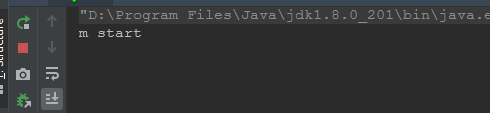

# 并发基础一

 - [一、基础概念](#一基础概念)
 - [二、线程状态](#二线程状态)
 - [三、中断线程interrupt](#三中断线程interrupt)
 - [四、守护线程](#四守护线程)
 - [五、sleep、yield、join](#五sleepyieldjoin)
 - [六、synchronized](#六synchronized)
    - [1、加锁简单演示]
    - [2、给某个对象加锁]
    - [3、给当前对象加锁]
    - [4、synchronized原理]
    - [5、给类加锁]
    - [6、同步方法和非同步方法可以被同时执行]
    - [7、可重入性]
    - [8、抛出异常锁释放]
    - [9、某个引用指向的对象改变，则原先对象的就释放]
    - [10、同步容器注意事项]
 - [七、volatile]
 - [八、线程协作]
    - [1、场景]
    - [2、wait/notify]
    - [3、生产者消费者模式]
    - [4、同时开始]
    - [5、等待结束(MyCountDownLatch)]
    - [6、异步结果(MyExcutor)]

## 一、基础概念

**CPU时间片轮转机制**

又称RR调度，会导致上下文切换 ，所以并发不一定比单线程快。

**什么是进程和线程**

进程：程序运行资源分配的最小单位，进程内部有多个线程，会共享这个进程的资源

线程：CPU调度的最小单位，必须依赖进程而存在。 

**澄清并行和并发**

并行：同一时刻，可以同时处理事情的能力

并发：与单位时间相关，在单位时间内可以处理事情的能力

**线程**

**创建线程需要消耗操作系统的资源，操作系统会为每个线程创建必要的数据结构、栈、程序计数器等**，创建也需要一定的时间。

此外，线程调度和切换也是有成本的，当有当量可运行线程的时候，操作系统会忙于调度，**为一个线程分配一段时间，执行完后，再让另一个线程执行，一个线程被切换出去后，操作系统需要保存它的当前上下文状态到内存，上下文状态包括当前CPU寄存器的值、程序计数器的值等，而一个线程被切换回来后，操作系统需要恢复它原来的上下文状态，整个过程被称为上下文切换**，这个切换不仅耗时，而且使CPU中的很多缓存失效，是有成本的。

**为什么是start而不是run?**

start表示启动该线程，使其成为一条单独的执行流，背后，操作系统会分配线程相关的资源，每个线程会有单独的程序执行计数器和栈，操作系统会把这个线程作为一个独立的个体进行调度，分配时间片让它执行，执行的起点就是run方法。

Thread中使用了[模板方法设计模式](https://blog.csdn.net/zxzxzx0119/article/details/81709199)，也就是我们继承Thread类，重写的是`run()`方法(钩子方法)，但是调用的却是`start()`方法(最终方法)的原因。

在`start()`方法中调用了`start0()`方法，然后在`start0()`中调用了`run()`方法。

## 二、线程状态


* New：`new Thread()`后线程的状态就是新建。
* Runnable : 可能正在运行，也可能正在等待 CPU 时间片，包含了操作系统线程状态中的 Running 和 Ready。
* BLOCKED : 尝试获取排他锁，线程试图获取一个内部对象的`Monitor`（进入`synchronized`方法或`synchronized`块）但是其他线程已经抢先获取，那此线程被阻塞，直到其他线程释放`Monitor`并且线程调度器允许当前线程获取到`Monitor`，此线程就恢复到可运行状态(Runnable)。
* Waiting : 等待其它线程显式地唤醒，否则不会被分配 CPU 时间片。
* Timed Waiting : 无需等待其它线程显式地唤醒，在一定时间之后会被系统自动唤醒。

> 睡眠和挂起是用来描述行为，而阻塞和等待用来描述状态。
>
> 阻塞和等待的区别在于，阻塞是被动的，它是在等待获取一个排它锁。而等待是主动的，通过调用 `Thread.sleep()` 和` Object.wait() `等方法进入。

## 三、中断线程interrupt

不能用stop()、resume()等强制终止线程，**java线程是协作式，而非抢占式**

* 调用一个线程的`interrupt() `方法中断一个线程，并不是强行关闭这个线程，只是跟这个线程打个招呼，**将线程的中断标志位置为true**，线程是否中断，由线程本身决定。	

* `isInterrupted() `判定当前线程是否处于中断状态。

* static方法`interrupted() `判定当前线程是否处于中断状态，**同时中断标志位改为false**。

* **方法里如果抛出`InterruptedException`，线程的中断标志位会被复位成false**，如果确实是需要中断线程，要求我们自己在catch语句块里再次调用`interrupt()`。

```java
/**
 * 继承Thread的时候使用的中断线程的方法
 */
public class T1_中断线程_Interrupt {

    private static class T extends Thread{
        @Override
        public void run() {
            String threadName = Thread.currentThread().getName();
            while(!isInterrupted()){ //这里就体现了 java里面的协作式，而不是抢占式
                System.out.println(threadName + " is run !");
            }
            System.out.println(threadName + " interrupt flag is " + isInterrupted());
        }
    }

    public static void main(String[] args) throws InterruptedException {
        T t = new T();
        t.start();
        Thread.sleep(20);
        t.interrupt();
    }
}

```

如果是Runnable，就要用`Thread.currentThread()`。

```java
/**
 * 实现Runnable的中断线程的方法
 */
public class T2_中断线程_Interrupt {

    private static class T implements Runnable{

        @Override
        public void run() {
            String threadName = Thread.currentThread().getName();
            while(!Thread.currentThread().isInterrupted()){ //这里必须要用Thread.currentThread()，不能用直接isInterrupted
                System.out.println(threadName + "is run!");
            }
            System.out.println(threadName + " interrupt flag is " + Thread.currentThread().isInterrupted());
        }
    }

}

```

抛出异常之后，flag就会变成false：

```java
public class T3_中断线程_InterruptedException {

    private static class T extends Thread{

        @Override
        public void run() {
            while(!isInterrupted()){
                try {
                    Thread.sleep(100);
                } catch (InterruptedException e) {
                    System.out.println("in catch, flag : " + isInterrupted()); // 这里抛出了InterruptedException之后，flag = false，必须要重新 interrupt()一下，才会true
                    interrupt(); //重新置flag为 true
                    e.printStackTrace();
                }
                System.out.println("in while, flag : " + isInterrupted());
            }
            System.out.println("in outside, flag : " + isInterrupted());
        }
    }

    public static void main(String[] args) throws InterruptedException {
        T t = new T();
        t.start();
        Thread.sleep(20);
        t.interrupt();

    }
}
```

此外:

如果线程在等待锁，对线程对象调用interrupt()只是会设置线程的中断标志位，线程依然会处于BLOCKED状态，也就是说**interrupt()并不能使一个在等待锁的线程真正"中断"**

在使用synchronized关键字获取锁的过程中不响应中断请求，这是synchronized的局限性。如果这对程序是一个问题，应该使用显式锁，后面我们会介绍显式锁Lock接口，它支持以响应中断的方式获取锁。

```java
package p_interrupt;

public class InterruptSynchronizedDemo {

    private static final Object lock = new Object();

    private static class A extends Thread {
        @Override
        public void run() {
            synchronized (lock) {
                while (!Thread.currentThread().isInterrupted()) {
                }
            }
            System.out.println("exit");
        }
    }

    public static void main(String[] args) throws InterruptedException {
        synchronized (lock) {
            A a = new A();
            a.start();
            Thread.sleep(1000);

            a.interrupt();
            // interrupt()并不能使一个在等待锁的线程真正"中断"
            a.join();  //需要注释这个，才会输出 exit,如果不结束，即使 a.interrupt被中断，也不会让a获得锁去执行
        }
    }
}
```

## 四、守护线程

**守护线程**  （与之对应的是用户线程）

* JVM会在所有的非守护线程（用户线程）执行完毕后退出，只要当前JVM实例中尚存在任何一个非守护线程没有结束，守护线程就全部工作；只有当最后一个非守护线程结束时，守护线程随着JVM一同结束工作。
* main线程是用户线程；
* 仅有main线程一个用户线程执行完毕，不能决定JVM是否退出，也即是说main线程并不一定是最后一个退出的线程。
* 守护线程和main线程 **共死**，如果将某个线程t设置为守护线程，也就是`t.setDaemon(true)`，就会在main线程结束的时候，这个线程也会结束（即使守护线程里面的`finally`也不会执行）。
* JVM启动时，实际上有多个线程，但是至少有一个**非守护线程**；

## 五、sleep、yield、join

### 1、sleep、yield以及区别

sleep : 会休眠当前正在执行的线程，**该线程会让出CPU**，但睡眠的时间不一定是确切的给定毫秒数，可能有一定的偏差，偏差与系统定时器和操作系统调度器的准确度和精度有关。可能会抛出 `InterruptedException`。

yield :  调用该方法，调用`yield()`方法会使得当前线程从`RUNNING`状态切换到`RUNNABLE`状态。**是告诉操作系统的调度器，我现在不着急占用CPU，你可以先让其他线程运行**。不过，这对调度器也仅仅是建议，调度器如何处理是不一定的，它可能完全忽略该调用。

看过前面的内容之后，会发现 yield 和 sleep 有一些混淆的地方， 在 JDK1.5 以前的版本中 yield 的方法事实上是调用了 `sleep(0)`，但是它们之间存在着本质的区别，具体如下。

* `sleep` 会导致当前线程暂停指定的时间，没有 CPU 时间片的消耗。

* `yield` 只是对 CPU 调度器的一个提示，如果 CPU 调度器没有忽略这个提示，它会导致线程上下文的切换。

* `sleep` 会使线程短暂 block，会在给定的时间内释放 CPU 资源。

* `yield` 会使RUNNING 状态的 Thread 进入RUNNABLE 状态 (如果 CPU 调度器没有忽略这个提示的话)。
  
* `sleep` 几乎百分之百地完成了给定时间的休眠，而 yield 的提示并不能一定担保。

* 一个线程 sleep 另一个线程调用 interrupt 会捕获到**中断信号**，而 yield 则不会。
### 2、join

join :   b 线程中调用了 a 线程的 join() 方法，b 线程会等待 a 线程结束才继续执行。

```java
public class JoinTest2 {

    static class A1 extends Thread{
        @Override
        public void run() {
            System.out.println("A1");
        }
    }

    static class A2 extends Thread{
        @Override
        public void run() {
            System.out.println("A2");
        }
    }

    static class B extends Thread{
        @Override
        public void run() {
            A1 a1 = new A1();
            A2 a2 = new A2();

            a1.start();
            a2.start();

            try {
                a1.join();
                a2.join();
                System.out.println("B");
            } catch (InterruptedException e) {
                e.printStackTrace();
            }
        }
    }
    public static void main(String[] args) {
        new B().start();
    }
}

```

输出 (A1和A2可以交换顺序，但是一定在B之前)：

```java
A2
A1
B
```

join需要中注意的是: 如果上述我只 `a1.join`，注释掉`a2.join`，那么B只会等待`a1`结束，也就是说`B`可能比`a2`更早结束，会输出: 

```java
A1
B
A2
```

Join的另一个应用: **线程顺序打印**。

```java
public class JoinTest3 {

    public static void main(String[] args) throws Exception {
        Thread previous = Thread.currentThread();

        for (int i = 0; i < 10; i++) {
            // 每个线程拥有前一个线程的引用，需要等待前一个线程终止，才能从等待中返回
            Thread thread = new Thread(new T(previous), String.valueOf(i));
            thread.start();
            previous = thread;
        }
        TimeUnit.SECONDS.sleep(3);
        System.out.println(Thread.currentThread().getName() + " terminate.");
    }

    static class T implements Runnable {

        private Thread preThread;

        public T(Thread thread) {
            this.preThread = thread;
        }

        public void run() {
            try {
                preThread.join();
            } catch (InterruptedException e) {
            }
            System.out.println(Thread.currentThread().getName() + " terminate.");
        }
    }
}
```

```java
main terminate.
0 terminate.
1 terminate.
2 terminate.
3 terminate.
4 terminate.
5 terminate.
6 terminate.
7 terminate.
8 terminate.
9 terminate.
```

join实际上就是调用了wait，其主要代码是：

```java
while (isAlive()) {
    wait(0);
}
```

只要线程是活着的，isAlive()返回true，join就一直等待。谁来通知它呢？当线程运行结束的时候，Java系统调用notifyAll来通知。

## 六、synchronized

### 1、加锁简单演示

如果不加锁，最后的count就不一定是100。

```java

public class T implements Runnable {

    private int count = 0;

    // 如果不加 synchronized就会出现问题，因为我只有一个t(Thread)对象，有5个线程在同时访问count
    // 加了这个synchronized之后就可以了，锁住了当前的对象, synchronized代码块是原子操作
    public /*synchronized*/ void run() {
        count++;
        System.out.println(Thread.currentThread().getName() + " count = " + count);
    }

    public static void main(String[] args) {
        T t = new T();
        for (int i = 0; i < 100; i++) {
            new Thread(t, "THREAD" + i).start();
        }
    }
}
```

### 2、给某个对象加锁

```java
/**
 * synchronized 对某个对象加锁,注意不是对某个代码块加锁
 */
public class T {

    private int count = 10;

    private Object o = new Object(); //锁

    public void m(){
        synchronized(o){ //o 指向了堆内存的一把锁
            count--;
            System.out.println(Thread.currentThread().getName() + "count = " + count);
        }
    }
}
```

### 3、给当前对象加锁

```java
/**
 * synchronized 对this加锁，只要这个对象new了出来，就对自己加锁
 */
public class T {

    private int count = 10;

    public void m(){
        synchronized(this){// 任何线程想要执行下面的代码，必须要拿到this对象的锁
            count--;
            System.out.println(Thread.currentThread().getName() + "count = " + count);
        }
    }
}

//上面的m()方法也可以写成
// 锁定的是当前的对象
public synchronized void m() {
    count--;
    System.out.println(Thread.currentThread().getName() + "count = " + count);
}
```

此作用域内的synchronized锁 ，可以防止多个线程同时访问这个对象的synchronized方法。

不同对象实例的synchronized方法是不相干预的。也就是说，其它线程可以同时访问此类下的**另一个对象实例**中的synchronized方法；

### 4、synchronized原理

synchronized实例方法保护的是当前实例对象，即this，this对象有一个锁和一个等待队列，锁只能被一个线程持有，其他试图获得同样锁的线程需要等待，执行synchronized实例方法的过程大概如下：

1、尝试获得锁，如果能够获得锁，继续下一步，否则加入等待队列，阻塞并等待唤醒

2、执行实例方法体代码

3、释放锁，如果等待队列上有等待的线程，从中取一个并唤醒，如果有多个等待的线程，唤醒哪一个是不一定的，不保证公平性

**当前线程不能获得锁的时候，它会加入等待队列等待，线程的状态会变为BLOCKED**。

再强调下，synchronized保护的是对象而非代码，只要访问的是同一个对象的synchronized方法，即使是不同的代码，也会被同步顺序访问，比如，对于Counter中的两个实例方法getCount和incr(都是synchronized的)，对同一个Counter对象，一个线程执行getCount，另一个执行incr，它们是不能同时执行的，会被synchronized同步顺序执行。

此外，需要说明的，**synchronized方法不能防止非synchronized方法被同时执行**。


synchronized本质是对一个对象的监视器（monitor）进行获取，而这个获取过程是排他的。

对象、对象的监视器、同步队列和执行线程之间的关系图:


**同步代码块是使用monitorenter和monitorexit指令实现的**，同步方法（在这看不出来需要看JVM底层实现）依靠的是方法修饰符上的ACC_SYNCHRONIZED实现。

多个线程是可以同时执行同一个synchronized实例方法的，只要它们访问的对象是不同的。

synchronized静态方法和synchronized实例方法保护的是不同的对象，**不同的两个线程，可以同时，一个执行synchronized静态方法，另一个执行synchronized实例方法** （锁类和锁对象不相干）。


同步代码块：monitorenter指令插入到同步代码块的开始位置，**monitorexit指令插入到同步代码块的结束位置，JVM需要保证每一个monitorenter都有一个monitorexit与之相对应。任何对象都有一个monitor与之相关联，当且一个monitor被持有之后，他将处于锁定状态**。

线程执行到monitorenter指令时，将会尝试获取对象所对应的monitor所有权，即尝试获取对象的锁； 同步方法：synchronized方法则会被翻译成普通的方法调用和返回指令如:invokevirtual、areturn指令，在VM字节码层面并没有任何特别的指令来实现被synchronized修饰的方法，而是在Class文件的方法表中将该方法的`access_flags`字段中的synchronized标志位置1，表示该方法是同步方法并使用调用该方法的对象或该方法所属的Class在JVM的内部对象表示Class做为锁对象。


### 5、给类加锁

`m1`和`m2`都需要加上`static`关键字。

```java
/**
 * synchronized 对this加锁，只要这个对象new了出来，就对自己加锁
 */
public class T implements Runnable{

    private static int count = 0;

    //这里等同于synchronized(thread.c_004.T.class)
    //反射，都是Class类的一个对象
    public synchronized /**static**/ void m1() {
        count++;
        System.out.println(Thread.currentThread().getName() + " count = " + count);
    }

    //和上面一样
    public /**static*/ void m2() {
        synchronized(T.class) {
            count++;
        }
    }

    @Override
    public void run() {
        m1();
    }

    public static void main(String[] args) {
        for (int i = 0; i < 100; i++) {
            new Thread(new T(), "THREAD" + i).start(); //这里每次都是new T(),如果是实例方法,就会有问题
        }
    }
}
```

对象锁和类锁(锁住Class)也是不相干预的；

### 6、同步方法和非同步方法可以被同时执行

```java
/**
 *  同步和非同步方法是否可以同时调用？ : 可以
 *  因为虽然对象被锁住了，但是m2不需要看那把锁
 */
public class T  {

    public synchronized void m1() {
        System.out.println(Thread.currentThread().getName() + " m1 start...");
        try {
            Thread.sleep(10000);
        } catch (InterruptedException e) {
            e.printStackTrace();
        }
        System.out.println(Thread.currentThread().getName() + " m1 end");
    }

    public void m2() {
        try {
            Thread.sleep(5000);
        } catch (InterruptedException e) {
            e.printStackTrace();
        }
        System.out.println(Thread.currentThread().getName() + " m2 ");
    }

    public static void main(String[] args){
        T t = new T();

        /*new Thread(()->t.m1(), "t1").start();
        new Thread(()->t.m2(), "t2").start();*/

        new Thread(t::m1, "t1").start(); //方法推导
        new Thread(t::m2, "t2").start();

        /*
        new Thread(new Runnable() {
            @Override
            public void run() {
                t.m1(); // 在run方法中调用了 m1()
            }
        });
        */
    }
}
```

输出:

```java
t1 m1 start...
t2 m2 
t1 m1 end
```

可以看到`t2`线程在`t1`线程调用`m1()`方法的同时，自己也调用了`m1()`方法。

即`t`对象虽然被锁住了。但是多个线程可以调用非同步的方法(调用`m2()`的时候不需要看那个锁)。

但是如果将`m2()`方法也加上`synchronized`，那执行结果就是下面这样了:(因为`synchronized`锁住的是对象)

```java
t1 m1 start...
t1 m1 end
t2 m2 
```

### 7、可重入性

synchronized有一个重要的特征，它是可重入的，也就是说，对同一个执行线程，它在获得了锁之后，在调用其他需要同样锁的代码时，可以直接调用，比如说，在一个synchronized实例方法内，可以直接调用其他synchronized实例方法。可重入是一个非常自然的属性，应该是很容易理解的，之所以强调，是因为并不是所有锁都是可重入的(后续章节介绍)。

**可重入是通过记录锁的持有线程和持有数量来实现的，当调用被synchronized保护的代码时，检查对象是否已被锁，如果是，再检查是否被当前线程锁定，如果是，增加持有数量，如果不是被当前线程锁定，才加入等待队列，当释放锁时，减少持有数量，当数量变为0时才释放整个锁**。

> 注意一点，synchronized关键字是不能继承的，也就是说，基类的方法synchronized fun(){} 在继承类中并不自动是synchronized fun(){}，而是变成了fun(){}。继承时，需要显式的指定它的某个方法为synchronized方法。

### 8、抛出异常锁释放

```java
/**
 * 线程抛出异常之后: 锁就会被释放
 *
 * 程序在执行过程中，如果出现异常，默认情况锁会被释放
 * 所以，在并发处理的过程中，有异常要多加小心，不然可能会发生不一致的情况。
 * 比如，在一个web app处理过程中，多个servlet线程共同访问同一个资源，这时如果异常处理不合适，
 * 在第一个线程中抛出异常，其他线程就会进入同步代码区，有可能会访问到异常产生时的数据。
 * 因此要非常小心的处理同步业务逻辑中的异常
 */
public class T {

    int count = 0;

    synchronized void m() {
        System.out.println(Thread.currentThread().getName() + " start");
        while(true) {
            count ++;
            System.out.println(Thread.currentThread().getName() + " count = " + count);

            try {
                TimeUnit.SECONDS.sleep(1);
            } catch (InterruptedException e) {
                e.printStackTrace();
            }
            
            if(count == 5) {
                int i = 1/0;  //此处抛出异常，锁将被释放，要想不被释放，可以在这里进行catch，然后让循环继续
                System.out.println(i);
            }
        }
    }


    // 如果没有t没有释放锁， t2应该是永远得不到执行，但是t1出现了异常，释放了锁，所以得到了执行
    public static void main(String[] args) throws InterruptedException {
        T t = new T();

        Runnable r = new Runnable() {
            @Override
            public void run() {
                t.m();
            }
            
        };
        new Thread(r, "t1").start();

        TimeUnit.SECONDS.sleep(3);

        new Thread(r, "t2").start();
    }
}

```

看程序输出，本来`t2`线程是永远得不到执行的，但是`t1`发生了异常，所以`t2`得到了执行。


### 9、某个引用指向的对象改变，则原先对象的就释放

某个对象的锁指的是在堆内对象的所，而不是在栈中引用的锁，所以当栈内的引用指向了堆的别的对象，那么原来的对象的锁就不存在了。

```java
/**
 * 锁是所在堆内存中，而不是栈内存中，当某个引用指向了别的地方，原先那个被指向的对象的锁就释放了
 * 即:
 * 锁定某对象o，如果o的属性发生改变，不影响锁的使用
 * 但是如果o变成另外一个对象，则锁定的对象发生改变
 * 应该避免将锁定对象的引用变成另外的对象
 */
public class T {

    Object o = new Object();

    void m() {
        synchronized(o) {
            while(true) {
                try {
                    TimeUnit.SECONDS.sleep(1);
                } catch (InterruptedException e) {
                    e.printStackTrace();
                }
                System.out.println(Thread.currentThread().getName());
            }
        }
    }

    public static void main(String[] args) {
        T t = new T();
        //启动第一个线程
        new Thread(t::m, "t1").start();
        
        try {
            TimeUnit.SECONDS.sleep(3);
        } catch (InterruptedException e) {
            e.printStackTrace();
        }

        //创建第二个线程
        Thread t2 = new Thread(t::m, "t2");

        //锁对象发生改变(指向了别的地方)，然后t1的锁就释放了, 所以t2线程得以执行，如果注释掉下面这句话，线程2将永远得不到执行机会
        t.o = new Object();
        t2.start();
    }
}
```

输出:

```java
t1
t1
t1
t2
t1
t2
t1
t2
t1
t2
```

### 10、同步容器注意事项

加了synchronized，所有方法调用变成了原子操作，客户端在调用时，是不是就绝对安全了呢？不是的，至少有以下情况需要注意：

- 复合操作，比如先检查再更新
- 伪同步(加锁不是同一个对象)
- 迭代

## 七、volatile

```java
/**
 * volatile: 保证线程之间的可见性
 * volatile 关键字，使一个变量在多个线程间可见
 * A B线程都用到一个变量，java默认是A线程中保留一份copy，这样如果B线程修改了该变量，则A线程未必知道
 * 使用volatile关键字，会让所有线程都会读到变量的修改值 (不是说每次都要去读一遍，而是这个值有改动就重新读一下)
 * 使用volatile，将会强制所有线程都去堆内存中读取running的值 (不会读缓存的内容)
 * 可以阅读这篇文章进行更深入的理解
 * http://www.cnblogs.com/nexiyi/p/java_memory_model_and_thread.html
 */
public class T {

    //对比一下有无volatile的情况下，整个程序运行结果的区别
   /** volatile**/ boolean running = true;   // volatile，可以保证每次都是从内存读，读完之后就写到内存(缓存),内存可见性，禁止指令重排
    void m() {
        System.out.println("m start");

        while(running) {
             //虽然加了下面的代码（或者别的代码，可以结束程序(和volatile)一样的结果，但是还是要加volatile，因为下面的是随机性的）
//            try {
//                TimeUnit.MILLISECONDS.sleep(10);
//            } catch (InterruptedException e) {
//                e.printStackTrace();
//            }
        }

        System.out.println("m end!");
    }

    public static void main(String[] args) {
        T t = new T();

        new Thread(t::m, "t1").start();
        //new Thread(()->t.m(), "t1").start();

        try {
            TimeUnit.SECONDS.sleep(1);
        } catch (InterruptedException e) {
            e.printStackTrace();
        }

        t.running = false;
    }
}
```

不加`volatile`的话，`m end!`这句不会输出。



## 五、线程协作

### 1、场景

* 生产者/消费者协作模式
* 同时开始
* 等待结束
* 异步结果
* 集合点

### 2、wait/notify

```java
public class T extends Thread {

    private volatile boolean fire = false; //注意这里要加volatile

    @Override
    public void run() {
        try {
            synchronized (this) {
                while (!fire) {
                    wait();
                }
            }
            System.out.println("fired....");
        } catch (InterruptedException e) {
        }
    }

    public synchronized void fire() {
        this.fire = true;
        notify();
    }

    public static void main(String[] args) throws InterruptedException {
        T t = new T();
        t.start();

        Thread.sleep(1000);

        System.out.println("fire....");
        t.fire();
    }
}
```

输出:

```java
fire....
fired....
```

每个对象都有一把锁和等待队列，一个线程在进入synchronized代码块时，会尝试获取锁，获取不到的话会把当前线程加入等待队列中，其实，除了用于锁的等待队列，每个对象还有另一个等待队列，表示条件队列，该队列用于线程间的协作。调用wait就会把当前线程放到条件队列上并阻塞，表示当前线程执行不下去了，它需要等待一个条件，这个条件它自己改变不了，需要其他线程改变。当其他线程改变了条件后，应该调用Object的notify方法。

两个线程都要访问协作的变量fire，容易出现竞态条件，所以相关代码都需要被synchronized保护。实际上，wait/notify方法只能在synchronized代码块内被调用，如果调用wait/notify方法时，当前线程没有持有对象锁，会抛出异常`java.lang.IllegalMonitorStateException`。

你可能会有疑问，如果wait必须被synchronzied保护，那一个线程在wait时，另一个线程怎么可能调用同样被synchronzied保护的notify方法呢？它不需要等待锁吗？我们需要进一步理解wait的内部过程，虽然是在synchronzied方法内，但调用wait时，线程会释放对象锁，wait的具体过程是：

1、把当前线程放入条件等待队列，释放对象锁，阻塞等待，线程状态变为WAITING或TIMED_WAITING

2、等待时间到或被其他线程调用notify/notifyAll从条件队列中移除，这时，

要重新竞争对象锁 （锁等待队列）

- 如果能够获得锁，线程状态变为RUNNABLE，并从wait调用中返回
- 否则，该线程加入对象锁等待队列，线程状态变为BLOCKED，只有在获得锁后才会从wait调用中返回


线程从wait调用中返回后，不代表其等待的条件就一定成立了，它需要重新检查其等待的条件，一般的调用模式是：

```java
synchronized (对象) {
    while (条件不成立)
        对象.wait();
    ... // 执行条件满足后的操作
}
```

比如，上例中的代码是：

```java
synchronized(对象) {
    改变条件
    对象.notifyAll();
}
```

注意:

* 调用wait()方法后，线程状态由RUNNING变为WAITING，并将当前线程放置到对象的等待队列。

* 调用notify会把在条件队列中等待的线程唤醒并从队列中移除，但它不会释放对象锁，也就是说，只有在包含notify的synchronzied代码块执行完后，等待的线程才会从wait调用中返回。
* notify()方法将等待队列中的一个等待线程从等待队列中移到同步队列中，而notifyAll()方法则是将等待队列中所有的线程全部移到同步队列，**被移动的线程状态由WAITING变为BLOCKED**(在锁等待队列中)。

### 3、生产者消费者模式

```java
public class ProducerConsumerTest {

    static class MyBlockingQueue<E> {
        private Queue<E> queue;
        private int limit;

        public MyBlockingQueue(int limit) {
            this.limit = limit;
            queue = new ArrayDeque<>(limit);
        }

        public synchronized void put(E e) throws InterruptedException {
            while (queue.size() == limit) {
                wait();
            }
            queue.add(e);
            notifyAll();
        }

        public synchronized E take() throws InterruptedException {
            while (queue.isEmpty()) {
                wait();
            }
            E e = queue.poll();
            notifyAll();
            return e;
        }
    }

    static class Producer extends Thread {
        MyBlockingQueue<String> queue;
        public Producer(MyBlockingQueue<String> queue) {
            this.queue = queue;
        }
        @Override
        public void run() {
            int num = 0;
            try {
                while (true) {
                    String task = String.valueOf(num);
                    queue.put(task);
                    System.out.println("P " + task);
                    num++;
                    Thread.sleep((int) (Math.random() * 100));
                }
            } catch (InterruptedException e) {
            }
        }
    }

    static class Consumer extends Thread {
        MyBlockingQueue<String> queue;
        public Consumer(MyBlockingQueue<String> queue) {
            this.queue = queue;
        }
        @Override
        public void run() {
            try {
                while (true) {
                    String task = queue.take();
                    System.out.println("C " + task);
                    Thread.sleep((int)(Math.random()*100));
                }
            } catch (InterruptedException e) {
            }
        }
    }

    public static void main(String[] args) {
        MyBlockingQueue<String> queue = new MyBlockingQueue<>(10);
        new Producer(queue).start();
        new Consumer(queue).start();
    }

}
```

MyBlockingQueue是一个长度有限的队列，长度通过构造方法的参数进行传递，有两个方法put和take。put是给生产者使用的，往队列上放数据，满了就wait，放完之后调用notifyAll，通知可能的消费者。take是给消费者使用的，从队列中取数据，如果为空就wait，取完之后调用notifyAll，通知可能的生产者。

我们看到，put和take都调用了wait，但它们的目的是不同的，或者说，它们等待的条件是不一样的，put等待的是队列不为满，而take等待的是队列不为空，但它们都会加入相同的条件等待队列。

### 4、同时开始

```java
public class BeginAtSame {
    static class FireFlag {
        private volatile boolean fired = false;

        public synchronized void waitForFire() throws InterruptedException {
            while (!fired) {
                wait();
            }
        }

        public synchronized void fire() {
            this.fired = true;
            notifyAll();
        }
    }

    static class Racer extends Thread {
        FireFlag fireFlag;

        public Racer(FireFlag fireFlag) {
            this.fireFlag = fireFlag;
        }

        @Override
        public void run() {
            try {
                this.fireFlag.waitForFire();
                System.out.println("start run " + Thread.currentThread().getName());
            } catch (InterruptedException e) {
            }
        }
    }

    public static void main(String[] args) throws InterruptedException {
        FireFlag fireFlag = new FireFlag();

        Thread[] racers = new Thread[10];
        for (int i = 0; i < 10; i++) {
            racers[i] = new Racer(fireFlag); //用同一个fireFlag
            racers[i].start();
        }

        Thread.sleep(1000);
        fireFlag.fire(); // 开枪
    }
}

```

同时开始，类似于运动员比赛，在听到比赛开始枪响后同时开始，下面，我们模拟下这个过程，这里，有一个主线程和N个子线程，每个子线程模拟一个运动员，主线程模拟裁判，它们协作的共享变量是一个开始信号。我们用一个类FireFlag来表示这个协作对象。

### 5、等待结束(MyCountDownLatch)

等待结束可以用`join`实现，这里先利用`wait/notify`实现一个类似`CountDownLatch`。

```java
/**
 * 类似 for(t : ts) t.join()的功能
 */
public class WaitingForEnd {

    static class MyCountDownLatch {
        private int count;

        public MyCountDownLatch(int count) {
            this.count = count;
        }

        public synchronized void await() throws InterruptedException {
            while (count > 0) {
                wait();
            }
        }

        public synchronized void countDown() {
            count--;
            if (count <= 0) {
                notifyAll();
            }
        }
    }

    static class T extends Thread {
        MyCountDownLatch latch;

        public T(MyCountDownLatch latch) {
            this.latch = latch;
        }

        @Override
        public void run() {
            try {
                // 模拟working
                System.out.println(Thread.currentThread().getName() + "  working..." );
                Thread.sleep((int) (Math.random() * 1000));
                latch.countDown();
            } catch (InterruptedException e) {
            }
        }
    }

    public static void main(String[] args) throws InterruptedException {

        MyCountDownLatch latch = new MyCountDownLatch(10);

        T[] ts = new T[10];
        for (int i = 0; i < 10; i++) {
            ts[i] = new T(latch);
            ts[i].start();
        }
        latch.await();

        System.out.println("main terminate..");
    }
}

```

### 6、异步结果(MyExcutor)

```java
import java.util.ArrayList;
import java.util.List;
import java.util.concurrent.Callable;

public class AsynchronousResult {

    interface MyFuture<V> {
        V get() throws Exception;
    }

    // execute启动一个线程，并返回MyFuture对象，MyFuture的get方法会阻塞等待直到线程运行结束。
    static class MyExecutor {

        public <V> MyFuture<V> execute(final Callable<V> task) {
            final Object lock = new Object();
            final ExecuteThread<V> thread = new ExecuteThread<>(task, lock); //有一把锁
            thread.start();
            MyFuture<V> future = () -> {  // new MyFuture<V>(){}  + 实现 public V get()
                synchronized (lock) {
                    while (!thread.isDone()) {
                        try {
                            lock.wait();
                        } catch (InterruptedException e) {
                        }
                    }
                    if (thread.getException() != null) {
                        throw thread.getException();
                    }
                    return thread.getResult();
                }
            };
            return future;
        }

    }

    static class ExecuteThread<V> extends Thread {
        private V result = null;
        private Exception exception = null;
        private boolean done = false;
        private Callable<V> task;
        private final Object lock;

        public ExecuteThread(Callable<V> task, Object lock) {
            this.task = task;
            this.lock = lock;
        }

        @Override
        public void run() {
            try {
                result = task.call();
            } catch (Exception e) {
                exception = e;
            } finally {
                synchronized (lock) {
                    done = true;
                    lock.notifyAll();
                }
            }
        }

        V getResult() {
            return result;
        }
        boolean isDone() {
            return done;
        }
        Exception getException() {
            return exception;
        }
    }


    public static void main(String[] args) {
        MyExecutor executor = new MyExecutor();

        // 子任务 + 异步调用
        // 异步调用，返回一个MyFuture对象
        MyFuture<List<Integer>> f1 = executor.execute(new MyTask(1, 80000));
        MyFuture<List<Integer>> f2 = executor.execute(new MyTask(80001, 130000));
        MyFuture<List<Integer>> f3 = executor.execute(new MyTask(130001, 170000));
        MyFuture<List<Integer>> f4 = executor.execute(new MyTask(170001, 200000));

        //其他操作...
        try {
            // 获取异步调用的结果
            ArrayList<Integer> res = new ArrayList<>();
            res.addAll(f1.get());
            res.addAll(f2.get());
            res.addAll(f3.get());
            res.addAll(f4.get());

            System.out.println(res);

        } catch (Exception e) {
            e.printStackTrace();
        }
    }

    static class MyTask implements Callable<List<Integer>> {
        int startPos, endPos;

        MyTask(int s, int e) {
            this.startPos = s;
            this.endPos = e;
        }

        @Override
        public List<Integer> call() throws Exception {
            List<Integer> r = getPrime(startPos, endPos);
            return r;
        }
    }

    static boolean isPrime(int num) {
        for (int i = 2; i <= Math.sqrt(num); i++)
            if (num % i == 0) return false;
        return true;
    }

    static List<Integer> getPrime(int start, int end) {
        List<Integer> results = new ArrayList<>();
        for (int i = start; i <= end; i++)  if (isPrime(i)) results.add(i);
        return results;
    }

}
```

MyExecutor的execute方法它封装了创建子线程，同步获取结果的过程，它会创建一个执行子线程。

这个子线程执行实际的子任务，记录执行结果到result变量、异常到exception变量，执行结束后设置共享状态变量done为true**并调用notifyAll以唤醒可能在等待结果的主线程**。

execute()启动一个线程，并返回MyFuture对象，MyFuture的get方法会阻塞等待直到线程运行结束。

