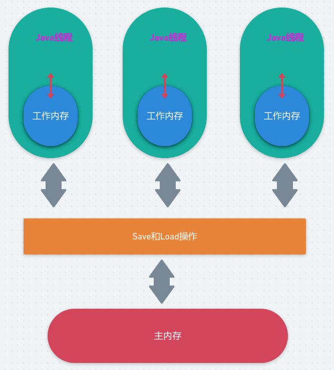

# Java内存模型

### 1、线程之间如何通信

* 共享内存: 在共享内存的并发模型里，线程通过处理器在总线上嗅探其他处理器的写操作，进而将自己的缓存行失效使得下次访问共享变量时重新到主内存中读，这称为隐式通信，对开发人员是透明的。
* 传递消息: 在传递消息的并发模型里，线程之间没有公共状态，只有通过传递消息来显示的通信(如wait/notify、join、PipeReader/PipeWriter)

### 2、线程之间如何同步

同步: 指程序中用于控制不同线程间操作发生相对顺序的机制。

> Java实现线程同步的几种方法: https://www.cnblogs.com/kaleidoscope/p/9767318.html

### 3、Java内存模型的抽象结构

本地内存是JMM虚拟出来的，它包括 缓存行、写缓冲区等。线程访问共享变量首先要将共享变量复制一份到本地内存，如果对其进行了修改，这个修改在本地内存刷新到主内存之前仅对当前内存可见。

**现在CPU大多数情况下读写都不会直接访问内存（CPU都没有连接到内存的管脚），取而代之的是CPU缓存，CPU缓存是位于CPU与内存之间的临时存储器，它的容量比内存小得多但是交换速度却比内存快得多**。而缓存中的数据是内存中的一小部分数据，但这一小部分是短时间内CPU即将访问的，当CPU调用大量数据时，就可先从缓存中读取，从而加快读取速度。

按照读取顺序与CPU结合的紧密程度，CPU缓存可分为：

- 一级缓存：简称L1 Cache，**位于CPU内核的旁边，是与CPU结合最为紧密的CPU缓存**；
- 二级缓存：简称L2 Cache，分内部和外部两种芯片，内部芯片二级缓存运行速度与主频相同，外部芯片二级缓存运行速度则只有主频的一半；
- 三级缓存：简称L3 Cache，部分高端CPU才有；

图示:

 
每一级缓存中所存储的数据全部都是下一级缓存中的一部分，这三种缓存的技术难度和制造成本是相对递减的，所以其容量也相对递增。

当CPU要读取一个数据时，首先从一级缓存中查找，如果没有再从二级缓存中查找，如果还是没有再从三级缓存中或内存中查找。一般来说每级缓存的命中率大概都有80%左右，也就是说全部数据量的80%都可以在一级缓存中找到，只剩下20%的总数据量才需要从二级缓存、三级缓存或内存中读取。

**当系统运行时，CPU执行计算的过程如下**：

* 1、程序以及数据被加载到主内存；
* 2、指令和数据被加载到CPU缓存；
* 3、CPU执行指令，把结果写到高速缓存；
* 4、高速缓存中的数据写回主内存；

> 参考:  
>
> <https://www.cnblogs.com/xrq730/p/7048693.html>
>
> <https://www.cnblogs.com/xrq730/p/4859107.html>

### 4、从源代码到指令序列的重排序

**什么是重排序**

为了提高程序的并行度编译器和处理器都会做一定的指令重排序，因此你可能会有如下疑问:初始共享变量flag = false, a = 0，线程A执行 `if(flag) { a = 1}`，线程B执行`b = a, flag = true`，按照正常的逻辑线程B在读取a的值时应该为0，因为flag还没被赋值为true，但是实际情况下可能读取到的是1，也就是说a = 1重排序到`if(flag)`前面了。

**重排序规则**

* 对有依赖关系的指令不会进行重排序
* volatile语义
  * 对volatile共享变量的读  不能和  在其之前的指令  重排序；
  * 对volatile共享变量的写  不能和  在其之后的指令  重排序；
  * 对volatile共享变量的读  不能和   对volatile变量的写  重排序；
* synchronized:  synchronized锁获取-释放 和 volatile 变量 读-写有相同的语义；
* CAS: CAS更新操作具有volatile读-写语义；
* final: ①在构造函数内对一个final域的写入，与随后把这个构造对象的引用赋值给一个引用变量，这两个操作不能重排序(确保在对象引用为任意线程可见之前，对象的final域已经被正确初始化了，而普通域不具有这个保障) ②初次读一个final域，与随后初次读这个final域，这两个操作之间不能重排序。

### 5、happen-before

happen-before是JMM表露给程序员的内存可见性规则，让程序员无需关注编译器以及不同处理器的指令重排序和内存屏蔽指令，JMM在中间做了一层封装。

* 程序顺序规则: 一个线程中的每一个规则，happen-before于该线程后续的任意操作；
* 监视器规则: 对一个监视器的释放，happen-before于后续对该监视器的获取；
* volatile变量规则: 对一个volatile域的写，happen-before于后续对该volatile域的读；

* 传递性: 如果 A  happen-before  B，B happen-before C，那么 A happen-before C；

注意: happen-before 并不意味着一个操作先于另一个操作执行，而仅仅代表这个操作的结果对另一个操作可见。

### 6、volatile的内存语义

**写读语义**

当写一个volatile变量时，JMM会把线程对应的本地内存中的所有共享变量(包括非volatile共享变量) 刷新到主内存

当读一个volatile变量时，JMM会把该线程对应的本地内存置为无效，线程接下来从主内存读取相关的共享变量(包括非volatile共享变量)