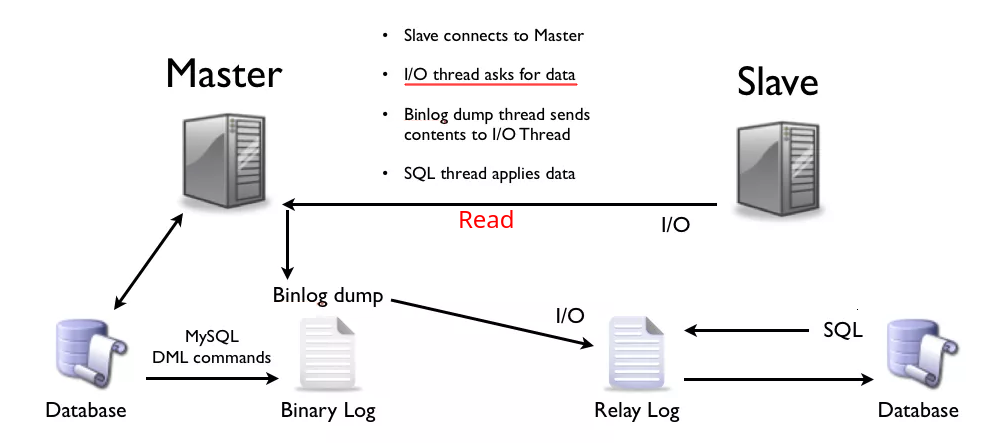
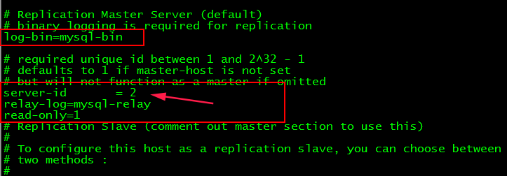
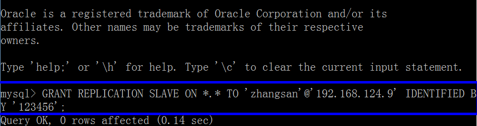
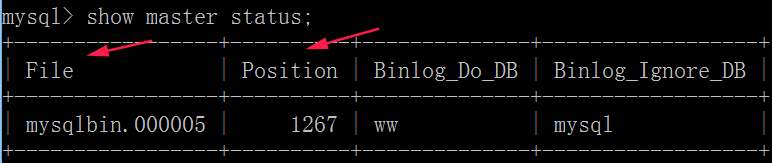
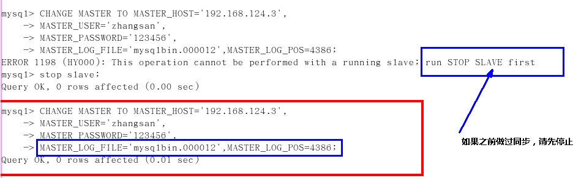
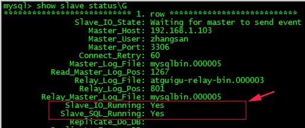

# MYSQL主从复制

## 一、基本原理

MySQL复制过程分成三步：

*  1)、master将改变记录到二进制日志（`binary log`）。这些记录过程叫做二进制日志事件，`binary log events`；
*  2)、slave将master的`binary log events`拷贝到它的中继日志（relay log）；
*  3)、slave重做中继日志中的事件，将改变应用到自己的数据库中。 MySQL复制是异步的且串行化的。

简单来说: **slave会从master读取binlog来进行数据同步**



Mysql的复制（replication）是一个**异步的复制**。

实现整个复制操作主要由三个进程完成的，其中两个进程在Slave（Sql进程和IO进程），另外一个进程在 Master（IO进程）上。 

要实施复制，首先必须打开Master端的`binary log（bin-log）`功能，否则无法实现。

因为整个复制过程实际上就是Slave从Master端获取该日志然后再在自己身上完全顺序的执行日志中所记录的各种操作。 

> 复制的详细过程： 
>
> （1）Slave上面的IO进程连接上Master，并请求从指定日志文件的指定位置（或者从最开始的日志）之后的日志内容； 
>
> （2）Master接收到来自Slave的IO进程的请求后，通过负责复制的IO进程根据请求信息读取制定日志指定位置之后的日志信息，返回给Slave 的IO进程。返回信息中除了日志所包含的信息之外，还包括本次返回的信息已经到Master端的`bin-log`文件的名称以及`bin-log`的位置； 
>
> （3）Slave的IO进程接收到信息后，将接收到的日志内容依次添加到Slave端的`relay-log`文件的最末端，并将读取到的Master端的 bin-log的文件名和位置记录到`master-info`文件中，以便在下一次读取的时候能够清楚的高速Master“我需要从某个bin-log的哪个位置开始往后的日志内容，请发给我”； 
>
> （4）Slave的Sql进程检测到relay-log中新增加了内容后，会马上解析relay-log的内容成为在Master端真实执行时候的那些可执行的内容，并在自身执行。

原则:

* 每个slave只有一个master；
* 每个slave只能有一个唯一的服务器ID；
* 每个master可以有多个salve；

## 二、一主一从相关配置

演示主机为`Windows` (配置文件为`my.ini`文件)，从机为`Linux`（配置文件为`my.cnf`）


### 1、主机配置(windows的my.ini)

* 1)、[必须]主服务器唯一ID；
* ２)、[必须]启用二进制日志；
  * `log-bin=自己本地的路径/data/mysqlbin`。
  * `log-bin=D:/devSoft/MySQLServer5.5/data/mysqlbin`。
* 3)、[可选]启用错误日志
  * `log-err=自己本地的路径/data/mysqlerr`。
  * `log-err=D:/devSoft/MySQLServer5.5/data/mysqlerr`。
* 4)、[可选]根目录
  * `basedir="自己本地路径"`。
  * `basedir="D:/devSoft/MySQLServer5.5/"`。
* 5)、[可选]临时目录
  * `tmpdir="自己本地路径"`。
  * `tmpdir="D:/devSoft/MySQLServer5.5/"`。
* 6)、[可选]数据目录
  * `datadir="自己本地路径/Data/"`。
  * `datadir="D:/devSoft/MySQLServer5.5/Data/"`。
* 7)、[可选]设置不要复制的数据库
  * `binlog-ignore-db=mysql`。
* 8)、[可选]设置需要复制的数据库
  * `binlog-do-db=需要复制的主数据库名字`。

### 2、从机配置(linux的my.cnf)

* [必须]从服务器唯一ID；
* [可选]启用二进制日志；



### 3、因修改过配置文件，请主机+从机都重启后台mysql服务

### 4、主从机都关闭linux防火墙

* windows手动关闭；
* 关闭虚拟机linux防火墙 `service iptables stop`；

### 5、在Windows主机上建立帐户并授权slave

* `GRANT REPLICATION SLAVE ON *.* TO 'zhangsan'@'从机器数据库IP' IDENTIFIED BY '123456';`。
* 刷新一下配置`flush privileges;`。
* 查询master的状态。
  * `show master status;`
  * **记录下File和Position的值**；
* 执行完此步骤后不要再操作主服务器MYSQL，防止主服务器状态值变化。





### 6、在Linux从机上配置需要复制的主机

* 配置

```mysql
CHANGE MASTER TO MASTER_HOST='主机IP',MASTER_USER='zhangsan',MASTER_PASSWORD='123456',MASTER_LOG_FILE='File名字',MASTER_LOG_POS=Position数字;
```

* 启动从服务器复制功能，`start slave;`。
* 查看配置
  * 下面两个参数都是Yes，则说明主从配置成功！
  * `Slave_IO_Running: Yes`。
  * `Slave_SQL_Running: Yes`。

```mysql
CHANGE MASTER TO MASTER_HOST='192.168.124.3',
MASTER_USER='zhangsan',
MASTER_PASSWORD='123456',
MASTER_LOG_FILE='mysqlbin.具体数字',MASTER_LOG_POS=具体值;
```



<div align="center"><div><br>

### 7、主机键表，看从机有没有

### 8、如何停止主从服务复制功能

在`linux`下面输入`stop slave；`。