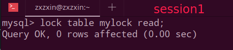
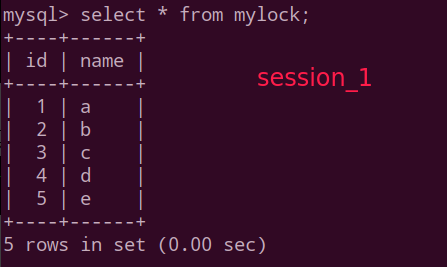
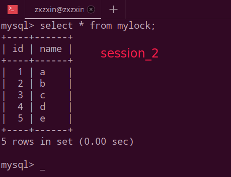
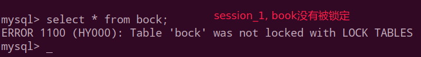
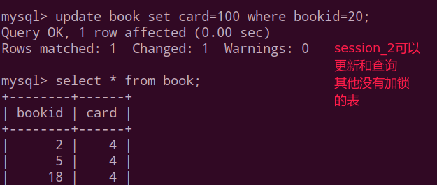
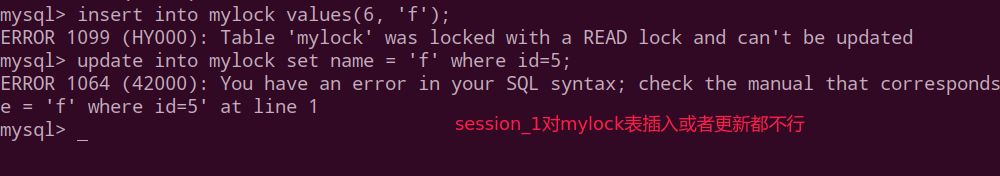

## 一、表锁

偏向MyISAM存储引擎，开销小，加锁快；无死锁；锁定粒度大，发生锁冲突的概率最高,并发度最低。

【手动增加表锁】

```mysql
lock table 表名字1 read(write)，表名字2 read(write)，其它;
```

【查看表上加过的锁】

```mysql
show open tables;
```

【释放表锁】

```mysql
unlock tables;
```

演示:

```mysql
mysql> select * from mylock;
+----+------+
| id | name |
+----+------+
|  1 | a    |
|  2 | b    |
|  3 | c    |
|  4 | d    |
|  5 | e    |
+----+------+
5 rows in set (0.00 sec)

# 给mylock表加读锁,给t1表加写锁
mysql> lock table mylock read, t1 write;
Query OK, 0 rows affected (0.02 sec)

# 查看已经加锁的表, 下面的结果省略了很多行
mysql> show open tables;
+--------------------+------------------------------------------------------+--------+-------------+
| Database           | Table                                                | In_use | Name_locked |
+--------------------+------------------------------------------------------+--------+-------------+
| mysqlad            | t1                                                   |      1 |           0 |
| performance_schema | events_transactions_current                          |      0 |           0 |
| performance_schema | events_statements_summary_by_program                 |      0 |           0 |
| performance_schema | events_waits_summary_by_host_by_event_name           |      0 |           0 |
| mysqlad            | mylock                                               |      1 |           0 |
| performance_schema | file_sum
121 rows in set (0.00 sec)

# 释放表锁
mysql> unlock tables;
Query OK, 0 rows affected (0.00 sec)

```
读锁案例:

| session_1                                                    | session_2                                                    |
| ------------------------------------------------------------ | ------------------------------------------------------------ |
| 获得表mylock的READ锁定<br>       | 连接终端                                                     |
| 当前session_1可以查询该表记录<br> | 其他session(session_2)也可以查询该表<br> |
| 当前session_1不能查询其它没有锁定的表。<br> | 其他session_2可以查询或者更新未锁定的表<br> |
| 当前session_1中插入或者更新锁定的表都会提示错误：<br> | 其他session_2插入或者更新锁定表**会一直等待**获得锁：(阻塞)<br> |
| 释放锁。<br>mysql> unlock tables;                            | **session_2**立即释放阻塞，马上获得锁。<br> |
|                                                              |                                                              |

