# MYSQL锁机制

* [一、锁概述和分类](#一锁概述和分类)
* [二、表锁](#二表锁)
* [三、行锁](#三行锁)
* [四、优化建议](#四优化建议)

## 一、锁概述和分类


## 二、表锁

偏向MyISAM存储引擎，开销小，加锁快；无死锁；锁定粒度大，发生锁冲突的概率最高,并发度最低。

【手动增加表锁】

```mysql
lock table 表名字1 read(write)，表名字2 read(write)，其它;
```

【查看表上加过的锁】

```mysql
show open tables;
```

【释放表锁】

```mysql
unlock tables;
```

演示:

```mysql
mysql> select * from mylock;
+----+------+
| id | name |
+----+------+
|  1 | a    |
|  2 | b    |
|  3 | c    |
|  4 | d    |
|  5 | e    |
+----+------+
5 rows in set (0.00 sec)

# 给mylock表加读锁,给t1表加写锁
mysql> lock table mylock read, t1 write;
Query OK, 0 rows affected (0.02 sec)

# 查看已经加锁的表, 下面的结果省略了很多行
mysql> show open tables;
+--------------------+------------------------------------------------------+--------+-------------+
| Database           | Table                                                | In_use | Name_locked |
+--------------------+------------------------------------------------------+--------+-------------+
| mysqlad            | t1                                                   |      1 |           0 |
| performance_schema | events_transactions_current                          |      0 |           0 |
| performance_schema | events_statements_summary_by_program                 |      0 |           0 |
| performance_schema | events_waits_summary_by_host_by_event_name           |      0 |           0 |
| mysqlad            | mylock                                               |      1 |           0 |
| performance_schema | file_sum
121 rows in set (0.00 sec)

# 释放表锁
mysql> unlock tables;
Query OK, 0 rows affected (0.00 sec)

```
读锁案例:下面通过两个会话窗口来演示对`mylock`表加读锁之后的效果:

| session_1                                                    | session_2                                                    |
| ------------------------------------------------------------ | ------------------------------------------------------------ |
| 获得表mylock的READ锁定<br>       | 连接终端                                                     |
| 当前session_1可以查询该表记录<br> | 其他session(session_2)也可以查询该表<br> |
| 当前session_1不能查询其它没有锁定的表。<br> | 其他session_2可以查询或者更新未锁定的表<br> |
| 当前session_1中插入或者更新锁定的表都会提示错误：<br> | 其他session_2插入或者更新锁定表**会一直等待**获得锁：(阻塞)<br> |
| 释放锁。<br>mysql> unlock tables;                            | **session_2**立即释放阻塞，马上获得锁。<br> |

演示对`mylock`加写锁:

| seession_1                                                   | session_2                                                    |
| ------------------------------------------------------------ | ------------------------------------------------------------ |
| 获得表mylock的WRITE锁定， 当前session对锁定表的查询+更新+插入操作都可以执行：<br>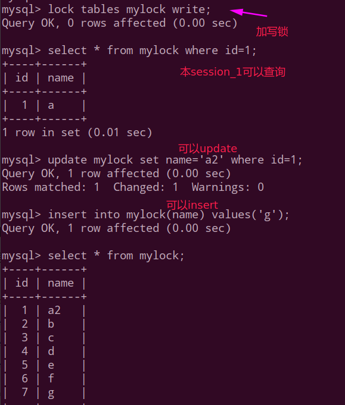 | 其他session对锁定表的查询被阻塞，<br>需要等待锁被释放：<br><div align="center">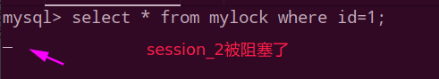</div><br> 在锁表前，如果session2有数据缓存，<br>锁表以后，在锁住的表不发生改变的情况下<br>session2可以读出缓存数据，一旦数据发生改变，缓存将失效，操作将被阻塞住。 |
| 释放锁<br>mysql> unlock tables;                              | session_2立即被释放得到锁<br>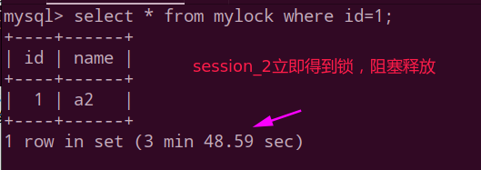  |

通过上面的实验，可以发现：

MyISAM在执行查询语句（SELECT）前，会自动给涉及的所有表加读锁，在执行增删改操作前，会自动给涉及的表加写锁。 

MySQL的表级锁有两种模式： 

- 表共享读锁（Table Read Lock）
- 表独占写锁（Table Write Lock） 

| 锁类型 | 他人可读 | 他人可写 |
| ------ | -------- | -------- |
| 读锁   | 是       | 否       |
| 写锁   | 否       | 否       |

 结合上表，所以对MyISAM表进行操作，会有以下情况： 

* 1、对MyISAM表的读操作（加读锁），不会阻塞其他进程对同一表的读请求，但会阻塞对同一表的写请求。只有当读锁释放后，才会执行其它进程的写操作。 
* 2、对MyISAM表的写操作（加写锁），会阻塞其他进程对同一表的读和写操作，只有当写锁释放后，才会执行其它进程的读写操作。

简而言之，就是读锁会阻塞写，但是不会堵塞读。而写锁则会把读和写都堵塞。

总结:

* 可以通过`show open tables`来查看哪些表被枷锁了；
* 如何分析表锁定，可以通过检查`table_locks_waited`和`table_locks_immediate`状态变量来分析系统上的表锁定；

<div align="center">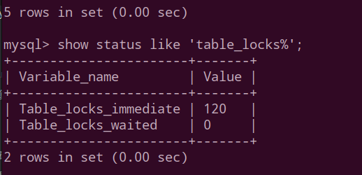</div><br>

这里有两个状态变手记录MySQL内部表级锁定的情况，两个变量说明如下:

`Table_locks_immediate`: 产生表级锁定的次数，表示可以立即获取锁的查询次数，每立即获取锁值加1 ;

`Table_locks_waited`: 出现表级锁定争用而发生等待的次数(不能立即获取锁的次数，每等待一次锁值加1)，此值高则说明存在着较严重的表级锁争用情况;

总结: MyISAM的读写锁调度是**写**优先，这也是MyISAM不适合做写为主表的引擎。 因为写锁后，其他线程不能做任何操作，大量的更新会使查询很难得到锁，从而造成永远阻塞。

## 三、行锁

特点:

* 偏向InnoDB存储引擎，开销大，加锁慢；
* 会出现死锁；
* 锁定粒度最小，发生锁冲突的概率最低，并发度也最高。

> InnoDB与MyISAM的最大不同有两点：**一是支持事务（TRANSACTION）；二是采用了行级锁**。
>
> **Innodb存储引擎由于实现了行级锁定，虽然在锁定机制的实现方面所带来的性能损耗可能比表级锁定会要更高一些，但是在整体并发处理能力方面要远远优于MyISAM的表级锁定的。当系统并发量较高的时候，Innodb的整体性能和MyISAM相比就会有比较明显的优势了**。
>
>  但是，Innodb的行级锁定同样也有其脆弱的一面，当我们使用不当的时候，可能会让Innodb的整体性能表现不仅不能比MyISAM高，甚至可能会更差。

演示案例，建表SQL:

```mysql
create table test_innodb_lock (a int(11),b varchar(16))engine=innodb;

insert into test_innodb_lock values(1,'b2');
insert into test_innodb_lock values(3,'3');
insert into test_innodb_lock values(4,'4000');
insert into test_innodb_lock values(5,'5000');
insert into test_innodb_lock values(6,'6000');
insert into test_innodb_lock values(7,'7000');
insert into test_innodb_lock values(8,'8000');
insert into test_innodb_lock values(9,'9000');
insert into test_innodb_lock values(1,'b1');

# 创建两个索引
create index test_innodb_a_ind on test_innodb_lock(a);
create index test_innodb_lock_b_ind on test_innodb_lock(b);

# 查询结果
mysql> select * from test_innodb_lock;
+------+------+
| a    | b    |
+------+------+
|    1 | b2   |
|    3 | 3    |
|    4 | 4000 |
|    5 | 5000 |
|    6 | 6000 |
|    7 | 7000 |
|    8 | 8000 |
|    9 | 9000 |
|    1 | b1   |
+------+------+
9 rows in set (0.00 sec)
```

测试: **读己之所写**。

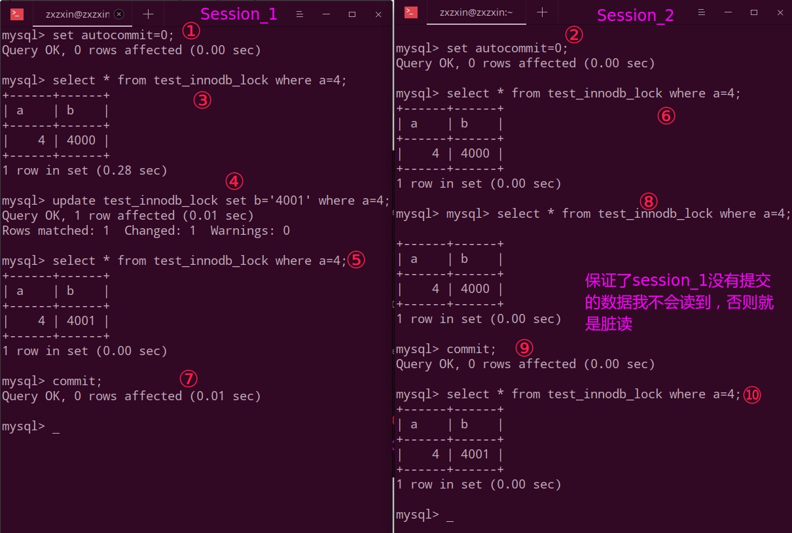

然后看`session_1`和`session_2`同时更新`a = 4`的情况:

| 更新但是不提交，即没有commit<br>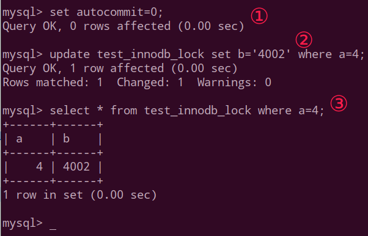 | session_2被阻塞，只能等待<br><div align="center">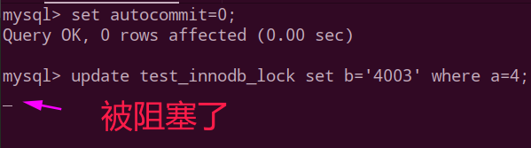</div><br> |
| ------------------------------------------------------------ | ------------------------------------------------------------ |
| 提交更新<br>`mysql> commit;`                                 | 解除阻塞<br>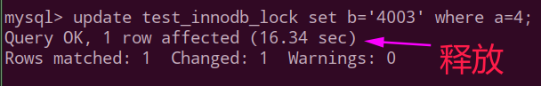</div><br> |

但是如果两个会话**不是更新同一行**呢?

如果不是更新同一行，则就算在`session_1`没有`commit`的时候，`session_2`也不会阻塞。

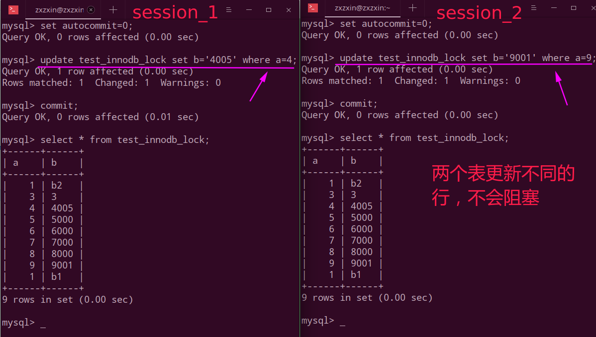

**尽可能让所有数据检索都通过索引来完成，避免无索引行锁升级为表锁**。

举个例子: 因为我们的`b`是`varchar`类型的，更新的时候我故意将`b`的单引号去掉，此时`MYSQL`底层自动类型转换，但是此时就会导致索引失效，然后我们看下面，就会导致我们的行锁变成了表锁，从而导致阻塞等待。

<div align="center">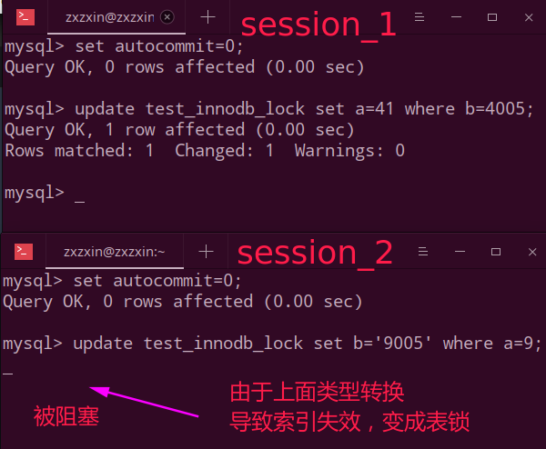</div><br>

**间隙锁带来的插入问题**:

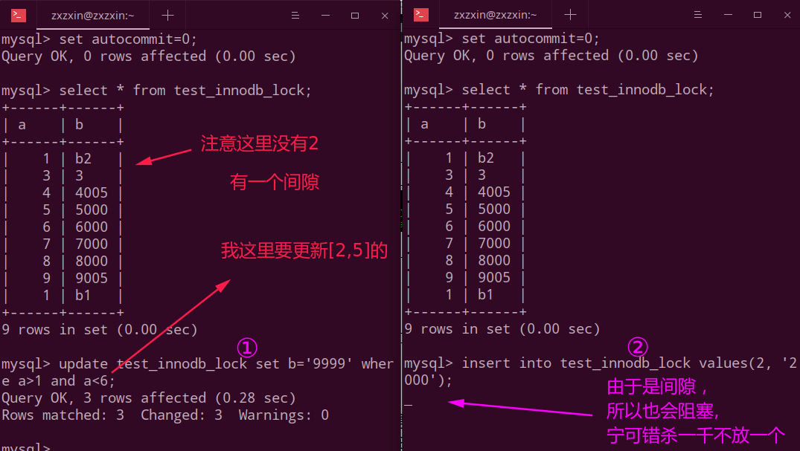

【什么是间隙锁】

**当我们用范围条件而不是相等条件检索数据**，并请求共享或排他锁时，InnoDB会给符合条件的已有数据记录的索引项加锁；对于键值在条件范围内但并不存在的记录，叫做“间隙（GAP)”，

**InnoDB也会对这个“间隙”加锁(不放过一个)，这种锁机制就是所谓的间隙锁**（GAP Lock）。

【危害】

因为Query执行过程中通过过范围查找的话，他会锁定整个范围内所有的索引键值，即使这个键值并不存在。

间隙锁有一个比较致命的弱点，就是当锁定一个范围键值之后，即使某些不存在的键值也会被无辜的锁定，而造成在锁定的时候无法插入锁定键值范围内的任何数据。在某些场景下这可能会对性能造成很大的危害。

> 面试题：常考如何锁定一行。
>
> 使用`for update`。
>
> 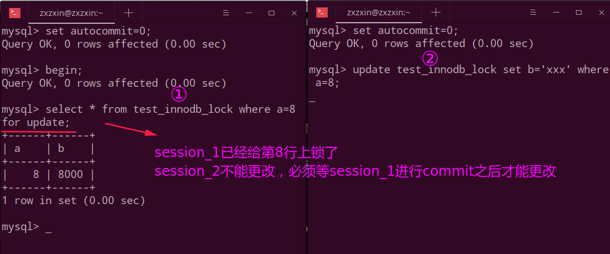


**【如何分析行锁定】**

通过检查InnoDB_row_lock状态变量来分析系统上的行锁的争夺情况

`mysql>show status like 'innodb_row_lock%';`

<div align="center">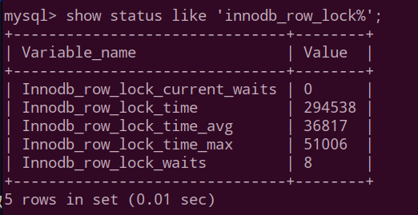</div><br>

对各个状态量的说明如下：

`Innodb_row_lock_current_waits`：当前正在等待锁定的数量；

`Innodb_row_lock_time`：从系统启动到现在锁定总时间长度；

`Innodb_row_lock_time_avg`：每次等待所花平均时间；

`Innodb_row_lock_time_max`：从系统启动到现在等待最常的一次所花的时间；

`Innodb_row_lock_waits`：**系统启动后到现在总共等待的次数**；

对于这5个状态变量，比较重要的主要是

 `Innodb_row_lock_time_avg`（等待平均时长），

`  Innodb_row_lock_waits`（等待总次数）

`  Innodb_row_lock_time`（等待总时长）这三项。

尤其是当等待次数很高，而且每次等待时长也不小的时候，我们就需要分析系统中为什么会有如此多的等待，然后根据分析结果着手指定优化计划。

最后可以通过`SELECT * FROM information_schema.INNODB_TRX\G;`来查询正在被锁阻塞的sql语句。

## 四、优化建议

* **尽可能让所有数据检索都通过索引来完成，避免无索引行锁升级为表锁**；
* **尽可能较少检索条件，避免间隙锁**；
* 尽量控制事务大小，减少锁定资源量和时间长度；
* 锁住某行后，尽量不要去调别的行或表，赶紧处理被锁住的行然后释放掉锁；
* 涉及相同表的事务，对于调用表的顺序尽量保持一致；
* 在业务环境允许的情况下,尽可能低级别事务隔离；